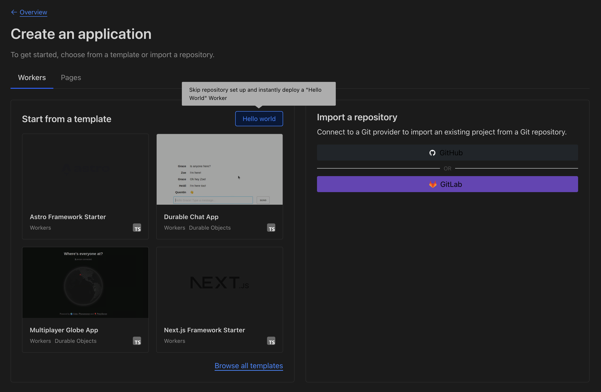

# Connect Akto with Cloudflare Worker Proxy

Cloudflare is a global network security platform that provides CDN, DDoS protection, and API security services. Integrating Cloudflare with Akto enables automatic discovery of all APIs passing through your Cloudflare infrastructure, helping you maintain continuous visibility and protection of your edge-distributed APIs.

<figure><figcaption></figcaption></figure>

To connect Akto with Cloudflare, follow these steps -

> **Important Note:** This configuration works for proxying traffic to **one worker only**. The worker must have a service binding configured in the Cloudflare Worker Proxy with the variable name `MCP`. This binding is used to forward all incoming requests to your target worker.

---

## Step 1: Deploy the Akto Data-Ingestion Service

Before configuring the Cloudflare Worker Traffic Connector, you need to deploy the Akto Data-Ingestion Service. Ensure that the service is running and accessible via a publicly available URL.
Set up and configure Akto Traffic Processor. The steps are mentioned [here](https://docs.akto.io/getting-started/traffic-processor/hybrid-saas).
Ensure this instance is publicly accessible, as it will receive traffic logs from your Cloudflare Worker.

---

## Step 2: Set Up Your Cloudflare Worker Script

1. Navigate to the [Cloudflare Dashboard](https://dash.cloudflare.com/) and select your account.
2. Go to **Workers & Pages**.

   <figure><figcaption></figcaption></figure>
3. Click **Create** and choose **Worker**.

   <figure><figcaption></figcaption></figure>
4. Click the **Hello World** button and deploy it.

   <figure><figcaption></figcaption></figure>
5. Click **Edit code** and replace the default script with your Worker code that proxies traffic and mirrors it to Akto using **service binding**.

    ```javascript
    export default {
        async fetch(request, env, ctx) {
        console.log("🚀 Worker handling:", request.method, request.url);
    
        // Detect WebSocket upgrade
        const upgradeHeader = request.headers.get("Upgrade") || "";
        const isWebSocket = upgradeHeader.toLowerCase() === "websocket";
    
        if (isWebSocket) {
            console.log("🔄 WebSocket upgrade detected");
    
            // Just proxy the connection
            const response = await env.MCP.fetch(request);
    
            // Clone headers only (no body to tee here)
            ctx.waitUntil(logTraffic(request, response, env, { isWebSocket: true }));
    
            return response;
        }
    
        // Normal HTTP(S) traffic
        let requestForFetch, requestForLog;
        if (request.body) {
            const [req1, req2] = request.body.tee();
            requestForFetch = new Request(request, { body: req1 });
            requestForLog = new Request(request, { body: req2 });
        } else {
            requestForFetch = request;
            requestForLog = request.clone();
        }
    
        const response = await env.MCP.fetch(requestForFetch);
        console.log("⬅️ Upstream response:", response.status);
    
        let responseForClient, responseForLog;
        if (response.body) {
            const [res1, res2] = response.body.tee();
            responseForClient = new Response(res1, response);
            responseForLog = new Response(res2, response);
        } else {
            responseForClient = response;
            responseForLog = response.clone();
        }
    
        ctx.waitUntil(logTraffic(requestForLog, responseForLog, env));
    
        return responseForClient;
        },
    };
    
    async function logTraffic(request, response, env, opts = {}) {
        try {
        console.log("📝 logTraffic running...");
    
        const reqContentType = request.headers.get("content-type") || "";
        const resContentType = response.headers.get("content-type") || "";
        const status = response.status;
    
        let reqBody = "";
        let resBody = "";
    
        if (!opts.isWebSocket) {
            // Only attempt to read bodies for HTTP
            reqBody = await readBodyAsText(request);
            resBody = await readBodyAsText(response);
    
            if (!(status >= 200 && status < 400)) {
            console.log("⚠️ Skipped log: status", status);
            return;
            }
    
            if (!reqContentType && !resContentType) {
            console.log("⚠️ Skipped log: no content-type in request or response");
            return;
            }
    
            if (!shouldCapture(reqContentType) && !shouldCapture(resContentType)) {
            console.log("⚠️ Skipped log: not a target content-type", { reqContentType, resContentType });
            return;
            }
        }
    
        const url = new URL(request.url);
        const logEntry = {
            path: url.pathname,
            method: request.method,
            requestHeaders: JSON.stringify(Object.fromEntries(request.headers)),
            responseHeaders: JSON.stringify(Object.fromEntries(response.headers)),
            requestPayload: reqBody,
            responsePayload: resBody,
            ip: request.headers.get("cf-connecting-ip") || "127.0.0.1",
            time: Math.floor(Date.now() / 1000).toString(),
            statusCode: status.toString(),
            type: opts.isWebSocket ? "WebSocket" : "HTTP/1.1",
            status: response.statusText || "OK",
            akto_account_id: "1000000",
            akto_vxlan_id: "0",
            is_pending: "false",
            source: "MIRRORING",
            tag: "{\n  \"service\": \"cloudflare\"\n}"
        };
    
        console.log("📤 Sending log entry to webhook...");
    
        const aktoReq = new Request("https://<DATA_INGESTION_SERVICE>/api/ingestData", {
            method: "POST",
            headers: { "content-type": "application/json" },
            body: JSON.stringify({ batchData: [logEntry] }),
        });
    
        // await env.<CONTAINER_BINDING_VARIABLE_NAME>.fetch(aktoReq);
        const aktoResp = await fetch(aktoReq);
    
        if (aktoResp.status == 200) {
            console.log("✅ Log sent to akto");
        } else {
            console.log("❌ Failed to send data to Akto. Response Status: " + aktoResp?.status);
        }
        } catch (err) {
        console.error("❌ Log error:", err);
        }
    }
    
    function shouldCapture(contentType) {
        const targets = ["json", "xml", "x-www-form-urlencoded", "soap", "grpc"];
        return targets.some((t) => contentType.toLowerCase().includes(t));
    }
    
    async function readBodyAsText(obj, maxSize = 64 * 1024) {
        try {
        const buf = await obj.arrayBuffer();
        const bytes = new Uint8Array(buf).slice(0, maxSize);
        return new TextDecoder().decode(bytes);
        } catch {
        return "";
        }
    }
    ```

### Important Notes while editing the Worker code

* Replace `<DATA_INGESTION_SERVICE>` with the URL of the Akto Data-Ingestion Service you deployed in **Step 1**.
* If you are using Cloudflare **Service Binding** to send traffic to your ingestion service hosted inside a Cloudflare container, use the following line instead of a public URL:

  ```javascript
  // use this line to send data internally to data ingestion service
  // hosted in your Cloudflare container
  await env.<CONTAINER_BINDING_VARIABLE_NAME>.fetch(aktoReq);

  // for example
  await env.data_inject_worker.fetch(aktoReq);
  ```

---

## Step 3: Configure Service Binding (MCP)

After adding the worker code, you need to configure a service binding to connect this proxy worker to your target worker.

1. In the Cloudflare Dashboard, navigate to your **Worker** (the proxy worker you just created).
2. Go to **Settings** > **Bindings**.
3. Click **Add binding** and select **Service binding**.
4. Configure the binding with the following details:
   * **Variable name:** `MCP` (this must match the variable used in the worker code: `env.MCP.fetch()`)
   * **Service:** Select the target worker you want to proxy traffic to
   * **Environment:** Choose the appropriate environment

5. Click **Save**.

> **Note:** The variable name `MCP` is used in the worker code on lines where `env.MCP.fetch(request)` is called. This service binding routes all incoming requests to your specified target worker while mirroring the traffic to Akto.

---

## Step 4: Configure Worker Routing

If you'd like to route specific domains or paths through this Worker:

1. In the Cloudflare Dashboard, go to **Workers & Pages**.
2. Under **Overview**, select your Proxy Worker that you created in above steps.
3. Navigate to **Settings** > **Domains & Routes**.
4. Click **Add Route**.
5. Select the appropriate zone (domain), and enter a route pattern such as:

   ```
   *.yourdomain.com/*
   ```

This ensures all traffic matching the route is intercepted and mirrored to Akto.

---

## Step 5: Verify the Setup

1. Confirm that API traffic data (requests and responses) are captured on the Akto dashboard under the respective API collection.
2. Check logs of your Worker for any initialization or forwarding messages.
3. Go back to the [Akto Dashboard](https://app.akto.io/).
4. Navigate to **API Collections** > **Hostname**.
5. You should start seeing the traffic from your Cloudflare Worker.

---

### Get Support for your Akto setup

There are multiple ways to request support from Akto. We are 24x7 available on the following:

1. In-app `intercom` support — message us inside the Akto dashboard and someone will reply.
2. Join our [discord channel](https://www.akto.io/community) for community support.
3. Contact `help@akto.io` for email support.
4. Reach us [here](https://www.akto.io/contact-us).