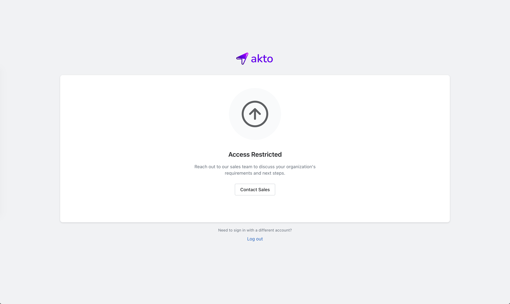

# Sign Up in Akto

## Overview

Getting started with Akto takes only a few minutes. This guide walks you through creating your account and accessing your organisation's dashboard.

## How to Sign Up



#### Go to the Akto Login Page

Navigate to [app.akto.io](https://app.akto.io) in your browser.



#### Click "Sign Up"

On the login page, click the **Sign up** link at the bottom of the form.



#### Enter Your Credentials

You have two options:

**Option A: Continue with Google**\
Click **Continue with Google** to sign up using your Google account. You will be redirected through Google's OAuth flow and returned to Akto once complete.

**Option B: Email and Password**\
Enter your **Email address** and **Password**, then click **Continue**.



#### Verify Your Email

Akto will send a verification email to the address you provided. Open the email and click the verification link to activate your account.


If you don't see the email in your inbox, check your spam or junk folder.




#### Log In to Akto

Once your email is verified, go back to [app.akto.io](https://app.akto.io) and log in with your credentials.



## Access Your Dashboard

After logging in, one of two things will happen:

* **Your organisation is already registered with Akto:** You are automatically taken to your organisation's dashboard. If your organisation has an active Akto plan, signing up with your org domain automatically grants you **Member** role access to the Akto API Security product.
* **Any other case:** You will land on the **Access Restricted** page. This includes scenarios where your organisation is not yet onboarded, does not have an active plan, or your domain is not linked to an existing Akto account. Click **Contact Sales** to reach out to the Akto team and they will provision your organisation and grant you access.

<figure><figcaption>
Access Restricted page
</figcaption></figure>
