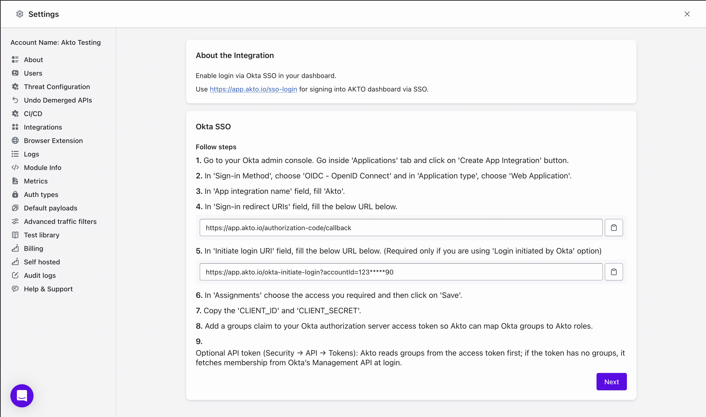

# Okta OIDC

Okta SSO integration with Akto provides a secure and scalable authentication solution for organizations using Okta as their identity provider. This OpenID Connect (OIDC) integration allows organizations to leverage Okta's comprehensive identity management capabilities while accessing Akto's API security features.

<figure><figcaption></figcaption></figure>

> Replace `123*****90` in step 5 with your actual account ID, which you can find in [Akto settings](https://app.akto.io/dashboard/settings/about).

## API Access Management in Okta

It is recommended to have the **API Access Management** feature enabled in Okta. Without this feature, users cannot customize the access policies of authorization server IDs. By default, Okta provides only a single **default authorization server**, which cannot be modified. Enabling API Access Management allows organizations to create and configure custom authorization servers, giving them more control over access policies and security.
