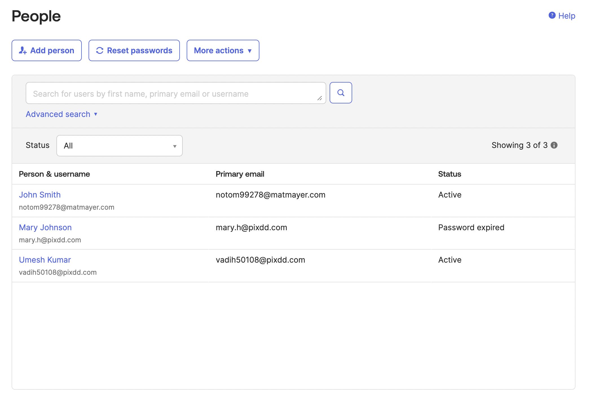
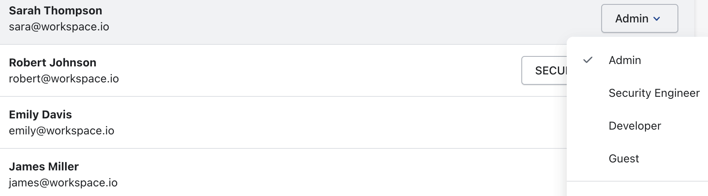

# How to add team members on Akto Dashboard from SSO

## Pre-requisites to add team members
1. Ensure the team member is added into the team of your Identity Provider.
<figure><figcaption></figcaption></figure>

## Steps for users to login into Akto dashboard via SSO
1. Navigate to `https://app.akto.io/sso-login` and enter your email id.
<figure><figcaption></figcaption></figure>

2. The user you will be signed in the Akto Dashboard with the role `SECURITY ENGINEER` by default.

3. The Admin of the Akto Dashboard account can change the role of the team member with the following steps:

    1. Click the `Settings` button on the bottom of the left nav.
    2. Click the `Users` tab from the left nav of the page.
    3. Click on the dropdown of the role and update the role of the team member.

<figure><figcaption></figcaption></figure> 

### Note:
For more information about Roles in Akto dashboard, refer [this](../understanding-role-permissions.md)