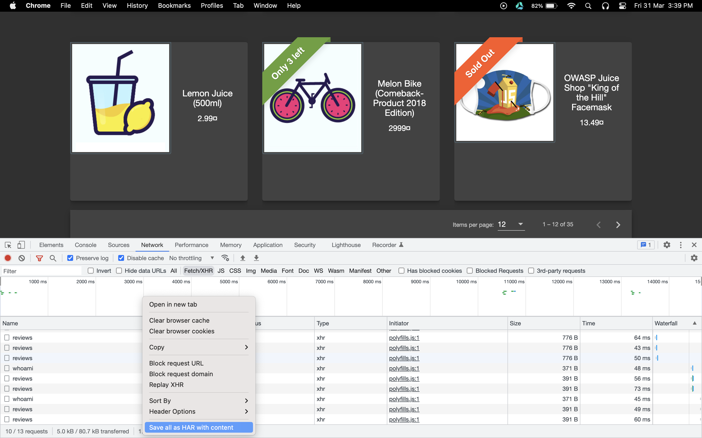

# HAR file upload

The HTTP Archive format, or HAR, is a JSON-formatted archive file format for logging of a web browser's interaction with a site. 
The common extension for these files is .har. You can use this method if you quickly want to try out Akto. Akto can process HAR (Http ARchive) files and populate inventory from it.

## How to capture traffic in a .har file and upload to Akto

1. Go to any website. Let's use https://juiceshop.akto.io for a demo.

2. Open the developer tools in Chrome and switch to the network tab.

3. Browse the website as usual to generate traffic, then right-click anywhere in the network and click on `save as har with content`

<figure><figcaption></figcaption></figure>

## How to upload a HAR file on Akto dashboard

1. Open any API Collection where you want to add traffic data. 
 - You can also [create a new collection](https://docs.akto.io/api-inventory/api-collections#custom-create-collections) for this purpose. 
 - Open the newly created API Collection 
2. Click on the **Upload Har file** button on the top right
   
3. Select the HAR file from the file browser.
   
4. Click on the Refresh icon on the top right. 
   
5. You should be able to see APIs imported in your collection from the HAR file. 
   
