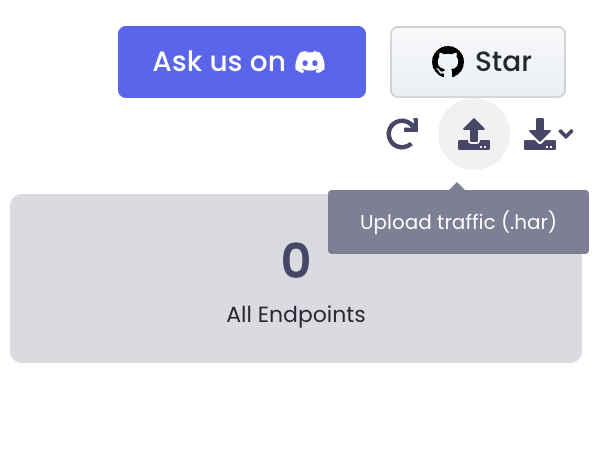

# HAR file upload

The HTTP Archive format, or HAR, is a JSON-formatted archive file format for logging of a web browser's interaction with a site. The common extension for these files is .har. You can capture traffic in any browser as a har file and upload it to akto. Akto then processes this traffic to create an inventory of API endpoints.

## How to capture traffic in a .har file and upload to akto

1. Go to any website. Let's use https://juiceshop.akto.io for a demo.

2. Open the developer tools in chrome and switch to the network tab.

3. Browse the website as usual to generate traffic, then right-click anywhere in the network and click on `save as har with content`

<figure><figcaption></figcaption></figure>

4. Now open akto and create an API Collection. 

5. Upload the har file on akto and wait for a couple of seconds as akto processes the har file to generate api endpoints.

<figure><figcaption></figcaption></figure>

6. Voila, you can now see all the endpoints along with a lot of information like request, response and sensitive data types found.

<figure><figcaption></figcaption></figure>