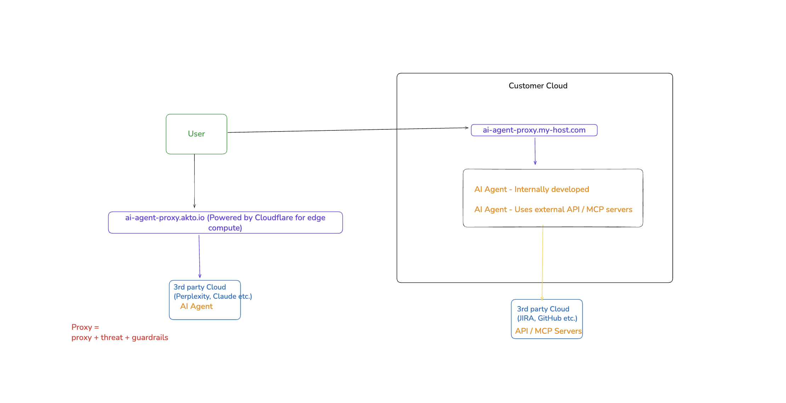

# Akto Agent Proxy

## Overview

Akto Agent Proxy is a security and governance layer that sits between agent clients and agent servers. It enables organizations to implement threat protection, security policies, and guardrails for all agent server requests while maintaining seamless connectivity to the original agent servers.

## Key Features

- **Threat Protection**: Real-time scanning and blocking of malicious requests
- **Security Guardrails**: Enforce organizational security policies and compliance requirements
- **Request Monitoring**: Complete visibility into all agent communications
- **Transparent Proxying**: Zero-configuration changes required on agent servers
- **Performance Optimization**: Intelligent caching and request optimization

## Architecture

```
┌───────────────┐        ┌───────────────────┐        ┌───────────────┐
│ Agent Client  │───────▶│  Akto Agent Proxy │───────▶│ Agent Server  │
└───────────────┘        └───────────────────┘        └───────────────┘
                              │
                              ▼
                       ┌─────────────────┐
                       │ Threat Detection │
                       │   & Guardrails   │
                       └─────────────────┘
```


Cloud setup
<figure><figcaption></figcaption></figure>

Local setup
<figure><figcaption></figcaption></figure>

## How It Works

1. **Request Interception**: Agent clients send requests to the Akto proxy endpoint instead of directly to agent servers
2. **Security Analysis**: Each request undergoes threat detection and policy validation
3. **Policy Enforcement**: Requests are evaluated against configured guardrails
4. **Request Forwarding**: Validated requests are forwarded to the original agent server
5. **Response Processing**: Server responses are analyzed and returned to the client

## Configuration

### Basic Setup

To use Akto Agent Proxy, simply prepend your original agent server URL with the Akto proxy endpoint. All existing authentication and credentials for your original agent server remain unchanged.

**Proxy URL Format:**
```
https://agent-proxy.akto.io/proxy/{protocol}/{host}/{path}
```

Where the original agent server URL is transformed by:
- Replacing `://` with `/` 
- Example: `https://agent.example.com/api` → `https/agent.example.com/api`

### Configuration Examples

1. **SSE-based Agent Server**
   
   Original configuration:
   ```json
   {
     "agentServers": {
       "kite-trading": {
         "url": "https://agent.kite.trade/sse",
         "apiKey": "your-kite-api-key"
       }
     }
   }
   ```
   
   With Akto proxy:
   ```json
   {
     "agentServers": {
       "kite-trading": {
         "url": "https://agent-proxy.akto.io/proxy/https/agent.kite.trade/sse",
         "apiKey": "your-kite-api-key"
       }
     }
   }
   ```

2. **WebSocket Agent Server**
   
   Original configuration:
   ```json
   {
     "agentServers": {
       "data-server": {
         "url": "wss://api.example.com/agent",
         "auth": {
           "token": "bearer-token-123"
         }
       }
     }
   }
   ```
   
   With Akto proxy:
   ```json
   {
     "agentServers": {
       "data-server": {
         "url": "https://agent-proxy.akto.io/proxy/wss/api.example.com/agent",
         "auth": {
           "token": "bearer-token-123"
         }
       }
     }
   }
   ```

**Important Notes:**
- All original authentication credentials (API keys, tokens, etc.) remain the same
- The proxy transparently forwards authentication headers to the original server
- No changes required on the agent server side
- The proxy URL supports both HTTP/HTTPS and WebSocket protocols

### Advanced Configuration

#### Custom Guardrails

Define custom security policies and guardrails:

```yaml
guardrails:
  - name: "PII Protection"
    type: "content_filter"
    rules:
      - pattern: "ssn|social security"
        action: "block"
      - pattern: "credit card|cc number"
        action: "redact"
  
  - name: "Rate Limiting"
    type: "rate_limit"
    rules:
      - requests_per_minute: 100
        per_client: true
```

#### Threat Detection Profiles

Configure threat detection sensitivity and rules:

```yaml
threat_detection:
  sensitivity: "high"
  enabled_checks:
    - sql_injection
    - command_injection
    - path_traversal
    - data_exfiltration
  custom_rules:
    - name: "Block Sensitive File Access"
      pattern: "/etc/passwd|/etc/shadow"
      action: "block"
```

## Security Features

### 1. Threat Detection

- **SQL Injection Prevention**: Detects and blocks SQL injection attempts
- **Command Injection Protection**: Prevents malicious command execution
- **Path Traversal Defense**: Blocks unauthorized file system access
- **Data Exfiltration Prevention**: Monitors and controls data egress

### 2. Access Control

- **Authentication**: API key-based authentication for all proxy requests
- **Authorization**: Role-based access control for different agent operations
- **IP Whitelisting**: Restrict access to approved IP addresses
- **Session Management**: Secure session handling with automatic timeout

### 3. Data Protection

- **Encryption in Transit**: TLS 1.3 for all communications
- **PII Detection**: Automatic identification and protection of sensitive data
- **Data Masking**: Real-time redaction of sensitive information
- **Audit Logging**: Comprehensive logging of all requests and responses

## Monitoring & Analytics

### Dashboard Metrics

- Request volume and trends
- Threat detection statistics
- Blocked request analysis
- Performance metrics (latency, throughput)
- Error rates and patterns

### Alerts & Notifications

Configure alerts for security events:

```yaml
alerts:
  - type: "threat_detected"
    severity: "high"
    channels: ["email", "slack"]
  
  - type: "rate_limit_exceeded"
    threshold: 1000
    channels: ["webhook"]
```

## API Reference

### Proxy Endpoints

#### Health Check
```http
GET https://proxy.akto.io/health
Authorization: Bearer {api_key}
```

### Response Format

```json
{
  "success": true,
  "data": {
    "response": {...},
    "metadata": {
      "request_id": "req_123456",
      "latency_ms": 45,
      "threats_detected": [],
      "guardrails_applied": ["PII Protection"]
    }
  }
}
```

## Best Practices

1. **Regular Policy Updates**: Keep security policies and guardrails up-to-date
2. **Monitor Alert Fatigue**: Fine-tune detection rules to reduce false positives
3. **Performance Optimization**: Use caching for frequently accessed resources
4. **Backup Configuration**: Maintain fallback options for critical agent servers
5. **Regular Audits**: Review logs and analytics for security insights

## Troubleshooting

### Common Issues

#### Connection Timeout
- Verify network connectivity to Akto proxy
- Check firewall rules and proxy settings
- Validate API key and authentication

#### Request Blocked
- Review threat detection logs for specific violations
- Check guardrail configurations
- Verify request content against security policies

#### Performance Degradation
- Monitor proxy latency metrics
- Optimize guardrail rules for efficiency
- Consider geographic proxy distribution

### Get Support for your Akto setup

There are multiple ways to request support from Akto. We are 24X7 available on the following:

1. In-app `intercom` support. Message us with your query on intercom in Akto dashboard and someone will reply.
2. Join our [discord channel](https://www.akto.io/community) for community support.
3. Contact `help@akto.io` for email support.
4. Contact us [here](https://www.akto.io/contact-us).


