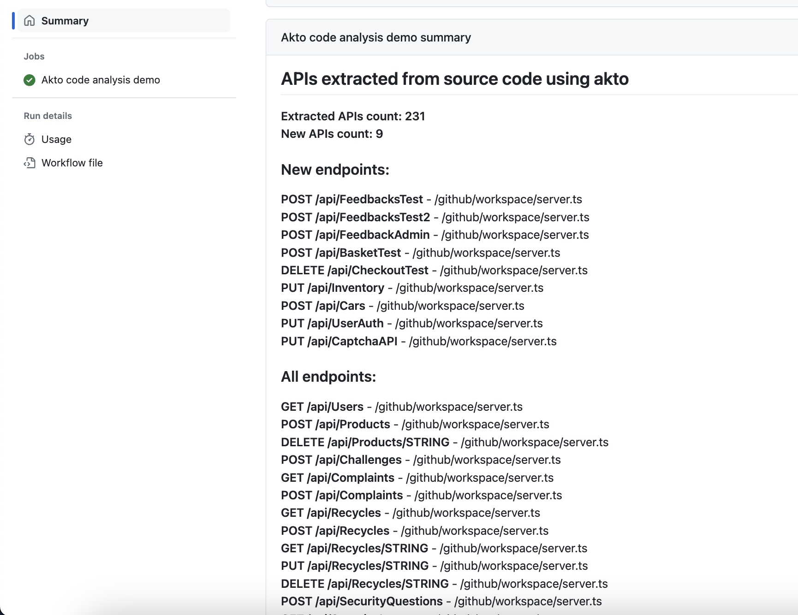

# Extract APIs from github hosted source code using our Github Action

You can extract APIs from your github code repositories using our [Github action](https://github.com/akto-api-security/code-analysis-action).

### How to use

Prepare the following variables:

1. `AKTO_API_KEY` - Go to My accounts > Settings > Integrations > Akto API > Generate token. Copy the token generated.
2. `AKTO_DASHBOARD_URL` - URL of your Akto dashboard. Please ensure the github action runner can access the Akto dashboard,
3. `API_COLLECTION_NAME` - The API collection name into which you want to import the extracted APIs. Ensure that this collection exists.

Add a step in your github action workflow based on the following example:

```yaml
- name: Akto code analysis
  uses: akto-api-security/code-analysis-action@v1
  with:
    AKTO_DASHBOARD_URL: "<AKTO_DASHBOARD_URL>"
    AKTO_API_KEY: ${{ secrets.AKTO_API_KEY }}
    API_COLLECTION_NAME: juice_shop_demo
```

### Results

1. A summary of all the extracted APIs should be avaialbe in the Github workflow run summary. The summary includes a list of the new APIs that were added in the present commit.
2. The API collection as specified by the `API_COLLECTION_NAME` variable can be viewed in the Akto dashboard to review the APIs extracted from source code.

<figure><figcaption><p>Github workflow summary</p></figcaption></figure>
