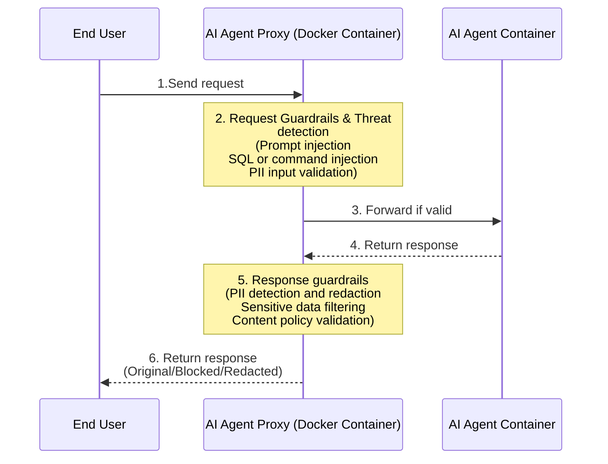

# AI Agent Proxy

## Overview

AI Agent Proxy is a security layer that protects AI agent applications by intercepting, analyzing, and securing communications between end users and AI agents. It provides real-time threat detection, guardrails enforcement, and response filtering for AI agent deployments running in customer environments.

## Key Features

* **Threat Detection**: Real-time scanning and blocking of malicious requests before they reach your AI agent
* **Request Guardrails**: Enforce security policies on incoming requests to prevent attacks and policy violations
* **Response Guardrails**: Scan and filter AI agent responses for sensitive data, policy violations, and security issues
* **Response Redaction**: Automatically redact sensitive information from AI agent responses
* **Complete Visibility**: Monitor all AI agent communications with comprehensive logging
* **Container-Based Deployment**: Deploy as Docker containers alongside your AI agent infrastructure

## Architecture

The AI Agent Proxy can be deployed as a Docker container or as a Kubernetes sidecar alongside your AI agent, providing a secure gateway for all AI agent traffic.



### **Traffic Flow:**

1. End user sends request to AI Agent Proxy endpoint
2. Proxy performs threat detection and applies request guardrails
3. Valid requests are forwarded to AI agent container
4. AI agent processes request and returns response to proxy
5. Proxy receives response and applies response guardrails and redaction rules
6. End user receives final response (original, blocked, or redacted)

## Deployment

## **Prerequisites**

* Docker installed on your VM
* An AI agent application running as a Docker container
* Network connectivity between proxy and AI agent containers

## **Docker Compose Setup**

### Locally running AI Agent

Create a `docker-compose.yml` file to run both the AI agent and proxy containers:

```yaml
version: '3.8'

services:
  your-agent:
    image: your-ai-agent:latest
    container_name: your-agent
    ports:
      - "3001:3001"
    environment:
      - SERVER_PORT=3001
    volumes:
      - ./your-agent-storage:/app/server/storage
    restart: always

  akto-ai-agent-shield:
    image: public.ecr.aws/aktosecurity/akto-ai-agent-shield:latest
    container_name: akto-ai-agent-shield
    ports:
      - "8080:8080"
    environment:
      - AKTO_API_TOKEN=<your-akto-api-token>
      - AKTO_API_BASE_URL=<your-akto-data-ingestion-url>
      - APP_URL=http://your-agent:3001
      - PROJECT_NAME=my-ai-agent
      - APP_TYPE=agent
      - AKTO_PROXY_PORT=8080
      - SKIP_THREAT=false
      - REQUEST_TIMEOUT=120
      - APPLY_GUARDRAILS_TO_SSE=true
    depends_on:
      - your-agent
    restart: always
```

### Hosted AI Agent

Alternatively, if your agent is hosted elsewhere and you want to access it locally, use this `docker-compose.yml`

```yaml
version: '3.8'

services:
  akto-ai-agent-shield:
    image: public.ecr.aws/aktosecurity/akto-ai-agent-shield:latest
    container_name: akto-ai-agent-shield
    ports:
      - "8080:8080"
    environment:
      - AKTO_API_TOKEN=<your-akto-api-token>
      - AKTO_API_BASE_URL=<your-akto-data-ingestion-url>
      - APP_URL=https://juiceshop.akto.io # Change to your Agent URL
      - PROJECT_NAME=localhost:8080
      - APP_SERVER_NAME=localhost:8080
      - APP_TYPE=agent
      - AKTO_PROXY_PORT=8080
      - SKIP_THREAT=false
      - REQUEST_TIMEOUT=120
      - APPLY_GUARDRAILS_TO_SSE=true
    restart: always
```

#### **Environment Variables**

Configure the AI Agent Proxy with the following environment variables:

| Variable | Description | Required | Default |
| -------- | ----------- | -------- | ------- |
| `AKTO_API_TOKEN` | Authentication token from Akto dashboard | Yes | - |
| `AKTO_API_BASE_URL` | URL for Akto data ingestion service (obtained from Akto dashboard) | Yes | - |
| `APP_URL` | Base URL where your AI agent is running. For docker-compose use service name (e.g., `http://your-agent:3001`), for local testing use localhost | Yes | - |
| `PROJECT_NAME` | Unique identifier for this AI agent deployment | Yes | - |
| `APP_TYPE` | Type of application being proxied: `agent` or `mcp-server` | Yes | `agent` |
| `APP_SERVER_NAME` | Name to identify this agent server for policy filtering. If not set, will be automatically extracted from APP_URL hostname | No | (extracted from APP_URL) |
| `AKTO_PROXY_PORT` | Port where AI Agent Shield will listen | No | `8080` |
| `SKIP_THREAT` | Set to true to skip sending threat reports to Akto (useful for testing) | No | `false` |
| `REQUEST_TIMEOUT` | Timeout for forwarding requests to AI agent (in seconds) | No | `120` |
| `MAX_REQUEST_SIZE` | Maximum request body size in bytes (0 = unlimited) | No | `0` |
| `MAX_RESPONSE_SIZE` | Maximum response body size in bytes (0 = unlimited) | No | `0` |
| `ALLOWED_HTTP_METHODS` | Comma-separated list of allowed HTTP methods (empty = all allowed) | No | (all methods) |
| `APPLY_GUARDRAILS_TO_SSE` | Apply guardrails to SSE (Server-Sent Events / text/event-stream) requests | No | `true` |
| `GUARDRAIL_ENDPOINTS` | Specific endpoints to apply guardrails. Format: `METHOD:PATH` or just `PATH` (defaults to POST). Comma-separated. If set, only these endpoints will have guardrails applied. Example: `POST:/v1/workspace/slug/chat,GET:/v1/query` | No | (apply to all SSE) |

#### **Start the Services**

```bash
# Start both containers
docker-compose up -d

# Check container status
docker-compose ps

# View proxy logs
docker-compose logs -f akto-ai-agent-shield

# View AI agent logs
docker-compose logs -f your-agent
```

#### **Configure Your Application**

Update your application to route AI agent requests through the proxy:

**Before:**

```
http://localhost:3001/agent/query
```

**After:**

```
http://localhost:8080/agent/query
```

## **Kubernetes Setup**

### **Prerequisites**

* Kubernetes cluster (v1.19+)
* kubectl configured to access your cluster
* An AI agent application deployed in Kubernetes
* Akto API token from [app.akto.io](https://app.akto.io)

### **Architecture: Sidecar Pattern**

The AI Agent Shield runs as a sidecar container in the same pod as your AI agent, providing zero-latency security.

```
Pod: your-agent
├─ akto-ai-agent-shield:8080  ← External traffic enters here
│         ↓ localhost
└─ your-agent:<app-port>      ← Receives filtered traffic
```

**Benefits:**
- Zero network latency (localhost communication)
- Automatic scaling with main container
- Per-pod isolation
- Simplified service routing

**Traffic Flow:**
```
User → Service:80 → Pod:
                     ├─ Shield:8080 (public)
                     └─ App:<app-port> (internal)
```

### **Step 1: Create ConfigMap**

Create a ConfigMap with common AI Agent Shield configuration:

```bash
kubectl apply -f - <<EOF
apiVersion: v1
kind: ConfigMap
metadata:
  name: akto-ai-agent-shield-config
  namespace: your-namespace
  labels:
    app: akto-ai-agent-shield
    component: security-proxy
data:
  # Akto API Base URL (obtained from Akto dashboard)
  AKTO_API_BASE_URL: "<your-akto-data-ingestion-url>"

  # Application Type: "agent" or "mcp-server"
  APP_TYPE: "agent"

  # Proxy Port
  AKTO_PROXY_PORT: "8080"

  # Threat Reporting (set to "true" to skip for testing)
  SKIP_THREAT: "false"

  # Request Timeout (seconds)
  REQUEST_TIMEOUT: "120"

  # Size Limits (0 = unlimited)
  MAX_REQUEST_SIZE: "0"
  MAX_RESPONSE_SIZE: "0"

  # Apply guardrails to SSE requests
  APPLY_GUARDRAILS_TO_SSE: "true"

  # Allowed HTTP Methods (empty = all allowed)
  ALLOWED_HTTP_METHODS: ""

  # Specific endpoints for guardrails (empty = apply to all)
  GUARDRAIL_ENDPOINTS: ""
EOF
```

### **Step 2: Add Secret**

Add your Akto API token to a Kubernetes secret:

```bash
# Create new secret
kubectl create secret generic your-agent-secret \
  --from-literal=AKTO_API_TOKEN='<your-akto-api-token>' \
  --namespace=your-namespace

# Or update existing secret
kubectl create secret generic your-agent-secret \
  --from-literal=AKTO_API_TOKEN='<your-akto-api-token>' \
  --namespace=your-namespace \
  --dry-run=client -o yaml | kubectl apply -f -
```

### **Step 3: Update Deployment with Sidecar**

Add the AI Agent Shield sidecar container to your existing deployment:

```yaml
apiVersion: apps/v1
kind: Deployment
metadata:
  name: your-agent
  namespace: your-namespace
spec:
  replicas: 2
  selector:
    matchLabels:
      app: your-agent
  template:
    metadata:
      labels:
        app: your-agent
    spec:
      containers:

      # AI Agent Shield Sidecar
      - name: akto-ai-agent-shield
        image: public.ecr.aws/aktosecurity/akto-ai-agent-shield:latest
        imagePullPolicy: IfNotPresent
        ports:
        - containerPort: 8080
          protocol: TCP
          name: http-proxy

        # Sidecar-specific environment variables
        env:
        # Target application URL (localhost for sidecar pattern)
        - name: APP_URL
          value: "http://localhost:<your-app-port>"

        # Unique project identifier
        - name: PROJECT_NAME
          value: "your-agent"

        # Server name for policy filtering (use k8s service FQDN)
        - name: APP_SERVER_NAME
          value: "your-agent.your-namespace.svc.cluster.local"

        # Import configuration from ConfigMap
        envFrom:
        - configMapRef:
            name: akto-ai-agent-shield-config

        # Import AKTO_API_TOKEN from Secret
        - secretRef:
            name: your-agent-secret

        # Resource limits
        resources:
          limits:
            cpu: 200m
            memory: 256Mi
          requests:
            cpu: 100m
            memory: 128Mi

        # Health checks
        livenessProbe:
          httpGet:
            path: /health
            port: 8080
          initialDelaySeconds: 30
          periodSeconds: 10

        readinessProbe:
          httpGet:
            path: /health
            port: 8080
          initialDelaySeconds: 10
          periodSeconds: 5

      # Your existing AI agent container
      - name: your-agent
        image: your-agent:latest
        ports:
        - containerPort: <your-app-port>
          protocol: TCP
        # ... rest of your container spec
```

Apply the updated deployment:

```bash
kubectl apply -f deployment.yaml
```

### **Step 4: Update Service**

Update your service to route traffic to the AI Agent Shield sidecar port (8080):

```yaml
apiVersion: v1
kind: Service
metadata:
  name: your-agent
  namespace: your-namespace
spec:
  ports:
  - port: 80
    protocol: TCP
    targetPort: 8080  # Changed from <your-app-port> to 8080 (shield port)
  selector:
    app: your-agent
  type: ClusterIP
```

Apply the service update:

```bash
kubectl apply -f service.yaml
```

**Traffic Flow with Shield:**
```
External Request → Service (port 80) → Pod:
                                        ├─ akto-ai-agent-shield:8080 ← Traffic enters here
                                        │         ↓ (localhost proxy)
                                        └─ your-agent:<your-app-port> ← Receives filtered traffic
```

### **Step 5: Verify Deployment**

```bash
# Check pods are running
kubectl get pods -n your-namespace

# Check shield container logs
kubectl logs -n your-namespace <pod-name> -c akto-ai-agent-shield

# Follow shield logs
kubectl logs -n your-namespace <pod-name> -c akto-ai-agent-shield -f

# Check detailed shield logs inside container
kubectl exec -n your-namespace <pod-name> -c akto-ai-agent-shield -- \
  tail -n 100 /var/log/akto-mcp-endpoint-shield/ai-agent-shield.log

# Test health check
kubectl port-forward -n your-namespace <pod-name> 8080:8080
curl http://localhost:8080/health

# Check resource usage
kubectl top pods -n your-namespace
```

## Configuration

All guardrails and security policies are configured through the Akto dashboard at [app.akto.io](https://app.akto.io). You can define:
* Request guardrails (rate limiting, pattern matching, PII detection)
* Response guardrails (PII redaction, sensitive data blocking, content filtering)
* Threat detection rules (prompt injection, SQL injection, command injection, etc.)
* Custom security policies specific to your organization

Navigate to **Akto Argus Dashboard → Settings → Guardrails** to configure your security policies.

## Monitoring & Logging

### **Container Logs**

View real-time logs from the proxy:

```bash
# Follow proxy logs (recommended)
docker exec -it akto-ai-agent-shield sh -c "tail -n 1000 -f /var/log/akto-mcp-endpoint-shield/ai-agent-shield.log"

# Alternative: View docker logs
docker logs -f akto-ai-agent-shield

# View last 100 lines
docker logs --tail 100 akto-ai-agent-shield
```

## **Dashboard Integration**

Connect to Akto dashboard for centralized monitoring:

1. Login to [app.akto.io](https://app.akto.io)
2. Navigate to Akto Argus Dashboard -> Connectors -> AI Agent Proxy
3. View real-time metrics:
   * Request volume and trends
   * Threat detection statistics
   * Blocked request analysis
   * Top guardrails triggered
   * Response redaction statistics

## Get Support

There are multiple ways to request support from Akto. We are 24X7 available on the following:

1. In-app `intercom` support. Message us with your query on intercom in Akto dashboard and someone will reply.
2. Join our [discord channel](https://www.akto.io/community) for community support.
3. Contact `help@akto.io` for email support.
4. Contact us [here](https://www.akto.io/contact-us).
