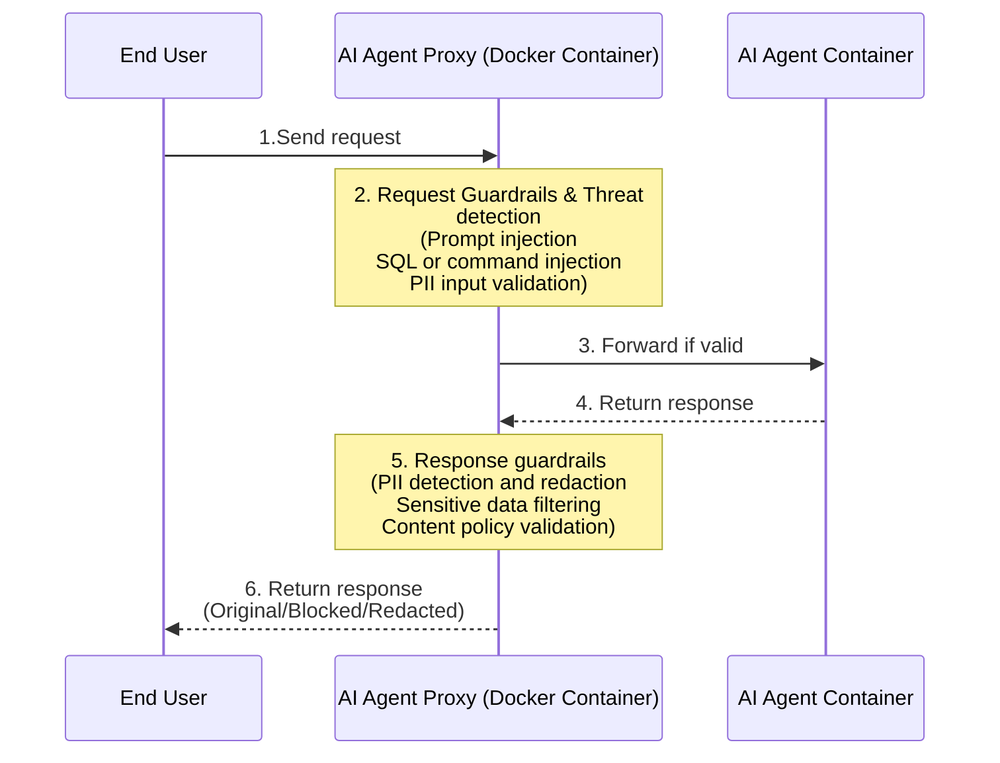

# AI Agent Proxy

## Overview

AI Agent Proxy is a security layer that protects AI agent applications by intercepting, analyzing, and securing communications between end users and AI agents. It provides real-time threat detection, guardrails enforcement, and response filtering for AI agent deployments running in customer environments.

## Key Features

* **Threat Detection**: Real-time scanning and blocking of malicious requests before they reach your AI agent
* **Request Guardrails**: Enforce security policies on incoming requests to prevent attacks and policy violations
* **Response Guardrails**: Scan and filter AI agent responses for sensitive data, policy violations, and security issues
* **Response Redaction**: Automatically redact sensitive information from AI agent responses
* **Complete Visibility**: Monitor all AI agent communications with comprehensive logging
* **Container-Based Deployment**: Deploy as Docker containers alongside your AI agent infrastructure

## Architecture

The AI Agent Proxy runs as a Docker container on the same VM as your AI agent container, providing a secure gateway for all AI agent traffic.



### **Traffic Flow:**

1. End user sends request to AI Agent Proxy endpoint
2. Proxy performs threat detection and applies request guardrails
3. Valid requests are forwarded to AI agent container
4. AI agent processes request and returns response to proxy
5. Proxy receives response and applies response guardrails and redaction rules
6. End user receives final response (original, blocked, or redacted)

## Deployment

## **Prerequisites**

* Docker installed on your VM
* An AI agent application running as a Docker container
* Network connectivity between proxy and AI agent containers

## **Docker Compose Setup**

Create a `docker-compose.yml` file to run both the AI agent and proxy containers:

```yaml
version: '3.8'

services:
  anythingllm:
    image: mintplexlabs/anythingllm:latest
    container_name: anythingllm
    ports:
      - "3001:3001"
    environment:
      - SERVER_PORT=3001
    volumes:
      - ./anythingllm-storage:/app/server/storage
    restart: always

  akto-ai-agent-shield:
    image: public.ecr.aws/aktosecurity/akto-ai-agent-shield:latest
    container_name: akto-ai-agent-shield
    ports:
      - "8080:8080"
    environment:
      - AKTO_API_TOKEN=your-akto-api-token-here
      - AKTO_API_BASE_URL=https://akto-mcp-proxy-nginx.billing-53a.workers.dev
      - APP_URL=http://anythingllm:3001
      - PROJECT_NAME=my-ai-agent
      - APP_TYPE=agent
      - AKTO_PROXY_PORT=8080
      - SKIP_THREAT=false
      - REQUEST_TIMEOUT=120
      - APPLY_GUARDRAILS_TO_SSE=true
    depends_on:
      - anythingllm
    restart: always
```

#### **Environment Variables**

Configure the AI Agent Proxy with the following environment variables:

| Variable | Description | Required | Default |
| -------- | ----------- | -------- | ------- |
| `AKTO_API_TOKEN` | Authentication token from Akto dashboard | Yes | - |
| `AKTO_API_BASE_URL` | URL for Akto data ingestion service | Yes | - |
| `APP_URL` | Base URL where your AI agent is running. For docker-compose use service name (e.g., `http://anythingllm:3001`), for local testing use localhost | Yes | - |
| `PROJECT_NAME` | Unique identifier for this AI agent deployment | Yes | - |
| `APP_TYPE` | Type of application being proxied: `agent` or `mcp-server` | Yes | `agent` |
| `APP_SERVER_NAME` | Name to identify this agent server for policy filtering. If not set, will be automatically extracted from APP_URL hostname | No | (extracted from APP_URL) |
| `AKTO_PROXY_PORT` | Port where AI Agent Shield will listen | No | `8080` |
| `SKIP_THREAT` | Set to true to skip sending threat reports to Akto (useful for testing) | No | `false` |
| `REQUEST_TIMEOUT` | Timeout for forwarding requests to AI agent (in seconds) | No | `120` |
| `MAX_REQUEST_SIZE` | Maximum request body size in bytes (0 = unlimited) | No | `0` |
| `MAX_RESPONSE_SIZE` | Maximum response body size in bytes (0 = unlimited) | No | `0` |
| `ALLOWED_HTTP_METHODS` | Comma-separated list of allowed HTTP methods (empty = all allowed) | No | (all methods) |
| `APPLY_GUARDRAILS_TO_SSE` | Apply guardrails to SSE (Server-Sent Events / text/event-stream) requests | No | `true` |
| `GUARDRAIL_ENDPOINTS` | Specific endpoints to apply guardrails. Format: `METHOD:PATH` or just `PATH` (defaults to POST). Comma-separated. If set, only these endpoints will have guardrails applied. Example: `POST:/v1/workspace/slug/chat,GET:/v1/query` | No | (apply to all SSE) |

#### **Start the Services**

```bash
# Start both containers
docker-compose up -d

# Check container status
docker-compose ps

# View proxy logs
docker-compose logs -f akto-ai-agent-shield

# View AI agent logs
docker-compose logs -f anythingllm
```

#### **Configure Your Application**

Update your application to route AI agent requests through the proxy:

**Before:**

```
http://localhost:3001/agent/query
```

**After:**

```
http://localhost:8080/agent/query
```

## Security Features

### **1. Request Threat Detection**

The proxy analyzes incoming requests for security threats including:

* **Prompt Injection**: Detects attempts to manipulate AI agent behavior through malicious prompts
* **SQL Injection**: Blocks SQL injection attempts in agent queries
* **Command Injection**: Prevents malicious command execution attempts
* **Path Traversal**: Detects unauthorized file system access attempts
* **Data Exfiltration**: Identifies attempts to extract sensitive information
* **SSRF (Server-Side Request Forgery)**: Blocks unauthorized internal network access

### **2. Request Guardrails**

Enforce security policies on incoming requests:

```yaml
# guardrails.yml
request_guardrails:
  - name: "Block Sensitive File Access"
    type: "pattern_match"
    patterns:
      - "/etc/passwd"
      - "/etc/shadow"
      - "C:\\Windows\\System32"
    action: "block"

  - name: "PII Input Protection"
    type: "pii_detection"
    detect:
      - ssn
      - credit_card
      - passport
    action: "block"

  - name: "Rate Limiting"
    type: "rate_limit"
    max_requests: 100
    window: "1m"
    action: "block"
```

### **3. Response Guardrails**

The proxy receives responses from the AI agent and applies security checks and data protection:

```yaml
response_guardrails:
  - name: "PII Redaction"
    type: "pii_detection"
    detect:
      - ssn
      - credit_card
      - email
      - phone_number
    action: "redact"

  - name: "Sensitive Data Blocking"
    type: "pattern_match"
    patterns:
      - "api[_-]?key"
      - "password"
      - "secret"
    action: "block"

  - name: "Malicious Content Filter"
    type: "content_filter"
    detect:
      - hate_speech
      - violence
      - illegal_content
    action: "block"
```

### **4. Response Handling**

After receiving the response from the AI agent, the proxy applies guardrails and returns one of three types of responses to the end user:

**Original Response**: Request and response passed all security checks

```json
{
  "status": "success",
  "response": {
    "data": "AI agent response content"
  },
  "security": {
    "threats_detected": [],
    "guardrails_triggered": []
  }
}
```

**Blocked Response**: Security violation detected in request or response

```json
{
  "status": "blocked",
  "reason": "Response blocked by guardrail: Sensitive Data Blocking",
  "violation": {
    "type": "sensitive_data_detected",
    "details": "API key detected in AI agent response"
  }
}
```

**Redacted Response**: Sensitive data removed from AI agent response

```json
{
  "status": "success",
  "response": {
    "data": "User SSN is [REDACTED] and email is [REDACTED]"
  },
  "security": {
    "redactions": ["ssn", "email"],
    "guardrails_triggered": ["PII Redaction"]
  }
}
```

## Configuration

### **Basic Guardrails Configuration**

Create a `guardrails.yml` file to define your security policies:

```yaml
# Request-level guardrails
request_guardrails:
  - name: "Rate Limiting"
    type: "rate_limit"
    max_requests: 1000
    window: "1h"
    action: "block"

  - name: "Prompt Injection Detection"
    type: "ai_threat"
    sensitivity: "high"
    action: "block"

# Response-level guardrails (applied to AI agent responses)
response_guardrails:
  - name: "PII Redaction"
    type: "pii_detection"
    detect: ["ssn", "credit_card", "email", "phone_number"]
    action: "redact"
    redaction_format: "[REDACTED]"

  - name: "API Key Protection"
    type: "pattern_match"
    patterns:
      - "(?i)api[_-]?key\\s*[:=]\\s*['\"]?[a-zA-Z0-9_-]{20,}"
      - "(?i)secret[_-]?key\\s*[:=]\\s*['\"]?[a-zA-Z0-9_-]{20,}"
    action: "redact"

# Global settings
settings:
  log_all_requests: true
  log_blocked_requests: true
  default_action: "block"
```

### **Advanced Configuration**

Configure threat detection sensitivity and custom rules:

```yaml
threat_detection:
  sensitivity: "high"
  enabled_checks:
    - prompt_injection
    - sql_injection
    - command_injection
    - path_traversal
    - ssrf
    - data_exfiltration

  custom_rules:
    - name: "Block AWS Credential Access"
      pattern: "(?i)(aws_access_key_id|aws_secret_access_key)"
      action: "block"
      severity: "critical"

    - name: "Database Connection String Detection"
      pattern: "(?i)(mongodb|mysql|postgresql)://[^\\s]+"
      action: "redact"
      severity: "high"
```

## Monitoring & Logging

### **Container Logs**

View real-time logs from the proxy:

```bash
# Follow proxy logs
docker logs -f akto-ai-agent-shield

# View last 100 lines
docker logs --tail 100 akto-ai-agent-shield

# Filter for blocked requests
docker logs akto-ai-agent-shield | grep "BLOCKED"
```

**Log Format**

The proxy generates structured JSON logs:

```json
{
  "timestamp": "2025-01-15T10:30:45Z",
  "request_id": "req_abc123",
  "client_ip": "192.168.1.10",
  "method": "POST",
  "path": "/agent/query",
  "status": "blocked",
  "threat_detected": "prompt_injection",
  "guardrail": "Prompt Injection Detection",
  "latency_ms": 12,
  "response_guardrails_applied": ["PII Redaction", "API Key Protection"]
}
```

## **Dashboard Integration**

Connect to Akto dashboard for centralized monitoring:

1. Login to [app.akto.io](https://app.akto.io)
2. Navigate to Akto Argus Dashboard -> Connectors -> AI Agent Proxy
3. View real-time metrics:
   * Request volume and trends
   * Threat detection statistics
   * Blocked request analysis
   * Top guardrails triggered
   * Response redaction statistics

#### Networking

**Container Network Configuration**

The proxy and AI agent containers communicate over a Docker network:

```yaml
services:
  anythingllm:
    networks:
      - agent-network
    # ... other config

  akto-ai-agent-shield:
    networks:
      - agent-network
    # ... other config

networks:
  agent-network:
    driver: bridge
```

**Exposing Proxy to End Users**

For production deployments, use a reverse proxy or load balancer:

**Using Nginx:**

```nginx
upstream ai-proxy {
    server localhost:8080;
}

server {
    listen 443 ssl;
    server_name api.yourdomain.com;

    ssl_certificate /path/to/cert.pem;
    ssl_certificate_key /path/to/key.pem;

    location /ai/ {
        proxy_pass http://ai-proxy/;
        proxy_set_header Host $host;
        proxy_set_header X-Real-IP $remote_addr;
        proxy_set_header X-Forwarded-for $proxy_add_x_forwarded_for;
    }
}
```

#### Best Practices

1. **Network Isolation**: Run containers in a dedicated Docker network for security
2. **Resource Limits**: Set CPU and memory limits for both containers
3. **Regular Updates**: Keep proxy and agent containers updated with latest security patches
4. **Backup Configuration**: Maintain version control for guardrails configuration
5. **Monitor Performance**: Track proxy latency to ensure minimal overhead
6. **Tune Guardrails**: Regularly review and optimize guardrail rules to reduce false positives
7. **Secure Tokens**: Store `AKTO_API_TOKEN` securely using Docker secrets or environment files
8. **Log Rotation**: Configure log rotation to prevent disk space issues

## Troubleshooting **Common Issues**

### **Proxy Cannot Connect to AI Agent**

**Symptoms**: 502 Bad Gateway errors

**Solutions**:

```bash
# Check if AI agent is running
docker ps | grep ai-agent

# Verify network connectivity
docker exec akto-ai-agent-shield ping anythingllm

# Check APP_URL configuration
docker exec akto-ai-agent-shield env | grep APP_URL
```

### **Requests Being Blocked Incorrectly**

**Symptoms**: Legitimate requests returning blocked status

**Solutions**:

* Review guardrails configuration for overly strict rules
* Check proxy logs for specific guardrail triggered
* Adjust sensitivity levels or whitelist patterns
* Temporarily disable specific guardrails for testing

### **High Latency**

**Symptoms**: Slow response times through proxy

**Solutions**:

```bash
# Check proxy resource usage
docker stats akto-ai-agent-shield

# Review guardrails complexity
# Optimize pattern matching rules
# Consider disabling expensive checks for non-critical paths
```

### **Container Restart Loops**

**Symptoms**: Proxy container keeps restarting

**Solutions**:

```bash
# Check container logs
docker logs akto-ai-agent-shield

# Common causes:
# - Invalid AKTO_API_TOKEN
# - Invalid AKTO_API_BASE_URL
# - Missing required environment variables
# - Insufficient memory/CPU
```

### **Debug Mode**

Enable debug logging for troubleshooting:

```yaml
services:
  akto-ai-agent-shield:
    environment:
      - SKIP_THREAT=true  # Skip sending threats during debugging
      - REQUEST_TIMEOUT=300  # Increase timeout for debugging
```

## Get Support

There are multiple ways to request support from Akto. We are 24X7 available on the following:

1. In-app `intercom` support. Message us with your query on intercom in Akto dashboard and someone will reply.
2. Join our [discord channel](https://www.akto.io/community) for community support.
3. Contact `help@akto.io` for email support.
4. Contact us [here](https://www.akto.io/contact-us).
