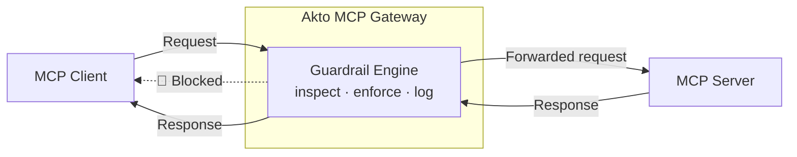
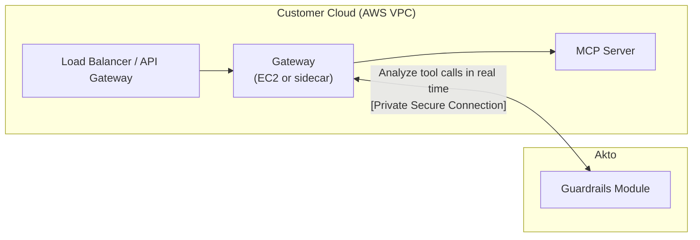

# MCP Gateway

## Overview

Akto MCP Gateway is a security and governance layer that sits between MCP (Model Context Protocol) clients and MCP servers. It enables organizations to implement guardrail protection, security policies, and guardrails for all MCP server requests while maintaining seamless connectivity to the original MCP servers.

## Key Features

* **Guardrail Protection**: Real-time scanning and blocking of malicious requests
* **Security Guardrails**: Enforce organizational security policies and compliance requirements
* **Request Monitoring**: Complete visibility into all MCP communications
* **Transparent Proxying**: Zero-configuration changes required on MCP servers

## Architecture



### Cloud setup



## How It Works

1. **Request Interception**: MCP clients send requests to the Akto gateway endpoint instead of directly to MCP servers
2. **Security Analysis**: Each request undergoes guardrail detection and policy validation
3. **Policy Enforcement**: Requests are evaluated against configured guardrails
4. **Request Forwarding**: Validated requests are forwarded to the original MCP server
5. **Response Processing**: Server responses are analyzed and returned to the client

## Configuration

### Basic Setup

The gateway URL is not a shared public endpoint; it's deployed uniquely for each client. Contact Akto Support to get your client-specific gateway URL, then prepend your original MCP server URL with it. All existing authentication and credentials for your original MCP server remain unchanged.

**Gateway URL Format:**

```
https://{your-client-gateway}.akto.io/proxy/{protocol}/{host}/{path}
```

Where the original MCP server URL is transformed by:

* Replacing `://` with `/`
* Example: `https://mcp.example.com/api` → `https/mcp.example.com/api`

#### Configuration Examples

1.  **SSE-based MCP Server**

    Original configuration:

    ```json
    {
      "mcpServers": {
        "kite-trading": {
          "url": "https://mcp.kite.trade/sse",
          "apiKey": "your-kite-api-key"
        }
      }
    }
    ```

    With Akto gateway:

    ```json
    {
      "mcpServers": {
        "kite-trading": {
          "url": "https://{your-client-gateway}.akto.io/proxy/https/mcp.kite.trade/sse",
          "apiKey": "your-kite-api-key"
        }
      }
    }
    ```
2.  **WebSocket MCP Server**

    Original configuration:

    ```json
    {
      "mcpServers": {
        "data-server": {
          "url": "wss://api.example.com/mcp",
          "auth": {
            "token": "bearer-token-123"
          }
        }
      }
    }
    ```

    With Akto gateway:

    ```json
    {
      "mcpServers": {
        "data-server": {
          "url": "https://{your-client-gateway}.akto.io/proxy/wss/api.example.com/mcp",
          "auth": {
            "token": "bearer-token-123"
          }
        }
      }
    }
    ```


**Important Notes**

* Your gateway URL is deployed specifically for your organization; it is not shared across clients.
* All original authentication credentials (API keys, tokens, etc.) remain the same
* The gateway transparently forwards authentication headers to the original server
* No changes required on the MCP server side
* The gateway URL supports both HTTP/HTTPS and WebSocket protocols


## Security Features

### 1. Guardrails

Every request and response that passes through the gateway is evaluated against Akto's guardrail scanners, the same ones used across every Akto connector:

* **Input guardrails**, applied to the request before it reaches your MCP server: prompt injection, secrets and credential leakage, banned code and topics, tool-call restrictions, context poisoning, and more.
* **Output guardrails**, applied to the server's response before it reaches the client: sensitive data exposure, malicious URLs, bias, tool-call abuse, and more.

Akto ships 40+ built-in guardrail scanners across input and output, plus custom policies for your own rules. See [Agent Guard](../concepts/agent-guard.md) for the full list of scanners and what each one detects.

### 2. Access Control

* **Authentication**: API key-based authentication for all gateway requests
* **Authorization**: Role-based access control for different MCP operations
* **IP Whitelisting**: Restrict access to approved IP addresses
* **Session Management**: Secure session handling with automatic timeout

### 3. Data Protection

* **Encryption in Transit**: TLS 1.3 for all communications
* **PII Detection**: Automatic identification and protection of sensitive data
* **Data Masking**: Real-time redaction of sensitive information
* **Audit Logging**: Comprehensive logging of all requests and responses

## Monitoring & Analytics

### Dashboard Metrics

* Request volume and trends
* Guardrail detection statistics
* Blocked request analysis
* Performance metrics (latency, throughput)
* Error rates and patterns

## API Reference

### Gateway Endpoints

#### Health Check

```http
GET https://{your-client-gateway}.akto.io/health
Authorization: Bearer {api_key}
```

#### Response Format

```json
{
  "success": true,
  "data": {
    "response": {...},
    "metadata": {
      "request_id": "req_123456",
      "latency_ms": 45,
      "threats_detected": [],
      "guardrails_applied": ["PII Protection"]
    }
  }
}
```

## Best Practices

1. **Regular Policy Updates**: Keep security policies and guardrails up-to-date
2. **Monitor Alert Fatigue**: Fine-tune detection rules to reduce false positives
3. **Backup Configuration**: Maintain fallback options for critical MCP servers
4. **Regular Audits**: Review logs and analytics for security insights

## Troubleshooting Common Issues

### Connection Timeout

* Verify network connectivity to Akto gateway
* Check firewall rules and gateway settings
* Validate API key and authentication

### Request Blocked

* Review security detection logs for specific violations
* Check guardrail configurations
* Verify request content against security policies

## Get Support for your Akto setup

There are multiple ways to request support from Akto. We are 24X7 available on the following:

1. In-app `intercom` support. Message us with your query on intercom in Akto dashboard and someone will reply.
2. Join our [discord channel](https://www.akto.io/community) for community support.
3. Contact `help@akto.io` for email support.
4. Contact us [here](https://www.akto.io/contact-us).
