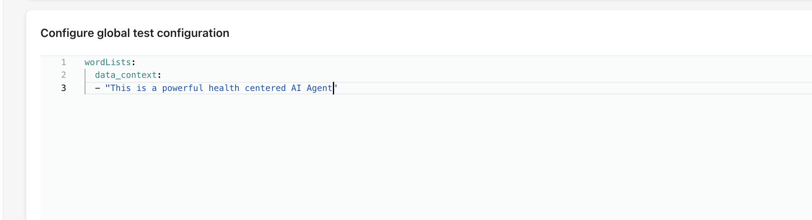

# Global Scan Template Configuration

**Global Scan Template Configuration** enables you to define reusable and centralized `wordLists` that automatically apply across all your probe templates.

<figure><figcaption></figcaption></figure>

