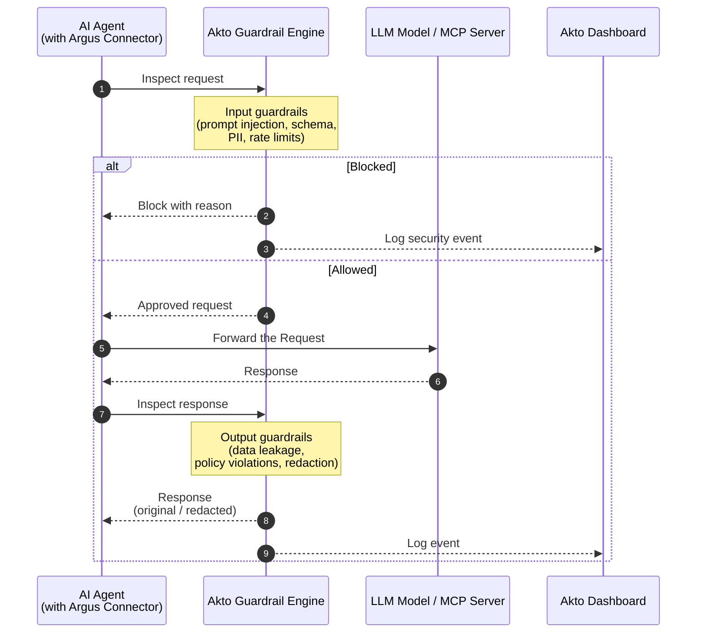

# Argus Guardrails

Akto Argus applies guardrails at runtime in front of the homegrown AI agents, MCP servers, and GenAI applications you ship to production. Guardrails sit in the request and response path of a centralized proxy, so every call your agents make is inspected, scored, and either allowed or blocked before it can cause harm.

## The Problem You Face

Production AI agents behave differently than traditional applications, and traditional controls do not keep up:

* Agent behavior changes dynamically at runtime, so pre-deployment scanning alone cannot catch prompt injection, tool abuse, or unsafe actions.
* MCP servers and agent tools expose powerful capabilities that need consistent, centralized policy enforcement, not per-service one-offs.
* Sensitive data can flow back through agent responses long after the request has been served, requiring inspection on both directions.

## How Argus Guardrails Help

Argus routes traffic through the **Akto MCP Proxy** or **Akto AI Agent Proxy** and evaluates every request and response against your policies. Enforcement is centralized, consistent across all your agents, and tied directly to the threat dashboard so you can investigate and respond to events in one place.

## What Argus Guardrails Cover

* **Prompt injection and jailbreaks** — detect and block adversarial prompts attempting to override agent instructions or escalate privileges.
* **Sensitive data leakage** — scan agent responses for PII, secrets, and regulated data, and redact or block before they reach the caller.
* **Unauthorized tool use** — restrict which MCP tools and actions an agent can invoke at runtime, even when its planner attempts to call them.
* **Schema violations and probing** — detect agent requests that deviate from expected MCP or tool schemas, an early signal of abuse attempts.
* **Rate abuse and successful exploits** — apply dynamic rate limits and surface attack chains that succeeded against your agents.

Argus ships with 20+ built-in guardrail policies covering input and output threats. See [**Agent Guard**](../agentic-guardrails/concepts/agent-guard.md) for the full list of scanners and what each one detects.

## How It Works

Argus connectors — agent frameworks, API gateways, service meshes, or cloud platforms — run alongside your AI agents in production. When an agent makes a tool call or LLM request, the connector hands the payload off to the Akto Guardrail Engine, which evaluates it against your input policies and returns the verdict. The connector then forwards the approved request to the AI tool or MCP server, captures the response, and sends it back through the engine for output guardrail checks before delivering it to the agent. Every decision flows into the Akto dashboard for monitoring, threat analysis, and remediation.

## Where Guardrails Plug In

* [**MCP Proxy**](../agentic-guardrails/overview/akto-mcp-proxy.md) — enforce guardrails on traffic to and from your MCP servers.
* [**AI Agent Proxy**](../agentic-guardrails/overview/akto-agent-proxy.md) — enforce guardrails on traffic to and from your homegrown AI agents.
* [**Connectors**](connectors/README.md) — route production traffic through Akto's proxy from any of the supported deployment targets.

## What You Can Do

* Define and enforce guardrail policies that control what your agents and MCP tools can do at runtime.
* Investigate threat actors, successful exploits, and guardrail activity from a centralized dashboard.
* Tie guardrail events into your remediation and ticketing workflows.

## Learn More

For a deep dive into guardrail scanners, policy creation, threat dashboards, and remediation workflows, see the [**Agentic Guardrails**](../agentic-guardrails/overview/README.md) section.
