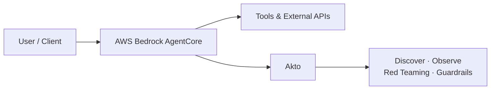

# AWS Bedrock AgentCore

## Overview

AWS Bedrock AgentCore is Amazon's managed platform for building, deploying, and operating production-grade AI agents. It provides a full runtime environment — handling infrastructure, memory, tool connectivity, observability, and identity — so teams can focus on agent logic rather than platform operations.

Akto integrates with Bedrock AgentCore to bring security visibility to agents deployed on the platform, covering prompt-level threats, sensitive data exposure, and tool/API misuse across all supported frameworks and model providers.

## What is AWS Bedrock AgentCore?

AgentCore is built around two deployment models:

* **Code-based agents** (GA) — you write the agent loop in Python using a framework of your choice (Strands Agents, LangGraph, Google ADK, OpenAI Agents SDK), package it, and deploy it to the AgentCore Runtime. Full control over orchestration.
* **Managed harness** (preview) — you declare the agent in config (model, prompt, tools, memory) and AgentCore runs the orchestration loop for you. No framework code required.

Both models deploy to a managed AgentCore Runtime endpoint and share the same underlying capability set.

## Key Platform Capabilities

| Capability | What It Provides |
|---|---|
| **AgentCore Runtime** | Managed execution environment; serves agent endpoints over HTTP, MCP, or A2A protocols |
| **Memory** | Short-term (session) and long-term (cross-session) memory stores with configurable retrieval |
| **Gateway** | Governed connectivity to external REST APIs and MCP tool servers |
| **Browser** | Managed web browsing tool available to agents at runtime |
| **Code Interpreter** | Sandboxed environment for agents to execute generated code |
| **Identity** | OAuth, API key management, and workload identity for agent-to-service authentication |
| **Observability** | Traces, structured logs, and metrics routed to CloudWatch |
| **VPC Support** | Run agents inside a customer-owned VPC for network isolation |

## What Akto Does

* **Discover** — automatically inventory all agents deployed on Bedrock AgentCore, their tools, and connected APIs
* **Observe** — capture agent conversations, tool calls, and API traffic in real time for continuous visibility
* **Red Teaming** — run automated adversarial probes against your agents to surface prompt injection, jailbreaks, and abuse scenarios before they reach production
* **Guardrails** — detect policy violations, sensitive data exposure, and unsafe model outputs at runtime and enforce security controls

## Architecture

## Integration Setup


To connect Akto with your AWS Bedrock AgentCore deployment, reach out to the Akto support team at [support@akto.io](mailto:support@akto.io). We'll guide you through the setup based on your specific deployment configuration.


## Related

* [Connect Akto with AWS Bedrock](connect-akto-with-aws-bedrock.md) — for teams using standard Bedrock model invocation logging outside of AgentCore

## Get Support for your Akto setup

There are multiple ways to request support from Akto. We are 24X7 available on the following:

1. In-app `intercom` support. Message us with your query on intercom in Akto dashboard and someone will reply.
2. Join our [discord channel](https://www.akto.io/community) for community support.
3. Contact `help@akto.io` for email support.
4. Contact us [here](https://www.akto.io/contact-us).
