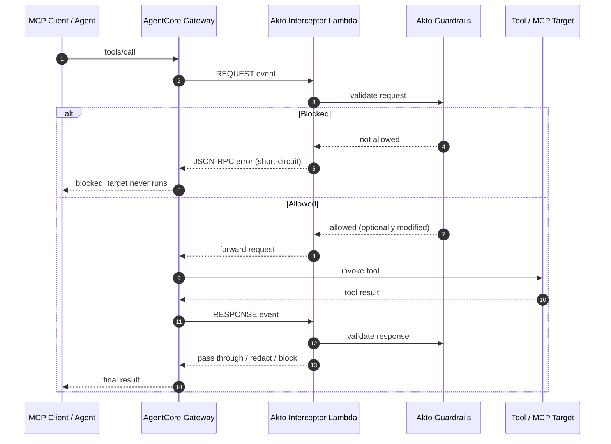

# AWS Bedrock AgentCore

## Overview

AWS Bedrock AgentCore is Amazon's managed platform for building and operating production AI agents. Its **Gateway** is a managed MCP endpoint that aggregates tools (Lambda, OpenAPI, and MCP servers) and serves them to your agents and MCP clients over a single URL.

Akto secures this traffic with a **gateway interceptor** — an AWS Lambda function that AgentCore invokes on every request and response passing through the gateway. It validates MCP `tools/call` traffic against your Akto guardrail policies in real time: blocking disallowed tool calls, redacting sensitive tool results, and ingesting all tool activity into the Akto dashboard.

The interceptor code and deployment script are open source: [github.com/akto-api-security/aws-bedrock-agentcore](https://github.com/akto-api-security/aws-bedrock-agentcore).

## How It Works

A single Lambda is attached to the gateway at two interception points — **REQUEST** (before the tool runs) and **RESPONSE** (after the tool returns). The same function handles both; it detects which phase it is from the event.



### What gets guardrailed

| MCP method | REQUEST interceptor | RESPONSE interceptor |
|---|---|---|
| `tools/call` | Validated; blocked or arguments rewritten | Result validated; blocked or redacted |
| `tools/list`, `initialize`, `notifications/*`, `ping` | Passed through | Passed through |

## What You'll Achieve

✅ **Real-time tool-call guardrails** — block disallowed `tools/call` before the tool executes\
✅ **Response redaction** — strip or block sensitive data in tool results before the client sees them\
✅ **Full observability** — every MCP tool call and result is ingested into the Akto dashboard\
✅ **Managed enforcement** — runs inside AWS as a gateway interceptor; no proxy or sidecar to operate\
✅ **Fail-open by design** — if Akto is unreachable, traffic passes through so the gateway never breaks

## Prerequisites

### AWS

* An existing AgentCore **Gateway** (MCP protocol) — note its **Gateway ID** and **Region**
* AWS credentials with permissions for `lambda:*`, `iam:CreateRole` / `PutRolePolicy` / `PassRole`, and `bedrock-agentcore-control:GetGateway` / `UpdateGateway`
* For the CLI method: `aws` CLI v2, `jq`, and `zip` installed locally

### Akto

* Akto **Data Ingestion URL** (`AKTO_DATA_INGESTION_URL`)
* Akto **API token** (`AKTO_API_TOKEN`)

## Setup

You can deploy either with the provided CLI script or manually from the AWS Console. Both attach the **same** Lambda to both interception points.





**Clone the repository**

```bash
git clone https://github.com/akto-api-security/aws-bedrock-agentcore.git
cd aws-bedrock-agentcore/deploy
```



**Create your `.env`**

```bash
cp .env.example .env
```

Fill in the four required values:

```bash
AKTO_DATA_INGESTION_URL=https://your-akto-instance.com
AKTO_API_TOKEN=your-akto-api-token
AWS_REGION=ap-south-1
GATEWAY_IDS=your-gateway-id          # one or many, comma/space separated
```



**Run the deploy script**

```bash
./deploy.sh
```

The script auto-fetches your AWS account ID, creates the Lambda execution role if needed, packages and deploys the interceptor, then for each gateway in `GATEWAY_IDS` grants invoke permission and attaches the interceptor (REQUEST + RESPONSE, with request headers enabled). It is idempotent — safe to re-run.




To attach to multiple gateways, list them in `GATEWAY_IDS` separated by commas or spaces. They must all be in the same `AWS_REGION`; for another region, run the script again with that region.






**Create the Lambda function**

Open the **AWS Lambda** console (in the same Region as your gateway) → **Create function** → **Author from scratch**.

* **Function name:** `akto-guardrails-interceptor`
* **Runtime:** **Python 3.12**
* **Architecture:** `x86_64` (default)

Click **Create function**.



**Add the interceptor code**

Download [`lambda/interceptor/handler.py`](https://github.com/akto-api-security/aws-bedrock-agentcore/blob/master/lambda/interceptor/handler.py) from the repository.

On the function page, open the **Code** tab and either:

* paste the file contents into the inline editor and rename the file to `handler.py`, **or**
* zip `handler.py` and use **Upload from → .zip file**

Then set the entry point: **Runtime settings → Edit → Handler** = `handler.lambda_handler`. Click **Save**.



**Set environment variables**

Go to **Configuration → Environment variables → Edit → Add environment variable** and add both:

| Key | Value |
|---|---|
| `AKTO_DATA_INGESTION_URL` | `https://your-akto-instance.com` |
| `AKTO_API_TOKEN` | your Akto API token (go to **Akto Argus → Connectors → Setup Guardrail** card and copy your token) |

Click **Save**.



Copy the **Function ARN** shown at the top right of the function page — you'll need it in the next steps.



**Allow the gateway to invoke the Lambda**

The gateway calls the interceptor using its own execution role, so that role needs `lambda:InvokeFunction` permission.

1. In the **Bedrock AgentCore** console, open your **Gateway** and note its **execution role** (an IAM role ARN under the gateway details).
2. Open the **IAM** console → **Roles** → find that role → **Add permissions → Create inline policy** → **JSON** tab, and paste (replace the ARN with your function ARN):

```json
{
  "Version": "2012-10-17",
  "Statement": [
    {
      "Effect": "Allow",
      "Action": "lambda:InvokeFunction",
      "Resource": "arn:aws:lambda:<region>:<account-id>:function:akto-guardrails-interceptor"
    }
  ]
}
```

3. Name it `invoke-akto-guardrails-interceptor` and **Create policy**.



**Attach the interceptor to the gateway**

Back in the **Bedrock AgentCore** console → your **Gateway** → **Edit**, find the interceptor configuration and paste the **same** Function ARN into both fields:

* **Request Interceptor Lambda ARN** → your function ARN — set **Pass request header** to **True**
* **Response Interceptor Lambda ARN** → the **same** function ARN — set **Pass request header** to **True**
* Leave **Exclude the response body from the interceptor Lambda invocation** **unchecked**

Click **Save** / **Update gateway**.




Set **Pass request header** to **True** on both interceptors — the interceptor forwards the `Mcp-Session-Id` header to Akto for session grouping; with it off, sessions can't be correlated. And keep **Exclude the response body** unchecked, or response-content guardrails become a no-op.




## Verify the Integration

Tail the Lambda logs and make a tool call through the gateway:

```bash
aws logs tail /aws/lambda/akto-guardrails-interceptor --follow --region <your-region>
```

On a `tools/call` you should see:

```
Guardrailing REQUEST tools/call: <tool-name>
Akto response: status=200 ...
```

A blocked call returns a JSON-RPC error to the client instead of the tool result, and the tool activity appears in the Akto dashboard.

## Environment Variables

Only two settings are environment-driven; everything else is a fixed default tuned for the gateway use case.

| Variable | Default | Description |
|---|---|---|
| `AKTO_DATA_INGESTION_URL` | *(required)* | Base URL of your Akto data ingestion service |
| `AKTO_API_TOKEN` | *(required)* | Authorization token sent to the Akto API |

## Guardrail Behaviour

The interceptor reads the guardrail verdict from Akto and acts on the policy `behaviour`:

| Verdict | Action at the gateway |
|---|---|
| Allowed | Traffic passes through |
| Blocked (`block`) | Returns a JSON-RPC error; the tool never runs (REQUEST) or the result is replaced (RESPONSE) |
| `warn` / `alert` | Traffic is **allowed and logged** — a gateway has no interactive resubmit path, so warnings cannot hard-block |
| Modified | The tool arguments (REQUEST) or result (RESPONSE) are rewritten with Akto's redacted payload |
| Akto error / timeout | **Fail-open** — traffic passes through so the gateway never breaks |


Configure which tools and patterns to block, warn, or redact in the Akto dashboard under **Settings → Guardrails**. The interceptor enforces whatever policies you define there.


## Troubleshooting

### Interceptor not firing

```bash
# Confirm the interceptor is attached to the gateway
aws bedrock-agentcore-control get-gateway \
  --gateway-identifier <gateway-id> --region <region> \
  --query interceptorConfigurations
```

You should see your Lambda ARN with `interceptionPoints` of `["REQUEST","RESPONSE"]` and `passRequestHeaders: true`.

### Guardrails always allowing (fail-open)

The interceptor is fail-open by design — any Akto error allows the request through. Check the Lambda logs:

```bash
aws logs tail /aws/lambda/akto-guardrails-interceptor --region <region> | grep -i "fail-open\|error"
```

Common causes:

* `AKTO_DATA_INGESTION_URL` not set or unreachable from the Lambda
* The Lambda is in a VPC without outbound internet (NAT) to reach Akto
* Guardrail policies not configured in the Akto dashboard

### Tool results not guardrailed

Confirm the **Response Interceptor** is configured (same Lambda ARN) and that **Exclude the response body** is unchecked. Look for `Guardrailing RESPONSE tools/call result:` in the logs.

## Get Support for your Akto setup

There are multiple ways to request support from Akto. We are 24X7 available on the following:

1. In-app `intercom` support. Message us with your query on intercom in Akto dashboard and someone will reply.
2. Join our [discord channel](https://www.akto.io/community) for community support.
3. Contact `help@akto.io` for email support.
4. Contact us [here](https://www.akto.io/contact-us).
