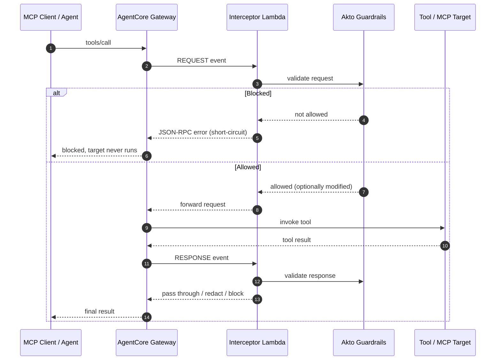

# AWS Bedrock AgentCore

## Overview

AWS Bedrock AgentCore is Amazon's managed platform for building and operating production AI agents. A **Gateway** is a managed front door: an MCP Gateway aggregates tools (Lambda, OpenAPI, and MCP servers); a protocol-less Gateway can proxy HTTP Runtime, inference, and custom targets.

Akto secures this traffic with a **gateway interceptor**: an AWS Lambda function that AgentCore invokes on every request and response passing through the gateway. It validates MCP `tools/call` traffic (and buffered HTTP target bodies) against your Akto guardrail policies in real time: blocking disallowed calls, redacting sensitive results, holding traffic for human approval when configured, and ingesting activity into the Akto dashboard.

The integration is a **public Lambda layer**. Attach the layer, set two environment variables, and either:

* use Akto's one-line handler if the gateway has **no interceptor yet**, or
* wrap your existing handler if the gateway **already has an interceptor**.

Open source: [github.com/akto-api-security/aws-bedrock-agentcore](https://github.com/akto-api-security/aws-bedrock-agentcore).

## How It Works

A single Lambda is attached to the gateway at two interception points: **REQUEST** (before the target runs) and **RESPONSE** (after the target returns). The same function handles both; it detects which phase it is from the event.


```mermaid
sequenceDiagram
    autonumber
    participant Client as MCP Client / Agent
    participant Gateway as AgentCore Gateway
    participant Interceptor as Interceptor Lambda
    participant Akto as Akto Guardrails
    participant Target as Tool / MCP Target

    Client->>Gateway: tools/call
    Gateway->>Interceptor: REQUEST event
    Interceptor->>Akto: validate request
    alt Blocked
        Akto-->>Interceptor: not allowed
        Interceptor-->>Gateway: JSON-RPC error (short-circuit)
        Gateway-->>Client: blocked, target never runs
    else Allowed
        Akto-->>Interceptor: allowed (optionally modified)
        Interceptor-->>Gateway: forward request
        Gateway->>Target: invoke tool
        Target-->>Gateway: tool result
        Gateway->>Interceptor: RESPONSE event
        Interceptor->>Akto: validate response
        Interceptor-->>Gateway: pass through / redact / block
        Gateway-->>Client: final result
    end
```

### What gets guardrailed

| Traffic | REQUEST interceptor | RESPONSE interceptor |
| ------- | ------------------- | -------------------- |
| MCP `tools/call` | Validated; blocked, rewritten, or held for approval | Result validated; blocked or redacted |
| MCP `tools/list`, `initialize`, `notifications/*`, `ping` | Passed through | Passed through |
| HTTP-family targets (AgentCore Runtime, inference, custom) in **buffered** mode | Non-empty bodies validated | Non-empty bodies validated |


HTTP interceptors run only in AWS **buffered** mode. Streaming HTTP targets bypass interceptors. If the gateway excludes `RESPONSE_BODY`, Akto cannot scan that response. HTTP-target Gateway availability is region-dependent; a Gateway created with `protocolType=MCP` cannot host HTTP targets.


### Guarding an AgentCore Runtime agent

To guardrail the user's prompt and the Runtime's final response, place the
Runtime behind a separate Gateway with an **HTTP Runtime target**:

```text
Client → HTTP-target Gateway → AgentCore Runtime → MCP Gateway → tools
```

The outer Gateway invokes Akto for the HTTP request and response. The inner MCP
Gateway invokes Akto for tool calls and tool results. Both gateways can use the
same interceptor Lambda.

Important AWS requirements:

* Create the outer Gateway **without** `protocolType=MCP`; MCP gateways reject
  HTTP targets.
* Add the Runtime as an `http.agentcoreRuntime` target and use buffered
  responses.
* Invoke it at
  `https://<gateway-id>.gateway.bedrock-agentcore.<region>.amazonaws.com/<target-name>/invocations`.
* Restrict the Runtime resource policy to the outer Gateway execution role.
  Otherwise callers with `InvokeAgentRuntime` can bypass the Gateway and Akto.

The outer Gateway sees the initial user request and final agent response. Calls the agent makes internally to a Bedrock model are not Gateway traffic; use in-agent hooks or a model proxy if those intermediate model requests must also be inspected.

### Existing interceptor composition

If you wrap an existing interceptor, **your handler runs first**. Akto then scans the **effective** request or response after your transformations, so later code cannot bypass a block or redaction. Your headers, status codes, and unrelated fields are retained. Akto's block or rewrite takes precedence.

## What You'll Achieve

✅ **Real-time tool-call guardrails**: block disallowed `tools/call` before the tool executes\
✅ **Response redaction**: strip or block sensitive data in tool results before the client sees them\
✅ **Human approval**: hold a call until an admin decides in Akto (up to Lambda's timeout)\
✅ **Full observability**: every guarded call is ingested into the Akto dashboard\
✅ **Managed enforcement**: runs inside AWS as a gateway interceptor; no proxy or sidecar\
✅ **Fail-closed by default**: if Akto is unreachable or approval is unresolved, the call is blocked (set `AKTO_FAIL_OPEN=true` to allow)

## Prerequisites

### AWS

* An existing AgentCore **Gateway**: note its **Gateway ID** and **Region**. MCP Gateways guard tool traffic; a separate protocol-less Gateway with an HTTP Runtime target is required to guard agent prompts and final responses.
* AWS credentials with permissions for `lambda:*` (including attaching a layer), `iam:CreateRole` / `PutRolePolicy` / `PassRole` (CLI only), and `bedrock-agentcore-control:GetGateway` / `UpdateGateway`
* For the CLI method: `aws` CLI v2, `jq`, and `zip` installed locally

### Akto

* Akto **Data Ingestion URL** (`AKTO_DATA_INGESTION_URL`) — base URL only, **no** `/api/ingestData` and **no** `/api/http-proxy`
* Akto **API token** (`AKTO_API_TOKEN`)

## Choose your path

| Gateway today | What you change |
| ------------- | --------------- |
| **No interceptor** | Deploy Akto's Lambda with the **CLI or Console** (layer + one-line handler), attach it as REQUEST + RESPONSE. |
| **Already has an interceptor** | Keep that Lambda. Attach the Akto **layer**, set env vars, wrap your handler. Do **not** replace the gateway interceptor with a second Lambda unless AWS chaining is confirmed for your account |


An AgentCore Gateway interceptor configuration is a replace-on-update field. The CLI deploy script **replaces** the gateway's interceptor list with Akto's Lambda. If you already have an interceptor, use the **Existing interceptor** path below instead of `deploy.sh`.


## Akto Lambda layer

Attach this **versioned** layer to the interceptor Lambda in the same Region. Layers are Region-specific; pin the exact version.

**Current public `us-east-1` layer:**

<pre data-overflow="wrap"><code>arn:aws:lambda:us-east-1:041877753357:layer:akto-agentcore:3
</code></pre>

Compatible runtimes: Python 3.10–3.13. Architectures: `x86_64` and `arm64`. Other accounts can attach this version (`lambda:GetLayerVersion` is granted to `*`).

To publish the same artifact in another Region from the repo:

```bash
AWS_REGION=<your-region> deploy/publish-layer.sh
```

## Setup: no existing interceptor

Use this when the gateway does not already run a custom interceptor Lambda.





**Clone the repository**

```bash
git clone https://github.com/akto-api-security/aws-bedrock-agentcore.git
cd aws-bedrock-agentcore/deploy
```



**Create your `.env`**

```bash
cp .env.example .env
```

Fill in the required values:

```bash
AKTO_DATA_INGESTION_URL=https://your-akto-instance.com
AKTO_API_TOKEN=your-akto-api-token
AKTO_LAYER_ARN=arn:aws:lambda:us-east-1:041877753357:layer:akto-agentcore:3
AWS_REGION=us-east-1
GATEWAY_IDS=your-gateway-id          # one or many, comma/space separated
```

`AKTO_LAYER_ARN` must be a **versioned** layer in the same Region as the Lambda. Use the `us-east-1` ARN above, or the ARN printed by `deploy/publish-layer.sh` for another Region.



**Run the deploy script**

```bash
./deploy.sh
```

The script creates the Lambda execution role if needed, deploys a **thin** handler that imports `akto_agentcore.lambda_handler` from the layer, then for each gateway in `GATEWAY_IDS` grants invoke permission and attaches the interceptor (REQUEST + RESPONSE, with request headers enabled). It is idempotent: safe to re-run.


This script **replaces** the gateway interceptor configuration. Do not use it if the gateway already has a custom interceptor — use [Setup: existing interceptor](#setup-existing-interceptor) instead.





To attach to multiple gateways, list them in `GATEWAY_IDS` separated by commas or spaces. They must all be in the same `AWS_REGION`; for another region, run the script again with that region and a layer ARN published there.






**Create the Lambda function**

Open the **AWS Lambda** console (in the same Region as your gateway) → **Create function** → **Author from scratch**.

* **Function name:** `akto-guardrails-interceptor`
* **Runtime:** **Python 3.12** (or 3.13)
* **Architecture:** `x86_64` or `arm64`

Click **Create function**.



**Attach the Akto layer**

On the function page: **Code** → **Layers** → **Add a layer** → **Specify an ARN**. Paste the versioned ARN for your Region, for example:

<pre data-overflow="wrap"><code>arn:aws:lambda:us-east-1:041877753357:layer:akto-agentcore:3
</code></pre>

Click **Add**.



**Add the one-line handler**

On the **Code** tab, replace the default file with `handler.py`:

```python
from akto_agentcore import lambda_handler
```

**Runtime settings → Edit → Handler** = `handler.lambda_handler`. Click **Save**. Deploy the code if the console asks you to.



**Set environment variables and timeout**

Go to **Configuration → Environment variables → Edit** and add:

| Key                       | Value                                                                                              |
| ------------------------- | -------------------------------------------------------------------------------------------------- |
| `AKTO_DATA_INGESTION_URL` | `https://your-akto-instance.com` (base URL only)                                                   |
| `AKTO_API_TOKEN`          | your Akto API token (**Akto Argus → Connectors → Setup Guardrail**)                                |

Optional: `AKTO_FAIL_OPEN=false`, `AKTO_TIMEOUT_SECONDS=30`, `AKTO_APPROVAL_WAIT_SECONDS=840`, `AKTO_APPROVAL_POLL_SECONDS=2`.

Under **Configuration → General configuration**, set **Timeout** to **15 minutes** (900 seconds) if you use human-approval policies. Click **Save**.



Copy the **Function ARN** shown at the top right of the function page: you'll need it in the next steps.



**Allow the gateway to invoke the Lambda**

The gateway calls the interceptor using its own execution role, so that role needs `lambda:InvokeFunction` permission.

1. In the **Bedrock AgentCore** console, open your **Gateway** and note its **execution role** (an IAM role ARN under the gateway details).
2. Open the **IAM** console → **Roles** → find that role → **Add permissions → Create inline policy** → **JSON** tab, and paste (replace the ARN with your function ARN):

```json
{
  "Version": "2012-10-17",
  "Statement": [
    {
      "Effect": "Allow",
      "Action": "lambda:InvokeFunction",
      "Resource": "arn:aws:lambda:<region>:<account-id>:function:akto-guardrails-interceptor"
    }
  ]
}
```

3. Name it `invoke-akto-guardrails-interceptor` and **Create policy**.



**Attach the interceptor to the gateway**

Back in the **Bedrock AgentCore** console → your **Gateway** → **Edit**, find the interceptor configuration and paste the **same** Function ARN into both fields:

* **Request Interceptor Lambda ARN** → your function ARN: set **Pass request header** to **True**
* **Response Interceptor Lambda ARN** → the **same** function ARN: set **Pass request header** to **True**
* Leave **Exclude the response body from the interceptor Lambda invocation** **unchecked**

Click **Save** / **Update gateway**.




Set **Pass request header** to **True** on both interceptors: the interceptor forwards the `Mcp-Session-Id` header to Akto for session grouping; with it off, sessions can't be correlated. And keep **Exclude the response body** unchecked, or response-content guardrails become a no-op.




## Setup: existing interceptor

Use this when the gateway **already** invokes your Lambda on REQUEST and/or RESPONSE. You keep that function, your business logic, and the gateway attachment. Akto is added as a layer around your handler.



**Attach the Akto layer to your existing Lambda**

Lambda console → your interceptor function → **Code** → **Layers** → **Add a layer** → **Specify an ARN**. Paste the versioned ARN for the function's Region:

<pre data-overflow="wrap"><code>arn:aws:lambda:us-east-1:041877753357:layer:akto-agentcore:3
</code></pre>



**Wrap your handler**

Do not replace your interceptor. After your `lambda_handler` is defined, wrap it:

```python
from akto_agentcore import wrap_interceptor


def lambda_handler(event, context):
    # Your existing interceptor logic stays unchanged.
    ...


lambda_handler = wrap_interceptor(lambda_handler)
```

Keep **Runtime settings → Handler** pointing at the same entry point you already use (for example `handler.lambda_handler`). Deploy the function.



**Set Akto environment variables**

**Configuration → Environment variables** — add (do not remove your existing variables):

| Key                       | Value                                                                 |
| ------------------------- | --------------------------------------------------------------------- |
| `AKTO_DATA_INGESTION_URL` | Base URL of your Akto instance, no path                               |
| `AKTO_API_TOKEN`          | Token from **Akto Argus → Connectors → Setup Guardrail**              |

Optional: `AKTO_FAIL_OPEN`, `AKTO_TIMEOUT_SECONDS`, `AKTO_APPROVAL_WAIT_SECONDS`, `AKTO_APPROVAL_POLL_SECONDS` (see [Environment Variables](#environment-variables)).



**Timeout for human approval**

If you use human-approval policies, set the Lambda **timeout** to **900 seconds**. Approval polling waits up to `AKTO_APPROVAL_WAIT_SECONDS` (default 840).



**Leave the gateway interceptor pointing at your Lambda**

You do **not** change the gateway's interceptor ARN. Confirm it still lists **your** function for REQUEST and RESPONSE, **Pass request header** is **True**, and **Exclude the response body** is unchecked.




Your interceptor runs first. Akto scans the payload **after** your transforms. If your handler short-circuits with `transformedGatewayResponse` on REQUEST, Akto still scans that synthetic response before it is returned.


## Verify the Integration

Tail the Lambda logs and make a tool call through the gateway:

```bash
aws logs tail /aws/lambda/<your-interceptor-function> --follow --region <your-region>
```

On a `tools/call` you should see:

```
Guardrailing REQUEST tools/call: <tool-name>
Akto response: status=200 ...
```

A blocked call returns a JSON-RPC error to the client instead of the tool result, and the tool activity appears in the Akto dashboard.

## Environment Variables

| Variable                        | Default      | Description                                                                 |
| ------------------------------- | ------------ | --------------------------------------------------------------------------- |
| `AKTO_DATA_INGESTION_URL`       | _(required)_ | Base URL of your Akto data ingestion service (no `/api/http-proxy`)         |
| `AKTO_API_TOKEN`                | _(required)_ | Authorization token sent to the Akto API                                    |
| `AKTO_FAIL_OPEN`                | `false`      | If `true`, Akto errors and unresolved human approval **allow** the call     |
| `AKTO_TIMEOUT_SECONDS`          | `30`         | Timeout for each Akto guardrails API request                                |
| `AKTO_APPROVAL_WAIT_SECONDS`    | `840`        | Max seconds to poll for a `human_approval` decision                         |
| `AKTO_APPROVAL_POLL_SECONDS`    | `2`          | Interval between approval status polls                                      |

Set the Lambda timeout to **900 seconds** when human approval is enabled.

## Guardrail Behaviour

The interceptor reads the guardrail verdict from Akto and acts on the policy `behaviour`:

| Verdict                         | Action at the gateway                                                                                         |
| ------------------------------- | ------------------------------------------------------------------------------------------------------------- |
| Allowed                         | Traffic passes through (existing interceptor transforms are kept)                                             |
| Blocked (`block`)               | Returns an error; the tool never runs (REQUEST) or the result is replaced (RESPONSE)                          |
| `warn` / `alert`                | Traffic is **allowed and logged**: a gateway has no interactive resubmit path, so warnings cannot hard-block  |
| Modified                        | The tool arguments (REQUEST) or result (RESPONSE) are rewritten with Akto's redacted payload                  |
| `human_approval`                | Lambda polls Akto until approved, blocked, or timeout                                                         |
| Akto error / timeout / no config | **Fail-closed** by default (block). Set `AKTO_FAIL_OPEN=true` to pass traffic through                        |


Configure which tools and patterns to block, warn, redact, or send to human approval in the Akto dashboard under **Settings → Guardrails**. The interceptor enforces whatever policies you define there.


## Troubleshooting

### Interceptor not firing

```bash
# Confirm the interceptor is attached to the gateway
aws bedrock-agentcore-control get-gateway \
  --gateway-identifier <gateway-id> --region <region> \
  --query interceptorConfigurations
```

You should see your Lambda ARN with `interceptionPoints` of `["REQUEST","RESPONSE"]` and `passRequestHeaders: true`.

### `No module named 'akto_agentcore'`

The layer is missing, in the wrong Region, or not attached to this function version. Confirm **Layers** on the Lambda shows the versioned `akto-agentcore` ARN, then deploy a new version if you attached the layer after the last publish.

### Guardrails always blocking (fail-closed)

The interceptor **fails closed** unless `AKTO_FAIL_OPEN=true`. Check the Lambda logs:

```bash
aws logs tail /aws/lambda/<your-interceptor-function> --region <region> | grep -i "failing closed\|error"
```

Common causes:

* `AKTO_DATA_INGESTION_URL` not set, includes a path it should not, or is unreachable from the Lambda
* The Lambda is in a VPC without outbound internet (NAT) to reach Akto
* Guardrail policies not configured in the Akto dashboard
* Human approval still `pending` when the wait budget expires

### Tool results not guardrailed

Confirm the **Response Interceptor** is configured (same Lambda ARN) and that **Exclude the response body** is unchecked. Look for `Guardrailing RESPONSE tools/call result:` in the logs.

## Get Support for your Akto setup

There are multiple ways to request support from Akto. We are 24X7 available on the following:

1. In-app `intercom` support. Message us with your query on intercom in Akto dashboard and someone will reply.
2. Join our [discord channel](https://www.akto.io/community) for community support.
3. Contact `help@akto.io` for email support.
4. Contact us [here](https://www.akto.io/contact-us).
