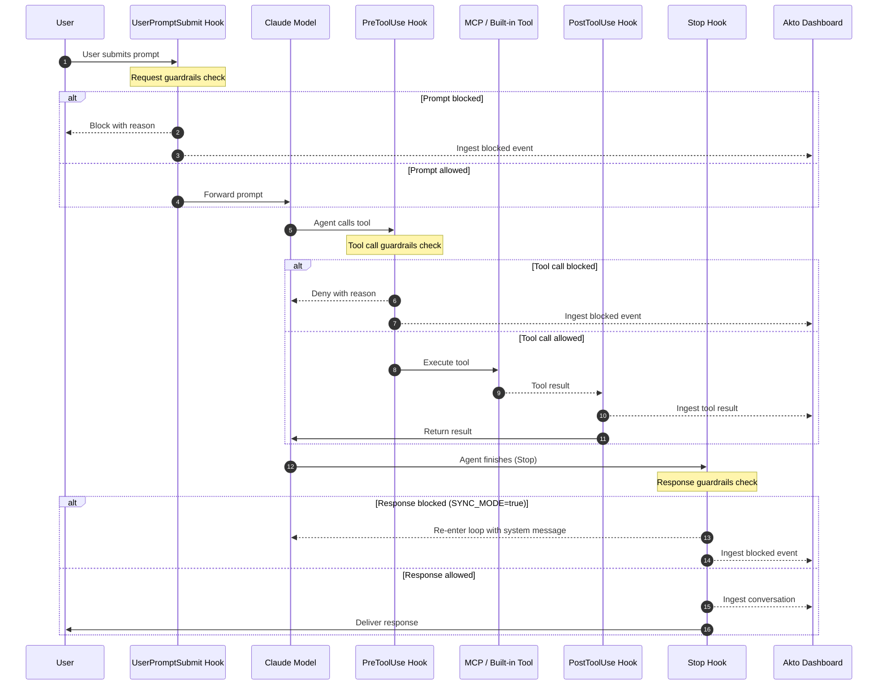

# Claude Agent SDK Hooks

Akto Guardrails for the Claude Agent SDK provides real-time security validation for server-side AI agent applications. It plugs directly into the Claude Agent SDK's native callback system to validate prompts and tool calls before execution, validate agent responses after generation, and ingest all events into your Akto dashboard.

## Key Features

* **Request Guardrails** — Validates user prompts against Akto security policies before they reach the model
* **Response Guardrails** — Validates agent responses against Akto security policies after generation
* **Tool Call Guardrails** — Validates MCP and built-in tool calls before execution
* **Observability** — Ingests all traffic (prompts, tool calls, responses) into the Akto dashboard
* **Sync & Async Modes** — Block violations in real time or run in observe-only mode
* **Zero External Dependencies** — Pure Python stdlib + asyncio; requires Python 3.8+

## How It Works

The integration hooks into four points of the Claude Agent SDK lifecycle:



### Hook Coverage

| Hook | Event | Sync Mode (`true`) | Async Mode (`false`) |
|---|---|---|---|
| `akto_user_prompt_submit` | `UserPromptSubmit` | Validates prompt; blocks if denied | Passes through; no validation |
| `akto_stop` | `Stop` | Validates response; re-enters agent loop if denied | Ingests with `response_guardrails=true` (observational) |
| `akto_pre_tool_use` | `PreToolUse` | Validates tool call; blocks if denied | Passes through; no validation |
| `akto_post_tool_use` | `PostToolUse` | Ingests tool result (always) | Ingests tool result with guardrails flag (always) |

## Prerequisites

* Python 3.8+
* Claude Agent SDK installed
* Akto Data Ingestion URL (`AKTO_DATA_INGESTION_URL`)

## Installation

No external packages required. Copy the three files into your project:

```
your-agent/
├── akto_machine_id.py
├── akto_guardrails_core.py
├── hooks.py
└── your_agent.py
```

Download from GitHub:

```bash
HOOKS_BASE="https://raw.githubusercontent.com/akto-api-security/akto/master/apps/mcp-endpoint-shield/claude-agent-sdk-hooks"

curl -o akto_machine_id.py     "${HOOKS_BASE}/akto_machine_id.py"
curl -o akto_guardrails_core.py "${HOOKS_BASE}/akto_guardrails_core.py"
curl -o hooks.py               "${HOOKS_BASE}/hooks.py"
```

## Usage



**Import and Create Hooks**

`create_hooks()` returns four async callbacks bound to the client IP of the incoming request. Call it once per request or session.

```python
from hooks import create_hooks
from claude_agent_sdk import ClaudeAgentOptions, HookMatcher

# Obtain client IP from your web framework (Flask, FastAPI, etc.)
user_prompt_submit, stop, pre_tool_use, post_tool_use = create_hooks(
    client_ip=request.remote_addr  # or however you obtain the client IP
)
```

If the client IP is not available, omit the argument — hooks fall back to `0.0.0.0`.



**Register Hooks with the Agent**

```python
options = ClaudeAgentOptions(
    hooks={
        "UserPromptSubmit": [HookMatcher(hooks=[user_prompt_submit])],
        "Stop":             [HookMatcher(hooks=[stop])],
        "PreToolUse":       [HookMatcher(hooks=[pre_tool_use])],
        "PostToolUse":      [HookMatcher(hooks=[post_tool_use])],
    }
)
```



**Set Environment Variables**

```bash
export AKTO_DATA_INGESTION_URL="https://your-akto-instance.com"
export AKTO_SYNC_MODE="true"          # "true" = block; "false" = observe only
export AKTO_HOST="api.anthropic.com"  # Hostname written into request headers for Akto's HTTP proxy
```

See [Environment Variables](#environment-variables) for the full reference.



**Run Your Agent**

```python
import asyncio
from claude_agent_sdk import run_agent

async def handle_request(user_message: str, client_ip: str):
    user_prompt_submit, stop, pre_tool_use, post_tool_use = create_hooks(client_ip=client_ip)

    options = ClaudeAgentOptions(
        hooks={
            "UserPromptSubmit": [HookMatcher(hooks=[user_prompt_submit])],
            "Stop":             [HookMatcher(hooks=[stop])],
            "PreToolUse":       [HookMatcher(hooks=[pre_tool_use])],
            "PostToolUse":      [HookMatcher(hooks=[post_tool_use])],
        }
    )

    async for event in run_agent(prompt=user_message, options=options):
        print(event)
```



## Sync vs Async Mode

### `AKTO_SYNC_MODE=true` (default — blocking)

```
User prompt → UserPromptSubmit hook
    ├─ Denied: prompt blocked, reason returned to user
    └─ Allowed: forwarded to model

Agent calls tool → PreToolUse hook
    ├─ Denied: tool call blocked, deny reason returned to model
    └─ Allowed: tool executes, result ingested via PostToolUse hook

Agent finishes → Stop hook
    ├─ Response denied: agent re-enters loop with system message to regenerate
    └─ Response allowed: conversation ingested, response delivered to user
```

### `AKTO_SYNC_MODE=false` (observe only)

```
All hooks pass through without blocking.
PostToolUse and Stop ingest traffic to Akto with the guardrails flag set,
so violations are recorded on the Akto side without affecting the agent.
```

## Response Guardrails

The `Stop` hook runs response guardrails by sending the full conversation turn (user prompt + agent response) to Akto's `/validate/response` endpoint via the `response_guardrails=true` query parameter on the http-proxy API.

**Sync mode behaviour when response is denied:**

The hook returns `{"continue_": True, "systemMessage": "<block reason>"}` to re-enter the agent loop. The agent receives the system message and regenerates a safe response.


The Stop hook fires after the agent has finished generating. In streaming deployments the response may already be partially visible to the user. The hook causes a follow-up regeneration but does not retroactively suppress already-streamed content.


## Environment Variables

| Variable | Default | Description |
|---|---|---|
| `AKTO_DATA_INGESTION_URL` | *(required)* | Base URL for Akto's data ingestion service |
| `AKTO_SYNC_MODE` | `true` | `true` = block on violations; `false` = observe-only |
| `AKTO_HOST` | `api.anthropic.com` | Hostname written into request headers sent to Akto's HTTP proxy |
| `AKTO_TIMEOUT` | `5` | HTTP request timeout in seconds |
| `AKTO_TOKEN` | `""` | Authorization header value sent to `AKTO_DATA_INGESTION_URL` |
| `MODE` | `argus` | `argus` (default) or `atlas` |
| `AKTO_CONNECTOR` | `claude_agent_sdk` | Source label shown in the Akto dashboard |
| `LOG_DIR` | `~/.claude/akto/logs` | Directory for log files |
| `LOG_LEVEL` | `INFO` | Logging level (`DEBUG`, `INFO`, `WARNING`, `ERROR`) |
| `LOG_PAYLOADS` | `false` | Set to `true` to log full request/response bodies |
| `SSL_CERT_PATH` | *(unset)* | Path to custom CA certificate bundle |

## Logging

All hooks write to a single log file:

```
$LOG_DIR/akto-agent-sdk.log
# Default: ~/.claude/akto/logs/akto-agent-sdk.log
```

```bash
# Follow logs in real time
tail -f ~/.claude/akto/logs/akto-agent-sdk.log

# Filter for blocked events only
grep "BLOCKING" ~/.claude/akto/logs/akto-agent-sdk.log

# Filter errors
grep -i "error" ~/.claude/akto/logs/akto-agent-sdk.log
```

Set `LOG_PAYLOADS=true` to log full request/response bodies (useful for debugging; disable in production).

## Differences from Claude CLI Hooks

| Aspect | Claude CLI Hooks | Claude Agent SDK Hooks |
|---|---|---|
| Invocation | Shell command via `settings.json` | Async Python callback function |
| Input format | JSON via stdin | `input_data` dict argument |
| Block (UserPromptSubmit) | `print({"decision":"block",...})` | `return {"continue_": False, "systemMessage": ...}` |
| Block (PreToolUse) | `print({"decision":"block",...})` | `return {"hookSpecificOutput": {"permissionDecision": "deny", ...}}` |
| Response guardrails | Stop hook (`validate-response.py`) | Stop hook via `response_guardrails=true` parameter |
| HTTP calls | Synchronous `urllib` | `urllib` wrapped in `asyncio.to_thread` |
| Configuration | Set by `.sh` wrapper scripts | Standard environment variables |
| `AKTO_CONNECTOR` default | `claude_code_cli` | `claude_agent_sdk` |
| Device/server ID | Derived from machine UUID | `AGENT_ID` env var |
| `contextSource` | `ENDPOINT` | `AGENTIC` (hardcoded) |

## Troubleshooting

### Hooks Not Triggering

```bash
# Verify environment variable is set
echo $AKTO_DATA_INGESTION_URL

# Check logs for initialisation message
grep "Akto Agent SDK hooks initialised" ~/.claude/akto/logs/akto-agent-sdk.log
```

### Guardrails Always Allowing (Fail-Open)

The hooks are fail-open by design — any network or API error allows the request through. Check logs for errors:

```bash
grep -i "error\|fail-open" ~/.claude/akto/logs/akto-agent-sdk.log
```

Common causes:
* `AKTO_DATA_INGESTION_URL` not set or unreachable
* `AKTO_SYNC_MODE` set to `false`
* Guardrail policies not configured in the Akto dashboard

### Events Not Appearing in Dashboard

```bash
# Test connectivity to Akto ingestion endpoint
curl -X POST "${AKTO_DATA_INGESTION_URL}/api/http-proxy?ingest_data=true&akto_connector=test" \
  -H "Content-Type: application/json" \
  -d '{"requestPayload": "{\"body\": \"test\"}", "path": "/v1/messages", "method": "POST"}'
```

### Response Guardrails Not Blocking

Confirm that `AKTO_SYNC_MODE=true` and that response guardrail policies are configured in the Akto dashboard under **Settings → Guardrails**. Response guardrails are a separate policy set from request guardrails.

## Get Support

1. In-app `intercom` support — message us from the Akto dashboard
2. Join our [Discord community](https://www.akto.io/community)
3. Email [help@akto.io](mailto:help@akto.io)
4. [Contact us](https://www.akto.io/contact-us)
