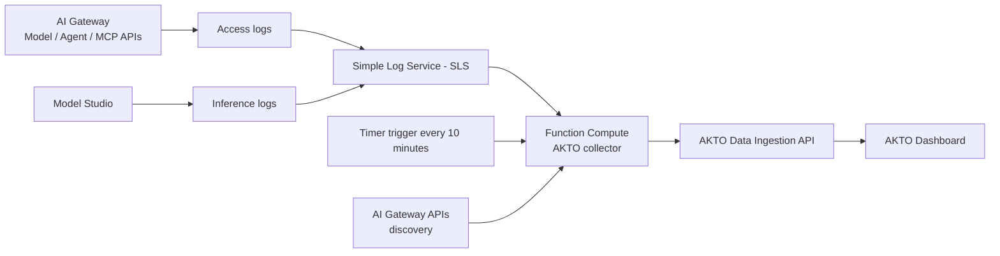
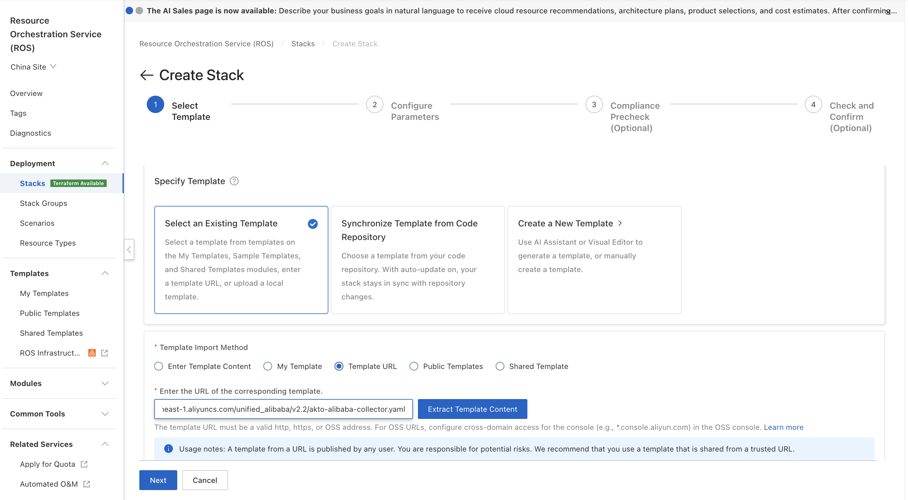
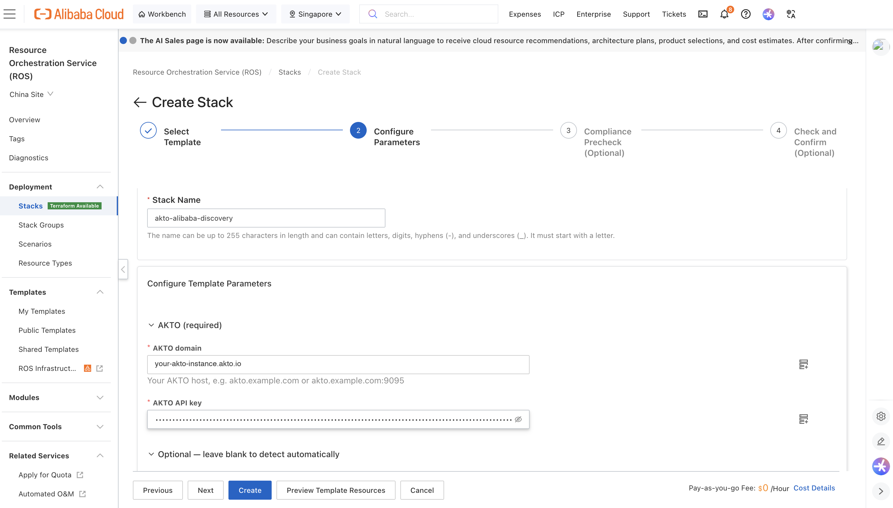

# Alibaba Cloud

## Overview

This guide explains how to set up AKTO's Alibaba Cloud connector in your Alibaba Cloud account. The connector automatically discovers your AI assets, including AI Gateways, Model APIs, Agent APIs, MCP servers and their tools, and sends their traffic (LLM calls, agent calls and MCP tool calls) to your AKTO instance for security analysis.

It is deployed with a single ROS (Resource Orchestration Service) stack, Alibaba Cloud's equivalent of CloudFormation, and runs entirely in your account on Function Compute.

## System Architecture



## What You'll Achieve

✅ **Automatic Discovery**: AI Gateways, Model APIs, Agent APIs, MCP servers and their tools, backend model providers, consumers and plugins\
✅ **Traffic Monitoring**: LLM calls, agent calls and MCP tool calls through your AI Gateway, plus direct Model Studio calls\
✅ **Near Real-time Processing**: Runs immediately after deployment, then every 10 minutes\
✅ **Security Analysis**: Traffic is sent to AKTO for guardrail detection\
✅ **Automatic Updates**: The connector keeps itself on AKTO's latest released version\
✅ **Client-Side Deployment**: Runs in your Alibaba Cloud account, with read-only access to your AI resources

## Prerequisites

### **1. Alibaba Cloud Account Requirements**

* An Alibaba Cloud account with **AI Gateway** and/or **Model Studio** in use.
* The following services activated in the region you deploy to: **Function Compute**, **Simple Log Service (SLS)**, **Object Storage Service (OSS)** and **Resource Orchestration Service (ROS)**.
* A user with permission to create RAM roles, Function Compute functions, OSS buckets and SLS projects (for example `AdministratorAccess`) to create the stack.
* Please provide the Alibaba Cloud **region** you will deploy in to the AKTO team before deployment (for example `ap-southeast-1` for Singapore). The connector reads AI resources and logs in the region it is deployed in. Deploy one stack per region you use.

### **2. Logging Enabled for the Traffic You Want Monitored**

The connector reads traffic from the logs Alibaba Cloud writes to SLS. Discovery works without logs, but **no traffic is captured unless logging is on**.

* **AI Gateway**: the instance must have been created with **Use Simple Log Service (SLS)** enabled.
  * For each **Model API**: open the API → **Policies and Plug-ins** → enable **AI Request Log**, and turn on the switches to record request and response content.
  * For each **MCP service**: enable **MCP Observation** in the service settings.
* **Model Studio** (direct model and agent calls that do not go through the AI Gateway): go to **Model Studio → Operations Management → Monitoring**, enable **audit log delivery** first, then open the **Inference Log** tab → **Start configuration** and choose an SLS project and logstore.


You do not need to tell AKTO where these logs are. The connector finds the AI Gateway and Model Studio logstores automatically. You can still specify them explicitly (see the optional parameters below).


### **3. AKTO Instance Requirements - To be verified with Akto Team**

* AKTO Data Ingestion service running and reachable from the internet
* AKTO API key for authentication

## Step-by-Step Setup





**Prepare Your Information**

Before running the deployment, gather this information:

1. **AKTO Domain** (required): the host of your AKTO Data Ingestion service. Enter the host only.
   * Example: `your-akto-instance.akto.io`, or `your-akto-instance.com:9095` if a port is needed
   * Contact the AKTO support team to obtain it
2. **AKTO API Key** (required): authentication key for your AKTO instance
   * Navigate to: **AKTO Argus** → **Connectors** → **Setup Guardrails**
   * Copy the API key from there
3. **Template URL**: provided by the AKTO team for your region and version. For example:

   <pre data-overflow="wrap"><code>https://akto-alibaba-collector-code-ap-southeast-1.oss-ap-southeast-1.aliyuncs.com/unified_alibaba/v2.2/akto-alibaba-collector.yaml
   </code></pre>

The following are **optional**. Leave them blank to use automatic detection:

4. **AI Gateway log location**: the SLS `project/logstore` of your AI Gateway access logs, comma-separated for several gateways. Use it only if automatic detection does not find them.
   * Find it in: **AI Gateway** → your instance → **Observability and Analysis** → **Logs**
   * Example: `aliyun-product-data-1234567890-ap-southeast-1/apig-access-log`
5. **Model Studio inference-log location**: the SLS `project/logstore` you chose under **Model Studio → Monitoring → Inference Log**.
6. **Model Studio workspace IDs**: comma-separated workspace IDs, shown in the Model Studio console. Provide them if you want agents with **no recent traffic** to be discovered too. If blank, workspaces are learned from the inference logs.
7. **State bucket**: an existing OSS bucket in the same region where the connector stores its checkpoint file (`akto/markers/alibaba/state.json`, with log read positions and the list of discovered assets). If blank, the stack creates a private, encrypted bucket for it.



**Open Resource Orchestration Service (ROS)**

1. Sign in to the Alibaba Cloud console.
2. Search for **Resource Orchestration Service** (or "ROS").
3. Select the **region** you are deploying in, at the top of the page.



**Create Stack**

1. In the left menu, under **Deployment**, click **Stacks** → **Create Stack**.
2. Under **Specify Template**, select **Select an Existing Template**.
3. For **Template Import Method**, select **Template URL**.
4. Paste the template URL provided by the AKTO team. Optionally click **Extract Template Content** to preview it.
5. Click **Next**.

<div data-with-frame="true"><figure><figcaption></figcaption></figure></div>



**Enter Stack Details**

* **Stack Name**: Enter a name for your stack (letters, digits, hyphens and underscores; must start with a letter).
  * Example: `akto-alibaba-discovery`

**Parameters** (the form is grouped into **AKTO (required)** and **Optional — leave blank to detect automatically**):

* **AKTO domain**: `<domain-obtained-from-akto-team>`
* **AKTO API key**: `<Akto-API-Key>`
* **AI Gateway log location**: (optional)
* **Model Studio inference-log location**: (optional)
* **Model Studio workspace IDs**: (optional)
* **State bucket**: (optional)

<div data-with-frame="true"><figure><figcaption></figcaption></figure></div>

Click **Create** (or **Next** to go through the optional Compliance Precheck and Check and Confirm steps first, then **Create**).



**Wait for Completion**

ROS creates the following resources:

* ✅ RAM role for the collector (`AktoCollector-<stack-id>`), read-only on AI Gateway, SLS and Model Studio
* ✅ OSS bucket for the checkpoint file (`akto-alibaba-state-<stack-id>`), unless you provided your own
* ✅ SLS project and logstore for the connector's own run logs (`akto-collector-logs-<stack-id>` / `collector-runs`)
* ✅ Function Compute function `akto-alibaba-collector` and its 10-minute timer trigger
* ✅ Function Compute function `akto-alibaba-collector-updater`, its RAM role and 15-minute timer trigger
* ✅ A first run of the collector, started immediately

**Expected Status:**

```
akto-alibaba-collector - CREATE_IN_PROGRESS
├─ CollectorRole - CREATE_COMPLETE ✓
├─ StateBucket - CREATE_COMPLETE ✓
├─ RunLogProject / RunLogStore - CREATE_COMPLETE ✓
├─ CollectorFunction - CREATE_COMPLETE ✓
├─ CollectorSchedule - CREATE_COMPLETE ✓
├─ CollectorInitialRun - CREATE_COMPLETE ✓
├─ UpdaterRole / UpdaterFunction / UpdaterSchedule - CREATE_COMPLETE ✓
└─ akto-alibaba-collector - CREATE_COMPLETE ✓
```

⏳ **Typical time: 2-3 minutes**



**Verify Success**

1. **Stack Status** should show: **CREATE\_COMPLETE**
2. Click the **Outputs** tab. You should see:
   * **FunctionName**: `akto-alibaba-collector`
   * **StateBucket**: where the checkpoint file is stored
   * **RunLogs**: the SLS project and logstore with the connector's run logs
   * **AutoUpdate**: confirms the connector keeps itself up to date

✅ **Deployment successful!**



**Check the Function Compute Function**

1. Search for **Function Compute** in the console and select your region.
2. Click **Functions** → **`akto-alibaba-collector`**.
3. Open the **Logs** tab (or **Invocation Records**). A run should appear within a minute or two of stack creation.
4. In that run's log you should see lines similar to:

```
🔐 Calling Alibaba as: acs:ram::<account-id>:assumed-role/aktocollector-<stack-id>/FunctionCompute
🔎 Gateway <your-gateway-name>: … AI API(s), … MCP server(s)
🧭 Found 1 AI log source(s): gateway=<project>/<logstore>
📊 Run summary:
  ├─ discovery   … asset(s) …
  ├─ traffic     … log entries → … message(s), … sent
```



**Check the AKTO Dashboard**

1. Open your AKTO dashboard.
2. Each AI Gateway appears as a discovered agent, named after the gateway. Its Model APIs, Agent APIs and MCP servers (with their tools) appear under it.
3. Traffic through the gateway appears with the API type (LLM, AGENT or MCP), the MCP server and tool, the model, token usage and the caller.

✅ **Everything working!**






## **Important Notes**

1. **Processing Schedule**: The connector runs once immediately after deployment, then every 10 minutes. The first run reads up to the last 3 days of logs, and later runs read only new entries.
2. **Automatic Updates**: Every 15 minutes the updater checks AKTO's latest released version and updates the collector if needed. No action is needed from you.
3. **Permissions**: The collector's role can only **read** AI Gateway configuration, SLS logs and Model Studio agents. It can write only its own checkpoint folder (`akto/markers/alibaba/`) and its own run logs. It cannot change your AI Gateway, Model Studio or other resources.
4. **Data Format**: Traffic is sent in AKTO's standard message format, with tags identifying the gateway, API, MCP server, tool, model and caller.
5. **Regions**: One stack covers one region. Deploy a stack in each region where you use AI Gateway or Model Studio.


## What Happens Next

Once deployed, the connector will:

1. **Discover AI Assets**: list your AI Gateways, Model APIs, Agent APIs, MCP servers (with tools), model providers, consumers and plugins, and send them to AKTO
2. **Find the Logs**: locate the AI Gateway and Model Studio logstores in SLS automatically, unless you specified them
3. **Process Traffic**: read new log entries, rebuild streamed responses and MCP tool calls, and send them to AKTO every 10 minutes
4. **Monitor Security**: AKTO analyses the traffic for potential threats

## Uninstalling

Delete the stack in **ROS → Stacks → your stack → Delete**. This removes the functions, timers, RAM roles and the SLS project created by the stack. If the stack created the checkpoint bucket and it still contains the checkpoint file, empty the bucket first (or delete it afterwards).

## Troubleshooting

| Symptom | What to check |
|---|---|
| No traffic appears in AKTO, but the AI Gateway and MCP servers are discovered | Logging is not enabled. Enable **AI Request Log** on your Model APIs and **MCP Observation** on your MCP services (see Prerequisites), send a few requests, and wait for the next run |
| The run log shows `No AI log source found yet` | Enter the **AI Gateway log location** (and/or Model Studio inference-log location) explicitly as `project/logstore` by updating the stack |
| The run log shows `Forbidden`, `AccessDenied` or `ImplicitDeny` errors | Make sure the stack was created from the template URL provided by AKTO without changes. If the stack was recently deleted and re-created, delete it and create it again |
| The run log shows `❌ Batch … failed` or `Send failed` lines | Check the **AKTO domain** and **API key** parameters, and that your AKTO instance is reachable from the internet |
| Agents built in Model Studio are not discovered | Provide the **Model Studio workspace IDs** parameter, or wait until those agents have traffic in the inference logs |

## Support

For issues or questions:

1. **Check the run logs**: Function Compute → `akto-alibaba-collector` → **Logs**, or the SLS project shown in the stack's **RunLogs** output
2. **Review logging**: ensure AI Request Log / MCP Observation (AI Gateway) and Inference Log (Model Studio) are enabled
3. **Verify AKTO connectivity**: check the AKTO domain and API key
4. **Contact AKTO support** with the stack's **Outputs** and the run log of a recent invocation
