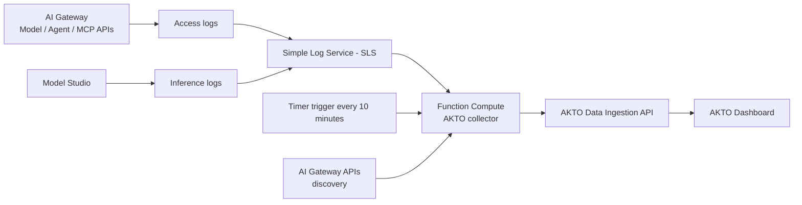
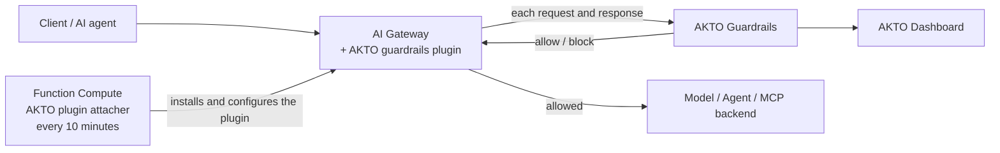

# Alibaba Cloud

## Overview

This guide explains how to set up AKTO's Alibaba Cloud connector in your Alibaba Cloud account. The connector automatically discovers your AI assets, including AI Gateways, Model APIs, Agent APIs, MCP servers and their tools, and sends their traffic (LLM calls, agent calls and MCP tool calls) to your AKTO instance for security analysis.

Traffic through your AI Gateway can reach AKTO in two ways, which you choose when you deploy:

* **From logs** (monitoring): the connector reads the AI Gateway and Model Studio logs that Alibaba Cloud writes to Simple Log Service (SLS), and sends them to AKTO every 10 minutes.
* **Inline, through the AKTO guardrails plugin** (real-time blocking): the connector installs AKTO's plugin on every AI Gateway in the region. The plugin sends each AI request and response to AKTO as it happens, and blocks it if it violates your AKTO guardrail policies.

It is deployed with a single ROS (Resource Orchestration Service) stack, Alibaba Cloud's equivalent of CloudFormation, and runs entirely in your account on Function Compute.

## System Architecture

**From logs**



**Inline, through the AKTO guardrails plugin**



## What You'll Achieve

✅ **Automatic Discovery**: AI Gateways, Model APIs, Agent APIs, MCP servers and their tools, backend model providers, consumers and plugins\
✅ **Traffic Monitoring**: LLM calls, agent calls and MCP tool calls through your AI Gateway, plus direct Model Studio calls\
✅ **Real-time Blocking** (optional): requests and responses that violate your AKTO guardrail policies are blocked at the AI Gateway\
✅ **Near Real-time Processing**: Runs immediately after deployment, then every 10 minutes\
✅ **Security Analysis**: Traffic is sent to AKTO for guardrail detection\
✅ **Automatic Updates**: The connector, and the plugin if used, keep themselves on AKTO's latest released version\
✅ **Client-Side Deployment**: Runs in your Alibaba Cloud account

## Choose a Traffic Mode

You choose the mode with the **Traffic mode** stack parameter, and you can change it later with a stack update. The plugin is added or removed automatically.

| Traffic mode | AKTO guardrails plugin | How traffic is recorded in AKTO | Use it when |
|---|---|---|---|
| **`logs`** (default) | Not installed | From SLS logs, every 10 minutes | You want monitoring only, with no change to your gateways |
| **`inline`** | Installed on every AI Gateway in the region: checks and **blocks** requests and responses | By the plugin, in real time. Gateway logs are not read for those gateways. Model Studio logs are still read | You want real-time blocking, and recording without enabling gateway logging |
| **`both`** | Installed: checks and **blocks** only | From SLS logs, every 10 minutes | You want real-time blocking, with traffic recorded from logs |


The plugin mode (`inline` and `both`) is available from connector version **v2.6**. Use the template URL for v2.6 or later.


## Prerequisites

### **1. Alibaba Cloud Account Requirements**

* An Alibaba Cloud account with **AI Gateway** and/or **Model Studio** in use.
* The following services activated in the region you deploy to: **Function Compute**, **Simple Log Service (SLS)**, **Object Storage Service (OSS)** and **Resource Orchestration Service (ROS)**.
* A user with permission to create RAM roles, Function Compute functions, OSS buckets and SLS projects (for example `AdministratorAccess`) to create the stack.
* Please provide the Alibaba Cloud **region** you will deploy in to the AKTO team before deployment (for example `ap-southeast-1` for Singapore). The connector works with the AI resources and logs in the region it is deployed in. Deploy one stack per region you use.

### **2. Logging Enabled for the Traffic You Want Monitored** (`logs` and `both` modes)

In the `logs` and `both` modes, the connector reads traffic from the logs Alibaba Cloud writes to SLS. Discovery works without logs, but **no traffic is captured from logs unless logging is on**. In `inline` mode, AI Gateway logging is not needed, because the plugin sends the traffic. Model Studio logging is still needed for direct Model Studio calls.

* **AI Gateway**: the instance must have been created with **Use Simple Log Service (SLS)** enabled.
  * For each **Model API**: open the API → **Policies and Plug-ins** → enable **AI Request Log**, and turn on the switches to record request and response content.
  * For each **MCP service**: enable **MCP Observation** in the service settings.
* **Model Studio** (direct model and agent calls that do not go through the AI Gateway): go to **Model Studio → Operations Management → Monitoring**, enable **audit log delivery** first, then open the **Inference Log** tab → **Start configuration** and choose an SLS project and logstore.


You do not need to tell AKTO where these logs are. The connector finds the AI Gateway and Model Studio logstores automatically. You can still specify them explicitly (see the optional parameters below).


### **3. Requirements for the Plugin** (`inline` and `both` modes)

* **AI Gateway** instances in the region you deploy to. The plugin is installed on every AI Gateway in that region that is in the **Running** state.
* **Outbound internet access from the AI Gateway to your AKTO instance on port 443.** The plugin calls AKTO from the gateway itself. If your gateway reaches backends on the internet (for example public model providers or MCP servers), this is already in place. Otherwise, the gateway's VPC needs a **NAT Gateway** with an **SNAT** entry.
* Your **AKTO guardrail policies** set up in the AKTO dashboard. The plugin blocks only what those policies block.

### **4. AKTO Instance Requirements - To be verified with Akto Team**

* AKTO Data Ingestion service running and reachable from the internet
* AKTO Guardrails service reachable from the internet over HTTPS (for the plugin)
* AKTO API key for authentication

## Step-by-Step Setup





**Prepare Your Information**

Before running the deployment, gather this information:

1. **AKTO Domain** (required): the host of your AKTO instance. Enter the host only.
   * Example: `your-akto-instance.akto.io`, or `your-akto-instance.com:9095` if a port is needed
   * Contact the AKTO support team to obtain it
2. **AKTO API Key** (required): authentication key for your AKTO instance
   * Navigate to: **AKTO Argus** → **Connectors** → **Setup Guardrails**
   * Copy the API key from there
3. **Traffic mode** (required, default `logs`): `logs`, `inline` or `both`. See [Choose a Traffic Mode](#choose-a-traffic-mode).
4. **Template URL**: provided by the AKTO team for your region and version. For example:

   <pre data-overflow="wrap"><code>https://akto-alibaba-collector-code-ap-southeast-1.oss-ap-southeast-1.aliyuncs.com/unified_alibaba/v2.6/akto-alibaba-collector.yaml
   </code></pre>

The following are **optional**. Leave them blank to use automatic detection:

5. **AI Gateway log location**: the SLS `project/logstore` of your AI Gateway access logs, comma-separated for several gateways. Use it only if automatic detection does not find them.
   * Find it in: **AI Gateway** → your instance → **Observability and Analysis** → **Logs**
   * Example: `aliyun-product-data-1234567890-ap-southeast-1/apig-access-log`
6. **Model Studio inference-log location**: the SLS `project/logstore` you chose under **Model Studio → Monitoring → Inference Log**.
7. **Model Studio workspace IDs**: comma-separated workspace IDs, shown in the Model Studio console. Provide them if you want agents with **no recent traffic** to be discovered too. If blank, workspaces are learned from the inference logs.
8. **State bucket**: an existing OSS bucket in the same region where the connector stores its checkpoint file (`akto/markers/alibaba/state.json`, with log read positions and the list of discovered assets). If blank, the stack creates a private, encrypted bucket for it.



**Open Resource Orchestration Service (ROS)**

1. Sign in to the Alibaba Cloud console.
2. Search for **Resource Orchestration Service** (or "ROS").
3. Select the **region** you are deploying in, at the top of the page.



**Create Stack**

1. In the left menu, under **Deployment**, click **Stacks** → **Create Stack**.
2. Under **Specify Template**, select **Select an Existing Template**.
3. For **Template Import Method**, select **Template URL**.
4. Paste the template URL provided by the AKTO team. Optionally click **Extract Template Content** to preview it.
5. Click **Next**.

<div data-with-frame="true"><figure><figcaption></figcaption></figure></div>



**Enter Stack Details**

* **Stack Name**: Enter a name for your stack (letters, digits, hyphens and underscores; must start with a letter).
  * Example: `akto-alibaba-discovery`

**Parameters** (the form is grouped into **AKTO (required)**, **Traffic capture** and **Optional — leave blank to detect automatically**):

* **AKTO domain**: `<domain-obtained-from-akto-team>`
* **AKTO API key**: `<Akto-API-Key>`
* **Traffic mode**: `logs`, `inline` or `both`
* **AI Gateway log location**: (optional)
* **Model Studio inference-log location**: (optional)
* **Model Studio workspace IDs**: (optional)
* **State bucket**: (optional)

<div data-with-frame="true"><figure><figcaption></figcaption></figure></div>

Click **Create** (or **Next** to go through the optional Compliance Precheck and Check and Confirm steps first, then **Create**).



**Wait for Completion**

ROS creates the following resources:

* ✅ RAM role for the collector (`AktoCollector-<stack-id>`), read-only on AI Gateway, SLS and Model Studio
* ✅ OSS bucket for the checkpoint file (`akto-alibaba-state-<stack-id>`), unless you provided your own
* ✅ SLS project and logstore for the connector's own run logs (`akto-collector-logs-<stack-id>` / `collector-runs`)
* ✅ Function Compute function `akto-alibaba-collector` and its 10-minute timer trigger
* ✅ Function Compute function `akto-alibaba-plugin-attacher`, its RAM role (`AktoPluginAttacher-<stack-id>`) and 10-minute timer trigger. In `inline` and `both` modes it installs the AKTO guardrails plugin on your AI Gateways while the stack is being created. In `logs` mode it makes no changes
* ✅ Function Compute function `akto-alibaba-collector-updater`, its RAM role and 15-minute timer trigger
* ✅ A first run of the collector, started immediately

**Expected Status:**

```
akto-alibaba-collector - CREATE_IN_PROGRESS
├─ CollectorRole - CREATE_COMPLETE ✓
├─ StateBucket - CREATE_COMPLETE ✓
├─ RunLogProject / RunLogStore - CREATE_COMPLETE ✓
├─ CollectorFunction - CREATE_COMPLETE ✓
├─ CollectorSchedule - CREATE_COMPLETE ✓
├─ CollectorInitialRun - CREATE_COMPLETE ✓
├─ AttacherRole / AttacherFunction / AttacherSchedule - CREATE_COMPLETE ✓
├─ AktoPluginLifecycle - CREATE_COMPLETE ✓
├─ UpdaterRole / UpdaterFunction / UpdaterSchedule - CREATE_COMPLETE ✓
└─ akto-alibaba-collector - CREATE_COMPLETE ✓
```

⏳ **Typical time: 3-5 minutes** (the plugin is published and installed during creation in `inline` and `both` modes)



**Verify Success**

1. **Stack Status** should show: **CREATE\_COMPLETE**
2. Click the **Outputs** tab. You should see:
   * **FunctionName**: `akto-alibaba-collector`
   * **StateBucket**: where the checkpoint file is stored
   * **RunLogs**: the SLS project and logstore with the connector's run logs
   * **TrafficMode**: the mode you chose
   * **PluginAttacher**: `akto-alibaba-plugin-attacher`
   * **AutoUpdate**: confirms the connector keeps itself up to date

✅ **Deployment successful!**



**Check the Function Compute Functions**

1. Search for **Function Compute** in the console and select your region.
2. Click **Functions** → **`akto-alibaba-collector`**.
3. Open the **Logs** tab (or **Invocation Records**). A run should appear within a minute or two of stack creation.
4. In that run's log you should see lines similar to:

```
🔐 Calling Alibaba as: acs:ram::<account-id>:assumed-role/aktocollector-<stack-id>/FunctionCompute
🔎 Gateway <your-gateway-name>: … AI API(s), … MCP server(s)
🧭 Found 1 AI log source(s): gateway=<project>/<logstore>
📊 Run summary:
  ├─ discovery   … asset(s) …
  ├─ traffic     … log entries → … message(s), … sent
```

**In `inline` and `both` modes**, also open **`akto-alibaba-plugin-attacher`** → **Logs**. Each AI Gateway should have a line similar to:

```
🧩 Plugin akto-guardrails-v2-6 (pls-…)
🛡️  <your-gateway-name> (gw-…): service created, TLS enabled, installed akto-guardrails-v2-6, attached
📊 mode inline: 1 gateway(s), 1 handled, 0 error(s)
```



**Check the AI Gateway** (`inline` and `both` modes)

In the **AI Gateway** console, open your instance:

1. **Plug-in**: **Akto Guardrails** appears under the custom plug-ins, installed and enabled at the instance level.
2. **Service**: a service named **`akto-guardrails`** (DNS domain) points to your AKTO instance on port 443, with **TLS** enabled under **Configure Policy** → **Port-level Configuration**. The plugin uses it to reach AKTO.

Do not edit or delete these by hand. The connector manages them, and restores them on its next run if they are changed.



**Check the AKTO Dashboard**

1. Open your AKTO dashboard.
2. Each AI Gateway appears as a discovered agent, named after the gateway. Its Model APIs, Agent APIs and MCP servers (with their tools) appear under it.
3. Traffic through the gateway appears with the API type (LLM, AGENT or MCP), the MCP server and tool, the model, token usage and the caller.
   * From logs: within about 10 minutes of the call.
   * From the plugin (`inline` mode): within a minute of the call, tagged `capture: gateway-plugin`.

✅ **Everything working!**



**Test Blocking** (`inline` and `both` modes)

Send a request through your AI Gateway that one of your AKTO guardrail policies blocks. For example, an MCP tool call:

```bash
curl -i "https://<your-gateway-endpoint>/<your-mcp-server-path>" \
  -H 'Content-Type: application/json' \
  -H 'Accept: application/json, text/event-stream' \
  -d '{"jsonrpc":"2.0","id":4,"method":"tools/call","params":{"name":"<tool>","arguments":{"message":"<text your AKTO policy blocks>"}}}'
```

The gateway answers without calling the backend:

```
HTTP/1.1 403 Forbidden
x-akto-guardrail: blocked

{"jsonrpc":"2.0","id":4,"error":{"code":-32000,"message":"Tool request blocked by Akto policy: <reason>"}}
```

A request that no policy blocks is passed to the backend unchanged.





## How the AKTO Guardrails Plugin Works

The plugin runs inside the AI Gateway, on every route, and acts only on AI traffic. All other routes on the gateway pass through untouched and are never sent to AKTO.

| Traffic | What the plugin does |
|---|---|
| **MCP `tools/call`** | Sends the tool call to AKTO before it reaches the MCP server, and the tool result before it reaches the caller. Either can be blocked |
| **LLM calls** (OpenAI-compatible, DashScope, Anthropic and similar request formats) | Sends the prompt before it reaches the model, and the model's answer before it reaches the caller. Either can be blocked |
| **Other MCP methods** (`initialize`, `tools/list`, …) | Passed through. Recorded in AKTO in `inline` mode |
| **Non-AI routes** | Passed through untouched, not sent to AKTO |

**Block replies**

* **MCP request blocked**: HTTP `403` with a JSON-RPC error: `"Tool request blocked by Akto policy: <reason>"`
* **MCP tool result blocked**: the result is replaced by a JSON-RPC error, so the MCP client reports it as a failed tool call
* **LLM prompt or answer blocked**: HTTP `403` with an OpenAI-style error (`"code": "blocked_by_akto"`)
* Every blocked or modified response carries the header `x-akto-guardrail: blocked` (or `modified`)

**Behaviour**

* **Fails open**: if AKTO cannot be reached, answers slowly (after 5 seconds), or returns an unexpected answer, the request is allowed. A problem on the AKTO side never stops your AI traffic.
* **Monitor-only policies**: AKTO policies set to warn or alert are recorded in AKTO but do not block at the gateway.
* **Modified content**: if an AKTO policy rewrites content (for example to mask sensitive data), the gateway forwards the rewritten version. For MCP tool calls only the tool arguments can be rewritten, never the tool being called.
* **Streamed answers** (`text/event-stream`): delivered to the caller as they arrive, then checked as a whole when the stream ends. They are recorded and reported in AKTO, but not blocked mid-stream.
* **Latency**: each checked request and response waits for AKTO's answer, for at most 5 seconds. Requests that are not checked are not delayed.
* **Automatic management**: the plugin attacher runs every 10 minutes. It installs the plugin on AI Gateways created later, moves every gateway to each new plugin version AKTO releases, and restores the plugin's settings if they are changed by hand.

## Changing the Traffic Mode

1. Go to **ROS → Stacks → your stack → Update**.
2. Keep the current template, and change **Traffic mode**.
3. Click **Update**.

The change is applied during the stack update:

* to `inline` or `both`: the plugin is installed on every AI Gateway in the region
* to `logs`: the plugin and the `akto-guardrails` service are removed from every AI Gateway, and traffic is read from logs again


## **Important Notes**

1. **Processing Schedule**: The connector runs once immediately after deployment, then every 10 minutes. The first run reads up to the last 3 days of logs, and later runs read only new entries.
2. **Automatic Updates**: Every 15 minutes the updater checks AKTO's latest released version and updates the collector and the plugin attacher if needed. The attacher then moves your gateways to the matching plugin version. No action is needed from you.
3. **Permissions**:
   * The **collector** can only **read** AI Gateway configuration, SLS logs and Model Studio agents. It can write only its own checkpoint folder (`akto/markers/alibaba/`) and its own run logs.
   * The **plugin attacher** is the only part of the connector that can change your AI Gateways. It can publish, install, attach and remove plugins, and create and remove gateway services with their TLS settings. It only ever creates, changes or removes the AKTO plugin (`akto-guardrails-*`) and the AKTO service (`akto-guardrails`), never your own plugins, services or routes. In `logs` mode it makes no changes.
   * The **updater** can only replace the code of the collector and plugin attacher functions.
4. **API key on the gateway**: in `inline` and `both` modes, the AKTO API key is stored in the plugin's configuration on each AI Gateway, so users who can read gateway plugin settings in your account can see it.
5. **Data Format**: Traffic is sent in AKTO's standard message format, with tags identifying the gateway, API, MCP server, tool, model and caller.
6. **Regions**: One stack covers one region. Deploy a stack in each region where you use AI Gateway or Model Studio.


## What Happens Next

Once deployed, the connector will:

1. **Discover AI Assets**: list your AI Gateways, Model APIs, Agent APIs, MCP servers (with tools), model providers, consumers and plugins, and send them to AKTO
2. **Find the Logs**: locate the AI Gateway and Model Studio logstores in SLS automatically, unless you specified them
3. **Process Traffic**: read new log entries, rebuild streamed responses and MCP tool calls, and send them to AKTO every 10 minutes. In `inline` mode, AI Gateway traffic is sent by the plugin as it happens instead
4. **Enforce Guardrails** (`inline` and `both` modes): check AI requests and responses at the gateway, and block those that violate your AKTO policies
5. **Monitor Security**: AKTO analyses the traffic for potential threats

## Uninstalling

Delete the stack in **ROS → Stacks → your stack → Delete**. This removes:

* the AKTO guardrails plugin and the `akto-guardrails` service from every AI Gateway (removed first, before the functions are deleted)
* the functions, timers, RAM roles and the SLS project created by the stack
* the checkpoint bucket, if the stack created it. A bucket you provided is not deleted; only the `akto/markers/alibaba/` folder in it belongs to the connector

## Troubleshooting

| Symptom | What to check |
|---|---|
| No traffic appears in AKTO, but the AI Gateway and MCP servers are discovered | In `logs` or `both` mode, logging is not enabled. Enable **AI Request Log** on your Model APIs and **MCP Observation** on your MCP services (see Prerequisites), send a few requests, and wait for the next run |
| The run log shows `No AI log source found yet` | Enter the **AI Gateway log location** (and/or Model Studio inference-log location) explicitly as `project/logstore` by updating the stack |
| The run log shows `Forbidden`, `AccessDenied` or `ImplicitDeny` errors | Make sure the stack was created from the template URL provided by AKTO without changes. If the stack was recently deleted and re-created, delete it and create it again |
| The run log shows `❌ Batch … failed` or `Send failed` lines | Check the **AKTO domain** and **API key** parameters, and that your AKTO instance is reachable from the internet |
| Agents built in Model Studio are not discovered | Provide the **Model Studio workspace IDs** parameter, or wait until those agents have traffic in the inference logs |
| `inline` or `both` mode: the plugin attacher log shows `❌` for a gateway | The line contains Alibaba Cloud's error. The attacher retries every 10 minutes. If the error persists, contact AKTO support with that line |
| `inline` or `both` mode: the plugin attacher log shows `could not publish akto-guardrails-…` | Alibaba Cloud did not accept the automatic publication of the plugin. The attacher retries every run. Meanwhile, you can publish it by hand once: download `akto-guardrails.wasm` from the link provided by the AKTO team, then in **AI Gateway** → **Plug-in** → **Publish Plug-in** upload it with the name **`akto-guardrails-manual`**, language **Go**, execution stage **Authorization** and priority **200**. The attacher installs and manages that plugin until its own publication succeeds |
| `inline` or `both` mode: requests are never blocked, and plugin traffic (`capture: gateway-plugin`) does not appear in AKTO | The gateway cannot reach AKTO. Check that the gateway has outbound internet access (NAT Gateway with SNAT), and that the **`akto-guardrails`** service shows **TLS** under **Configure Policy** → **Port-level Configuration** |
| `inline` or `both` mode: a request you expected to be blocked is allowed | Check that an AKTO guardrail policy blocks that content and is not set to warn or alert only. Streamed answers are checked after delivery and are not blocked |

## Support

For issues or questions:

1. **Check the run logs**: Function Compute → `akto-alibaba-collector` (and `akto-alibaba-plugin-attacher` for the plugin) → **Logs**, or the SLS project shown in the stack's **RunLogs** output
2. **Review logging**: ensure AI Request Log / MCP Observation (AI Gateway) and Inference Log (Model Studio) are enabled, in `logs` and `both` modes
3. **Verify AKTO connectivity**: check the AKTO domain and API key, and in plugin modes the gateway's outbound internet access
4. **Contact AKTO support** with the stack's **Outputs** and the run log of a recent invocation
