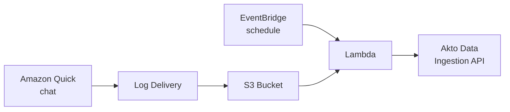

# Amazon Quick → Akto: Chat Log Connector Setup

## Overview

This guide walks through connecting Amazon Quick to Akto, so that chat conversations from your Quick deployment are automatically sent to your Akto instance for security analysis.

Amazon Quick delivers chat conversation logs through AWS's vended log delivery service. This solution captures those logs in an S3 bucket and uses a scheduled Lambda function to process and forward them to Akto.

## Architecture



## Prerequisites

- An active Amazon Quick instance with an Enterprise or Professional subscription
- AWS CLI installed and configured with sufficient IAM permissions (Lambda, S3, EventBridge, IAM role creation, CloudWatch Logs delivery APIs)
- An Akto instance with a reachable Data Ingestion API endpoint and API key
- An S3 bucket to receive the logs (existing or to be created)

## Setup



**Configure IAM permissions**

Grant permission to deliver vended logs from your Quick account:

```json
{
  "Version": "2012-10-17",
  "Statement": [
    {
      "Sid": "QuicksightLogDeliveryPermissions",
      "Effect": "Allow",
      "Action": "quicksight:AllowVendedLogDeliveryForResource",
      "Resource": "arn:aws:quicksight:region:account-id:account/account-id"
    }
  ]
}
```

If your destination S3 bucket uses a customer-managed KMS key, also add this to the key policy:

```json
{
  "Effect": "Allow",
  "Principal": {
    "Service": "delivery.logs.amazonaws.com"
  },
  "Action": [
    "kms:GenerateDataKey",
    "kms:Decrypt"
  ],
  "Resource": "*",
  "Condition": {
    "StringEquals": {
      "kms:EncryptionContext:SourceArn": "arn:partition:logs:region:account-id:*"
    }
  }
}
```




**Create the delivery source**

```bash
aws logs put-delivery-source \
  --name quick-chat-logs-source \
  --resource-arn arn:aws:quicksight:region:account-id:account/account-id \
  --log-type CHAT_LOGS
```

Other available `--log-type` values: `AGENT_HOURS_LOGS`, `FEEDBACK_LOGS`, `INDEX_USAGE_LOGS`.




**Create the delivery destination (S3)**

```bash
aws logs put-delivery-destination \
  --name quick-chat-logs-destination \
  --delivery-destination-type S3 \
  --delivery-destination-configuration destinationResourceArn=arn:aws:s3:::your-bucket-name
```

Note the returned destination ARN — you'll need it in the next step.




**Create the delivery (link source to destination)**

```bash
aws logs create-delivery \
  --delivery-source-name quick-chat-logs-source \
  --delivery-destination-arn <destination-arn-from-step-3>
```

By default, several fields are **not** included in the delivered logs: `namespace`, `latency`, `time_to_first_token`, `surface_type`, and `web_search`. If you need these, pass them explicitly via `--record-fields` on this call.




**Verify delivery is active**

```bash
aws logs describe-deliveries
aws s3 ls s3://your-bucket-name/ --recursive
```

Generate a test chat conversation in Quick and confirm a new log object appears in the bucket.




**Review the chat log schema**

Each chat log record is a JSON object with fields including:

```json
{
  "status_code": "success",
  "namespace": "default",
  "user_type": "ADMIN_PRO",
  "conversation_id": "a11b2bbc-c123-3abc-a12b-12a34b5c678d",
  "system_message_id": "a11b2bbc-c123-3abc-a12b-12a34b5c678d",
  "user_message_id": "a11b2bbc-c123-3abc-a12b-12a34b5c678d",
  "user_message": "Hi chat",
  "agent_id": "a11b2bbc-c123-3abc-a12b-12a34b5c678d",
  "flow_id": "a11b2bbc-c123-3abc-a12b-12a34b5c678d",
  "system_text_message": "Hello user",
  "surface_type": "WEB_EXPERIENCE",
  "web_search": "true",
  "user_selected_resources": [...],
  "action_connectors": [...],
  "cited_resource": [...],
  "file_attachment": [...]
}
```

`conversation_id` ties related messages together; `user_message` / `system_text_message` are the actual transcript content.




**Deploy a Lambda function to forward logs to Akto**

The Lambda should:
1. List/read new objects in the S3 bucket since its last run
2. Parse each JSON chat log record
3. Map fields into Akto's expected ingestion format (e.g. `conversation_id` → conversation ID, `user_message`/`system_text_message` → transcript turns)
4. POST the transformed payload to Akto:

```bash
curl -X POST "https://your-akto-instance.com/api/ingestData" \
  -H "Content-Type: application/json" \
  -H "X-API-KEY: your-akto-api-key" \
  -d @transformed-payload.json
```




**Schedule the Lambda**

Create an EventBridge rule to run the Lambda on a fixed interval (e.g. every 5 minutes), matching Akto's Bedrock connector pattern:

```bash
aws events put-rule \
  --name quick-akto-log-schedule \
  --schedule-expression "rate(5 minutes)"
```




**Test end-to-end**

1. Have a real conversation in Amazon Quick
2. Wait for the next scheduled Lambda run
3. Confirm the conversation appears in the Akto dashboard



## Get Support for your Akto setup

There are multiple ways to request support from Akto. We are 24X7 available on the following:

1. In-app `intercom` support. Message us with your query on intercom in Akto dashboard and someone will reply.
2. Join our [discord channel](https://www.akto.io/community) for community support.
3. Email our support team for direct help.
4. Contact us [here](https://www.akto.io/contact-us).

