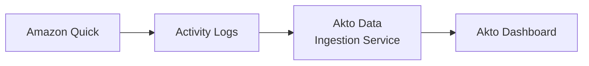

# Amazon Quick

## Overview

Amazon Quick Suite is an AWS-native agentic AI platform that lets employees query data, trigger workflows, and take actions across enterprise tools through natural language chat. Organizations use Amazon Quick to build and deploy AI-powered chat agents that connect to business systems like Jira, ServiceNow, Slack, and more.

The Akto Amazon Quick connector automatically:

* Discovers all Amazon Quick chat agents and action connectors in your environment
* Monitors chat conversations and agent interactions
* Sends activity data to Akto for security analysis and guardrail enforcement

## How It Works

Amazon Quick Suite records all agent and chat activity as logs. Akto reads these logs asynchronously, forwards them to Akto's Data Ingestion Service, and surfaces findings in your dashboard.


```mermaid
flowchart LR
    A[Amazon Quick] --> B[Activity Logs]
    B --> C[Akto Data\nIngestion Service]
    C --> D[Akto Dashboard]
```


**Async mode** — Akto reads from Amazon Quick logs after the fact. There is an inherent delay between an event occurring in Amazon Quick and it appearing in Akto.


## What Data is Collected

| Category | What Akto Discovers |
|---|---|
| **Chat activity** | User queries, agent responses, conversation sessions |
| **Action connector events** | External service actions triggered from Quick (Jira, Slack, ServiceNow, etc.) |
| **Admin operations** | Connector creation/deletion, permission and policy changes |


## Org-wide Auto Deployment

Deploy the Akto processor across your AWS Organization with one StackSet. It discovers Amazon Quick agents and MCP connectors in each account and sends their chat conversations to Akto.

### Artifacts

| Artifact | Purpose | Link                                                                                                                            |
|---|---|---------------------------------------------------------------------------------------------------------------------------------|
| Lambda deployment package | The Akto processor Lambda that reads Amazon Quick activity and forwards it to Akto | [akto-quick-processor.zip](https://lambda-code-akto-us-east-1.s3.us-east-1.amazonaws.com/aws-quick/v1.2/akto-quick-processor.zip) |
| StackSet deployment CFT | Deploys the processor as a StackSet from the management account to all target accounts in the org | [client-aws-cf-template.yaml](https://lambda-code-akto-us-east-1.s3.us-east-1.amazonaws.com/aws-quick/v1.2/client-aws-cf-template.yaml)   |
| Marker bucket CFT | Creates the central checkpoint bucket in the management account with cross-account write policies. Can also be created manually. | [akto-markers-bucket.yaml](https://lambda-code-akto-us-east-1.s3.us-east-1.amazonaws.com/aws-quick/v1.2/akto-markers-bucket.yaml)         |

### Before You Start

* You are signed into the **Organization management account** with permission to create StackSets.
* **Trusted access for StackSets** is enabled. In the console this is offered automatically when you pick service-managed permissions.
* Akto has given you a **code version** (for example `v2.0`), your **ingestion endpoint**, and an **API key**.
* You know your **Organization ID** — find it under AWS Organizations, or run:

  ```bash
  aws organizations describe-organization --query Organization.Id
  ```

  It looks like `o-abcd1234ef`.

### Choose Your Regions

Amazon Quick chat agents only exist in the regions where AWS has enabled agentic features. Deploy only to the regions your organization actually uses Quick in — a processor in any other region finds nothing and idles.

`us-east-1` `us-west-2` `eu-west-1` `eu-west-2` `eu-central-1` `ap-southeast-2` `ap-northeast-1`


Quick is not available in other regions, including `ap-south-1`, `ap-southeast-1` and `us-east-2`. A StackSet deploys one stack per account per region, so adding regions you don't need multiplies the stacks you have to manage.


### Part One · Central Checkpoint Bucket 
(If client already has bucket in management account with required policies as mentioned in 'Marker bucket CFT' in the above 'Artifacts' section then no need of creating bucket through Stack)

This runs once, as an ordinary stack, in the management account. It creates the bucket every processor writes its progress to.


Do this before the StackSet — if the processors run first they cannot record progress and will re-send data on the following run.




**Open CloudFormation and create a stack**

CloudFormation → Stacks → Create stack → With new resources. This is a plain stack, not a StackSet.



**Upload the bucket template**

Choose Upload a template file and select `akto-markers-bucket.yaml`, or paste the S3 URL Akto provided.



**Name the stack and enter your Organization ID**

Stack name: `akto-markers-bucket`. Then fill in the two parameters:

| Parameter | Required | Example | Notes |
|---|---|---|---|
| `OrgId` | Yes | `o-abcd1234ef` | Only accounts inside this organization may write to the bucket. Get this wrong and every processor is denied access when it tries to save its progress. |
| `BucketName` | No | leave blank | Blank creates `akto-markers-<your-account-id>`, which is guaranteed to be unique. Set a name only if you have a naming standard to follow. |



**Submit, then copy the bucket name**

When the stack completes, open its **Outputs** tab and copy `MarkersBucketName`. You need this value in Part Two.



### Part Two · The StackSet



**Create the StackSet**

CloudFormation → StackSets → Create StackSet. Under permissions choose **Service-managed permissions** — this lets CloudFormation deploy into member accounts without you creating roles in each one.



**Upload the processor template**

Choose Upload a template file and select `client-aws-cf-template.yaml`, or paste the S3 URL Akto provided.



**Name it and fill in the parameters**

StackSet name: `akto-quick-processor`. The six parameters are described in full below.



**Set execution options**

Set **Managed execution** to **Active**. This lets CloudFormation queue operations instead of rejecting them, which matters as soon as you want to retry a failed account or push an update while something else is running.



**Choose deployment targets**

Select the organizational units that hold your Quick accounts, and enable **Automatic deployment** so accounts added to those OUs later get the processor without any further action. Under regions, pick only the regions from the list above.



**Change this default**


**Failure tolerance** defaults to `0`, which aborts and rolls back the entire operation if a single account fails. Set it to **10%**, and **maximum concurrent accounts** to **25%**. Across a large organization some accounts will fail for reasons unrelated to Akto, and the default stops every other account from succeeding.




**Acknowledge and submit**

On the review page, tick "I acknowledge that AWS CloudFormation might create IAM resources with custom names." The template creates a named execution role for the processor. Then submit.



#### Parameters

| Parameter | Required | Example / Default                             | Description                                                                                                                                                                                                                                                                                                                                                                                                                                                |
|---|---|-----------------------------------------------|------------------------------------------------------------------------------------------------------------------------------------------------------------------------------------------------------------------------------------------------------------------------------------------------------------------------------------------------------------------------------------------------------------------------------------------------------------|
| `MarkersBucketName` | Yes | the Outputs value from Part One               | The central bucket in the management account. Every processor writes its progress and its list of discovered agents here, filed under `<account-id>/<region>/` — which is what gives you one org-wide view. Each account can only read and write its own folder, so no account can see or overwrite another's data.                                                                                                                                        |
| `DataIngestionEndpoint` | Yes | `https://your-instance.akto.io/api/ingestData` | Where discovered agents and chat conversations are sent. Provided by Akto.                                                                                                                                                                                                                                                                                                                                                                                 |
| `AktoApiKey` | Yes | provided by Akto                              | Authenticates to that endpoint. The field is masked, so the value never appears in the console or in stack history.                                                                                                                                                                                                                                                                                                                                        |
| `QuickLoggingMode` | Yes | `already-enabled` or `create-new-bucket` or `use-existing-bucket`  | The one decision that changes what the processor does — see below.                                                                                                                                                                                                                                                                                                                                                                                         |
| `QuickBucketBaseName` | `create-new-bucket` or `use-existing-bucket` mode only | `akto-quick-logs`                             | 'already-enabled' — leave blank. The bucket is read from your existing delivery. 'create-new-bucket' — a base name. The account ID and region are appended, so akto-quick-logs becomes akto-quick-logs-123456789012-us-east-1. The region is included because S3 bucket names are global and one account may run Quick in two regions. 'use-existing-bucket' — the exact bucket name, used as given, and it must be in the same region as this deployment. |
| `LambdaCodeVersion` | Yes | `v1.2`                                        | Which published build to deploy. The default of `v1.0` is a placeholder and will not work — always enter the version Akto gave you. A version that doesn't exist is the most common cause of a failed rollout.                                                                                                                                                                                                                                             |

`QuickLoggingMode` answers one question: is Quick chat logging already switched on in these accounts?

* **`already-enabled`** — Yes, logging is already on. The processor finds your existing chat log delivery and reads from wherever it already writes. Nothing is created, and the processor is granted read-only permissions.
* **`create-new-bucket`** — No, logging is not set up. The processor creates a bucket and switches Quick chat logging on, capturing the full set of fields including response latency.The processor creates a bucket per account and enables logging into it. The account ID and region are appended, so akto-quick-logs becomes akto-quick-logs-123456789012-us-east-1. The region is included because S3 bucket names are global and one account may run Quick in two regions
* **`use-existing-bucket`** — Logging is not set up, and you already have a bucket for it — typically one central bucket shared by every account. The processor enables logging into that bucket but does not create it and does not change its policy. You grant access on the bucket once.

#### Bucket Policy for `use-existing-bucket`


Skip this section entirely unless you chose `use-existing-bucket`.


Your bucket needs a policy that does two things: lets AWS write Quick's logs into it, and lets each account read its own logs back. The processor never edits this policy — that bucket is yours, and granting every account in the fleet the right to rewrite it would be a poor trade.

| Requirement | Why |
|---|---|
| Bucket is in the same region as the deployment | AWS requires a log delivery destination to be in the delivery's own region. Accounts in two regions therefore need one bucket each. |
| Policy allows `delivery.logs.amazonaws.com` | Without it the delivery is created successfully and simply never receives anything — no error anywhere. |
| Policy allows each account to read | Otherwise logs arrive but the processor cannot fetch them. |

Both statements below use your Organization ID, so they cover every account at once — there is no list of account IDs to maintain as accounts come and go. Replace `YOUR-BUCKET` and `o-abcd1234ef`.

```json
{
  "Version": "2012-10-17",
  "Statement": [
    {
      "Sid": "AllowQuickLogDelivery",
      "Effect": "Allow",
      "Principal": { "Service": "delivery.logs.amazonaws.com" },
      "Action": "s3:PutObject",
      "Resource": "arn:aws:s3:::YOUR-BUCKET/AWSLogs/*",
      "Condition": {
        "StringEquals": { "aws:SourceOrgID": "o-abcd1234ef" }
      }
    },
    {
      "Sid": "AllowEachAccountToReadItsOwnLogs",
      "Effect": "Allow",
      "Principal": "*",
      "Action": ["s3:GetObject", "s3:ListBucket"],
      "Resource": [
        "arn:aws:s3:::YOUR-BUCKET",
        "arn:aws:s3:::YOUR-BUCKET/AWSLogs/${aws:PrincipalAccount}/*"
      ],
      "Condition": {
        "StringEquals": { "aws:PrincipalOrgID": "o-abcd1234ef" }
      }
    }
  ]
}
```

Leave `${aws:PrincipalAccount}` exactly as written — S3 substitutes the calling account at request time. That is what confines each account to `AWSLogs/<its-own-account-id>/`, so a shared bucket does not mean shared visibility: no account can read another's conversations.


`create-new-bucket` is safe to use across a mixed set of accounts: any account that already has logging is detected and left untouched, and an account with no Quick presence in that region has nothing created for it.


### Confirm It Is Working

The processor runs every 10 minutes. Give it one cycle after the StackSet completes before checking.



**Every account deployed**

CloudFormation → StackSets → `akto-quick-processor` → Stack instances. Every row should read `CURRENT`. Any other status shows a reason in the same row.



**Accounts are reporting in**

```bash
aws s3 ls s3://<your-markers-bucket>/ --recursive
```

One file per account and region appears here, each named `manifest.json`. This is the quickest health check you have: the timestamp on each file tells you when that account last ran. A file hours out of date means that account has stopped processing.



**Agents are being discovered**

Discovered agents and MCP connectors appear in Akto within a few minutes of the first run. Conversations follow once someone uses Quick — AWS batches chat logs roughly every five minutes, so allow about 15 minutes end to end.




## Get Support for your Akto setup

There are multiple ways to request support from Akto. We are 24X7 available on the following:

1. In-app `intercom` support. Message us with your query on intercom in Akto dashboard and someone will reply.
2. Join our [discord channel](https://www.akto.io/community) for community support.
3. Email us at [support@akto.io](mailto:support@akto.io) for direct help.
4. Contact us [here](https://www.akto.io/contact-us).

