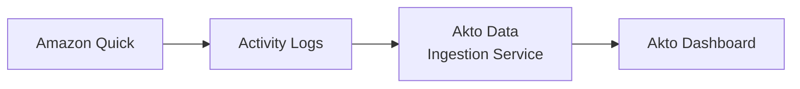

# Amazon Quick

## Overview

Amazon Quick Suite is an AWS-native agentic AI platform that lets employees query data, trigger workflows, and take actions across enterprise tools through natural language chat. Organizations use Amazon Quick to build and deploy AI-powered chat agents that connect to business systems like Jira, ServiceNow, Slack, and more.

The Akto Amazon Quick connector automatically:

* Discovers all Amazon Quick chat agents and action connectors in your environment
* Monitors chat conversations and agent interactions
* Sends activity data to Akto for security analysis and guardrail enforcement

## How It Works

Amazon Quick Suite records all agent and chat activity as logs. Akto reads these logs asynchronously, forwards them to Akto's Data Ingestion Service, and surfaces findings in your dashboard.


```mermaid
flowchart LR
    A[Amazon Quick] --> B[Activity Logs]
    B --> C[Akto Data\nIngestion Service]
    C --> D[Akto Dashboard]
```


**Async mode** — Akto reads from Amazon Quick logs after the fact. There is an inherent delay between an event occurring in Amazon Quick and it appearing in Akto.


## What Data is Collected

| Category | What Akto Discovers |
|---|---|
| **Chat activity** | User queries, agent responses, conversation sessions |
| **Action connector events** | External service actions triggered from Quick (Jira, Slack, ServiceNow, etc.) |
| **Admin operations** | Connector creation/deletion, permission and policy changes |
| **User & access management** | User additions, role changes, group membership updates |

## Steps to Connect

Amazon Quick delivers chat conversation logs through AWS's vended log delivery service. The setup captures those logs in an S3 bucket and uses a scheduled Lambda function to process and forward them to Akto.



**Configure IAM permissions**

The Lambda execution role (and the account/role running the CLI setup commands below) needs permissions covering the full pipeline: enabling Quick's vended log delivery, managing the delivery source/destination, reading the delivered log objects from S3, writing its own execution logs, reading the Akto API key from Secrets Manager, and letting EventBridge invoke the function.

Replace the placeholders (`REGION`, `ACCOUNT_ID`, `CONVERSATION_BUCKET`, `LAMBDA_FUNCTION_NAME`, `AKTO_SECRET_ARN`) with your actual values.

```json
{
  "Version": "2012-10-17",
  "Statement": [
    {
      "Sid": "EnableQuickConversationLogging",
      "Effect": "Allow",
      "Action": [
        "quicksight:AllowVendedLogDeliveryForResource"
      ],
      "Resource": [
        "arn:aws:quicksight:REGION:ACCOUNT_ID:account/ACCOUNT_ID"
      ]
    },
    {
      "Sid": "ManageQuickLogDelivery",
      "Effect": "Allow",
      "Action": [
        "logs:PutDeliverySource",
        "logs:GetDeliverySource",
        "logs:DeleteDeliverySource",
        "logs:PutDeliveryDestination",
        "logs:GetDeliveryDestination",
        "logs:DeleteDeliveryDestination",
        "logs:GetDeliveryDestinationPolicy",
        "logs:PutDeliveryDestinationPolicy",
        "logs:DeleteDeliveryDestinationPolicy",
        "logs:CreateDelivery",
        "logs:GetDelivery",
        "logs:DeleteDelivery",
        "logs:UpdateDeliveryConfiguration",
        "logs:DescribeDeliverySources",
        "logs:DescribeDeliveryDestinations",
        "logs:DescribeDeliveries",
        "logs:DescribeConfigurationTemplates",
        "logs:TagResource",
        "logs:UntagResource",
        "logs:ListTagsForResource"
      ],
      "Resource": "*"
    },
    {
      "Sid": "ListQuickConversationObjects",
      "Effect": "Allow",
      "Action": [
        "s3:ListBucket"
      ],
      "Resource": [
        "arn:aws:s3:::CONVERSATION_BUCKET"
      ],
      "Condition": {
        "StringLike": {
          "s3:prefix": [
            "AWSLogs/ACCOUNT_ID",
            "AWSLogs/ACCOUNT_ID/*"
          ]
        }
      }
    },
    {
      "Sid": "ReadQuickConversationObjects",
      "Effect": "Allow",
      "Action": [
        "s3:GetObject"
      ],
      "Resource": [
        "arn:aws:s3:::CONVERSATION_BUCKET/AWSLogs/ACCOUNT_ID/*"
      ]
    },
    {
      "Sid": "CreateLambdaLogGroup",
      "Effect": "Allow",
      "Action": [
        "logs:CreateLogGroup"
      ],
      "Resource": [
        "arn:aws:logs:REGION:ACCOUNT_ID:*"
      ]
    },
    {
      "Sid": "WriteLambdaLogs",
      "Effect": "Allow",
      "Action": [
        "logs:CreateLogStream",
        "logs:PutLogEvents"
      ],
      "Resource": [
        "arn:aws:logs:REGION:ACCOUNT_ID:log-group:/aws/lambda/LAMBDA_FUNCTION_NAME:*"
      ]
    },
    {
      "Sid": "ReadAktoApiCredential",
      "Effect": "Allow",
      "Action": [
        "secretsmanager:GetSecretValue"
      ],
      "Resource": [
        "AKTO_SECRET_ARN"
      ]
    },
    {
      "Sid": "InvokeQuickConversationLambda",
      "Effect": "Allow",
      "Action": [
        "lambda:InvokeFunction"
      ],
      "Resource": [
        "arn:aws:lambda:REGION:ACCOUNT_ID:function:LAMBDA_FUNCTION_NAME"
      ]
    }
  ]
}
```

A quick breakdown of what each statement is for:

1. **EnableQuickConversationLogging** — lets you turn on vended log delivery for your Quick account.
2. **ManageQuickLogDelivery** — CloudWatch Logs delivery APIs used to create/inspect/tear down the delivery source and destination (Steps 2–4 below).
3. **ListQuickConversationObjects** / **ReadQuickConversationObjects** — lets the Lambda list and read the delivered chat log objects in the destination S3 bucket, scoped to the `AWSLogs/ACCOUNT_ID/*` prefix.
4. **CreateLambdaLogGroup** / **WriteLambdaLogs** — standard Lambda execution logging permissions.
5. **ReadAktoApiCredential** — lets the Lambda pull the Akto API key out of Secrets Manager rather than hardcoding it.
6. **InvokeQuickConversationLambda** — lets the EventBridge schedule (Step 8 below) invoke the Lambda.


If your destination S3 bucket uses a customer-managed KMS key, you'll also need to add a matching statement to the key policy granting `kms:GenerateDataKey` and `kms:Decrypt` to the `delivery.logs.amazonaws.com` service principal.




**Create the delivery source**

```bash
aws logs put-delivery-source \
  --name quick-chat-logs-source \
  --resource-arn arn:aws:quicksight:REGION:ACCOUNT_ID:account/ACCOUNT_ID \
  --log-type CHAT_LOGS
```

Other available `--log-type` values: `AGENT_HOURS_LOGS`, `FEEDBACK_LOGS`, `INDEX_USAGE_LOGS`.



**Create the delivery destination (S3)**

```bash
aws logs put-delivery-destination \
  --name quick-chat-logs-destination \
  --delivery-destination-type S3 \
  --delivery-destination-configuration destinationResourceArn=arn:aws:s3:::CONVERSATION_BUCKET
```

Note the returned destination ARN — you'll need it in the next step.



**Create the delivery (link source to destination)**

```bash
aws logs create-delivery \
  --delivery-source-name quick-chat-logs-source \
  --delivery-destination-arn <destination-arn-from-step-3>
```

By default, several fields are **not** included in the delivered logs: `namespace`, `latency`, `time_to_first_token`, `surface_type`, and `web_search`. If you need these, pass them explicitly via `--record-fields` on this call.



**Verify delivery is active**

```bash
aws logs describe-deliveries
aws s3 ls s3://CONVERSATION_BUCKET/ --recursive
```

Generate a test chat conversation in Quick and confirm a new log object appears in the bucket.



**Deploy a Lambda function to forward logs to Akto**

The Lambda should:

1. List/read new objects in the S3 bucket since its last run
2. Parse each JSON chat log record
3. Map fields into Akto's expected ingestion format (e.g. `conversation_id` → conversation ID, `user_message`/`system_text_message` → transcript turns)
4. POST the transformed payload to Akto:

```bash
curl -X POST "https://your-akto-instance.com/api/ingestData" \
  -H "Content-Type: application/json" \
  -H "X-API-KEY: your-akto-api-key" \
  -d @transformed-payload.json
```



**Schedule the Lambda**

Create an EventBridge rule to run the Lambda on a fixed interval (e.g. every 5 minutes):

```bash
aws events put-rule \
  --name quick-akto-log-schedule \
  --schedule-expression "rate(5 minutes)"
```




**Test end-to-end**

1. Have a real conversation in Amazon Quick
2. Wait for the next scheduled Lambda run
3. Confirm the conversation appears in the Akto dashboard




Reach out to the Akto support team via in-app intercom or using the contact links below if you'd rather have Akto provide a **CloudFormation Template (CFT)** that automates this setup end-to-end.


## Get Support for your Akto setup

There are multiple ways to request support from Akto. We are 24X7 available on the following:

1. In-app `intercom` support. Message us with your query on intercom in Akto dashboard and someone will reply.
2. Join our [discord channel](https://www.akto.io/community) for community support.
3. Email us at [support@akto.io](mailto:support@akto.io) for direct help.
4. Contact us [here](https://www.akto.io/contact-us).

