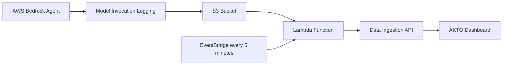

# AWS Bedrock

## Overview

This guide provides step-by-step instructions for setting up AKTO's AWS Bedrock monitoring solution in your AWS account. This solution automatically captures, processes, and sends AWS Bedrock agent conversations to your AKTO instance for security analysis.

## System Architecture



## What You'll Achieve

✅ **Automated Bedrock Monitoring**: Capture all AWS Bedrock agent conversations\
✅ **Real-time Processing**: Process logs every 5 minutes automatically\
✅ **Security Analysis**: Send conversation data to AKTO for guardrail detection\
✅ **Multi-Model Support**: Works with Amazon Nova, Claude, and other Bedrock models\
✅ **Client-Side Deployment**: Complete data isolation in your AWS account

## Prerequisites

### **1. AWS Account Requirements**

* AWS CLI installed and configured with user who has below permissions
* IAM permissions for:
  * Lambda functions
  * S3 buckets
  * EventBridge rules
  * Bedrock service access
  * IAM role creation

### **2. AKTO Instance Requirements**

* AKTO Data ingestion service instance running and accessible
* AKTO API key for authentication

## Step-by-Step Setup





**Prepare Your Information**

Before running the deployment, gather this information:

1. **S3 Bucket Name**: A unique bucket name for storing Bedrock logs where you have enabled model invocation logging
   * Example: `my-company-bedrock-logs-2026`
   * Must be globally unique across all AWS accounts
2. **AKTO Data Ingestion URL**: Your AKTO endpoint
   * Format: `https://your-akto-instance.com/api/ingestData`
   * Contact AKTO support team to obtain your Data Ingestion URL
3. **AKTO API Key**: Authentication key for your AKTO instance
   * Navigate to: **AKTO Argus** → **Connectors** → **Setup Guardrails**
   * Copy the API key from there



**Open CloudFormation**

1. Sign in to AWS Console
2. Search for "CloudFormation"
3. Click **CloudFormation** service



**Create Stack**

1. Click **Create stack**
2. Select **Amazon S3 URL**
3.  Enter the CloudFormation template URL:

    <pre data-overflow="wrap"><code>https://lambda-code-akto.s3.ap-southeast-1.amazonaws.com/client-aws-cf-template.yaml
    </code></pre>

    <div data-with-frame="true"><figure><figcaption></figcaption></figure></div>
4. Click **Next.**



**Enter Stack Details**

Fill in the form with your information:

* **Stack name**: `akto-bedrock-discovery` (must be lowercase, no spaces)

**Parameters:**

* **S3BucketName**: Enter the S3 bucket name you gathered in Step 1
  * Example: `my-company-bedrock-logs-2026`
* **DataIngestionEndpoint**: `<URL-obtained-from-akto-team>`
* **AktoApiKey**: `<Akto-API-Key>`&#x20;

<div data-with-frame="true"><figure><figcaption></figcaption></figure></div>

Click **Next.**



**Configure Stack Options**

1. Leave defaults (no changes needed)
2. Scroll down to **Acknowledgment**
3. ✅ Check: "I acknowledge that AWS CloudFormation might create IAM resources with custom names"


CloudFormation needs to create the Lambda execution role.


4. Click **Create stack**



**Wait for Completion**

CloudFormation will create the following resources:

* ✅ Lambda Execution Role
* ✅ Lambda Function (akto-bedrock-log-processor-cf-)
* ✅ EventBridge Execution Role
* ✅ EventBridge Schedule Rule

**Expected Status:**

```
akto-bedrock-discovery-prod - CREATE_IN_PROGRESS
├─ LambdaExecutionRole - CREATE_COMPLETE ✓
├─ AktoBedrocklambdaFunction - CREATE_COMPLETE ✓
├─ EventBridgeExecutionRole - CREATE_COMPLETE ✓
├─ BedrocktogProcessingScheduleRule - CREATE_COMPLETE ✓
└─ akto-bedrock-discovery-prod - CREATE_COMPLETE ✓
```

⏳ **Typical time: 2-3 minutes**



**Verify Success**

1. **Stack Status** should show: **CREATE\_COMPLETE** (green)
2. Click **Outputs** tab
3. You should see:
   * LambdaFunctionName
   * LambdaFunctionArn
   * EventBridgeRuleName

✅ **Deployment successful!**



**Check Lambda Function**

1. Search for "Lambda" in AWS Console
2. Click **Lambda**
3. Look for function: `akto-bedrock-log-processor-cf-<account-id>`
4. Click on it
5. Should show: **Last modified: just now**



**Check EventBridge Schedule**

1. Search for "EventBridge" in AWS Console
2. Click **EventBridge**
3. Click **Rules** (left sidebar)
4. Look for: `akto-bedrock-schedule-cf-<account-id>`
5. Should show: **State: Enabled** ✅



**Check Lambda Logs**

1. From Lambda function page, click **Monitor** tab
2. Click **View CloudWatch logs**
3. Should see log stream with recent entries

✅ **Everything working!**







**Install AWS CLI if not installed**

If AWS CLI is already configured then move to Step 2

```bash
# On Mac:
brew install awscli

# On Windows: Download from https://aws.amazon.com/cli/
# On Linux:
curl "https://awscli.amazonaws.com/awscli-exe-linux-x86_64.zip" -o "awscliv2.zip"
unzip awscliv2.zip
sudo ./aws/install
```

1.  **Install Node.js**

    ```bash
    # On Mac:
    brew install node

    # On Windows/Linux: Download from https://nodejs.org/
    ```
2.  **Configure AWS Credentials**

    You need to tell AWS who you are:

    ```bash
    aws configure
    ```

    It will ask for:

    * **AWS Access Key ID**: Get from AWS Console → IAM → Users → Your User → Security credentials
    * **AWS Secret Access Key**: Same place as above
    * **Default region**: Use `us-east-1` (or your preferred region)
    * **Default output format**: Just press Enter
3.  **Test AWS Access**

    ```bash
    aws sts get-caller-identity
    ```
4.  Verify your AWS identity

    ```bash
    aws sts get-caller-identity
    ```

    Expected Output

    ```json
    {
        "UserId": "AIDACKXXXXXXXXXXXXXXXXX",
        "Account": "123456789***",
        "Arn": "arn:aws:iam::123456789012:user/your-username"
    }
    ```

    ✅ **Should show your account ID** - You're ready!\
    ❌ **Shows error** - Fix your credentials first



**Download the Solution**

```bash
# Clone the repository
git clone https://github.com/akto-api-security/akto_aws_bedrock_discovery.git

# Navigate to the solution directory
cd akto_aws_bedrock_discovery

#Navigate to CloudFormation Directory
cd cloudformation

#Edit Your Environment Parameters
#Choose your environment and edit the parameters file:

#for development
nano parameters/dev-parameters.json

#for production
nano parameters/prod-parameters.json

#Update these values:
- `S3BucketName`: Your existing S3 bucket
- `DataIngestionEndpoint`: Your AKTO API endpoint
- `AktoApiKey`: Your AKTO authentication key

#Make Deployment Script Executable
chmod +x scripts/deploy.sh
```



**Prepare Your Information**

Before running the deployment, gather this information:

1. **S3 Bucket Name**: A unique bucket name for storing Bedrock logs
   * Example: `my-company-bedrock-logs-2024`
   * Must be globally unique across all AWS accounts
2. **AKTO Data Ingestion URL**: Your AKTO endpoint
   * Format: `https://your-akto-instance.com/api/ingestData`
   * Replace `your-akto-instance.com` with your actual AKTO domain/IP
3. **AKTO API Key**: Authentication key for your AKTO instance
   * Obtain from your AKTO dashboard
   * Example: `ak_live_xxxxxxxxxxxxxxxxxxxx`



**Run the Deployment**

Execute the deployment script:

Choose which environment to deploy to:

```bash
#Development:

./scripts/deploy.sh dev
```

```bash
#Production:

./scripts/deploy.sh prod
```

The script will:

* ✅ Build the Lambda package automatically
* ✅ Create all AWS resources (roles, Lambda, EventBridge)
* ✅ Configure everything with one command
* ✅ Show you the results

```bash
 Deployment completed successfully!

📊 Retrieving stack outputs...
---------
|OutputKey|OutputValue|
---------
|LambdaFunctionName|akto-bedrock-log-processor-123456|
|LambdaFunctionArn|arn:aws:lambda:us-east-1:123456:function:...|
|EventBridgeRuleName|akto-bedrock-schedule-123456|

```



**Wait for Deployment**

The script will automatically:

1. **Create IAM Role**: Set up permissions for Lambda
2. **Deploy Lambda Function**: Upload and configure the processing function
3. **Set Up EventBridge**: Schedule processing every 5 minutes
4. **Configure Environment**: Set all required variables

**Expected Output:**

```bash
✅ Lambda package built successfully

📤 Uploading Lambda package to S3 (5.4 MB, may take 1-2 minutes)...
upload: ../akto-bedrock-processor.zip to s3://akto-aws-bedrock-logs-02/lambda-code/akto-bedrock-processor.zip
✅ Lambda package uploaded to S3: s3://akto-aws-bedrock-logs-02/lambda-code/akto-bedrock-processor.zip

🔧 Updating Lambda function code: akto-bedrock-log-processor-cf-041877753357
✅ Lambda function code updated successfully!

🔧 Updating CloudFormation stack: akto-bedrock-discovery-prod
⏳ Waiting for stack update to complete...
✅ Stack updated successfully!

## 📊 Retrieving stack outputs...

|                                                                   DescribeStacks                                                                   |
+------------------------------+----------------------+----------------------------------------------------------------------------------------------+
|          Description         |      OutputKey       |                                         OutputValue                                          |
+------------------------------+----------------------+----------------------------------------------------------------------------------------------+
|  ARN of the Lambda function  |  LambdaFunctionArn   |  arn:aws:lambda:us-east-1:xxxxxx:function:akto-bedrock-log-processor-cf-xxxxxx   |
|  Name of the Lambda function |  LambdaFunctionName  |  akto-bedrock-log-processor-cf-xxxxxx                                               |
|  Name of the EventBridge rule|  EventBridgeRuleName |  akto-bedrock-schedule-cf-xxxxxx                                                       |
|  CloudFormation stack name   |  StackName           |  akto-bedrock-discovery-prod                                                                 |
+------------------------------+----------------------+----------------------------------------------------------------------------------------------+

🎉 Deployment completed successfully!

🔍 Next steps:

1. Generate some AWS Bedrock conversations
2. Monitor Lambda logs:
aws logs tail /aws/lambda/akto-bedrock-log-processor-xxxxxx --follow --region us-east-1
3. Test manually:
aws lambda invoke --function-name akto-bedrock-log-processor-xxxxxx --region us-east-1 response.json

📌 CloudFormation Stack Information:
Stack Name: akto-bedrock-discovery-prod
Region: us-east-1
Environment: prod
```



**Verify the Deployment**

Run the verification script:

```bash
./test-solution.sh
```

This will check:

* ✅ Lambda function exists and is accessible
* ✅ S3 bucket is properly configured
* ✅ CloudWatch logs are working
* ✅ EventBridge schedule is active



**Create S3 Bucket (If Needed)**

If you don't have an S3 bucket, create one:

```bash
# Replace 'my-company-bedrock-logs-2024' with your bucket name
aws s3 mb s3://my-company-bedrock-logs-2024

# Set bucket policy for Bedrock access (optional - Lambda will handle this)
aws s3api put-bucket-versioning \
    --bucket my-company-bedrock-logs-2024 \
    --versioning-configuration Status=Enabled
```



**Test with Bedrock**

Generate a test conversation:

```bash
# Example Bedrock API call
aws bedrock-runtime invoke-model \
    --model-id anthropic.claude-3-haiku-20240307-v1:0 \
    --body '{"messages":[{"role":"user","content":[{"type":"text","text":"Hello, this is a test message for AKTO monitoring."}]}],"max_tokens":50,"anthropic_version":"bedrock-2023-05-31"}' \
    --content-type application/json \
    test-output.json
```



**Monitor the System**

**Check Lambda Logs:**

```bash
aws logs tail /aws/lambda/akto-bedrock-log-processor-cf-YOUR_ACCOUNT_ID --follow
```

**Check S3 for Bedrock Logs:**

```bash
aws s3 ls s3://your-bucket-name/bedrock-logs/ --recursive
```

**Manual Lambda Test:**

```bash
aws lambda invoke \
    --function-name akto-bedrock-log-processor-YOUR_ACCOUNT_ID \
    --payload '{}' \
    response.json
```





## Troubleshooting **Common Issues**

### **1. Permission Denied Errors**

```bash
# Check your AWS credentials
aws sts get-caller-identity

# Ensure you have sufficient IAM permissions
aws iam list-attached-user-policies --user-name YOUR_USERNAME
```

### **2. S3 Bucket Already Exists**

```bash
# Choose a different bucket name or check if you own it
aws s3 ls s3://your-bucket-name
```

### **3. Lambda Function Not Processing**

```bash
# Check Lambda logs for errors
aws logs describe-log-groups --log-group-name-prefix "/aws/lambda/akto-bedrock"

# View recent logs
aws logs tail /aws/lambda/akto-bedrock-log-processor-YOUR_ACCOUNT_ID --follow
```

### **4. AKTO Connection Issues**

```bash
# Test connectivity to your AKTO instance
curl -X POST "https://your-akto-instance.com/api/ingestData" \
     -H "Content-Type: application/json" \
     -H "X-API-KEY: your-api-key" \
     -d '{"test": "connection"}'
```


**Important Notes**

1. **Bedrock Logging Configuration**: The Lambda function automatically enables Bedrock model invocation logging on first run if not enabled
2. **Processing Schedule**: Logs are processed every 5 minutes via EventBridge
3. **Data Format**: Conversations are formatted in AKTO StandardMessage format with security tags
4. **Security**: All data remains in your AWS account; no external access required


## What Happens Next

Once deployed, the system will:

1. **Auto-Configure Bedrock**: Enable model invocation logging to your S3 bucket
2. **Process Conversations**: Extract and format conversation data every 5 minutes
3. **Send to AKTO**: Forward processed data to your AKTO instance for analysis
4. **Monitor Security**: AKTO will analyze conversations for potential threats

## Support

For issues or questions:

1. **Check CloudWatch Logs**: Monitor Lambda execution logs
2. **Review S3 Configuration**: Ensure bucket exists and is accessible
3. **Verify AKTO Connectivity**: Test endpoint and API key
