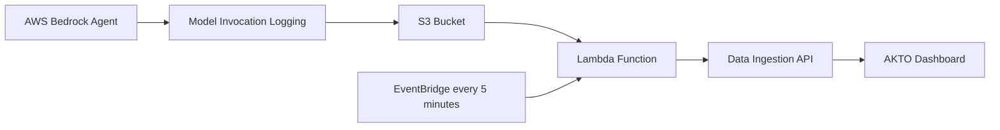
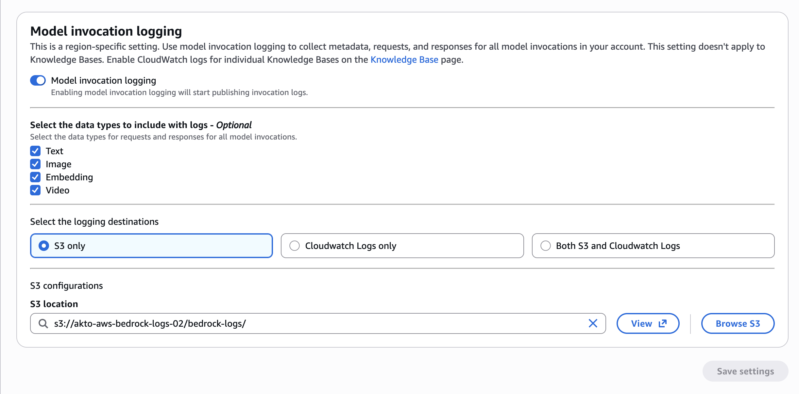

# AWS Bedrock

## Overview

This guide provides step-by-step instructions for setting up AKTO's AWS Bedrock monitoring solution in your AWS account. This solution automatically captures, processes, and sends AWS Bedrock agent conversations to your AKTO instance for security analysis.

## System Architecture


```mermaid
flowchart LR
    A[AWS Bedrock Agent] --> B[Model Invocation Logging] --> C[S3 Bucket]
    C --> E[Lambda Function]
    D[EventBridge every 5 minutes] --> E
    E --> F[Data Ingestion API] --> G[AKTO Dashboard]


```
## What You'll Achieve

✅ **Automated Bedrock Monitoring**: Capture all AWS Bedrock agent conversations\
✅ **Real-time Processing**: Process logs every 5 minutes automatically\
✅ **Security Analysis**: Send conversation data to AKTO for guardrail detection\
✅ **Multi-Model Support**: Works with Amazon Nova, Claude, and other Bedrock models\
✅ **Client-Side Deployment**: Complete data isolation in your AWS account

## Prerequisites

### **1. AWS Account Requirements**

* AWS account with Bedrock agents configured and model invocation logging enabled.
* Please provide the AWS region on which deployment will be done to Akto team before deployment (Eg: us-east-1)


### **2. AKTO Instance Requirements - To be verified with Akto Team**

* AKTO Data ingestion service instance running and accessible
* AKTO API key for authentication

## Step-by-Step Setup





**Prepare Your Information**

Before running the deployment, gather this information:

1. **S3 Bucket Name - LogsBucketName**: A bucket name where Bedrock logs are stored ie. where you have enabled model invocation logging
   * Make sure that you have enabled 'Model invocation logging' and the S3 bucket configured for invocation logs need to be provided.
   * Go to Amazon Bedrock - Settings - Check 'Model invocation logging' and the S3 logging destination selected. If not enabled, there would be no discovery possible.
   * Example: `my-company-bedrock-logs-2026`
   **Enable AgentCore CloudWatch tracing**: Skip this step entirely if you don’t have AgentCore Harnesses/Runtimes yet, or don’t need their conversation data — the AgentCore pipeline just no-ops (finds 0 log groups) without it. 
   * This is a one-time, account-level setting, not per-resource: your Harnesses/Runtimes already run inside AgentCore’s managed runtime, so once this is on they get OpenTelemetry instrumentation automatically — no per-agent config needed.
   * Go to CloudWatch → Settings (under Setup) → Account tab → X-Ray traces tab → Transaction Search section → View settings → Edit → Enable Transaction Search → Save.
2. **LogsPrefix**: (Optional) S3 prefix path for Bedrock logs. Default: AWSLogs/
    * Check 'Model invocation logging' and check the S3 location prefix configured for the bucket
    * Example: S3 location : `s3://akto-aws-bedrock-logs-02/bedrock-logs/`
    * In the above eg : LogsBucketName would be akto-aws-bedrock-logs-02 and LogsPrefix would be bedrock-logs/
    * This is optional field, if user has not configured any prefix then by default AWSLogs/ will be configured

<div data-with-frame="true"><figure><figcaption></figcaption></figure></div>

3.  **S3 Bucket Name - MarkersBucketName**: S3 bucket name to store AKTO marker files for maintaining checkpoint of processed logs. This can be the same bucket name or a different bucket name. It stores a manifest file with all discovered agents details and lastprocessed timestamp.
    * Example: `akto-marker-logs`
4. **AKTO Data Ingestion URL**: Your AKTO endpoint
   * Format: `https://your-akto-instance.com/api/ingestData`
   * Contact AKTO support team to obtain your Data Ingestion URL
5. **AKTO API Key**: Authentication key for your AKTO instance
   * Navigate to: **AKTO Argus** → **Connectors** → **Setup Guardrails**
   * Copy the API key from there
6. **LambdaCodeVersion**: version 
   * Contact AKTO support team to obtain your lambda version
7. **RuntimeLogGroupPrefix**: This can be left blank if you dont have Agentcore/runtimes yet. (Optional) CloudWatch log group prefix for per-runtime AgentCore observability logs. Default matches AWS''s own naming convention so if no changes done to default then can be left blank.



**Open CloudFormation**

1. Sign in to AWS Console
2. Search for "CloudFormation"
3. Click **CloudFormation** service



**Create Stack**

1. Click **Create stack**
2. Select **Amazon S3 URL**
3.  Enter the CloudFormation template URL:

    <pre data-overflow="wrap"><code>https://lambda-code-akto-us-east-1.s3.us-east-1.amazonaws.com/v3.6/client-aws-cf-template.yaml
    </code></pre>

    <div data-with-frame="true"><figure><figcaption></figcaption></figure></div>
4. Click **Next.**



**Enter Stack Details**

Fill in the form with your information:

* **Stack name**: Enter a name for your stack (must be lowercase, no spaces)
  * Example: `akto-bedrock-discovery-prod`

**Parameters:**

* **S3BucketName**: Enter the S3 bucket name you gathered in Step 1
  * Example: `my-company-bedrock-logs-2026`
* **LogsPrefix**: (Optional) S3 prefix path for Bedrock logs
  * Example: `bedrock-logs`
* **MarkersBucketName**: S3 bucket name to store AKTO marker manifest file
* **DataIngestionEndpoint**: `<URL-obtained-from-akto-team>`
* **LambdaCodeVersion**: v3.6 `<Version-obtained-from-akto-team>`
* **AktoApiKey**: `<Akto-API-Key>`&#x20;

<div data-with-frame="true"><figure><figcaption></figcaption></figure></div>

Click **Next.**



**Configure Stack Options**

1. Leave defaults (no changes needed)
2. Scroll down to **Acknowledgment**
3. ✅ Check: "I acknowledge that AWS CloudFormation might create IAM resources with custom names"


CloudFormation needs this acknowledgement to create the Lambda execution role.


4. Click **Create stack**



**Wait for Completion**

CloudFormation will create the following resources:

* ✅ Lambda Execution Role
* ✅ Lambda Function (akto-bedrock-log-processor-cf-)
* ✅ EventBridge Execution Role
* ✅ EventBridge Schedule Rule

**Expected Status:**

```
akto-bedrock-discovery-prod - CREATE_IN_PROGRESS
├─ LambdaExecutionRole - CREATE_COMPLETE ✓
├─ AktoBedrocklambdaFunction - CREATE_COMPLETE ✓
├─ EventBridgeExecutionRole - CREATE_COMPLETE ✓
├─ BedrocktogProcessingScheduleRule - CREATE_COMPLETE ✓
└─ akto-bedrock-discovery-prod - CREATE_COMPLETE ✓
```

⏳ **Typical time: 2-3 minutes**



**Verify Success**

1. **Stack Status** should show: **CREATE\_COMPLETE** (green)
2. Click **Outputs** tab
3. You should see:
   * LambdaFunctionName
   * LambdaFunctionArn
   * EventBridgeRuleName

✅ **Deployment successful!**



**Check Lambda Function**

1. Search for "Lambda" in AWS Console
2. Click **Lambda**
3. Look for function: `akto-bedrock-log-processor-cf-<account-id>`
4. Click on it
5. Should show: **Last modified: just now**



**Check EventBridge Schedule**

1. Search for "EventBridge" in AWS Console
2. Click **EventBridge**
3. Click **Rules** (left sidebar)
4. Look for: `akto-bedrock-schedule-cf-<account-id>`
5. Should show: **State: Enabled** ✅



**Check Lambda Logs**

1. From Lambda function page, click **Monitor** tab
2. Click **View CloudWatch logs**
3. Should see log stream with recent entries

✅ **Everything working!**







## **Important Notes**

1 **Processing Schedule**: Logs are processed every 10 minutes via EventBridge
2 **Data Format**: Conversations are formatted in AKTO StandardMessage format with security tags
3 **Security**: All data remains in your AWS account; no external access required



## Integrate Both Bedrock and AgentCore Gateway Interceptor (Unified Setup)

To integrate **both** AWS Bedrock discovery **and** [AWS Bedrock AgentCore](aws-bedrock-agentcore.md) gateway interception in a single stack, use the unified template below instead of the template referenced in the steps above.

**Unified CloudFormation Template:**

<pre data-overflow="wrap"><code>https://lambda-code-akto-us-east-1.s3.us-east-1.amazonaws.com/v4.2/client-aws-cf-template.yaml
</code></pre>

This template adds one new parameter on top of the standard Bedrock discovery setup:

* **EnableGatewayInterception** (`true` / `false`)
    * `true` — Attaches the Akto interceptor to all available AgentCore Gateways. All gateway requests are routed through the interceptor (proxy) to Akto, in addition to discovery through agent traffic.
    * `false` — Only discovery through agent traffic is enabled; no gateway interceptor is attached.

Lambda-version to be specified in cloud formation template - v4.2

Deploy following the same **Deploy via AWS Console** steps in the [Step-by-Step Setup](#step-by-step-setup) section above, using this template URL and setting `EnableGatewayInterception` alongside the other parameters when filling in stack details.

## What Happens Next

Once deployed, the system will:

1. **Auto-Configure Bedrock**: Enable model invocation logging to your S3 bucket
2. **Process Conversations**: Extract and format conversation data every 10 minutes
3. **Send to AKTO**: Forward processed data to your AKTO instance for analysis
4. **Monitor Security**: AKTO will analyze conversations for potential threats

## Support

For issues or questions:

1. **Check CloudWatch Logs**: Monitor Lambda execution logs
2. **Review S3 Configuration**: Ensure bucket exists and is accessible
3. **Verify AKTO Connectivity**: Test endpoint and API key
