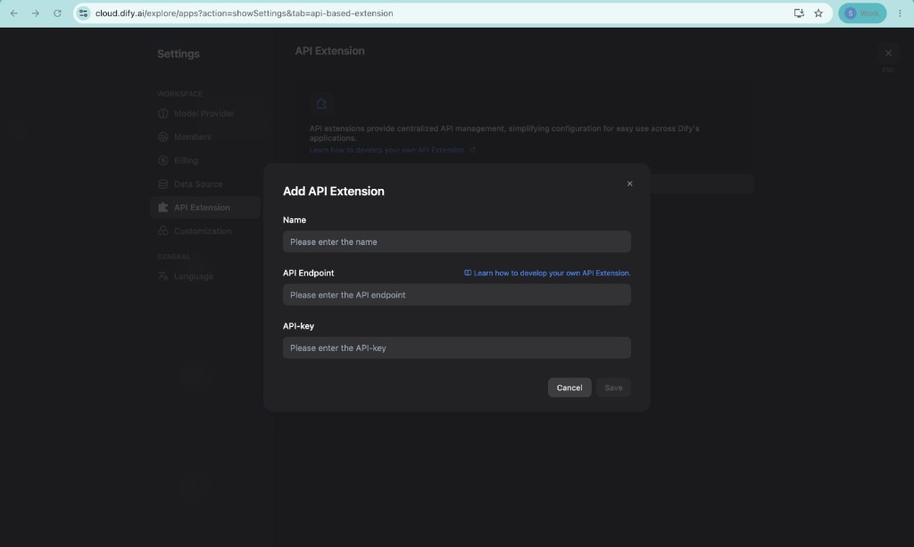

# Dify

## Overview

[Dify](https://dify.ai) is an open-source platform for building LLM applications such as chatbots, agents, and workflows. This integration uses Dify's [Moderation API Extension](https://docs.dify.ai/en/use-dify/workspace/api-extension/moderation-api-extension) to route end-user inputs and LLM outputs through Akto guardrails before they reach (or leave) your Dify app.

The Akto Dify connector provides the following capabilities:

* Validates Dify app inputs and outputs against security policies
* Detects PII, prompt injection, and policy violations
* Blocks violating content or redacts it inline (override) before it is shown
* Ingests traffic into Akto, creating a per-app collection for monitoring and analysis


**No extra service to deploy**

Dify calls Akto's per-account guardrails service directly at `/api/http-proxy/dify`. There is no separate adapter or sidecar to run or maintain.


## How It Works

Dify's Moderation API Extension sends each input/output to an external endpoint. Akto exposes that endpoint on your account's guardrails service host, which validates the content against guardrails, ingests it for monitoring, and returns Dify's moderation verdict:

```
Dify app --(app.moderation.input / app.moderation.output)--> https://<accountId>-guardrails-service.akto.io/api/http-proxy/dify --> guardrails + ingestion
   ^                                                                                              |
   |------------------------ { flagged, action, preset_response / text } --------------------------|
```

| Extension point | Behavior |
| --- | --- |
| `app.moderation.input` | Validates end-user input (request guardrails) and ingests it |
| `app.moderation.output` | Validates LLM output (response guardrails) and ingests it |
| `ping` | Health check (`{ "result": "pong" }`) |

Akto verdicts map to Dify responses as follows:

| Akto guardrails result | Dify response |
| --- | --- |
| Blocked | `{ flagged: true, action: "direct_output", preset_response: <reason> }` |
| Allowed but modified | `{ flagged: true, action: "overridden", inputs/query \| text: <redacted> }` |
| Allowed | `{ flagged: false }` |

The endpoint is fail-open: if guardrails are unreachable or error, content is allowed through.

## API Endpoint

Each Akto account has a dedicated guardrails service host:

```
https://<accountId>-guardrails-service.akto.io/api/http-proxy/dify
```

Replace `<accountId>` with your Akto account ID. The **Connectors → Dify** setup guide in the dashboard shows the full URL for your account — copy it from there.

## Prerequisites

Before integrating Akto with Dify, ensure the following are in place:

* A running Dify instance (cloud or self-hosted) with workspace settings access
* Network access from Dify to your Akto guardrails service (`https://<accountId>-guardrails-service.akto.io`)
* A token generated from **Akto Argus → Connectors → Dify**

## Steps to Connect



**Get your token from Akto**

In the Akto dashboard, go to **Connectors → Dify**, select a token expiry, and copy the generated token. You will use it as the API Key in Dify.



**Add the API Extension in Dify**

In Dify, go to **Settings → API Extension → Add** and fill in the fields as shown below:

<div data-with-frame="true"><figure><figcaption></figcaption></figure></div>

* **Name**: e.g. `Akto Guardrails`
* **API Endpoint**: `https://<accountId>-guardrails-service.akto.io/api/http-proxy/dify` (copy the exact URL from **Connectors → Dify** in your dashboard)
* **API-key**: the token from step 1 (Dify sends it as `Authorization: Bearer <token>`)


**Authentication**

The token identifies your Akto account and is carried on every request. This endpoint is intended for guardrails service deployments that do not enforce strict token authentication on ingestion traffic (i.e. `AKTO_DI_AUTHENTICATE` is not enabled), which is the default for ingestion endpoints. If your deployment enforces it, reach out to Akto support so we can enable Dify's `Authorization: Bearer` format for your environment.




**Enable Content Moderation per app**

Open the app you want to protect → **Content Moderation**, choose the **Akto Guardrails** API extension, and enable **Review Input Content** and/or **Review Output Content**.



**Verify Integration**

Confirm the endpoint is reachable and the moderation contract works (replace `<accountId>` and `<token>`):

```bash
# Ping (Dify health check contract)
curl -X POST https://<accountId>-guardrails-service.akto.io/api/http-proxy/dify \
  -H "Authorization: Bearer <token>" \
  -H "Content-Type: application/json" \
  -d '{"point":"ping"}'

# Input moderation
curl -X POST https://<accountId>-guardrails-service.akto.io/api/http-proxy/dify \
  -H "Authorization: Bearer <token>" \
  -H "Content-Type: application/json" \
  -d '{"point":"app.moderation.input","params":{"app_id":"demo","inputs":{},"query":"My SSN is 123-45-6789"}}'
```

**Verify in the Akto dashboard:**

* Log into the Akto dashboard
* Navigate to the **Collections** section and confirm a `*.dify.agent` collection appears
* Confirm guardrail activity is visible under Agentic Guardrails



## Get Support for your Akto setup

There are multiple ways to request support from Akto. We are 24X7 available on the following:

1. In-app `intercom` support. Message us with your query on intercom in Akto dashboard and someone will reply.
2. Join our [discord channel](https://www.akto.io/community) for community support.
3. Contact `help@akto.io` for email support.
4. Contact us [here](https://www.akto.io/contact-us).
