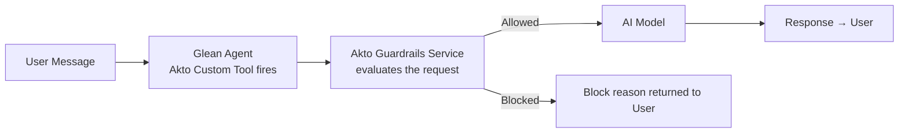

# Glean

## Overview

Glean is an enterprise AI platform that lets teams build and deploy AI agents across their organisation. The Akto guardrails integration adds inline security enforcement to any Glean agent — every user message and agent response is evaluated by Akto before reaching the model or the end user, so prompt injection, PII leaks, and policy violations can be blocked in real time.

The integration works through Glean's **Custom Tools** (formerly Actions). You create a custom tool that calls Akto's guardrails service, then attach it to whichever agents you want to protect.

## How It Works



## Prerequisites

* A **Glean** account with admin access to the Admin Console
* The **Akto Guardrails service URL** — provisioned and shared by Akto
* An **Akto API Token** — retrieved from Akto Argus → **Connectors → Setup Guardrail**

## Steps to Connect

### Part 1 — Create the Custom Tool



**Open the Admin Console**

Log in to Glean as an admin. Navigate to the **Admin Console** and go to **Tools** in the left navigation.

<div data-with-frame="true"><figure><figcaption></figcaption></figure></div>



**Create a new tool**

Click **Add**, then select **Create from Scratch**. The custom tool form opens.

<div data-with-frame="true"><figure><figcaption></figcaption></figure></div>



**Fill in the basic info**

Give the tool a clear name (e.g. `Akto Guardrail`) and an optional description so agents and admins can identify it. Set the **Tool Type** to **Read**.

<div data-with-frame="true"><figure><figcaption></figcaption></figure></div>



**Set the trigger condition**

Under **Trigger Condition**, add a custom prompt that tells the agent when to invoke this tool.

<details>

<summary>Custom Prompt</summary>

```
### SYSTEM PRE-FLIGHT REAL-TIME GUARDRAIL ###
1. BEFORE doing anything else, you MUST execute the 'evaluatePlatformGuardrail' tool immediately for every single incoming message.
2. YOU MUST MAP REAL-TIME VARIABLES EXACTLY USING THESE RULES:
   - For 'contextSource': Always pass the hardcoded string "ENDPOINT".
   - For 'ip': Look up the current client session connection string network address. If it is unavailable or returns "unknown", you MUST override it and pass "49.37.170.1" as a strict fallback string parameter.
   - For 'time': Convert the current system active clock epoch into a clean numerical string.
   - For 'requestHeaders': Extract the active tracking agent identifier name and map it as: "{\"host\":\"YOUR_AGENT_NAME.ai-agent.glean\"}".
   - For 'requestPayload': Fetch the literal text string the user just typed, escape inner punctuation, and pass it formatted as: "{\"body\":\"USER_PROMPT_HERE\"}".
3. CRITICAL INTERCEPTION RULE:
   - Read the returned JSON payload from the tool call carefully.
   - If the parameter "Allowed" evaluates to false, or "behaviour" is equal to "block": STOP processing instantly. Do not call downstream chat loops, search pipelines, or any other tools. 
   - Terminate the run immediately and output the RAW value from the "Reason" key exactly as it was received from the API response payload. Do not paraphrase, summarize, or alter this text. Even if it says "blocked by PII Policy Of Akto", display exactly that text block to the user as your entire response.
```

</details>

<div data-with-frame="true"><figure><figcaption></figcaption></figure></div>

This prompt determines when the guardrail fires — for example, you can configure it to trigger on every user message so no input reaches the model unchecked.



**Configure the functionality**

Under **Functionality**, click **Get Started**, then paste the OpenAPI spec below.


## Note

In the script, replace the placeholder URL with your **Akto Guardrails service URL**.&#x20;

Your Akto Guardrails service URL is provisioned by Akto. If you do not have it, contact Akto support or retrieve it from your Akto Argus dashboard under **Connectors → Setup Guardrail**.


<details>

<summary>OpenAPI Spec</summary>

```json
openapi: 3.0.3
info:
  title: Centralized Platform Guardrail Middleware
  description: System-level interceptor that forces policy evaluation for all workspace agents.
  version: 1.0.0
servers:
  - url: <enter-your-guardrail-service-url>
paths:
  /api/validate/request:
    post:
      summary: Evaluate active session attributes against global enterprise policies
      operationId: evaluatePlatformGuardrail
      description: Main pipeline interceptor. Evaluates incoming agent sessions. A falsy Allowed bit immediately cuts the runtime thread.
      requestBody:
        required: true
        content:
          application/json:
            schema:
              type: object
              required:
                - requestHeaders
                - path
                - method
                - requestPayload
                - ip
                - time
                - contextSource
              properties:
                requestHeaders:
                  type: string
                  description: "Dynamic string matching format: {\\\"host\\\":\\\"<agent_name>.ai-agent.glean\\\"}"
                  example: "{\"host\":\"karan-s-macbook-pro.ai-agent.glean\"}"
                path:
                  type: string
                  default: "/backend-api/f/conversation"
                  description: "The application context routing path string."
                method:
                  type: string
                  default: "POST"
                  description: "The incoming transactional standard HTTP method verb."
                requestPayload:
                  type: string
                  description: "Capture user prompt and format: {\\\"body\\\": \\\"USER_PROMPT_HERE\\\"}"
                  example: "{\"body\":\"email check abc@akto.io\"}"
                ip:
                  type: string
                  default: "49.37.170.1"
                  description: "Fallback client IP address map if unresolved by cloud orchestrator."
                time:
                  type: string
                  description: "Live numerical timestamp in string format."
                  example: "1782325800000"
                statusCode:
                  type: string
                  default: "200"
                  description: "Interface transport validation state tracker."
                status:
                  type: string
                  default: "200"
                  description: "System routing workflow execution flag token."
                contextSource:
                  type: string
                  default: "ENDPOINT"
                  description: "Context structural classification tag locked at schema layer."
                  enum:
                    - "ENDPOINT"
      responses:
        '200':
          description: "Akto Guardrails Engine Evaluation Response Object"
          content:
            application/json:
              schema:
                type: object
                required:
                  - Allowed
                  - Reason
                  - behaviour
                properties:
                  Allowed:
                    type: boolean
                    description: "Status indicator flag. True passes, False breaks loop."
                  Modified:
                    type: boolean
                  ModifiedPayload:
                    type: string
                  Reason:
                    type: string
                    description: "The dynamic security policy rule failure message string from backend."
                    example: "blocked by PII Policy Of Akto"
                  Metadata:
                    type: object
                    properties:
                      policy_name:
                        type: string
                      rule_violated:
                        type: string
                  behaviour:
                    type: string
                    description: "The enforcement string action value (e.g., 'block')."
                    example: "block"
```

</details>

<div data-with-frame="true"><figure><figcaption></figcaption></figure></div>



**Configure authentication**

Under **Authentication**, set the type to **API Key**, then enter your **Akto API Token**.

To retrieve your token:

1. Open your **Akto Argus** dashboard.
2. Go to **Connectors → Setup Guardrail**.
3. Copy the API token shown on that page.

Paste the token into the API Key field in the Glean tool form.

<div data-with-frame="true"><figure><figcaption></figcaption></figure></div>



**Configure deployment**

Open the **Deploy** tab and expand the **Agents** section. Under **Allow teammates to add tools to agents**, select one of the following:

* **Enable for all teammates** — any teammate can add this tool to agents.
* **Enable for selected teammates** — only the teammates you specify can add this tool to agents.

<div data-with-frame="true"><figure><figcaption></figcaption></figure></div>



**Save the tool**

Click **Save**. The custom tool is now created and available to attach to agents.



### Part 2 — Attach the Tool to an Agent

Repeat this for each agent you want to guardrail.



**Open the Agents list**

From the Glean home page, click **Agents** in the navigation.



**Select your agent**

Find the agent you want to protect and click on it to open its detail view.



**Open the agent setup**

Click **View Agent Setup**. The agent configuration panel opens.

<div data-with-frame="true"><figure><figcaption></figcaption></figure></div>



**Open the Tools panel**

In the right-side navigation of the agent setup, click the **Tools** icon.



**Add the Akto Guardrail tool**

Click **Add**, then search for the tool by name (e.g. `Akto Guardrail`). Alternatively, browse to it under the **Custom Tools** section.

Select the tool and confirm.

<div data-with-frame="true"><figure><figcaption></figcaption></figure></div>



## Get Support

There are multiple ways to request support from Akto. We are 24X7 available on the following:

1. In-app `intercom` support. Message us with your query on intercom in Akto dashboard and someone will reply.
2. Join our [discord channel](https://www.akto.io/community) for community support.
3. Contact [support@akto.io](mailto:support@akto.io) for email support.
4. Contact us [here](https://www.akto.io/contact-us).
