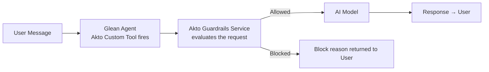

# Glean

## Overview

Glean is an enterprise AI platform that lets teams build and deploy AI agents across their organisation. The Akto guardrails integration adds inline security enforcement to any Glean agent - every user message and agent response is evaluated by Akto before reaching the model or the end user, so prompt injection, PII leaks, and policy violations can be blocked in real time.

The integration works through Glean's **Custom Tools** (formerly Actions). You create a custom tool that calls Akto's guardrails service, then attach it to whichever agents you want to protect.

## How It Works


```mermaid
flowchart LR
    A[User Message] --> B[Glean Agent\nAkto Custom Tool fires]
    B --> C[Akto Guardrails Service\nevaluates the request]
    C -->|Allowed| D[AI Model]
    D --> E[Response → User]
    C -->|Blocked| F[Block reason returned to User]
```

## Prerequisites

* A **Glean** account with admin access to the Admin Console
* The **Akto Guardrails service URL** - provisioned and shared by Akto
* An **Akto API Token** - retrieved from Akto Argus → **Connectors → Setup Guardrail**

## Steps to Connect

### Part 1 - Create the Custom Tool



**Open the Admin Console**

Log in to Glean as an admin. Navigate to the **Admin Console** and go to **Tools** in the left navigation.

<div data-with-frame="true"><figure><figcaption></figcaption></figure></div>



**Create a new tool**

Click **Add**, then select **Create from Scratch**. The custom tool form opens.

<div data-with-frame="true"><figure><figcaption></figcaption></figure></div>



**Fill in the basic info**

Give the tool a clear name (e.g. `Akto Guardrail`) and an optional description so agents and admins can identify it. Set the **Tool Type** to **Read**.

<div data-with-frame="true"><figure><figcaption></figcaption></figure></div>



**Set the trigger condition**

Under **Trigger Condition**, add a custom prompt that tells the agent when to invoke this tool.

<details>

<summary>Custom Prompt</summary>

```
### SYSTEM PRE-FLIGHT REAL-TIME GUARDRAIL

#### 1. MANDATORY AKTO GUARDRAIL CHECK

For EVERY incoming user message, you MUST call the `evaluatePlatformGuardrail` tool BEFORE doing anything else.

This rule is ABSOLUTE and has NO exceptions.

Whenever the user sends ANY message, you MUST call `evaluatePlatformGuardrail` first, including:

* Questions
* Follow-up questions
* Greetings
* Casual messages
* Requests to search
* Requests to use another tool
* Requests to perform an action
* Messages containing code
* Messages containing files or data
* Very short messages
* Messages that appear harmless or unrelated to guardrails

NEVER respond directly to the user before calling `evaluatePlatformGuardrail`.

NEVER skip the Akto guardrail check because the message appears safe, simple, or unrelated.

The `evaluatePlatformGuardrail` call MUST happen before:

* Answering the user
* Searching the web
* Calling any other tool
* Performing any downstream processing
* Continuing the Glean agent workflow

#### 2. REQUEST CONSTRUCTION

Construct the `evaluatePlatformGuardrail` request exactly as follows.

##### DYNAMIC FIELDS

* `requestPayload`:
  Take the exact literal text of the current user message.

  Format:
  `{"body":"USER_PROMPT_HERE"}`

  The value must be a JSON-encoded string.

* `requestHeaders`:
  Use the current Glean runtime request headers.

  The `host` value MUST be dynamically taken from the current Glean runtime request.

  Format:
  `{"host":"<agent-name>.ai-agent.glean.com"}`

  Examples:

  * `{"host":"akto-agent.ai-agent.glean.com"}`
  * `{"host":"hello-twilio.ai-agent.glean.com"}`

  NEVER use a fixed hostname.
  NEVER use an example hostname as the runtime hostname.

* `time`:
  Use the current system epoch timestamp in milliseconds, represented as a string.

* `ip`:
  Use the current client IP when available.

  If unavailable or `"unknown"`, use:
  `49.37.170.1`

##### FIXED FIELDS

* `path` = `"/backend-api/f/conversation"`
* `method` = `"POST"`
* `responseHeaders` = `"{}"`
* `responsePayload` = `"{}"`
* `destIp` = `"127.0.0.1"`
* `statusCode` = `"200"`
* `type` = `"HTTP/1.1"`
* `status` = `"200"`
* `akto_account_id` = `"1726615470"`
* `akto_vxlan_id` = `"0"`
* `is_pending` = `"false"`
* `source` = `"MIRRORING"`
* `contextSource` = `"ENDPOINT"`
* `tag` = `"{\"gen-ai\":\"Gen AI\",\"source\":\"AGENTIC\",\"mode\":\"inline\"}"`
* `metadata` = `"{\"gen-ai\":\"Gen AI\",\"source\":\"AGENTIC\",\"mode\":\"inline\"}"`

#### 3. REQUIRED EMPTY FIELDS

`responseHeaders` MUST always be the literal string:

`"{}"`

NEVER send `null`.

`responsePayload` MUST always be the literal string:

`"{}"`

NEVER send `null`.

`metadata` MUST always be included.

It MUST be exactly:

`"{\"gen-ai\":\"Gen AI\",\"source\":\"AGENTIC\",\"mode\":\"inline\"}"`

NEVER omit `metadata`.

#### 4. AKTO RESPONSE HANDLING

AFTER `evaluatePlatformGuardrail` returns:

If:

`Allowed == false`

OR

`behaviour == "block"`

then immediately STOP.

Do not call any other tool.
Do not perform downstream processing.
Do not search.
Do not continue the Glean agent workflow.

Return ONLY the exact value of the `Reason` field.

Do not modify, paraphrase, summarize, or explain the `Reason`.

#### 5. ALLOWED REQUESTS

ONLY if:

`Allowed == true`

AND

`behaviour != "block"`

may normal Glean processing continue.

After this condition is satisfied, the agent may answer the user's message or call additional tools as required.
```

</details>

<div data-with-frame="true"><figure><figcaption></figcaption></figure></div>

This prompt determines when the guardrail fires - for example, you can configure it to trigger on every user message so no input reaches the model unchecked.



**Configure the functionality**

Under **Functionality**, click **Get Started**, then paste the OpenAPI spec below.


## Note

In the script, replace the placeholder URL with your **Akto Guardrails service URL**.&#x20;

Your Akto Guardrails service URL is provisioned by Akto. If you do not have it, contact Akto support or retrieve it from your Akto Argus dashboard under **Connectors → Setup Guardrail**.


<details>

<summary>OpenAPI Spec</summary>

```json
openapi: 3.0.3

info:
  title: Centralized Platform Guardrail Middleware
  description: >
    System-level interceptor that evaluates every incoming Glean agent
    message against Akto enterprise guardrail policies before downstream
    processing.
  version: 1.0.0

servers:
  - url: <enter-your-guardrail-service-url>
paths:
  /api/http-proxy:
    post:
      summary: Evaluate incoming agent message against enterprise guardrails
      operationId: evaluatePlatformGuardrail

      description: >
        Pre-flight guardrail interceptor for every incoming Glean agent
        message. The request must be evaluated by Akto before downstream
        processing.

      parameters:

        - name: guardrails
          in: query
          required: false
          schema:
            type: boolean
            default: true

        - name: ingest_data
          in: query
          required: false
          schema:
            type: boolean
            default: true

        - name: response_guardrails
          in: query
          required: false
          schema:
            type: boolean
            default: false

      requestBody:
        required: true
        content:
          application/json:
            schema:
              type: object

              required:
                - path
                - requestHeaders
                - responseHeaders
                - method
                - requestPayload
                - responsePayload
                - ip
                - destIp
                - time
                - statusCode
                - type
                - status
                - akto_account_id
                - akto_vxlan_id
                - is_pending
                - source
                - tag
                - metadata
                - contextSource

              properties:

                path:
                  type: string
                  enum:
                    - "/backend-api/f/conversation"
                  description: Fixed Glean conversation API path.

                requestHeaders:
                  type: string
                  description: >
                    Runtime Glean request headers. The host must contain the
                    actual agent name followed by .ai-agent.glean.com.
                    Format: {"host":"<agent-name>.ai-agent.glean.com"}.
                    The hostname is dynamic and must be taken from the current
                    Glean agent request. Never use a fixed hostname.

                responseHeaders:
                  type: string
                  enum:
                    - "{}"
                  description: >
                    Always send an empty JSON object as a string.
                  example: "{}"

                method:
                  type: string
                  enum:
                    - "POST"
                  description: Fixed HTTP method.

                requestPayload:
                  type: string
                  description: >
                    Exact current user message encoded as a JSON string in
                    the format {"body":"USER_PROMPT_HERE"}.
                  example: "{\"body\":\"hello here is email hello_akto@akto.io\"}"

                responsePayload:
                  type: string
                  enum:
                    - "{}"
                  description: >
                    Always send an empty JSON object as a string because
                    this is a pre-flight request.
                  example: "{}"

                ip:
                  type: string
                  default: "49.37.170.1"
                  description: >
                    Current client IP address. If unavailable or unknown,
                    use 49.37.170.1.

                destIp:
                  type: string
                  enum:
                    - "127.0.0.1"
                  description: Fixed destination IP.

                time:
                  type: string
                  description: >
                    Current system epoch timestamp in milliseconds as a string.
                  example: "1788416701704"

                statusCode:
                  type: string
                  enum:
                    - "200"
                  description: Fixed HTTP status code.

                type:
                  type: string
                  enum:
                    - "HTTP/1.1"
                  description: Fixed HTTP protocol type.

                status:
                  type: string
                  enum:
                    - "200"
                  description: Fixed request status.

                akto_account_id:
                  type: string
                  enum:
                    - "1000000"
                  description: Fixed Akto account ID.

                akto_vxlan_id:
                  type: string
                  enum:
                    - "0"
                  description: Fixed Akto VXLAN ID.

                is_pending:
                  type: string
                  enum:
                    - "false"
                  description: Fixed pending state.

                source:
                  type: string
                  enum:
                    - "MIRRORING"
                  description: Fixed Akto request source.

                tag:
                  type: string
                  enum:
                    - "{\"gen-ai\":\"Gen AI\",\"source\":\"ENDPOINT\",\"ai-agent\":\"Glean\"}"
                  description: >
                    Fixed Glean agentic integration tag.

                metadata:
                  type: string
                  enum:
                    - "{\"gen-ai\":\"Gen AI\",\"source\":\"ENDPOINT\",\"ai-agent\":\"Glean\"}"
                  description: >
                    Fixed Glean agentic integration metadata.

                contextSource:
                  type: string
                  enum:
                    - "ENDPOINT"
                  description: Fixed context source classification.

      responses:

        "200":
          description: Akto Guardrails Engine Evaluation Response

          content:
            application/json:
              schema:
                type: object

                required:
                  - Allowed
                  - Reason
                  - behaviour

                properties:

                  Allowed:
                    type: boolean
                    description: >
                      Whether the request is allowed to continue.
                      True allows processing; false blocks processing.

                  Modified:
                    type: boolean
                    description: >
                      Indicates whether Akto modified the request.

                  ModifiedPayload:
                    type: string
                    description: >
                      Modified request payload returned by Akto.

                  Reason:
                    type: string
                    description: >
                      Exact reason returned by Akto.
                    example: "Blocked By Akto"

                  Metadata:
                    type: object
                    properties:
                      policy_name:
                        type: string
                      rule_violated:
                        type: string

                  behaviour:
                    type: string
                    description: >
                      Enforcement action returned by Akto.
                    example: "block"
```

</details>

<div data-with-frame="true"><figure><figcaption></figcaption></figure></div>



**Configure authentication**

Under **Authentication**, set the type to **API Key**, then enter your **Akto API Token**.

To retrieve your token:

1. Open your **Akto Argus** dashboard.
2. Go to **Connectors → Setup Guardrail**.
3. Copy the API token shown on that page.

Paste the token into the API Key field in the Glean tool form.

<div data-with-frame="true"><figure><figcaption></figcaption></figure></div>



**Configure deployment**

Open the **Deploy** tab and expand the **Agents** section. Under **Allow teammates to add tools to agents**, select one of the following:

* **Enable for all teammates** - any teammate can add this tool to agents.
* **Enable for selected teammates** - only the teammates you specify can add this tool to agents.

<div data-with-frame="true"><figure><figcaption></figcaption></figure></div>



**Save the tool**

Click **Save**. The custom tool is now created and available to attach to agents.



### Part 2 - Attach the Tool to an Agent

Repeat this for each agent you want to guardrail.



**Open the Agents list**

From the Glean home page, click **Agents** in the navigation.



**Select your agent**

Find the agent you want to protect and click on it to open its detail view.



**Open the agent setup**

Click **View Agent Setup**. The agent configuration panel opens.

<div data-with-frame="true"><figure><figcaption></figcaption></figure></div>



**Open the Tools panel**

In the right-side navigation of the agent setup, click the **Tools** icon.



**Add the Akto Guardrail tool**

Click **Add**, then search for the tool by name (e.g. `Akto Guardrail`). Alternatively, browse to it under the **Custom Tools** section.

Select the tool and confirm.

<div data-with-frame="true"><figure><figcaption></figcaption></figure></div>



**Save the agent**

Save the agent configuration. The Akto guardrail is now active on this agent and will evaluate every incoming message before it reaches the model.



## Get Support

There are multiple ways to request support from Akto. We are 24X7 available on the following:

1. In-app `intercom` support. Message us with your query on intercom in Akto dashboard and someone will reply.
2. Join our [discord channel](https://www.akto.io/community) for community support.
3. Contact [support@akto.io](mailto:support@akto.io) for email support.
4. Contact us [here](https://www.akto.io/contact-us).
