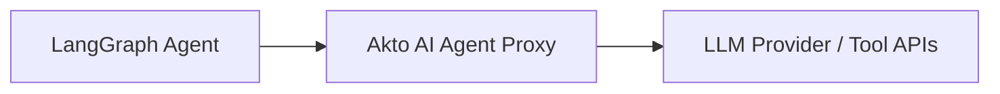

# LangGraph

## Overview

LangGraph is a framework for building stateful, multi-actor AI agent applications using graph-based workflows. This integration lets you capture tool calls, agent interactions, and execution traces from your LangGraph applications and send them into Akto for security monitoring and policy enforcement.

Akto supports three integration methods for LangGraph depending on your deployment requirements.

## Integration Methods

### 1. Via LangSmith (Telemetry)

LangGraph natively integrates with LangSmith for observability and tracing. If your LangGraph application already reports traces to LangSmith, you can use Akto's existing LangChain connector to pull that data into Akto — no additional instrumentation required.

Follow the steps in the [LangChain connector guide](langchain.md) to configure the integration. The same connector works for LangGraph applications traced through LangSmith.


**When to use this**

Use this method if you want passive observability; collecting execution traces and API traffic after the fact without intercepting live requests.


### 2. Via Proxy

Route your LangGraph agent's outbound LLM and tool calls through Akto's AI Agent Proxy. This gives you real-time inspection, guardrails enforcement, and response filtering on every request your agent makes, without modifying your application logic.

#### 1. Set Up the AI Agent Proxy

Configure an **AI Agent Proxy** in your environment so LangGraph agent requests can pass through the proxy before reaching the upstream LLM or tool APIs.



Akto Argus inspects prompts, evaluates guardrail policies, and filters responses before forwarding traffic to the upstream services.

Refer to the [AI Agent Proxy guide](../../../agentic-guardrails/overview/akto-agent-proxy.md) for setup instructions.

An enterprise platform team can deploy and manage the proxy within internal infrastructure. The deployed proxy endpoint becomes the `{PROXY_URL}` used in model routing configuration.

#### 2. Route Model Requests Through the Proxy

Update the model endpoint used by the LangGraph agent so requests pass through the proxy before reaching the model provider.

General model endpoint format:

```
https://{MODEL_HOST}/{MODEL_PATH}
```

Proxy endpoint format:

```
https://{PROXY_URL}/{MODEL_PATH}?openai_url=https://{MODEL_HOST}
```

| Configuration Element | Value                                                              |
| --------------------- | ------------------------------------------------------------------ |
| Model URL             | `https://{MODEL_HOST}/{MODEL_PATH}`                                |
| Proxy URL Format      | `https://{PROXY_URL}/{MODEL_PATH}?openai_url=https://{MODEL_HOST}` |

Akto Argus evaluates prompts, applies guardrail policies, and forwards the request to the upstream model provider.

<details>

<summary><strong>Example: Azure AI Foundry endpoint</strong></summary>

Azure AI Foundry model endpoint:

```
https://{AZURE_MODEL_URL}/openai/v1/
```

Proxy endpoint format:

```
https://{PROXY_URL}/openai/v1/?openai_url=https://{AZURE_MODEL_URL}
```

</details>


## **Proxy URL usage**

If your team deployed an AI Agent Proxy in the previous step, use the proxy endpoint from that deployment as `{PROXY_URL}`.\
If your team prefers not to deploy a proxy, request a **managed proxy URL from the Akto support team** and use the provided endpoint as `{PROXY_URL}`.



**When to use this**

Use this method if you want active enforcement — intercepting and inspecting requests in real time before they reach the LLM or tool.


### 3. Via Hooks (Recommended)

Akto provides `AktoGuardrailsMiddleware` — a class-based `AgentMiddleware` that hooks directly into the LangGraph agent lifecycle to enforce Akto guardrails on every model call. This requires no proxy and no external telemetry pipeline.

The middleware intercepts two points in the agent lifecycle:

* **`before_model`** — Validates the prompt against Akto guardrails _before_ the LLM is called. In sync mode, a policy violation blocks the request immediately.
* **`after_model`** — Ingests the completed interaction (prompt + response) into Akto for audit and dashboard visibility.

Both synchronous and asynchronous agent execution modes are supported.

#### Request Flow (AKTO\_SYNC\_MODE=true)

```
1. Agent invokes model call
2. before_model hook intercepts the request
3. Prompt sent to Akto Data Ingestion Service for validation
   ├─ If BLOCKED: ValueError raised, LLM never called
   └─ If ALLOWED: Continue to step 4
4. Request forwarded to LLM provider
5. LLM response received
6. after_model hook intercepts the response
7. Full interaction sent to Akto for audit and dashboard display
```

#### Request Flow (AKTO\_SYNC\_MODE=false)

```
1. Agent invokes model call
2. Request forwarded to LLM provider immediately (no pre-validation)
3. LLM response received
4. after_model hook sends the interaction to Akto asynchronously (log-only)
```

#### Steps to Connect



**Install Dependencies**

Ensure the required packages are installed:

```bash
pip install httpx langchain langgraph
```



**Download the Middleware**

Download the `akto_middleware.py` file into your project:

```bash
curl -O https://raw.githubusercontent.com/akto-api-security/akto/master/apps/mcp-endpoint-shield/langchain-hooks/akto_middleware.py
```



**Configure Environment Variables**

Set the following environment variables in your shell or `.env` file:

```bash
# Required: Akto Data Ingestion Service URL
AKTO_DATA_INGESTION_URL=https://<YOUR_AKTO_INSTANCE_URL>

# Optional: Operation mode (default: "true")
AKTO_SYNC_MODE=true        # true = block violations, false = async log-only

# Optional: HTTP timeout in seconds (default: "5")
AKTO_TIMEOUT=5

# Optional: Logging
LOG_LEVEL=INFO             # Logging level (default: "INFO")
LOG_PAYLOADS=false         # Log full payloads — privacy-sensitive (default: "false")
```


#### **Note**

`AKTO_SYNC_MODE` determines behavior:

* `AKTO_SYNC_MODE=true`: Prompts are validated **before** being sent to the LLM. Policy violations raise a `ValueError` and block the request.
* `AKTO_SYNC_MODE=false`: All requests proceed immediately. Interactions are ingested after the fact for logging and audit only.




**Integrate the Middleware into Your LangGraph Agent**

Import `AktoGuardrailsMiddleware` and pass it to your LangGraph agent's middleware list:

```python
from akto_middleware import AktoGuardrailsMiddleware
from langgraph.prebuilt import create_react_agent

agent = create_react_agent(
    model="gpt-4.1",
    tools=[...],
    middleware=[AktoGuardrailsMiddleware()],
)
```

The middleware automatically handles both sync and async execution paths — no additional configuration is needed.



**Verify Integration**

Run your agent and check the logs for middleware initialization:

```
AktoGuardrailsMiddleware initialized | connector=langchain sync_mode=True url=https://<YOUR_AKTO_INSTANCE_URL>
```

Then verify in the Akto dashboard:

* Log into your Akto dashboard
* Navigate to the Collections section
* Verify you see requests from your LangGraph application appearing



#### Configuration Reference

| Variable                | Required | Default              | Description                                        |
| ----------------------- | -------- | -------------------- | -------------------------------------------------- |
| `AKTO_DATA_INGESTION_URL` | Yes   |                      | Akto service base URL                              |
| `AKTO_SYNC_MODE`        | No       | `true`               | `true` to block on violation, `false` for log-only |
| `AKTO_TIMEOUT`          | No       | `5`                  | HTTP timeout in seconds                            |
| `LOG_LEVEL`             | No       | `INFO`               | Logging level                                      |
| `LOG_PAYLOADS`          | No       | `false`              | Log full request/response payloads (privacy-sensitive) |
| `LANGCHAIN_API_HOST`    | No       | `api.langchain.com`  | Host header used in the proxy payload              |
| `LANGCHAIN_API_PATH`    | No       | `/langchain/chat`    | Path used in the proxy payload                     |

#### Handling Blocked Requests

When `AKTO_SYNC_MODE=true` and a request is blocked by guardrails, the middleware raises a `ValueError`:

```
ValueError: Blocked by Akto Guardrails: <reason>
```

You can catch this in your application to handle blocked requests gracefully:

```python
try:
    result = agent.invoke({"messages": [{"role": "user", "content": user_input}]})
except ValueError as e:
    if "Blocked by Akto Guardrails" in str(e):
        print(f"Request blocked: {e}")
```


**When to use this**

Use this method if you want guardrails enforcement directly inside your LangGraph agent without deploying a separate proxy. It provides the same validation and blocking capabilities as the proxy approach, with a simpler setup.


## Get Support

* **In-app Chat**: Use the chat widget in your Akto dashboard for instant support
* **Discord Community**: Join our community at [discord.gg/Wpc6xVME4s](https://discord.gg/Wpc6xVME4s)
* **Email Support**: Contact us at [support@akto.io](mailto:support@akto.io)
* **Contact Form**: Submit a support request at [https://www.akto.io/contact-us](https://www.akto.io/contact-us)
