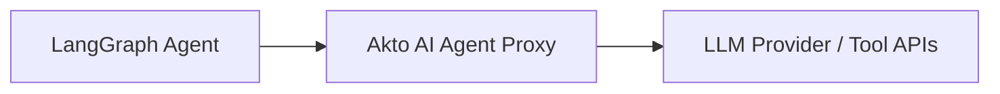

# LangGraph

## Overview

LangGraph is a framework for building stateful, multi-actor AI agent applications using graph-based workflows. This integration lets you capture tool calls, agent interactions, and execution traces from your LangGraph applications and send them into Akto for security monitoring and policy enforcement.

Akto supports three integration methods for LangGraph depending on your deployment requirements.

## Integration Methods

### 1. Via LangSmith (Telemetry)

LangGraph natively integrates with LangSmith for observability and tracing. If your LangGraph application already reports traces to LangSmith, you can use Akto's existing LangChain connector to pull that data into Akto — no additional instrumentation required.

Follow the steps in the [LangChain connector guide](langchain.md) to configure the integration. The same connector works for LangGraph applications traced through LangSmith.


**When to use this**

Use this method if you want passive observability; collecting execution traces and API traffic after the fact without intercepting live requests.


### 2. Via Proxy

Route your LangGraph agent's outbound LLM and tool calls through Akto's AI Agent Proxy. This gives you real-time inspection, guardrails enforcement, and response filtering on every request your agent makes, without modifying your application logic.

#### 1. Set Up the AI Agent Proxy

Configure an **AI Agent Proxy** in your environment so LangGraph agent requests can pass through the proxy before reaching the upstream LLM or tool APIs.



Akto Argus inspects prompts, evaluates guardrail policies, and filters responses before forwarding traffic to the upstream services.

Refer to the [AI Agent Proxy guide](../../../agentic-guardrails/overview/akto-agent-proxy.md) for setup instructions.

An enterprise platform team can deploy and manage the proxy within internal infrastructure. The deployed proxy endpoint becomes the `{PROXY_URL}` used in model routing configuration.

#### 2. Route Model Requests Through the Proxy

Update the model endpoint used by the LangGraph agent so requests pass through the proxy before reaching the model provider.

General model endpoint format:

```
https://{MODEL_HOST}/{MODEL_PATH}
```

Proxy endpoint format:

```
https://{PROXY_URL}/{MODEL_PATH}?openai_url=https://{MODEL_HOST}
```

| Configuration Element | Value                                                              |
| --------------------- | ------------------------------------------------------------------ |
| Model URL             | `https://{MODEL_HOST}/{MODEL_PATH}`                                |
| Proxy URL Format      | `https://{PROXY_URL}/{MODEL_PATH}?openai_url=https://{MODEL_HOST}` |

Akto Argus evaluates prompts, applies guardrail policies, and forwards the request to the upstream model provider.

<details>

<summary><strong>Example: Azure AI Foundry endpoint</strong></summary>

Azure AI Foundry model endpoint:

```
https://{AZURE_MODEL_URL}/openai/v1/
```

Proxy endpoint format:

```
https://{PROXY_URL}/openai/v1/?openai_url=https://{AZURE_MODEL_URL}
```

</details>


## **Proxy URL usage**

If your team deployed an AI Agent Proxy in the previous step, use the proxy endpoint from that deployment as `{PROXY_URL}`.\
If your team prefers not to deploy a proxy, request a **managed proxy URL from the Akto support team** and use the provided endpoint as `{PROXY_URL}`.



**When to use this**

Use this method if you want active enforcement — intercepting and inspecting requests in real time before they reach the LLM or tool.


### 3. Via Hooks


**Coming Soon**

Native LangGraph hook-based integration is coming soon in Akto. This will allow you to instrument your LangGraph graphs directly using lifecycle hooks, enabling deep visibility into node-level execution, state transitions, and tool calls without routing traffic through a proxy.

Reach out to us at [support@akto.io](mailto:support@akto.io) to register your interest.


## Get Support

* **In-app Chat**: Use the chat widget in your Akto dashboard for instant support
* **Discord Community**: Join our community at [discord.gg/Wpc6xVME4s](https://discord.gg/Wpc6xVME4s)
* **Email Support**: Contact us at [support@akto.io](mailto:support@akto.io)
* **Contact Form**: Submit a support request at [https://www.akto.io/contact-us](https://www.akto.io/contact-us)
