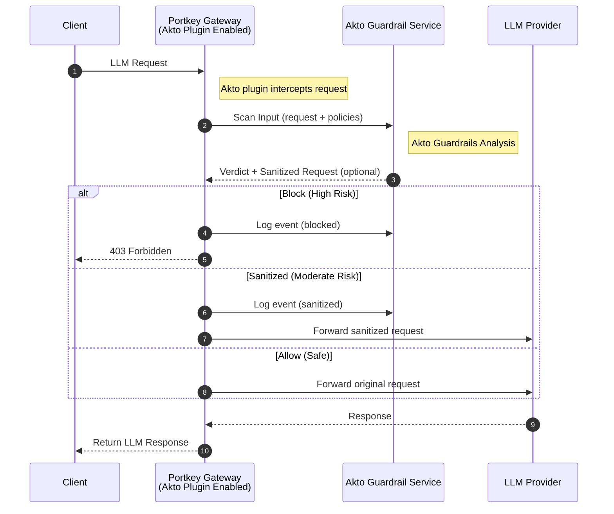

# Portkey

## Overview

Akto integrates with **Portkey AI Gateway** to provide comprehensive security guardrails for AI applications. This integration enables automatic threat detection and prevention at both the request and response stages of LLM interactions.

### What is Portkey?

Portkey is an AI gateway that routes requests to various LLM providers (OpenAI, Anthropic, etc.) and provides a unified interface for managing AI infrastructure. Learn more at [portkey.ai](https://portkey.ai).

### Key Benefits

* **Threat Detection**: Identify prompt injection, data leakage, and other LLM-specific attacks
* **Flexible Response Actions**: Block, sanitize, alert, or log suspicious activity
* **Transparent Integration**: Works seamlessly with existing Portkey configurations
* **Centralized Management**: Configure guardrails from Portkey's admin dashboard

## Architecture

The integration operates as a Portkey plugin that hooks into two critical lifecycle points:



## Setup Guide



### Prerequisites

Ensure the following requirements are available:

* Access to Portkey AI Gateway (v2.0.0 or later)
* Administrative access to Portkey settings
* Akto API key
* Akto API domain



### Configure Akto Credentials in Portkey

1. Log in to your Portkey dashboard
2. Navigate to **Admin Settings** → **Plugins**
3. Find the **Akto** plugin section
4. Enter the following credentials:
   * **Akto API Key**: Your Akto API key from the dashboard
   * **Akto API Domain**: Your Akto API endpoint domain (e.g., `api.akto.io`)
5. Click **Save** to activate the plugin.



### Obtain Guardrail IDs from Our Support

Guardrails are pre-configured and managed by the Akto team. To get the guardrail IDs for your specific threat detection needs:

1. Contact **Akto Support** at [support@akto.io](mailto:support@akto.io) or through your account manager,
2. Our team will provide you with:
   * **Input Guardrail IDs**: For request-level scanning
   * **Output Guardrail IDs**: For response-level scanning
   * Configuration details and any specific requirements



### Create a Portkey Configuration with Akto Guardrails

Define a reusable configuration that includes guardrails and model settings.

1. Navigate to **Portkey Configurations**
2. Create a new configuration
3. Add:
   * **Input guardrails**: List of Akto guardrail IDs
   * **Output guardrails**: List of Akto guardrail IDs
4. Configure:
   * Provider (for example: OpenAI)
   * Model (for example: gpt-4)
5. Save the configuration

Portkey generates a **config ID**.



### Use Config ID in API Requests

You now attach the Portkey configuration at the client level using the generated config ID.\
The config ID encapsulates Akto guardrails and model settings.



```js
const portkey = new Portkey({
    apiKey: "PORTKEY_API_KEY",
    config: "pc-***" // Supports a string config id or a config object
});
```



```python
portkey = Portkey(
    api_key="PORTKEY_API_KEY",
    config="pc-***" # Supports a string config id or a config object
)
```



```js
const openai = new OpenAI({
  apiKey: 'OPENAI_API_KEY',
  baseURL: PORTKEY_GATEWAY_URL,
  defaultHeaders: createHeaders({
    apiKey: "PORTKEY_API_KEY",
    config: "CONFIG_ID"
  })
});
```



```py
client = OpenAI(
    api_key="OPENAI_API_KEY", # defaults to os.environ.get("OPENAI_API_KEY")
    base_url=PORTKEY_GATEWAY_URL,
    default_headers=createHeaders(
        provider="openai",
        api_key="PORTKEY_API_KEY", # defaults to os.environ.get("PORTKEY_API_KEY")
        config="CONFIG_ID"
    )
)
```



```hurl
curl https://api.portkey.ai/v1/chat/completions \
  -H "Content-Type: application/json" \
  -H "Authorization: Bearer $OPENAI_API_KEY" \
  -H "x-portkey-api-key: $PORTKEY_API_KEY" \
  -H "x-portkey-config: $CONFIG_ID" \
  -d '{
    "model": "gpt-3.5-turbo",
    "messages": [{
        "role": "user",
        "content": "Hello!"
      }]
  }'
```





For more guidance, refer to the [Portkey Config](https://portkey.ai/docs/product/ai-gateway/configs).



You can now route all LLM traffic through Portkey with Akto guardrails enforced.

## Troubleshooting

#### Issue: Guardrails Not Applied

**Symptoms**: Requests passing without guardrail validation

**Solutions**:

1. Verify guardrail IDs in configuration match Portkey records
2. Check Akto credentials are correctly configured in Portkey
3. Confirm Akto plugin is enabled in Admin Settings
4. Check network connectivity to Akto service

#### Issue: Legitimate Requests Being Blocked

**Symptoms**: Valid requests returning 403 errors

**Solutions**:

1. Review blocked request details in logs
2. Adjust guardrail sensitivity settings
3. Temporarily switch BLOCK action to ALERT for analysis
4. Contact Akto support with examples

#### Issue: Performance Degradation

**Symptoms**: Increased latency in API requests

**Solutions**:

1. Reduce number of guardrails applied
2. Use caching for repeated queries
3. Monitor Akto service health
4. Consider separating critical vs. non-critical paths

#### Issue: Akto Service Unavailable

**Symptoms**: Errors about inability to reach Akto

**Solutions**:

1. Check network firewall rules allow Akto domain
2. Verify API key is valid and not expired
3. Check Akto service status page
4. Configure fallback policy (fail open/closed)

## Get Support for your Akto setup

There are multiple ways to request support from Akto. We are 24X7 available on the following:

1. In-app `intercom` support. Message us with your query on intercom in Akto dashboard and someone will reply.
2. Join our [discord channel](https://www.akto.io/community) for community support.
3. Contact [support@akto.io](mailto:support@akto.io) for email support.
4. Contact us [here](https://www.akto.io/contact-us).
