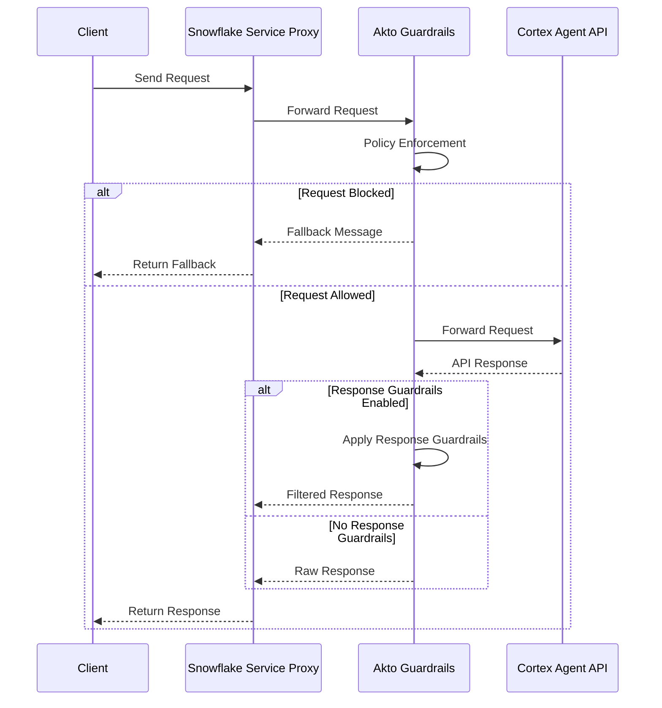

# Snowflake — Block Mode

## Overview

Deploy Akto Guardrails in Block Mode on Snowflake using Snowpark Container Services (SPCS).

In Block Mode, the Akto proxy intercepts traffic between your client and the Cortex Agent API. Each request and response is evaluated against your guardrail policies. Unsafe responses are blocked and replaced with a configurable fallback message.

## Architecture



## Setup



**Create Image Repository**

```sql
CREATE IMAGE REPOSITORY IF NOT EXISTS AKTO_INTEGRATION.AKTO_GUARDRAIL.AKTO_REPO;
SHOW IMAGE REPOSITORIES IN SCHEMA AKTO_INTEGRATION.AKTO_GUARDRAIL;
```



**Push Image**

Pull the Akto public image, tag it for your Snowflake registry, and push it.

```bash
docker pull --platform linux/amd64 888570865705.dkr.ecr.ap-south-1.amazonaws.com/akto-snowflake-proxy:latest
docker tag 888570865705.dkr.ecr.ap-south-1.amazonaws.com/akto-snowflake-proxy:latest <repository_url>/akto-snowflake-proxy:latest

snow spcs image-registry login
docker push <repository_url>/akto-snowflake-proxy:latest
```

Replace `<repository_url>` with the URL returned by `SHOW IMAGE REPOSITORIES` in the previous step.



**Store Secrets**

Store your Akto token and Snowflake PAT as Snowflake secrets. These are referenced securely in the service spec — never hardcode tokens directly.

```sql
CREATE SECRET IF NOT EXISTS AKTO_INTEGRATION.AKTO_GUARDRAIL.AKTO_TOKEN_SECRET
  TYPE = GENERIC_STRING
  SECRET_STRING = '<YOUR_AKTO_TOKEN>';

CREATE SECRET IF NOT EXISTS AKTO_INTEGRATION.AKTO_GUARDRAIL.SNOWFLAKE_PAT_SECRET
  TYPE = GENERIC_STRING
  SECRET_STRING = '<YOUR_SNOWFLAKE_PAT>';
```



**Create Compute Pool**

```sql
CREATE COMPUTE POOL IF NOT EXISTS AKTO_POOL
  MIN_NODES = 1
  MAX_NODES = 3
  INSTANCE_FAMILY = CPU_X64_S
  AUTO_SUSPEND_SECS = 3600
  AUTO_RESUME = TRUE;
```



**Configure Network Access**

Create an egress network rule that allows the service to reach Akto Guardrails and your Snowflake account, then attach it to an external access integration.

```sql
CREATE OR REPLACE NETWORK RULE AKTO_INTEGRATION.AKTO_GUARDRAIL.AKTO_RULE
  MODE = EGRESS
  TYPE = HOST_PORT
  VALUE_LIST = (
    '<AKTO_GUARDRAILS_HOST>:443',
    '<SNOWFLAKE_ACCOUNT>.snowflakecomputing.com:443'
  );

CREATE OR REPLACE EXTERNAL ACCESS INTEGRATION AKTO_EAI
  ALLOWED_NETWORK_RULES = (AKTO_INTEGRATION.AKTO_GUARDRAIL.AKTO_RULE)
  ENABLED = TRUE;
```



**Deploy Service (Block Mode)**

The service runs in Block Mode by default — unsafe requests are blocked before they reach the Cortex Agent API.


**Optional: Enable response guardrails**

Set `ENABLE_RESPONSE_GUARDRAILS: "true"` to also apply guardrails to the agent's response before it is returned to the client. When a response is blocked, the value set in `SAFE_RESPONSE_TEXT` is returned instead.

Leave this flag unset or set it to `"false"` if you only want request-side enforcement.


```sql
CREATE SERVICE IF NOT EXISTS AKTO_INTEGRATION.AKTO_GUARDRAIL.AKTO_GUARD_SERVICE
  IN COMPUTE POOL AKTO_POOL
  MIN_INSTANCES = 1
  MAX_INSTANCES = 2
  EXTERNAL_ACCESS_INTEGRATIONS = (AKTO_EAI)
  FROM SPECIFICATION $$
spec:
  containers:
    - name: proxy
      image: /akto_integration/akto_guardrail/akto_repo/akto-snowflake-proxy:<VERSION_TAG>
      env:
        AKTO_BASE_URL: "<AKTO_GUARDRAILS_URL>"
        AKTO_ACCOUNT_ID: "<AKTO_ACCOUNT_ID>"
        SNOWFLAKE_HOST: "<SNOWFLAKE_ACCOUNT>.snowflakecomputing.com"
        ENABLE_RESPONSE_GUARDRAILS: "true"
        SAFE_RESPONSE_TEXT: "Response blocked by policy"
      secrets:
        - snowflakeSecret:
            objectName: AKTO_INTEGRATION.AKTO_GUARDRAIL.AKTO_TOKEN_SECRET
          envVarName: AKTO_TOKEN
          secretKeyRef: secret_string
        - snowflakeSecret:
            objectName: AKTO_INTEGRATION.AKTO_GUARDRAIL.SNOWFLAKE_PAT_SECRET
          envVarName: SNOWFLAKE_PAT
          secretKeyRef: secret_string
      readinessProbe:
        port: 8080
        path: /healthcheck
      resources:
        requests:
          memory: 512Mi
          cpu: 0.5
        limits:
          memory: 1Gi
          cpu: 1

  endpoints:
    - name: api
      port: 8080
      public: true

  logExporters:
    eventTableConfig:
      logLevel: ERROR
$$;
```



**Verify the Service**

Confirm the service is running and retrieve its public endpoint URL.

```sql
SHOW SERVICES LIKE 'AKTO_GUARD_SERVICE' IN SCHEMA AKTO_INTEGRATION.AKTO_GUARDRAIL;
SHOW SERVICE CONTAINERS IN SERVICE AKTO_INTEGRATION.AKTO_GUARDRAIL.AKTO_GUARD_SERVICE;

-- Get public service URL
SHOW ENDPOINTS IN SERVICE AKTO_INTEGRATION.AKTO_GUARDRAIL.AKTO_GUARD_SERVICE;
```



**Generate a Programmatic Access Token (PAT)**

The proxy authenticates to the Snowflake API using a PAT. Complete the steps below and then update the secret created in Step 3.

```sql
-- Step 1: Create auth policy to bypass network policy requirement
CREATE AUTHENTICATION POLICY IF NOT EXISTS AKTO_INTEGRATION.AKTO_GUARDRAIL.AKTO_AUTH_POLICY
  PAT_POLICY=(NETWORK_POLICY_EVALUATION = ENFORCED_NOT_REQUIRED);

ALTER USER <YOUR_USERNAME> SET AUTHENTICATION POLICY AKTO_INTEGRATION.AKTO_GUARDRAIL.AKTO_AUTH_POLICY;

-- Step 2: Generate PAT (save the token — it will not be shown again)
ALTER USER <YOUR_USERNAME> ADD PROGRAMMATIC ACCESS TOKEN AKTO_PROXY_PAT
  ROLE_RESTRICTION = '<YOUR_ROLE>'
  DAYS_TO_EXPIRY = 90
  MINS_TO_BYPASS_NETWORK_POLICY_REQUIREMENT = 1440
  COMMENT = 'PAT for Akto proxy service';

-- Step 3: Store the PAT in the secret created earlier
ALTER SECRET AKTO_INTEGRATION.AKTO_GUARDRAIL.SNOWFLAKE_PAT_SECRET
  SET SECRET_STRING = '<YOUR_PAT_TOKEN>';
```


Save the token value immediately after generating it — Snowflake will not display it again.




**Send a Sample Request**

Use the public endpoint URL from Step 7 to send a request through the proxy.

```bash
# Generate a JWT token (or use SSO)
snow connection generate-jwt

curl -N -X POST "https://<SERVICE_PUBLIC_URL>/api/v2/databases/<DATABASE>/schemas/<SCHEMA>/agents/<AGENT_NAME>:run" \
  -H "Content-Type: application/json" \
  -H "Accept: text/event-stream" \
  -H "Authorization: Snowflake Token=\"<YOUR_TOKEN>\"" \
  -d '{"messages":[{"role":"user","content":[{"type":"text","text":"Your question here"}]}], "stream": true}'
```



## Block Mode Behavior

| Input | Outcome | Returned to Client |
|---|---|---|
| Safe request / safe response | Allowed | Original response |
| Unsafe request or response | Blocked | `SAFE_RESPONSE_TEXT` value |

## Checklist


Use this checklist to confirm the deployment is complete:

* [ ] Image pushed to Snowflake registry
* [ ] Secrets created for Akto token and Snowflake PAT
* [ ] Service status is **RUNNING**
* [ ] Guardrails enabled (`ENABLE_RESPONSE_GUARDRAILS: "true"`)
* [ ] Public endpoint responding to requests


## Complete Production Script

<details>

<summary>View complete production script</summary>

```sql
-- ============================================================
-- Akto Guardrail Proxy — Production Setup
-- ============================================================

-- Step 1: Create image repository
CREATE IMAGE REPOSITORY IF NOT EXISTS AKTO_INTEGRATION.AKTO_GUARDRAIL.AKTO_REPO;

-- Step 2: Push image to Snowflake registry
-- Run: SHOW IMAGE REPOSITORIES IN SCHEMA AKTO_INTEGRATION.AKTO_GUARDRAIL;
-- Then locally:
--   docker pull --platform linux/amd64 888570865705.dkr.ecr.ap-south-1.amazonaws.com/akto-snowflake-proxy:latest
--   docker tag 888570865705.dkr.ecr.ap-south-1.amazonaws.com/akto-snowflake-proxy:latest <repository_url>/akto-snowflake-proxy:latest
--   snow spcs image-registry login
--   docker push <repository_url>/akto-snowflake-proxy:latestin production

-- Step 3: Store secrets (do NOT hardcode tokens in the service spec)
CREATE SECRET IF NOT EXISTS AKTO_INTEGRATION.AKTO_GUARDRAIL.AKTO_TOKEN_SECRET
  TYPE = GENERIC_STRING
  SECRET_STRING = '<YOUR_AKTO_TOKEN>';

CREATE SECRET IF NOT EXISTS AKTO_INTEGRATION.AKTO_GUARDRAIL.SNOWFLAKE_PAT_SECRET
  TYPE = GENERIC_STRING
  SECRET_STRING = '<YOUR_SNOWFLAKE_PAT>';

-- Step 4: Create a dedicated service role (avoid using ACCOUNTADMIN)
-- The proxy calls agents via the Snowflake REST API using a PAT,
-- so this role only needs access to its own infra — NOT to agent databases.
-- CREATE ROLE IF NOT EXISTS AKTO_PROXY_ROLE;
-- GRANT USAGE ON DATABASE AKTO_INTEGRATION TO ROLE AKTO_PROXY_ROLE;
-- GRANT USAGE ON SCHEMA AKTO_INTEGRATION.AKTO_GUARDRAIL TO ROLE AKTO_PROXY_ROLE;
-- GRANT READ ON SECRET AKTO_INTEGRATION.AKTO_GUARDRAIL.AKTO_TOKEN_SECRET TO ROLE AKTO_PROXY_ROLE;
-- GRANT READ ON SECRET AKTO_INTEGRATION.AKTO_GUARDRAIL.SNOWFLAKE_PAT_SECRET TO ROLE AKTO_PROXY_ROLE;
-- GRANT USAGE ON COMPUTE POOL AKTO_POOL TO ROLE AKTO_PROXY_ROLE;
-- GRANT USAGE ON EXTERNAL ACCESS INTEGRATION AKTO_EAI TO ROLE AKTO_PROXY_ROLE;
-- GRANT BIND SERVICE ENDPOINT ON ACCOUNT TO ROLE AKTO_PROXY_ROLE;

-- Step 5: Create compute pool with auto-suspend
CREATE COMPUTE POOL IF NOT EXISTS AKTO_POOL
  MIN_NODES = 1
  MAX_NODES = 3
  INSTANCE_FAMILY = CPU_X64_S
  AUTO_SUSPEND_SECS = 3600
  AUTO_RESUME = TRUE;

-- Step 6: Network rule and external access
CREATE OR REPLACE NETWORK RULE AKTO_INTEGRATION.AKTO_GUARDRAIL.AKTO_RULE
  MODE = EGRESS
  TYPE = HOST_PORT
  VALUE_LIST = (
    '<AKTO_GUARDRAILS_HOST>:443',
    '<SNOWFLAKE_ACCOUNT>.snowflakecomputing.com:443'
  );

CREATE OR REPLACE EXTERNAL ACCESS INTEGRATION AKTO_EAI
  ALLOWED_NETWORK_RULES = (AKTO_INTEGRATION.AKTO_GUARDRAIL.AKTO_RULE)
  ENABLED = TRUE;

-- Step 7: Create service with secrets, resource limits, and readiness probe
CREATE SERVICE IF NOT EXISTS AKTO_INTEGRATION.AKTO_GUARDRAIL.AKTO_GUARD_SERVICE
  IN COMPUTE POOL AKTO_POOL
  MIN_INSTANCES = 1
  MAX_INSTANCES = 2
  EXTERNAL_ACCESS_INTEGRATIONS = (AKTO_EAI)
  FROM SPECIFICATION $$
spec:
  containers:
    - name: proxy
      image: /akto_integration/akto_guardrail/akto_repo/akto-snowflake-proxy:<VERSION_TAG>
      env:
        AKTO_BASE_URL: "<AKTO_GUARDRAILS_HOST>"
        AKTO_ACCOUNT_ID: "<AKTO_ACCOUNT_ID>"
        SNOWFLAKE_HOST: "<SNOWFLAKE_ACCOUNT>.snowflakecomputing.com"
        ENABLE_RESPONSE_GUARDRAILS: "true"
        SAFE_RESPONSE_TEXT: "Response blocked by policy"
      secrets:
        - snowflakeSecret:
            objectName: AKTO_INTEGRATION.AKTO_GUARDRAIL.AKTO_TOKEN_SECRET
          envVarName: AKTO_TOKEN
          secretKeyRef: secret_string
        - snowflakeSecret:
            objectName: AKTO_INTEGRATION.AKTO_GUARDRAIL.SNOWFLAKE_PAT_SECRET
          envVarName: SNOWFLAKE_PAT
          secretKeyRef: secret_string
      readinessProbe:
        port: 8080
        path: /healthcheck
      resources:
        requests:
          memory: 512Mi
          cpu: 0.5
        limits:
          memory: 1Gi
          cpu: 1

  endpoints:
    - name: api
      port: 8080
      public: true

  logExporters:
    eventTableConfig:
      logLevel: ERROR
$$;

-- Step 8: Verify
SHOW SERVICES LIKE 'AKTO_GUARD_SERVICE' IN SCHEMA AKTO_INTEGRATION.AKTO_GUARDRAIL;
SHOW SERVICE CONTAINERS IN SERVICE AKTO_INTEGRATION.AKTO_GUARDRAIL.AKTO_GUARD_SERVICE;

-- Get public service URL
SHOW ENDPOINTS IN SERVICE AKTO_INTEGRATION.AKTO_GUARDRAIL.AKTO_GUARD_SERVICE;

-- ============================================================
-- Generate a Programmatic Access Token (PAT)
-- ============================================================
-- Step 1: Create auth policy to bypass network policy requirement
-- CREATE AUTHENTICATION POLICY IF NOT EXISTS AKTO_INTEGRATION.AKTO_GUARDRAIL.AKTO_AUTH_POLICY
--   PAT_POLICY=(NETWORK_POLICY_EVALUATION = ENFORCED_NOT_REQUIRED);
-- ALTER USER <YOUR_USERNAME> SET AUTHENTICATION POLICY AKTO_INTEGRATION.AKTO_GUARDRAIL.AKTO_AUTH_POLICY;
--
-- Step 2: Generate PAT (save the token_secret — it won't be shown again)
-- ALTER USER <YOUR_USERNAME> ADD PROGRAMMATIC ACCESS TOKEN AKTO_PROXY_PAT
--   ROLE_RESTRICTION = '<YOUR_ROLE>'
--   DAYS_TO_EXPIRY = 90
--   MINS_TO_BYPASS_NETWORK_POLICY_REQUIREMENT = 1440
--   COMMENT = 'PAT for Akto proxy service';
--
-- Step 3: Store PAT as a secret (update the secret created in Step 3 above)
-- ALTER SECRET AKTO_INTEGRATION.AKTO_GUARDRAIL.SNOWFLAKE_PAT_SECRET SET SECRET_STRING = '<YOUR_PAT_TOKEN>';

-- ============================================================
-- Sample request
-- ============================================================
-- curl -N -X POST "https://<SERVICE_PUBLIC_URL>/api/v2/databases/<DATABASE>/schemas/<SCHEMA>/agents/<AGENT_NAME>:run" \
--   -H "Content-Type: application/json" \
--   -H "Accept: text/event-stream" \
--   -H "Authorization: Snowflake Token=\"<YOUR_TOKEN>\"" \
--   -d '{"messages":[{"role":"user","content":[{"type":"text","text":"Your question here"}]}], "stream": true}'
```

</details>

## Get Support

If you need assistance with the Snowflake Block Mode setup:

* **In-app Chat**: Use the chat widget in your Akto dashboard for instant support
* **Discord Community**: Join our community at [discord.gg/Wpc6xVME4s](https://discord.gg/Wpc6xVME4s)
* **Contact Form**: Submit a support request at [https://www.akto.io/contact-us](https://www.akto.io/contact-us)

Our team is available 24/7 to help with setup, troubleshooting, and best practices.
