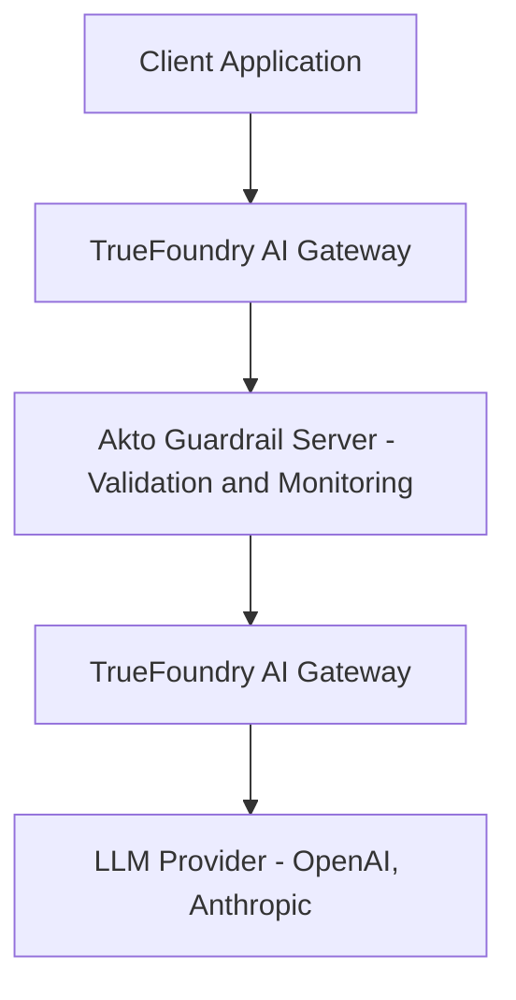

# Truefoundry

## Overview

TrueFoundry is a comprehensive ML platform that helps you deploy and manage LLM-powered applications at scale. The **TrueFoundry AI Gateway** routes all LLM traffic through a centralized gateway, enabling security, monitoring, and cost management.

Akto integrates with TrueFoundry AI Gateway as a **custom guardrail server**, providing real-time security validation and comprehensive traffic monitoring for all your LLM interactions. Once configured, TrueFoundry AI Gateway automatically sends requests to Akto for security analysis.

The Akto TrueFoundry integration automatically:

* **Validates Input Requests**: Checks user prompts against security policies before they reach your LLM (input guardrails)
* **Blocks Malicious Requests**: Prevents prompt injection, jailbreaks, and policy violations in real-time
* **Monitors LLM Responses**: Analyzes model outputs for sensitive data leakage and policy violations (output guardrails)
* **Ingests Traffic**: Captures all LLM interactions for security analysis and compliance
* **Provides Visibility**: Centralizes monitoring of all TrueFoundry AI Gateway traffic in a unified dashboard

## How It Works

Akto acts as an **external guardrail plugin** for TrueFoundry AI Gateway:

### Architecture Flow



## How Guardrails Work

### Input Guardrails (Pre-Request Validation)

When you configure input guardrails with **Target: Request**:

* User request is sent to Akto for validation **before** reaching the LLM
* If request **passes** validation: TrueFoundry forwards it to the LLM (user receives LLM response)
* If request **fails** validation: TrueFoundry blocks the request and returns an error to the user (LLM is never called)
* All blocked requests appear in your Akto dashboard for monitoring

### Output Guardrails (Post-Response Monitoring)

When you configure output guardrails with **Target: Response**:

* Request and response are sent to Akto after the LLM has responded
* User receives the LLM response immediately (no blocking)
* All such interactions appear in your Akto dashboard for security analysis and compliance monitoring
* You can review violations, sensitive data exposure, and policy compliance

### Streaming Mode

If your application streams LLM responses (token-by-token), append `?streaming=true` to the Akto TrueFoundry endpoint URL in your guardrail configuration:

```
https://<your-akto-host>:<port>/api/http-proxy/truefoundry?streaming=true
```

In streaming mode, Akto captures each turn of the conversation as it progresses and ingests it for monitoring and compliance. Input guardrail validation still runs on every new user message.

## Prerequisites

Before integrating Akto with TrueFoundry AI Gateway, ensure you have:

* **TrueFoundry AI Gateway**: Active TrueFoundry AI Gateway instance (v1.0+)
* **Admin Access**: Permissions to configure routing and model settings in the TrueFoundry dashboard
* **Akto Traffic Processor**: Configured [Traffic Processor](../others/hybrid-saas.md) to receive and analyse LLM traffic
* **Akto Data Ingestion Service**: Running Akto instance with accessible proxy endpoint as:\
  `https://<your-akto-host>:<port>/api/http-proxy/truefoundry`
* **Network Access**: TrueFoundry AI Gateway can reach the Akto Data Ingestion Service endpoint
* **HTTPS Recommended**: Secure communication between TrueFoundry and Akto helps protect data in transit


Ensure the Akto Data Ingestion Service is reachable from your TrueFoundry AI Gateway instance. Test connectivity before proceeding.


## Integration Steps

You can integrate Akto with TrueFoundry in two ways:

* **Option 1:** [Use Akto as an External Provider](truefoundry.md#option-1-use-akto-as-an-external-provider-recommended) (recommended)
* **Option 2:** [Use a Custom Guardrail Group ](truefoundry.md#option-2-use-a-custom-guardrail-group)(manual setup)

### **Option 1: Use Akto as an External Provider (recommended)**

Use this for a simpler and faster setup:



#### Go to External Providers

* Open **AI Gateway**
* Navigate to **External Providers / Guardrails**
* Choose **Akto** from the provider list



#### Configure Akto

Fill in the required fields:

* **Name**
  * Provide a unique identifier for this integration
* **Description (optional)**
  * Add context (e.g., LLM security, prompt injection detection)
* **Akto Token Auth**
  * Enter your **Akto JWT token**
* **Operation**
  * Set to `Validate`
  * _(Akto supports validation-only guardrails)_
* **Enforcing Strategy**
  * Choose one:
    * `Enforce` → block on failure
    * `Enforce but ignore on error` → fail-open on errors
    * `Audit` → log only, no blocking
* **Base URL**
  * Enter your Akto guardrail service url.&#x20;
  * Contact the **Akto Support Team** to get this URL.
  *   Example:

      ```
      https://<your-akto-instance>-guardrails.akto.io
      ```



#### Save the Provider

* Click **Save**
* Akto is now available as a selectable guardrail provider



#### Attach to Your Gateway Flow

* Select Akto while configuring:
  * Model routes, or
  * Guardrail rules (input/output)



#### Validate

* Send test requests through the gateway
* Confirm Akto is enforcing policies&#x20;



### **Option 2: Use a Custom Guardrail Group**



**Navigate to TrueFoundry AI Gateway Dashboard**

1. Log in to your TrueFoundry account
2. Navigate to **AI Gateway** in the sidebar
3. Click on **Guardrails** tab
4. Click **Add New Guardrails Group**



**Configure Guardrails Group**

Fill in the guardrails form for input/output validation:

**Basic Settings:**

* **Name**: `akto-guardrails` (or your preferred name)
* **Access Control**: Add users/teams who should have access
* **Guardrails**: This is where you configure the custom guardrails. Click on **Add Guardrail** and select **Custom** under **External Providers**.

**Adding a Guardrail:**

1. **Name**: `akto-input-guardrail` (or your choice)
2. **Description (Optional)**: `Add a description for this guardrail`
3. **Operation**: Select **Validate**
4. **Enforcing Strategy**: Choose **Enforce**, this will block requests that fail validation
5. **Target**: Request (for input guardrails) or Response (for output guardrails)
6. **Config**:
   * **URL**: Enter your Akto Data Ingestion Service URL (e.g., `https://<your-akto-host>:<port>/api/http-proxy/truefoundry`)


**Important**: You must add **both** input and output guardrails for complete security coverage:

* **Input Guardrail** (Target: Request) - Validates and blocks malicious requests before reaching the LLM
* **Output Guardrail** (Target: Response) - Monitors responses and ingests all interactions for compliance

To add both, click on **Add Guardrail** twice and configure each with the appropriate **Target** setting.


Finally, save the Guardrails Group by clicking on **Add Guardrails Group**.



**Add Guardrails to model:** You can add the saved guardrails to the model in one of the two ways:

1. **In the Playground**: When testing your model in the TrueFoundry Playground, you can add guardrails by clicking on the plus icon next to Input/Output Guardrails in the left panel, and adding the desired guardrails from the list.


Guardrails are only applied in the Playground and not in production traffic. You will also need to add the guardrails for every new session in the Playground.


2. **At the Controls Page**
   1. Navigate to the **Controls** tab in the TrueFoundry AI Gateway dashboard
   2. Click on Guardrails
   3. Click on **Add Rule**
   4. Fill in the form:
      * **Rule ID**: `akto-guardrail` (or your preferred name)
      * **When Request Goes To**: Select the model(s) you want to apply the guardrail to (e.g., `gpt-4`, `claude-2`, etc.)
      * **From Subjects**: Select the users/teams you want to include/exclude from the guardrail
      * **Apply on Hooks**: Select the specific LLM Hook (input/output) and choose the corresponding guardrail that you created.
   5. Click on **Submit** to save the rule.



## What happens when Akto blocks a request

When Akto blocks a request, TrueFoundry AI Gateway will:

1. **Not forward** the request to the LLM provider
2. Return an error response to the client
3. Log the blocked request for audit purposes

You can review these events in the [guardrail-activity.md](../../../agentic-guardrails/concepts/guardrail-activity.md "mention") page in Ako Argus Dashboard.

## Get Support

For assistance with your TrueFoundry integration:

1. **In-app Support**: Message us via Intercom in the Akto dashboard
2. **Community**: Join our [Discord channel](https://www.akto.io/community)
3. **Email**: Contact [support@akto.io](mailto:support@akto.io)
4. **Website**: Visit our [contact page](https://www.akto.io/contact-us)
