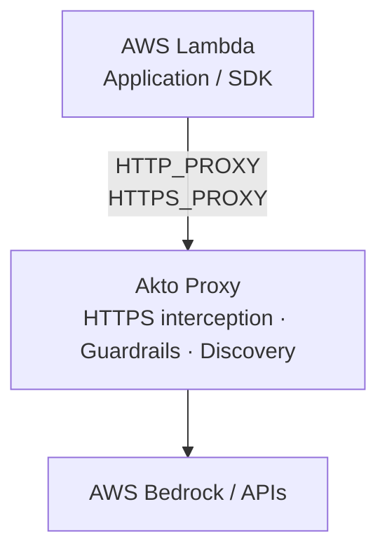
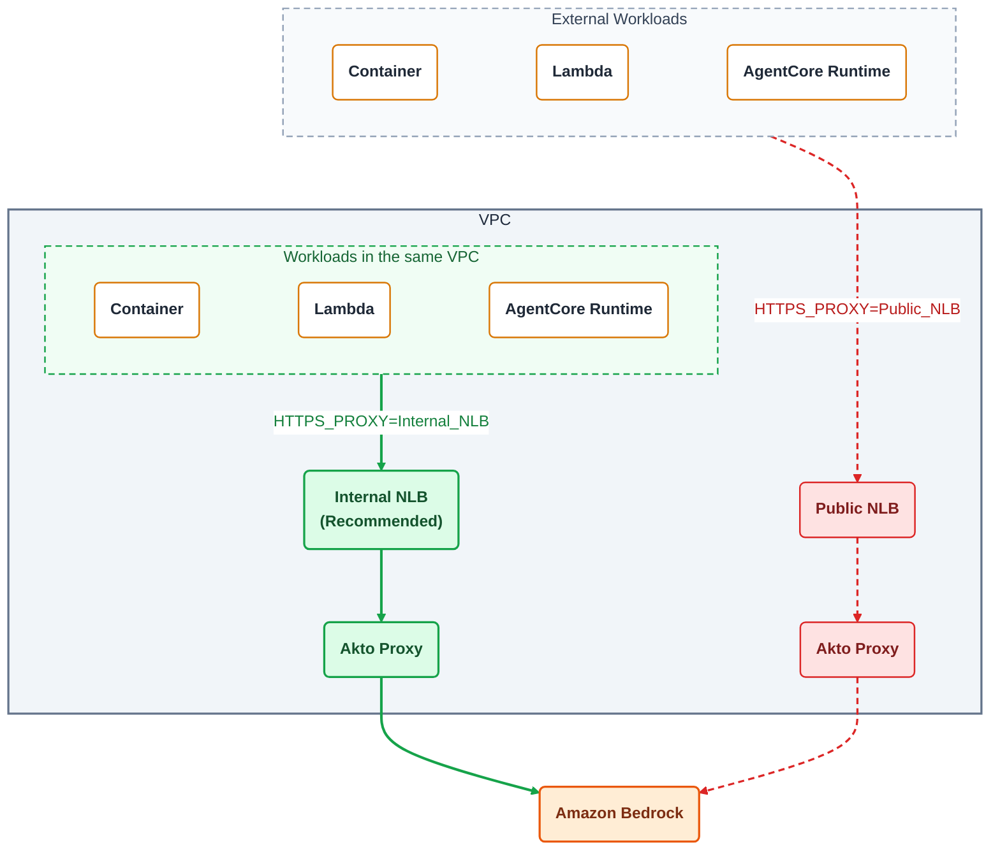

# Integrate AWS Lambda using Egress Proxy

AWS Lambda functions that make outgoing calls to services such as Amazon Bedrock can be connected to Akto for **traffic interception, guardrails, and agentic discovery**.

The Lambda function routes its outgoing HTTP/HTTPS traffic through the Akto proxy and trusts the Akto MITM CA certificate using a Lambda Layer.

## Configuration

### 1. Configure the Akto proxy

Set the following environment variables in the Lambda function:

```text
HTTPS_PROXY=http://<AKTO_PROXY_HOST>:<PORT>
HTTP_PROXY=http://<AKTO_PROXY_HOST>:<PORT>
```

These variables route the Lambda's outgoing HTTP/HTTPS requests through the Akto proxy.

### 2. Add the Akto CA certificate using a Lambda Layer

The Akto/MITM CA certificate can be provided through a **Lambda Layer**, so the certificate does not need to be included directly in the Lambda function's deployment package.

Create a Lambda Layer containing:

```text
mitm-ca-layer.zip
└── certs/
    └── mitmproxy-ca-cert.pem
```

Lambda mounts the contents of the layer under `/opt`. The certificate will therefore be available at:

```text
/opt/certs/mitmproxy-ca-cert.pem
```

Attach this Layer to the Lambda function.

### 3. Configure the certificate environment variables

Set the following environment variables:

```text
AWS_CA_BUNDLE=/opt/certs/mitmproxy-ca-cert.pem
SSL_CERT_FILE=/opt/certs/mitmproxy-ca-cert.pem
```

`AWS_CA_BUNDLE` allows AWS SDK clients such as boto3 to trust the Akto proxy certificate.

`SSL_CERT_FILE` configures Python SSL-based clients to use the same CA certificate.

## Required Environment Variables

The Lambda function requires these four environment variables:

```text
HTTPS_PROXY=http://<AKTO_PROXY_HOST>:<PORT>
HTTP_PROXY=http://<AKTO_PROXY_HOST>:<PORT>
AWS_CA_BUNDLE=/opt/certs/mitmproxy-ca-cert.pem
SSL_CERT_FILE=/opt/certs/mitmproxy-ca-cert.pem
```

The first two configure the proxy, while the last two configure trust for the MITM CA certificate provided through the Lambda Layer.

## Traffic Flow

Once configured, the traffic flow is:



Akto can inspect the intercepted traffic and apply configured **guardrails**, including allowing, blocking, or alerting on requests.

The intercepted traffic can also be used for **agentic discovery**, allowing Akto to discover services, APIs, and agent interactions originating from the Lambda function.

## Deployment Options

The Akto proxy is typically placed behind a Network Load Balancer (NLB), and `HTTPS_PROXY` / `HTTP_PROXY` point to the NLB's DNS name. The same setup works for other AWS workloads that make outbound calls, such as Bedrock AgentCore Runtime and containers (ECS/EKS).

There are two ways to expose the proxy:



| Option | Proxy endpoint | When to use |
| --- | --- | --- |
| **Same VPC + Internal NLB** (recommended) | `http://<INTERNAL_NLB_DNS>:<PORT>` | The Lambda is VPC-attached (or can be) and runs in the same VPC as the Akto proxy, or in a peered / Transit Gateway-connected VPC. |
| **Public NLB** | `http://<PUBLIC_NLB_DNS>:<PORT>` | The Lambda is not attached to a VPC and cannot reach a private endpoint. |

> **Recommendation:** Deploy the Akto proxy in the **same VPC** as your Lambda functions and expose it through an **internal NLB**, rather than a public-facing load balancer.
>
> * Traffic, including prompts, responses, and AWS request signatures, stays on the private network and is never exposed to the internet.
> * The proxy is not reachable from the internet, which reduces the attack surface and removes the need to lock down a public listener.
> * Latency is lower because traffic does not leave the VPC to reach the proxy.
> * Access can be restricted with security groups to only the Lambda functions' security groups.
>
> If you must use a public NLB, restrict inbound access to known source IP ranges (for example, the Elastic IPs of your NAT gateways) using security groups on the NLB.

To route a Lambda through an internal NLB, attach the Lambda to the VPC (subnets and security group), and allow outbound traffic from the Lambda's security group to the NLB on the proxy port.

## Verification

After configuring the Lambda:

1. Attach the CA certificate Lambda Layer.
2. Verify that the certificate exists at:

   ```text
   /opt/certs/mitmproxy-ca-cert.pem
   ```
3. Verify all four environment variables are configured.
4. Invoke the Lambda and make a Bedrock or other outbound API call.
5. Verify that the request reaches the Akto proxy.
6. Verify that Akto evaluates the request against the configured guardrails.
7. Verify that the traffic appears in Akto Agentic Discovery.

If HTTPS requests fail with certificate errors, verify that the Lambda Layer is attached and that both certificate environment variables point to:

```text
/opt/certs/mitmproxy-ca-cert.pem
```

> **Note:** The proxy endpoint must support HTTPS `CONNECT` tunneling. A webhook endpoint such as Webhook.site cannot be used directly as `HTTP_PROXY` or `HTTPS_PROXY`.
