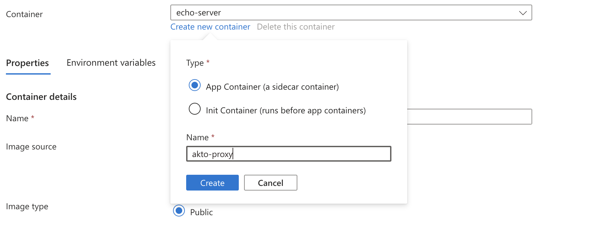
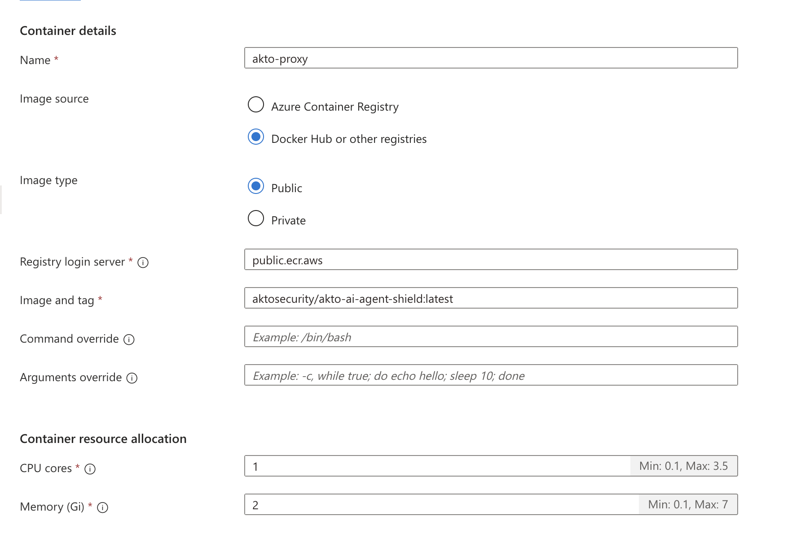
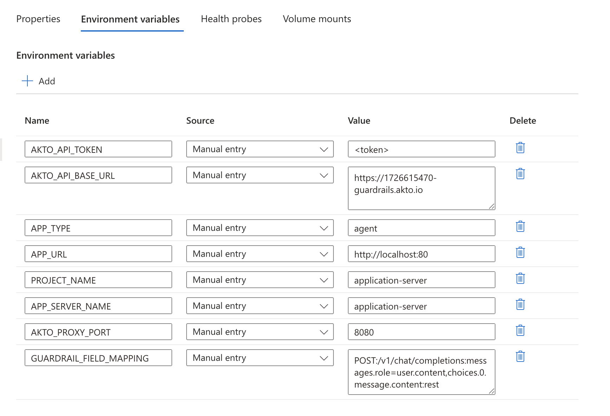
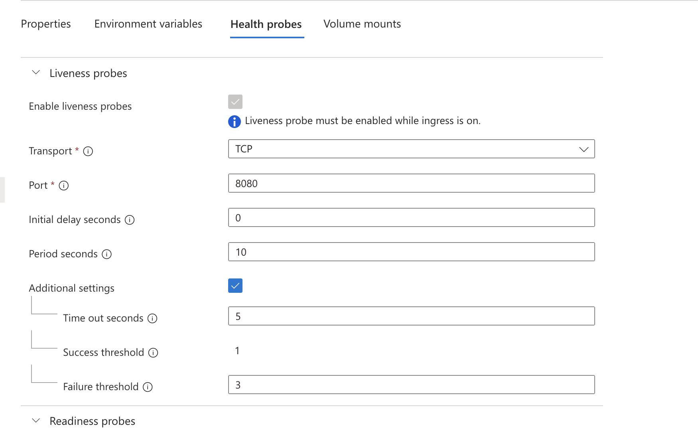
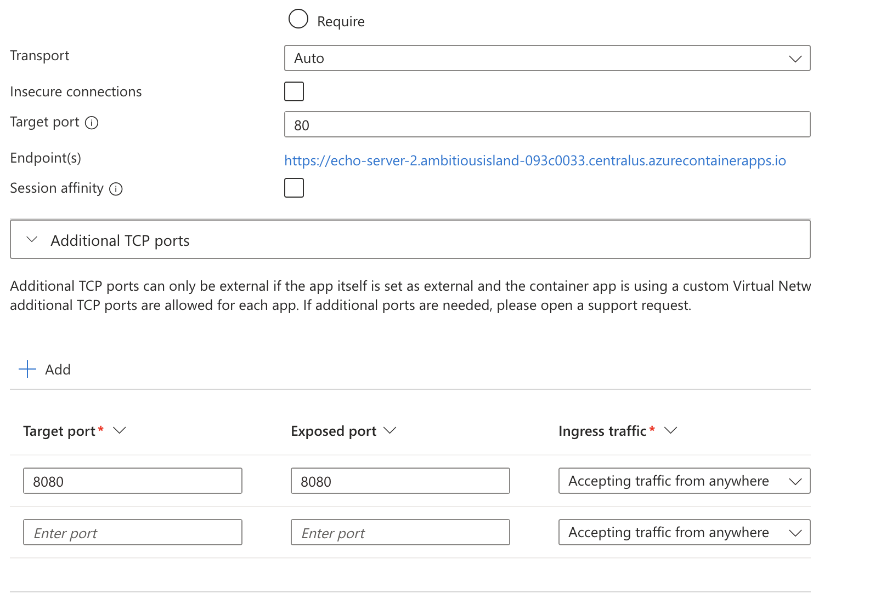

# Connect Akto with Azure Container App

<figure><figcaption></figcaption></figure>

1. Go to the container app for which we need to deploy Akto proxy. Go to containers left navigation, click on `Create new container` , name it `akto-proxy` and click Create.

<figure><figcaption></figcaption></figure>

2. We'll now configure it. Add the image as `aktosecurity/akto-ai-agent-shield:latest` , registry as `public.ecr.aws` . Allocate minimum 1 CPU core and 2 GB memory to the container.

<figure><figcaption></figcaption></figure>

3. Go to environment variables tab. We'll add the following environment variables.

```bash
AKTO_API_TOKEN: <token> # Database abstractor token, available on Akto dashboard. For documentation on this, refer to **Connectors → Setup Guardrails**
AKTO_API_BASE_URL: https://demo-guardrails.akto.io # guardrails URL provided by Akto. This should be accessible from inside this container.
APP_URL: "http://localhost:80" # url on which application is accessible. Since both the containers share the same network, this URL is "http://localhost:<port-of-application>"
PROJECT_NAME: "application-server" # used to uniquely identify this agent
APP_SERVER_NAME: "application-server" # used to filter guardrails for this agent
APP_TYPE: "agent"
AKTO_PROXY_PORT: "8080" # port on which we want the proxy to run
GUARDRAIL_FIELD_MAPPING: "POST:/v1/chat/completions:messages.role=user.content,choices.0.message.content:rest" # the URL and payload attribute on which guardrails will be working. this is of the format <method>.<url>.<request-payload-attribute>.<response-payload-attribute>.<request-type>
```

<figure><figcaption></figcaption></figure>

4. Go to the health probes tab and configure all the probes for the same port as mentioned in `AKTO_PROXY_PORT`. Post this, click on `Save as new revision`.

<figure><figcaption></figcaption></figure>

5. This starts the akto proxy container on `AKTO_PROXY_PORT` and traffic from `APP_URL` should be routed through it. To make it accessible, we'll enable ingress on this. Go to ingress left navigation and add additional TCP ports for the exposed port `AKTO_PROXY_PORT`.

<figure><figcaption></figcaption></figure>

Note:

- Additional TCP ports can only be external if the app itself is set as external and the container app is using a custom Virtual Network. At most 5 additional TCP ports are allowed for each app. So, the additional port added in step 5, can be only accessed from container apps environment, in case of the above network setup. This should not be a problem if your upstream services are internal as well.
- If your upstream services are external, and we're not able to create external additional TCP port, then we recommend setting `AKTO_PROXY_PORT` env as your ingress port, and changing the primary application port to any different port, which we can then configure in `APP_URL` env.


## Get Support

There are multiple ways to request support from Akto. We are 24X7 available on the following:

1. In-app `intercom` support. Message us with your query on intercom in Akto dashboard and someone will reply.
2. Join our [discord channel](https://www.akto.io/community) for community support.
3. Contact `help@akto.io` for email support.
4. Contact us [here](https://www.akto.io/contact-us).