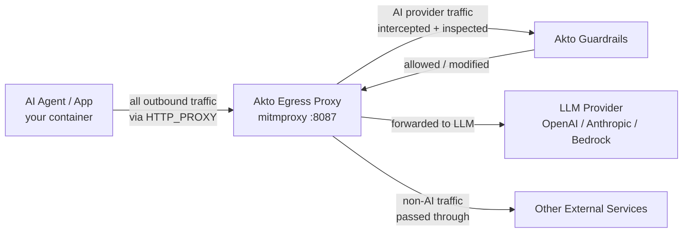

# Sidecar Egress Proxy

## Overview

Akto Egress Proxy is a transparent mitmproxy-based security layer that intercepts and governs outbound AI API calls made by your agents or applications to LLM providers (OpenAI, Anthropic, Amazon Bedrock). It applies request and response guardrails on every AI API call — without requiring any changes to your agent code.

## Key Features

* **Outbound LLM Guardrails**: Inspect and enforce policies on every prompt your agent sends to OpenAI, Anthropic, or Bedrock before it reaches the provider
* **Response Guardrails**: Scan and filter LLM responses for PII, sensitive data, or policy violations before your agent consumes them
* **Request Modification**: Automatically rewrite prompts flagged for modification (e.g., strip PII, enforce system prompt constraints)
* **Selective Interception**: Only intercepts traffic to known AI providers — all other traffic passes through untouched
* **Zero Code Changes**: Routes through standard `HTTP_PROXY` / `HTTPS_PROXY` env vars; your agent code is unchanged
* **Open Source**: The proxy script and Docker setup are fully open source at [akto-api-security/akto-ai-egress](https://github.com/akto-api-security/akto-ai-egress)

## Architecture



### Traffic Flow

1. Your agent makes an LLM API call (e.g., `POST https://api.anthropic.com/v1/messages`)
2. The call is transparently routed through the Egress Proxy via `HTTP_PROXY` / `HTTPS_PROXY`
3. The proxy intercepts the request and sends the message payload to Akto's guardrails endpoint
4. Akto evaluates the prompt against configured guardrails:
   * **Blocked**: Proxy returns a `403` error immediately; the LLM is never called
   * **Modified**: Proxy rewrites the request body before forwarding
   * **Allowed**: Request is forwarded to the LLM provider unchanged
5. The LLM response is intercepted and evaluated by Akto's response guardrails
6. The response is returned to the agent (original, blocked, or rewritten)

## Deployment


**Prerequisites**

* Docker and Docker Compose installed
* An Akto instance (self-hosted or cloud) with your `AKTO_URL`
* Your AI agent or application running as a Docker container




### Clone the repository

```bash
git clone https://github.com/akto-api-security/akto-ai-egress.git
cd akto-ai-egress
```



### Set environment variables

```bash
export AKTO_URL=https://akto.example.com   # your Akto instance base URL
export APP_NAME=my-ai-agent                # identifies your app in Akto guardrails
export ANTHROPIC_API_KEY=sk-ant-...        # (only needed for the bundled example agent)
```

| Variable   | Required | Description                                                                                                 |
| ---------- | -------- | ----------------------------------------------------------------------------------------------------------- |
| `AKTO_URL` | Yes      | Base URL of your Akto instance (e.g. `https://akto.example.com`). The proxy appends `/api/http-proxy`.      |
| `APP_NAME` | Yes      | Name of your application. Sent as the `host` header to Akto so traffic is grouped per app in the dashboard. |



### Start the proxy

```bash
docker compose up --build
```

The included `docker-compose.yml` starts two containers:

| Container           | Role                                                               |
| ------------------- | ------------------------------------------------------------------ |
| `akto-egress-proxy` | mitmproxy on port `8087`, runs `akto_guardrails.py` addon          |
| `anthropic-agent`   | Example Anthropic agent, pre-configured to route through the proxy |

On first run, mitmproxy auto-generates its CA certificate inside the `mitmproxy-data/` volume. The example agent container already mounts and trusts this cert.



### Connect your own agent

To route your existing agent through the proxy instead of the bundled example, add it to `docker-compose.yml` with the proxy env vars and the CA cert mount:

```yaml
services:
  your-agent:
    image: your-ai-agent:latest
    depends_on:
      - akto-egress-proxy
    environment:
      HTTP_PROXY: http://akto-egress-proxy:8087
      HTTPS_PROXY: http://akto-egress-proxy:8087
    volumes:
      - ./mitmproxy-data/mitmproxy-ca-cert.pem:/usr/local/share/ca-certificates/mitmproxy-ca-cert.crt:ro

  akto-egress-proxy:
    image: akto-egress-proxy
    build:
      context: ./akto-egress-proxy
    command:
      - mitmdump
      - --listen-host
      - 0.0.0.0
      - --listen-port
      - "8087"
      - --ignore-hosts
      - "^(?!.*((^|\\.)anthropic\\.com$|(^|\\.)openai\\.com$|(^|\\.)chatgpt\\.com$|(^|\\.)amazonaws\\.com$)).*$"
      - -s
      - /addons/akto_guardrails.py
    environment:
      AKTO_URL: ${AKTO_URL}
      APP_NAME: ${APP_NAME:-}
    volumes:
      - ./mitmproxy-data:/home/mitmproxy/.mitmproxy
      - ./akto-egress-proxy:/addons:ro
```


**CA Certificate** The `mitmproxy-data/mitmproxy-ca-cert.pem` file is created automatically on first run (Step 3). Mount it into your agent container as a trusted CA so HTTPS interception works without certificate errors.




### Verify

Confirm the proxy is intercepting traffic by checking its logs:

```bash
docker logs -f akto-egress-proxy
```

You should see `[AKTO] URL: <your-akto-url>/api/http-proxy` on startup, and `evaluating request` / `evaluating response` log lines when your agent makes LLM calls.



## Supported AI Providers

The proxy selectively intercepts traffic only to these hosts; all other traffic passes through unmodified:

* `api.openai.com`
* `api.anthropic.com`
* `chatgpt.com`
* `*.amazonaws.com` (Amazon Bedrock)

You can extend this list by editing the `--ignore-hosts` regex in the `docker-compose.yml` to include additional AI provider hostnames.


**All outbound traffic is routed through the proxy container**

Because `HTTP_PROXY` / `HTTPS_PROXY` are set on the agent container, every outbound request — not just AI API calls — is sent through the mitmproxy process as a network hop. Mitmproxy only performs SSL interception and guardrail evaluation on the AI provider hosts listed above; all other traffic is tunnelled through without inspection.


## How Guardrails Work

See [Guardrail Schema](concepts/guardrail-schema.md) for the full data model and [Agent Guard](concepts/agent-guard.md) for how guardrails are evaluated against agentic traffic.

The proxy evaluates both the outbound request (prompt sent to the LLM) and the inbound response (LLM output) against Akto's guardrails. For each, Akto returns one of three decisions:

| Akto Decision                          | Proxy Behaviour                                                                                                                           |
| -------------------------------------- | ----------------------------------------------------------------------------------------------------------------------------------------- |
| `Allowed: true`                        | Request or response forwarded unchanged                                                                                                   |
| `Modified: true`                       | Payload replaced with `ModifiedPayload` before forwarding                                                                                 |
| `Allowed: false` or `behaviour: block` | Returns `403` with `{"error": "<reason>"}` and header `X-Akto-Guardrails-Decision: blocked`; the LLM is never called on a blocked request |

## Guardrail Configuration

All guardrail policies are configured in the Akto dashboard — no proxy restart is required when policies change.

* [Create guardrail policies](how-to/create-guardrail-policies.md) — set up rules for prompt injection detection, PII filtering, disallowed topics, and response redaction
* [Manage guardrail policies](how-to/manage-guardrail-policies.md) — edit, clone, or delete existing policies
* [Enable or disable guardrails](how-to/enable-or-disable-guardrails.md) — toggle guardrails per policy without deleting them

Policies are scoped per app using the `APP_NAME` identifier set in your environment variables.

## Monitoring

All intercepted traffic is ingested into Akto (`ingest_data=true`) and visible in the dashboard under your `APP_NAME`:

* [Guardrail Activity](concepts/guardrail-activity.md) — view all guardrail events, decisions, and flagged payloads
* [Guardrail Activity — Detailed View](how-to/guardrail-activity-detailed-view.md) — inspect individual blocked or modified requests
* [Threat Dashboard](concepts/threat-dashboard.md) — monitor threat actors, IPs, and anomalous LLM usage patterns

## Get Support

There are multiple ways to request support from Akto. We are 24X7 available on the following:

1. In-app `intercom` support. Message us with your query on intercom in Akto dashboard and someone will reply.
2. Join our [discord channel](https://www.akto.io/community) for community support.
3. Contact `help@akto.io` for email support.
4. Contact us [here](https://www.akto.io/contact-us).
