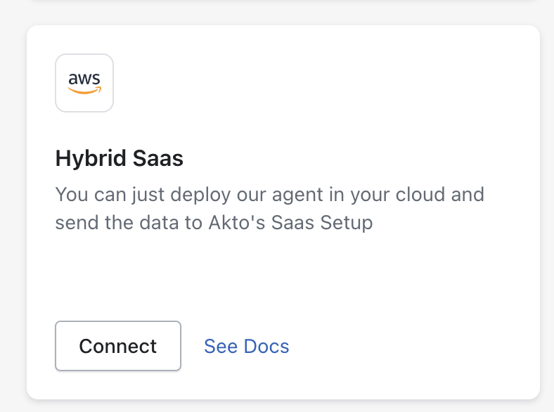

# Connect Akto with AWS Lambda

AWS Lambda is Amazon’s serverless compute service that lets you run code without provisioning or managing servers. Integrating AWS Lambda with Akto via the Golang Runtime API Proxy Extension enables automatic discovery of all API traffic processed by your Lambda functions.

<figure><figcaption><p>Image source: <a href="https://aws.amazon.com/blogs/compute/enhancing-runtime-security-and-governance-with-the-aws-lambda-runtime-api-proxy-extension/">Amazon Web Services Documentation</a></p></figcaption></figure>

To connect Akto with AWS Lambda functions, please follow these steps:

***

## Step 1: Deploy the Akto Data-Ingestion Service

Before configuring the AWS Lambda Traffic Connector Extension, you must deploy the Akto Data-Ingestion Service. Ensure that the service is running and accessible via a publicly available URL.

### 1.1 Download the Required Files

SSH into the instance where you want to deploy the data-ingestion service and run these commands:

```bash
wget https://raw.githubusercontent.com/akto-api-security/infra/refs/heads/feature/quick-setup/docker-compose-data-ingestion-runtime.yml
wget https://raw.githubusercontent.com/akto-api-security/infra/refs/heads/feature/quick-setup/data-ingestion-docker.env
wget https://raw.githubusercontent.com/akto-api-security/infra/refs/heads/feature/quick-setup/docker-mini-runtime.env
wget https://raw.githubusercontent.com/akto-api-security/infra/refs/heads/feature/quick-setup/watchtower.env
```

### 1.2 Retrieve the `DATABASE_ABSTRACTOR_SERVICE_TOKEN`

* Log in to the [Akto Dashboard](https://app.akto.io/).
*   Navigate to the **Quick Start** tab from the left panel.

    <figure><figcaption></figcaption></figure>
*   Select **Hybrid SaaS Connector** and copy the token from the **Runtime Service Command** section.

    <figure><figcaption></figcaption></figure>

### 1.3 Update the `docker-mini-runtime.env` File

Open the `docker-mini-runtime.env` file and replace `token` with the `DATABASE_ABSTRACTOR_SERVICE_TOKEN` you retrieved earlier.

```plaintext
DATABASE_ABSTRACTOR_SERVICE_TOKEN=token
```

### 1.4 Deploy the Data-Ingestion Service

Run the following command to start the data-ingestion service:

```bash
docker-compose -f docker-compose-data-ingestion-runtime.yml up -d
```

### 1.5 Note the IP Address of the Data-Ingestion Service

Ensure the instance is accessible from the network where your AWS Lambda functions will send traffic. Note the public IP address or public DNS name.

***

## Step 2: Setup AWS Lambda Runtime API Proxy Extension

Now that the Akto Data-Ingestion Service is deployed, follow these steps to setup and connect your AWS Lambda functions with Akto.

### 2.1 Clone the Extension Repository

Clone the repository containing the Golang Lambda Runtime API Proxy Extension to your local machine or CI/CD environment:

```bash
git clone https://github.com/akto-api-security/golang-lambda-runtime-api-proxy-extension.git
cd golang-lambda-runtime-api-proxy-extension
```

***

### 2.2 Modify the `Makefile`

Update the following variables inside the provided `Makefile`:

```makefile
BASENAME := $(shell basename $(CURDIR))
ARTIFACTS_DIR ?= out
targetArch := amd64
extensionName := golang-lambda-runtime-api-proxy-extension
FUNCTION_NAME := <your-lambda-function-name>  # Change this to your actual Lambda function name
LAYER_NAME := $(extensionName)-layer
```

* `FUNCTION_NAME`: Provide your target AWS Lambda function name.
* Optionally, update `AKTO_MIRRORING_URL` later during function configuration to point to your deployed Akto Data-Ingestion Service.

***

### 2.3 Build and Deploy the Extension

Run the following command to build and package the extension:

```bash
make all
```

This will:

* Build the extension binary for Linux (`amd64`) architecture.
* Package the binary and wrapper script into a zip file inside the `out/` directory.

***

### 2.4 Publish the Extension as a Lambda Layer

After building, publish the extension as a Lambda Layer by running:

```bash
make publishLayerVersion
```

This command will output the **Layer Version ARN** needed in the next step.

***

### 2.5 Attach the Extension Layer to Your Lambda Function

Finally, run:

```bash
make updateFunctionConfiguration
```

This will:

* Attach the newly published layer to your Lambda function.
* Set necessary environment variables:
  * `AWS_LAMBDA_EXEC_WRAPPER=/opt/wrapper-script.sh`
  * `AKTO_MIRRORING_URL=https://<your-ingestion-service-address>/api/ingestData` (Replace with your Akto Data-Ingestion Service address)

**Example**:

```bash
make updateFunctionConfiguration FUNCTION_NAME=my-production-lambda AKTO_MIRRORING_URL=https://1.2.3.4/api/ingestData
```

> **Note:** Before running this command, make sure **jq** is installed on your system. You can install it using your package manager, e.g., `sudo apt install jq` on Debian-based systems, `brew install jq` on macOS, or `winget install jqlang.jq` on Windows.

### 2.6 API Inventory with Source Location

Once your Lambda extension is connected, Akto automatically tags API Collection with the source, like `service=lambda`. This helps you easily track and filter API Collection based on their origin. You can view this under **API Discovery > API Collections**.

<figure><figcaption></figcaption></figure>

***

## Step 3: Verify the Setup

1. Invoke your Lambda function manually or through an event.
2. Confirm that API traffic data (requests and responses) are captured on the Akto dashboard under the respective api collection.
3. Check logs of your Lambda function for any initialization messages from the extension.

If you face any issues, ensure:

* The Akto Data-Ingestion Service is reachable publicly.
* The correct ingestion URL is set in `AKTO_MIRRORING_URL`.
* Proper IAM permissions are granted if needed for the Lambda function.

***

### Get Support for your Akto setup

There are multiple ways to request support from Akto. We are 24X7 available on the following:

1. In-app `intercom` support. Message us with your query on intercom in Akto dashboard and someone will reply.
2. Join our [discord channel](https://www.akto.io/community) for community support.
3. Contact `help@akto.io` for email support.
4. Contact us [here](https://www.akto.io/contact-us).
