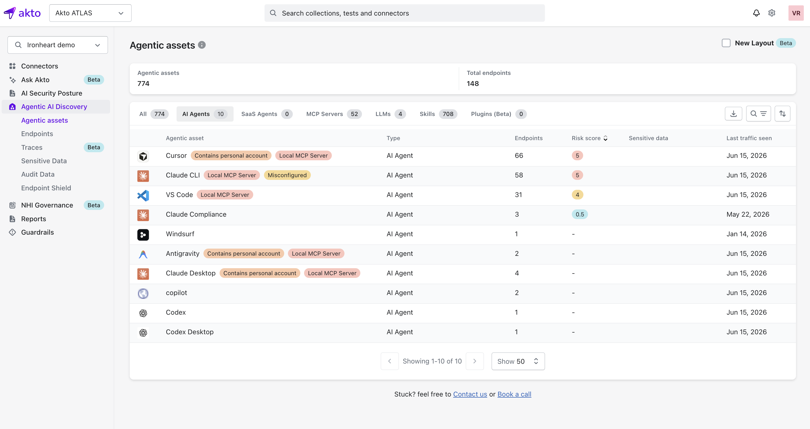

# Agentic Assets

## Overview

**Agentic Assets** is your inventory of every agentic system Atlas has discovered in your environment. Each entry is a distinct AI-driven system you've observed in live traffic, and this page is where you start before drilling into its endpoints and components.

## What an Agentic Asset Represents

An **agentic asset** represents a logical agentic system: an AI Agent, SaaS Agent, MCP Server, LLM, Skill, or Plugin. Each asset groups all the endpoints and execution contexts you've observed for that system.

<figure><figcaption></figcaption></figure>

### Agentic Assets Summary

The top of the page gives you a high-level view of what you've discovered:

1. **Agentic assets**: total number of distinct agentic systems you've discovered.
2. **Total endpoints**: total number of endpoints across all your agentic assets.

### Agentic Assets Table

Use the tabs above the table to filter by asset type. Each tab shows you a live count of assets in that category.

What each tab covers

| Tab            | What it covers                                                                                            |
| -------------- | --------------------------------------------------------------------------------------------------------- |
| All            | Every agentic asset you've discovered, across all types                                                   |
| AI Agents      | CLIs, IDEs, and desktop apps your employees use to run AI, such as Claude CLI, Cursor, and VS Code        |
| SaaS Agents    | Agents hosted and run through a SaaS platform, such as Copilot Studio or Amazon Q                         |
| MCP Servers    | MCP servers you've observed in agent traffic, whether local or remote                                     |
| LLMs           | LLMs your employees access directly, for example through a browser or API call                            |
| Skills         | Callable skill files your employees' agents expose, discovered across IDEs, repos, CI/CD, and MCP servers |
| Plugins (Beta) | Plugin extensions installed into your employees' agentic tools                                            |

| Column            | Description                                                                       |
| ----------------- | --------------------------------------------------------------------------------- |
| Agentic asset     | Identifier derived from hostname, provider, or agent name                         |
| Type              | Category of agentic system (AI Agent, SaaS Agent, MCP Server, LLM, Skill, Plugin) |
| Endpoints         | Number of endpoints associated with the asset                                     |
| Risk score        | Aggregated risk score across all associated components                            |
| Sensitive data    | Indicates whether sensitive data was detected on this asset                       |
| Last traffic seen | Time of most recent observed interaction                                          |


**Search and Filtering**

Use the search bar to find assets by name, and the tabs above the table to narrow the list down to a specific asset type.



**Asset Badges**

You'll see badges next to an asset's name that flag it at a glance:

* **Contains personal account**: an employee accessed this asset using a personal (non-organization) account.
* **Local MCP Server**: this asset runs a locally spun-up MCP server.
* **Misconfigured**: this asset has a configuration issue that needs your attention.


## Navigating into an Agentic Asset

Select an agentic asset to open its **Agentic Asset Details** view.\
The header shows you the asset's type and name (for example, **AI Agent - Cursor**), a short description of what the tool does, and an **Explore mode** button. From here you get endpoint-level visibility into the selected agentic asset.

<figure><figcaption></figcaption></figure>

### Endpoint List

The endpoint list shows you every endpoint through which you observed the agentic asset. Search across all endpoints, and filter by **Endpoint tags**, **Endpoint ID**, or **Username**.

| Column            | Description                                                                                         |
| ----------------- | --------------------------------------------------------------------------------------------------- |
| Endpoint ID       | Unique identifier generated by Akto                                                                 |
| Username          | Execution identity associated with the endpoint                                                     |
| Risk score        | Risk score calculated for the endpoint                                                              |
| Sensitive data    | Icons indicating the types of sensitive data detected (for example, email addresses or credentials) |
| Last traffic seen | Timestamp of most recent activity                                                                   |
| Discovered        | Timestamp of initial discovery                                                                      |
| Endpoint tags     | Tags applied to the endpoint, such as **Local MCP Server** or **Contains personal account**         |

### Endpoint Expansion

Expand an endpoint row to see additional execution context associated with it, such as tool or client identifiers.

This helps you distinguish different execution environments using the same agentic asset.


**Asset-Level Actions**

The Agentic Asset Details view gives you asset-level controls, such as **Explore Mode** to interactively explore the selected asset.


## What Next

After reviewing an agentic asset and its endpoints, you can drill down into individual [**Agentic Components**](../agentic-components/) exposed by those endpoints.
