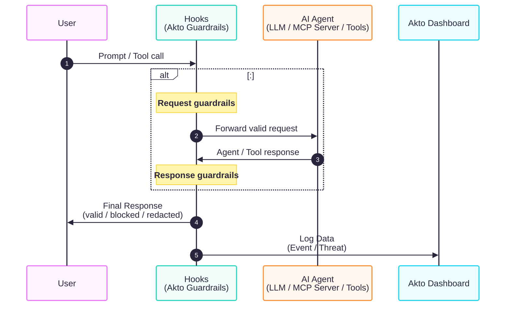

# Atlas Guardrails

Akto Atlas applies guardrails directly at the endpoint, where employees actually interact with AI agents, MCP servers, and GenAI tools. Guardrails inspect every prompt, response, and tool call locally and block risky behavior before it ever leaves the device.

## The Problem You Face

AI usage on employee endpoints is hard to control with traditional perimeter tools:

* You cannot rely on cloud-side filtering when prompts and tool calls happen on developer laptops, browsers, and IDEs.
* Sensitive data such as source code, PII, and secrets can leak into AI tools long before any cloud gateway sees the traffic.
* Locally spun-up MCP servers and unvetted tools execute commands on the device with no built-in policy enforcement.

## How Atlas Guardrails Help

Atlas embeds enforcement into the same agents that already discover AI activity on the endpoint. You define policies centrally in Akto, and they are evaluated locally on each device, so risky prompts and tool calls are stopped at the source.

## What Atlas Guardrails Cover

* **Sensitive data exposure** - block prompts containing PII, secrets, source code, or other regulated data before they reach external AI tools.
* **Unsafe prompts and jailbreaks** - detect prompt injection, jailbreak patterns, and policy-violating instructions on the endpoint.
* **Risky MCP tool calls -** restrict destructive shell commands, file system access, and unvetted MCP tools from executing on the device.
* **Shadow AI usage** - enforce guardrails on AI tools and MCP servers that fall outside your approved list.
* **Personal account usage** - detect sign-ins to AI tools using personal email domains and restrict access to organization-approved accounts only.

Atlas ships with 20+ built-in guardrail policies covering input and output threats. See [**Agent Guard**](../agentic-guardrails/concepts/agent-guard.md) for the full list of scanners and what each one detects.

## How It Works

Guardrails run inside the same Atlas components that you deploy for discovery — browser extensions, IDE hooks, and the AI Endpoint Shield. Each component intercepts AI traffic on the device, applies input guardrails to the request and output guardrails to the response, and either forwards, redacts, or blocks based on your policies. Every decision is reported back to the Akto dashboard for monitoring and audit.

## Where Guardrails Plug In

* [**Browser Extensions**](endpoints-discovery-agents/browser-extensions/) - apply guardrails to prompts and responses on web-based AI tools.
* [**AI Endpoint Shield**](endpoints-discovery-agents/ai-endpoint-shield/) - enforce guardrails on local MCP traffic across the device.
* [**IDE Hooks**](endpoints-discovery-agents/) - validate chat prompts, agent responses, and MCP tool calls inside Cursor, Claude, Copilot, Gemini, and other supported IDEs.

## What You Can Do

* Map skills and tools to guardrail policies and enforce them per user, device, or collection.
* Track endpoint-level guardrail effectiveness through the AI Security Posture dashboard.
* Review every blocked or allowed event with full endpoint, user, and device context.

## Learn More

For a deep dive into guardrail scanners, policies, threat dashboards, and remediation workflows, see the [**Agentic Guardrails**](https://app.gitbook.com/s/tog5ODwYfqPOf4eQhsOC/agentic-guardrails) section.
