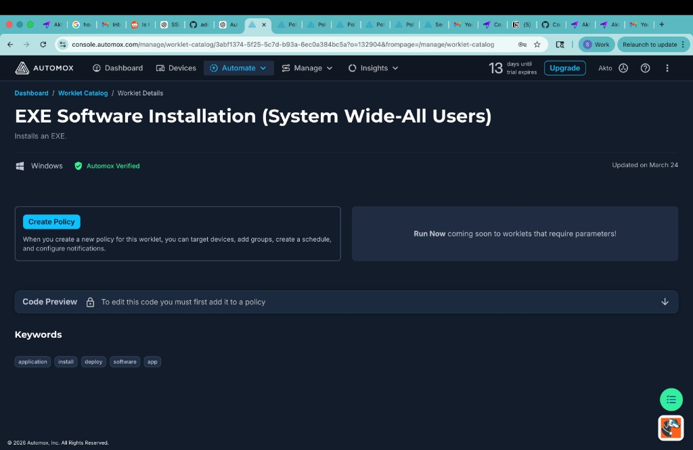
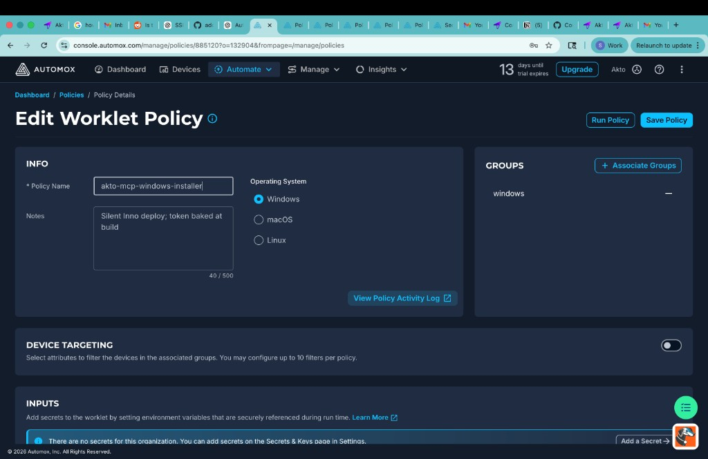
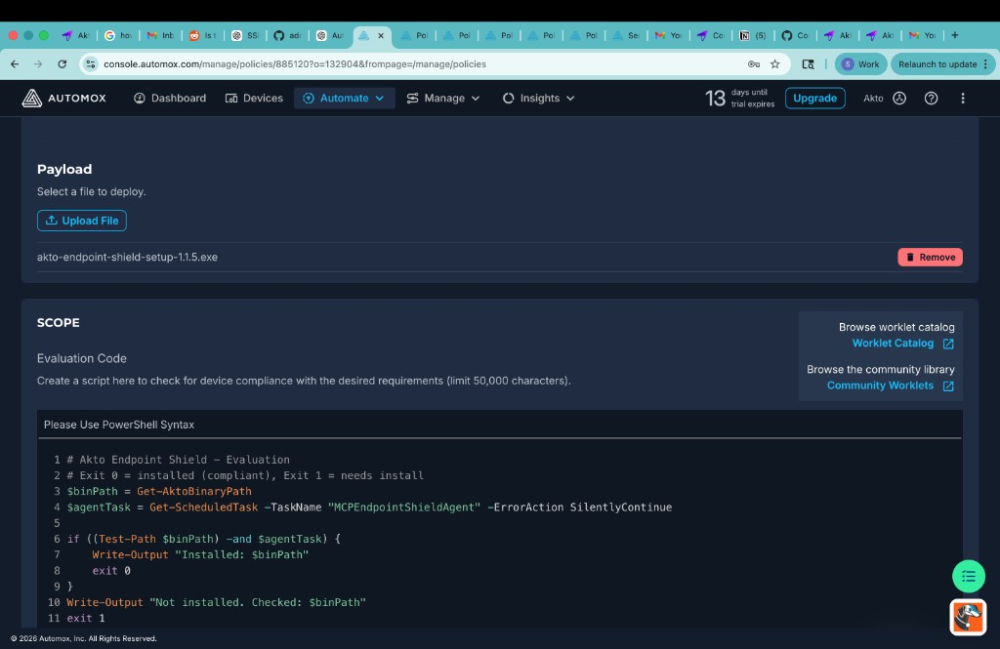

# Automox Deployment

## Overview

**Akto Endpoint Shield** can be deployed to managed Windows laptops and desktops using **Automox Worklets**. Automox runs a compliance check (evaluation script) on each device; if the shield is not installed or misconfigured, it silently runs remediation.

This guide covers:

* Obtaining a **customer-specific** `akto-endpoint-shield-setup-<version>.exe` from Akto (token embedded at build time)
* Creating an Automox **Worklet policy** with evaluation and remediation PowerShell
* **Config propagation** — required because Automox runs as SYSTEM (see below)
* Uploading the installer and targeting device groups
* Verifying installation and troubleshooting common issues


**Windows installer type:** Akto ships an **Inno Setup `.exe`**, not an MSI. Use an Automox **Worklet** with a file payload (or the **EXE Software Installation** catalog worklet as a starting point).


### Why Automox

* **Silent, unattended install** on fleet devices (runs as SYSTEM)
* **Compliance loop** — reinstall or repair only when evaluation reports non-compliant
* **Central scheduling** and group targeting
* **Activity logs** per device for install success or failure

### Automox runs as SYSTEM — config must be propagated

Automox worklets run elevated as **SYSTEM**. The Inno installer writes `config.env` to the **SYSTEM profile**:

`C:\Windows\System32\config\systemprofile\.akto-endpoint-shield\config\config.env`

The agent scheduled task remaps to the **logged-in user** and reads:

`C:\Users\<user>\.akto-endpoint-shield\config\config.env`

If that user file is missing `AKTO_API_TOKEN` (often only `AGENT_ID` is present), the agent logs **`401 Unauthorized`** to `ultron.akto.io` even though install succeeded.

**The remediation script in this guide always propagates config from SYSTEM to all interactive user profiles** — on fresh install, upgrade, and repair of already-installed devices.

### What the installer does

When remediation runs successfully, the installer:

* Installs to `C:\Program Files\Akto Endpoint Shield\` (fresh install) or may keep legacy `C:\Program Files\MCP Endpoint Shield\` on upgrade
* Writes `config.env` with embedded token to the **SYSTEM** profile
* Registers scheduled tasks (`MCPEndpointShieldHTTP`, `MCPEndpointShieldAgent`, `MCPEndpointShieldDetector`)
* Bundles hook and system-proxy scripts (hooks stay **off** until enabled in the Akto dashboard unless your build sets otherwise)

The **Automox remediation script** then copies config to every interactive user profile and restarts the agent.

**Why a manual restart was needed before:** Earlier remediation runs could exit early (e.g. `SYSTEM config missing` from 32-bit path redirect) **before** reaching the restart step. Once user config had a token, evaluation returned **compliant** and Automox **skipped remediation entirely** — leaving a stale agent process running without the token. Updated scripts fix both issues: `Sysnative` for SYSTEM config, evaluation checks `agentHealthy`, and remediation uses explicit stop/start with Activity Log output.

## Prerequisites

* **Automox** account with permission to create Worklet policies
* **Windows 10/11** devices (64-bit) enrolled in Automox
* **Akto account** and API token (Akto builds the installer with your token — you do not paste the token into Automox)
* Network access from endpoints to:
  * `https://*.akto.io` (guardrails / API)
  * `https://ultron.akto.io` (database abstractor — default in builds)

Contact **support@akto.io** to request the installer build.

## Deployment Steps



#### Obtain the installer from Akto

**Contact Akto Support**

Email **support@akto.io** (or your Akto account team) with:

* Your **Akto account ID** / guardrails URL (e.g. `https://<account-id>-guardrails.akto.io`)
* **API token** to embed (or ask Akto to use your existing org token)
* Target **version** (e.g. `1.1.5`)

Akto will return:

* `akto-endpoint-shield-setup-<version>.exe` — silent Inno Setup installer with your token and URLs baked in
* Optional: evaluation and remediation scripts (also in this document)

**Verify the file name**

Note the **exact** file name (e.g. `akto-endpoint-shield-setup-1.1.5.exe`). The remediation script must use the **same** name as the uploaded payload.



#### Create the Worklet policy in Automox

You can either start from the **Worklet Catalog** template or create a **custom policy** from scratch. Both approaches use the same evaluation/remediation scripts and uploaded `.exe`.

**Option A — Start from the catalog (recommended)**

1. In Automox, go to **Automate → Worklet Catalog**.
2. Open **EXE Software Installation (System Wide-All Users)** (Windows, Automox Verified).
3. Click **Create Policy**.

<div data-with-frame="true"><figure><figcaption><p>Worklet Catalog — EXE Software Installation (System Wide-All Users)</p></figcaption></figure></div>

4. Continue with the next step below.

**Option B — Create a custom Worklet policy**

1. Go to **Automate → Policies → Create Policy**.
2. Choose **Worklet** and **Windows**.
3. Continue with the next step.



#### Configure policy info

On the policy **Info** tab:

| Field                | Example                                          |
| -------------------- | ------------------------------------------------ |
| **Policy name**      | `akto-mcp-windows-installer`                     |
| **Operating system** | **Windows**                                      |
| **Notes**            | `Silent Inno deploy; token baked at build`       |
| **Groups**           | Target group(s), e.g. `windows` or a pilot group |

<div data-with-frame="true"><figure><figcaption><p>Policy Info — name, OS, and device groups</p></figcaption></figure></div>


**Pilot first:** Assign a **small test group** before rolling out to all Windows devices.


**Device targeting:** Leave off unless you need attribute filters within the group.

**Inputs / Secrets:** Not required when the API token is embedded in the installer at build time.



#### Upload the installer (Payload)

1. Open the **Payload** (file upload) section.
2. Click **Upload File** and select your `akto-endpoint-shield-setup-<version>.exe`.
3. Confirm the uploaded name matches what you use in remediation (e.g. `akto-endpoint-shield-setup-1.1.5.exe`).

Automox stages the file next to the worklet scripts on each device (under its exec directory).



#### Evaluation code

Paste this script into **Evaluation Code** (PowerShell). It must be **self-contained** — do not call helper functions defined only in remediation (Automox runs evaluation and remediation in **separate** processes).

**Compliance rules:**

* **Exit `0`** → compliant (binary, agent task, user config with token, agent process restarted after config)
* **Exit `1`** → run remediation (install, config repair, and/or agent restart)

```powershell
# Akto Endpoint Shield - Evaluation
# Exit 0 = compliant, Exit 1 = needs remediation

$pf64 = ${env:ProgramW6432}
if (-not $pf64) { $pf64 = "C:\Program Files" }

$binCandidates = @(
  (Join-Path $pf64 "Akto Endpoint Shield\akto-endpoint-shield.exe")
  (Join-Path $pf64 "MCP Endpoint Shield\akto-endpoint-shield.exe")
)
$binPath = $binCandidates | Where-Object { Test-Path -LiteralPath $_ } | Select-Object -First 1

$arp = Get-ItemProperty "HKLM:\SOFTWARE\Microsoft\Windows\CurrentVersion\Uninstall\*" -ErrorAction SilentlyContinue |
  Where-Object { $_.DisplayName -like "*Endpoint*Shield*" -or $_.DisplayName -like "*Akto*Endpoint*" }

$agentTask = Get-ScheduledTask -TaskName "MCPEndpointShieldAgent" -ErrorAction SilentlyContinue

$userHasToken = $false
$agentHealthy = $true
Get-CimInstance Win32_UserProfile -ErrorAction SilentlyContinue | ForEach-Object {
  if ($_.Special -or -not $_.LocalPath) { return }
  if ($_.SID -notmatch '^S-1-5-21-') { return }
  $userCfg = Join-Path $_.LocalPath ".akto-endpoint-shield\config\config.env"
  if ((Test-Path -LiteralPath $userCfg) -and (Select-String -LiteralPath $userCfg -Pattern '^AKTO_API_TOKEN=' -Quiet)) {
    $userHasToken = $true
    $agentLog = Join-Path $_.LocalPath "AppData\Local\akto-endpoint-shield\logs\agent.log"
    if (-not (Test-Path -LiteralPath $agentLog)) {
      $agentHealthy = $false
      return
    }
    $startupLine = Select-String -LiteralPath $agentLog -Pattern "startup env" -ErrorAction SilentlyContinue |
      Select-Object -Last 1
    if (-not $startupLine) {
      $agentHealthy = $false
      return
    }
    if ($startupLine.Line -match 'AKTO_API_TOKEN.*\(not set\)') {
      $agentHealthy = $false
      return
    }
    $cfgTime = (Get-Item -LiteralPath $userCfg).LastWriteTime
    $logTime = (Get-Item -LiteralPath $agentLog).LastWriteTime
    if ($cfgTime -gt $logTime) {
      $agentHealthy = $false
    }
  }
}

if ($binPath -and $arp -and $agentTask -and $userHasToken -and $agentHealthy) {
  Write-Output "Compliant: $binPath"
  exit 0
}

Write-Output "Non-compliant. binary=$([bool]$binPath) task=$([bool]$agentTask) userToken=$userHasToken agentHealthy=$agentHealthy"
exit 1
```

<div data-with-frame="true"><figure><figcaption><p>Payload upload and Evaluation Code</p></figcaption></figure></div>


**Do not use `Get-AktoBinaryPath`.** Evaluation and remediation are separate runs — custom functions defined in one block are not available in the other.



**Already installed but 401 errors?** If the binary and tasks exist but `userToken=False` or `agentHealthy=False`, evaluation returns non-compliant and remediation runs **config propagation + task restart** (no reinstall needed if binary is present).




#### Remediation code

Paste this into **Remediation Code** only (not Evaluation). Update `$fileName` to match your uploaded installer **exactly**.


**Copy-paste rules for Automox:**
* Paste **only** the PowerShell lines below — **not** the ` ```powershell ` fences
* Do **not** combine Evaluation and Remediation into one field
* Use a plain ASCII hyphen `-`, not special Unicode dashes, if you edit strings manually


This script:

1. Installs (or re-runs) the Inno `.exe` if the binary is missing
2. **Always propagates** `config.env` from SYSTEM to all interactive user profiles (fixes Automox token issue)
3. Preserves per-user `AGENT_ID` lines
4. Restarts agent tasks

```powershell
# Akto Endpoint Shield - Remediation (install + config propagation)
# No functions - flat script for Automox compatibility

$fileName  = "akto-endpoint-shield-setup-1.1.5.exe"
$arguments = "/VERYSILENT /SUPPRESSMSGBOXES /NORESTART /SP- /LOG=C:\Windows\Temp\akto-endpoint-shield-install.log"

$pf64 = ${env:ProgramW6432}
if (-not $pf64) { $pf64 = "C:\Program Files" }

$bin1 = Join-Path $pf64 "Akto Endpoint Shield\akto-endpoint-shield.exe"
$bin2 = Join-Path $pf64 "MCP Endpoint Shield\akto-endpoint-shield.exe"

# Automox runs 32-bit PowerShell: plain System32 redirects to SysWOW64 (config is NOT there).
# Sysnative reaches the real 64-bit System32 from 32-bit processes.
$systemCfgCandidates = @(
  (Join-Path ${env:WINDIR} "Sysnative\config\systemprofile\.akto-endpoint-shield\config\config.env")
  (Join-Path $env:SystemRoot "System32\config\systemprofile\.akto-endpoint-shield\config\config.env")
)
$systemCfg = $null
foreach ($candidate in $systemCfgCandidates) {
  if (Test-Path -LiteralPath $candidate) { $systemCfg = $candidate; break }
}
if (-not $systemCfg) { $systemCfg = $systemCfgCandidates[0] }

$binPath = $null
if (Test-Path -LiteralPath $bin1) { $binPath = $bin1 }
elseif (Test-Path -LiteralPath $bin2) { $binPath = $bin2 }

if (-not $binPath) {
  $sPath = Split-Path $script:MyInvocation.MyCommand.Path -Parent
  $fPath = Join-Path $sPath $fileName
  if (-not (Test-Path -LiteralPath $fPath)) {
    Write-Error "Installer not found: $fPath"
    exit 1
  }
  Write-Output "Running: $fPath $arguments"
  $p = Start-Process -FilePath $fPath -ArgumentList $arguments -Wait -PassThru
  if ($null -eq $p -or $p.ExitCode -ne 0) {
    Write-Error "Installer failed. ExitCode=$($p.ExitCode)"
    exit 1
  }
  $deadline = (Get-Date).AddMinutes(5)
  do {
    if (Test-Path -LiteralPath $bin1) { $binPath = $bin1; break }
    if (Test-Path -LiteralPath $bin2) { $binPath = $bin2; break }
    Start-Sleep -Seconds 15
  } while ((Get-Date) -lt $deadline)
  if (-not $binPath) {
    Write-Error "Binary missing after install. Checked: $bin1 ; $bin2"
    if (Test-Path "C:\Windows\Temp\akto-endpoint-shield-install.log") {
      Get-Content "C:\Windows\Temp\akto-endpoint-shield-install.log" -Tail 30
    }
    exit 1
  }
  Write-Output "Installed: $binPath"
  foreach ($candidate in $systemCfgCandidates) {
    if (Test-Path -LiteralPath $candidate) { $systemCfg = $candidate; break }
  }
}
else {
  Write-Output "Binary present: $binPath - running config sync"
  if (-not (Test-Path -LiteralPath $systemCfg)) {
    $sPath = Split-Path $script:MyInvocation.MyCommand.Path -Parent
    $fPath = Join-Path $sPath $fileName
    if (Test-Path -LiteralPath $fPath) {
      Write-Output "SYSTEM config missing - re-running installer"
      $p = Start-Process -FilePath $fPath -ArgumentList $arguments -Wait -PassThru
      if ($null -eq $p -or $p.ExitCode -ne 0) {
        Write-Error "Installer failed. ExitCode=$($p.ExitCode)"
        exit 1
      }
      Start-Sleep -Seconds 30
      foreach ($candidate in $systemCfgCandidates) {
        if (Test-Path -LiteralPath $candidate) { $systemCfg = $candidate; break }
      }
    }
  }
}

if (-not (Test-Path -LiteralPath $systemCfg)) {
  Write-Error "SYSTEM config missing. Checked: $($systemCfgCandidates -join ' ; ')"
  exit 1
}

Write-Output "Using SYSTEM config: $systemCfg"

$configContent = Get-Content -LiteralPath $systemCfg -Raw
$configContent = $configContent.TrimEnd()

Get-CimInstance Win32_UserProfile -ErrorAction SilentlyContinue | ForEach-Object {
  if ($_.Special -or -not $_.LocalPath) { return }
  if ($_.SID -notmatch '^S-1-5-21-') { return }
  if (-not (Test-Path -LiteralPath $_.LocalPath)) { return }

  $userCfg = Join-Path $_.LocalPath ".akto-endpoint-shield\config\config.env"
  $cfgDir = Split-Path -Parent $userCfg
  if (-not (Test-Path -LiteralPath $cfgDir)) {
    New-Item -ItemType Directory -Path $cfgDir -Force | Out-Null
  }

  $out = $configContent
  if (Test-Path -LiteralPath $userCfg) {
    $agentId = Get-Content -LiteralPath $userCfg -ErrorAction SilentlyContinue |
      Where-Object { $_ -match '^AGENT_ID=' } | Select-Object -First 1
    if ($agentId -and ($out -notlike "*AGENT_ID=*")) {
      $out = $out + [Environment]::NewLine + $agentId
    }
  }

  Set-Content -LiteralPath $userCfg -Value $out -Encoding UTF8
  Write-Output "Synced config: $userCfg"
}

$taskNames = @("MCPEndpointShieldAgent", "MCPEndpointShieldHTTP", "MCPEndpointShieldDetector")
foreach ($taskName in $taskNames) {
  $task = Get-ScheduledTask -TaskName $taskName -ErrorAction SilentlyContinue
  if (-not $task) {
    Write-Output "Task not found (skipped): $taskName"
    continue
  }
  try {
    Stop-ScheduledTask -TaskName $taskName -ErrorAction SilentlyContinue
    Start-Sleep -Seconds 3
    Start-ScheduledTask -TaskName $taskName -ErrorAction Stop
    Write-Output "Restarted: $taskName"
  }
  catch {
    Write-Output "Restart via ScheduledTasks failed for $taskName - trying schtasks"
    & schtasks.exe /End /TN $taskName 2>$null | Out-Null
    Start-Sleep -Seconds 3
    & schtasks.exe /Run /TN $taskName 2>$null | Out-Null
    Write-Output "Restarted via schtasks: $taskName"
  }
}

Write-Output "Success: $binPath (config propagated; tasks restarted)"
exit 0
```


* Do **not** use `-Verb RunAs` — the worklet already runs elevated as **SYSTEM**.
* Use **`${env:ProgramW6432}`** — Automox often runs 32-bit PowerShell where `$env:ProgramFiles` is Program Files (x86).
* Use **`Sysnative`** for SYSTEM `config.env` — plain `System32\...` from 32-bit PowerShell redirects to SysWOW64 where the file does not exist.
* Install folder may be **`Akto Endpoint Shield`** or legacy **`MCP Endpoint Shield`** — scripts above handle both.
* Set **`$fileName`** to your uploaded payload exactly (e.g. `Akto-Endpoint-Shield-Comscore-1.1.5.exe`).




#### Schedule and notifications

| Setting               | Recommendation                                                         |
| --------------------- | ---------------------------------------------------------------------- |
| **Schedule**          | Custom — pilot: run once soon; production: recurring or on check-in    |
| **Missed run**        | Enable _run on next check-in_ so offline devices get the install later |
| **Automatic restart** | **Do not** restart devices after worklet completion                    |


**Repair existing broken installs:** Run the policy once on devices that already have the binary but show 401 errors. Evaluation will report non-compliant (`userToken=False`); remediation will sync config without a full reinstall.


Save the policy (**Save Policy**), then **Run Policy** on a pilot device or wait for the schedule.



#### Verify deployment

**In Automox**

* **Activity Log** — look for `Installed:` or `Binary present:`, `Synced config:`, and `Restarted: MCPEndpointShieldAgent`
* **Device logs** — `policy_*_remediate` / `policy_*_test` entries

**On the Windows device (PowerShell — run as the logged-in user)**

```powershell
# Find binary (Akto or legacy MCP folder)
$pf64 = ${env:ProgramW6432}
$bin = Get-ChildItem "$pf64\*Endpoint Shield\akto-endpoint-shield.exe" -ErrorAction SilentlyContinue | Select-Object -First 1
$bin.FullName
& $bin.FullName --version

# Scheduled tasks
Get-ScheduledTask -TaskName "MCPEndpointShield*" -ErrorAction SilentlyContinue |
  Format-Table TaskName, State

# User config must include AKTO_API_TOKEN (not just AGENT_ID)
Select-String -Path "$env:USERPROFILE\.akto-endpoint-shield\config\config.env" -Pattern "^AKTO_API_TOKEN="

# Agent startup — token should NOT be "(not set)"
Select-String -Path "$env:LOCALAPPDATA\akto-endpoint-shield\logs\agent.log" -Pattern "startup env" | Select-Object -Last 1

# Agent logs
Get-Content "$env:LOCALAPPDATA\akto-endpoint-shield\logs\agent.log" -Tail 20 -ErrorAction SilentlyContinue
```

**Test API token (PowerShell)**

```powershell
$token = (Get-Content "$env:USERPROFILE\.akto-endpoint-shield\config\config.env" |
  Where-Object { $_ -match '^AKTO_API_TOKEN=' }) -replace '^AKTO_API_TOKEN=',''
Invoke-WebRequest -Method POST -Uri "https://ultron.akto.io/api/fetchMcpAuditInfo" `
  -Headers @{ Authorization = $token; "Content-Type" = "application/json" } `
  -Body '{"updatedAfter":0}' -UseBasicParsing
```

Expect **HTTP 200**. **401** from curl with a valid-looking token in user config means expired/wrong JWT — contact Akto for a new installer build.



## Hooks, MCP wrap, and system proxy

The installer embeds feature flags in `config.env`. **Defaults are `false`** (opt-in):

* Hook installers (Claude, Cursor, Copilot, etc.) run when flags are enabled in the **Akto dashboard** or in `config.env`
* **System proxy (Atlas)** requires dashboard **SwitchProxyMode** and/or `ENABLE_SYSTEM_PROXY=true`

Installing via Automox does **not** mean all hooks are active immediately.

## Troubleshooting

#### Evaluation error: `Get-AktoBinaryPath` is not recognized

Evaluation and remediation are separate runs. Use the scripts above with inline paths — no shared custom functions.

#### Remediation error: `Unexpected token '}'`

PowerShell **ParserError** at two consecutive `}` lines — the script never ran. Common causes:

* Pasted markdown fences (` ```powershell `) into the Automox editor
* Pasted **Evaluation + Remediation** into one field
* Extra `}` from copy/paste (often when using `function` blocks)

**Fix:** Clear the Remediation field and paste only the **flat remediation script** from this doc (no `function` keywords). Save policy and re-run.

#### Remediation error: `SYSTEM config missing`

Automox runs **32-bit PowerShell**. The path `C:\Windows\System32\config\systemprofile\...` is redirected to **SysWOW64**, so `config.env` looks missing even when it exists.

**Fix:** Use the updated remediation script with **`Sysnative`** (in this doc). Verify on the device:

```powershell
Test-Path "$env:WINDIR\Sysnative\config\systemprofile\.akto-endpoint-shield\config\config.env"
```

#### Remediation error: binary missing under `Program Files (x86)`

Automox often runs 32-bit PowerShell where `$env:ProgramFiles` points to **x86**. Scripts use `${env:ProgramW6432}`.

#### `COMMAND TIMED OUT`

Install or config sync took too long. Increase Automox worklet timeout; check `C:\Windows\Temp\akto-endpoint-shield-install.log`.

#### Binary installed but no `MCPEndpointShield*` tasks

Re-run the policy. Check Inno log for task registration failures.

#### Agent logs show `401 Unauthorized` to `ultron.akto.io`

**Most common cause:** user `config.env` has only `AGENT_ID`, no `AKTO_API_TOKEN`.

1. Confirm in agent log: `AKTO_API_TOKEN": "(not set)"` on startup
2. Confirm SYSTEM has token (from 64-bit or Sysnative path):

```powershell
Get-Content "$env:WINDIR\Sysnative\config\systemprofile\.akto-endpoint-shield\config\config.env"
```

3. **Re-run the Automox policy** — remediation syncs SYSTEM → all user profiles and **restarts** agent tasks
4. Evaluation stays non-compliant (`agentHealthy=False`) until the agent logs a fresh startup **after** config sync — no manual restart needed

If token is present in user config but API still returns 401, the JWT is invalid/expired — request a new build from Akto.

#### Token in user config but agent still returns 401

Evaluation may report `userToken=True agentHealthy=False` when config was synced but the agent process was never restarted (e.g. a prior remediation run exited before the restart step).

**Fix:** Re-run the Automox policy. Updated evaluation detects stale agents and remediation performs an explicit stop/start with logging (`Restarted: MCPEndpointShieldAgent` in Activity Log).

#### `config.env` only under SYSTEM profile

Expected after Inno install via Automox. The **remediation script** in this guide fixes it automatically. Re-run the policy on affected devices.

#### New user account created after deploy

The new user will not have `config.env` until the next policy run (evaluation detects `userToken=False`). Use a recurring schedule or run the policy when onboarding new users.

## Uninstall

```powershell
$pf64 = ${env:ProgramW6432}
foreach ($dir in @("Akto Endpoint Shield", "MCP Endpoint Shield")) {
  $unins = Join-Path $pf64 "$dir\unins000.exe"
  if (Test-Path -LiteralPath $unins) {
    & $unins /VERYSILENT /SUPPRESSMSGBOXES /NORESTART
    break
  }
}
```

Or **Settings → Apps → Akto Endpoint Shield → Uninstall**.

After uninstall, evaluation should return non-compliant and remediation can reinstall on the next policy run (if desired).

## Related documentation

* [MDM Deployment](mdm-deployment.md) — Intune, Jamf, and other MDM platforms
* [Mosyle MDM Deployment](mosyle-deployment.md) — macOS MDM
* [README](README.md) — product overview and manual setup

## Get Support

1. In-app **Intercom** on the Akto dashboard
2. [Discord community](https://www.akto.io/community)
3. **support@akto.io**
4. [Contact us](https://www.akto.io/contact-us)
