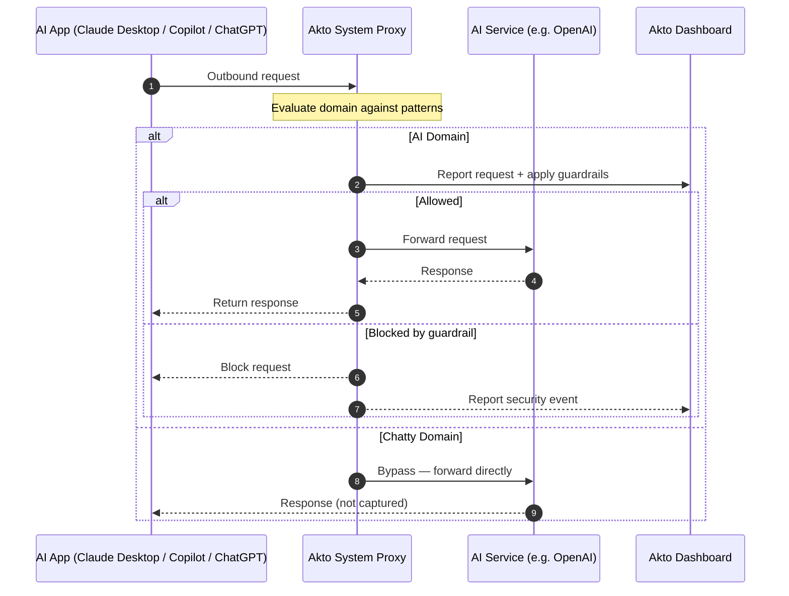

# Akto System Proxy

## Overview

Akto System Proxy is a network-level endpoint discovery method that monitors outbound traffic from AI applications running on employee devices — including **Claude Desktop**, **GitHub Copilot**, **ChatGPT desktop app**, and any other AI-related software. It captures API calls made by these apps and surfaces them in the Akto dashboard for visibility, analysis, and guardrails enforcement.

The proxy is installed automatically alongside [MCP Endpoint Shield](mcp-endpoint-shield/README.md) — no separate installation step is required.

## Guardrails for Desktop AI Apps

Akto System Proxy intercepts and enforces guardrails on **standalone desktop AI applications** — apps that don't expose hooks or extensions:

| App | What gets intercepted |
|-----|-----------------------|
| **Claude Desktop** | All API calls to Anthropic endpoints |
| **GitHub Copilot** | Requests to GitHub Copilot AI services |
| **ChatGPT Desktop** | API traffic to OpenAI endpoints |
| **Any other AI app** | Any app whose traffic matches your configured AI domains |

Because the proxy operates at the network level, it works transparently across all these apps without any per-app configuration or code changes.

## How It Works

The Akto System Proxy runs as a local service on the employee's device. All outbound network traffic is evaluated against your configured Proxy Patterns and domain lists:



This gives your security team full visibility into which AI services are being accessed, what data is being sent, and the ability to enforce policies — without requiring any changes to the AI applications themselves.

## Prerequisites

* **MCP Endpoint Shield** installed on the device (the system proxy is bundled with it)
* Access to **Settings → Proxy Patterns** in the Akto dashboard

## Configuration

All proxy configuration lives in **Settings → Proxy Patterns**.

### Proxy Patterns

Proxy patterns control which outbound traffic is routed through the Akto proxy for interception, and which is allowed to pass through directly.



**Open Proxy Patterns**

Go to **Settings → Proxy Patterns** in the Akto dashboard.



**Add a pattern**

Click **Add pattern** (top right). The **Add Proxy Pattern** dialog opens.



**Set Proxy Mode**

| Proxy Mode | Behaviour |
|------------|-----------|
| **True**   | Traffic matching this pattern is intercepted and routed through the Akto proxy |
| **False**  | Traffic matching this pattern bypasses the proxy (not captured) |



**Enter the Pattern**

Type a URL or domain pattern in the **Pattern** field.

```
e.g. .internal.example.com.
```

Patterns follow standard proxy URL-matching syntax. Use leading dots to match all subdomains (e.g., `.openai.com` matches `api.openai.com`).



**Click Add**

The pattern is saved and takes effect immediately on devices running the Endpoint Shield.



### Domains

The **Domains** section lets you classify domains so the proxy knows what to intercept and what to ignore.

| Domain Type | Description | Proxy behaviour |
|-------------|-------------|-----------------|
| **Chatty Domains** | High-traffic domains that are not AI-related (e.g., telemetry, CDN, package registries) | **Bypassed** — traffic is not captured, reducing noise |
| **AI Domains** | AI service domains whose traffic should be monitored (e.g., `openai.com`, `api.anthropic.com`) | **Intercepted and guardrailed** — traffic is captured and enforced against your security policies |

To add a domain, type it in the respective input field (e.g., `openai.com`) and click **Add**.

## Get Support

There are multiple ways to request support from Akto. We are 24X7 available on the following:

1. In-app `intercom` support. Message us with your query on intercom in Akto dashboard and someone will reply.
2. Join our [discord channel](https://www.akto.io/community) for community support.
3. Contact `help@akto.io` for email support.
4. Contact us [here](https://www.akto.io/contact-us).
