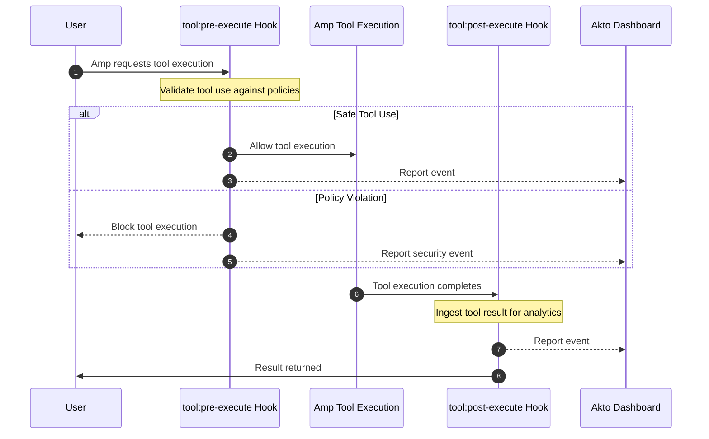

# Amp Hooks

Akto Guardrails for Amp provides security validation for AI coding agent interactions. It intercepts tool executions before and after they run, validates against security policies, blocks risky behavior, and reports events to your Akto dashboard.

## Key Features

* ✅ **Zero Installation** - No standalone apps to install
* ✅ **Transparent Integration** - Uses Amp's native hook mechanism
* ✅ **Real-time Tool Blocking** - Can block dangerous tool executions before they run
* ✅ **Centralized Monitoring** - All events reported to Akto dashboard
* ✅ **Flexible Deployment** - Supports Argus and Atlas modes

## How It Works

Amp's hook system triggers policy checks at two critical points in every tool execution:



**2 Hook Points:**

1. `tool:pre-execute` — Validates tool use before execution and **can block** dangerous operations
2. `tool:post-execute` — Ingests tool execution results for monitoring and audit

## Setup Guide

### Prerequisites

* Amp CLI installed and authenticated — run `amp --version` to verify
* macOS or Linux with bash/zsh

### Installation Steps



**Get the Akto Hook Configuration**


Contact [support@akto.io](mailto:support@akto.io) to get the Akto guardrail hook configuration for Amp. Akto provides a policy-based `amp.hooks` configuration tailored to your security requirements.





**Configure Hooks in settings.json**

Add the Akto-provided hook configuration to `~/.config/amp/settings.json`.

Amp hooks use `send-user-message` to intercept and cancel a tool call before execution, and `redact-tool-input` to scrub sensitive data from stored tool inputs after execution:

```json
{
  "amp.hooks": [
    {
      "compatibilityDate": "2025-05-14",
      "id": "akto-pre-tool-validation",
      "on": {
        "event": "tool:pre-execute",
        "tool": ["<tool_name>"],
        "input.contains": "<exact-string-to-match>"
      },
      "action": {
        ...
      }
    },
    {
      "compatibilityDate": "2025-05-14",
      "id": "akto-post-tool-ingestion",
      "on": {
        "event": "tool:post-execute",
        "tool": ["<tool_name>"]
      },
      "action": {
        ...
      }
    }
  ]
}
```




Once configured, Akto Guardrails will automatically run its checks on every tool execution. Any malicious or policy-violating events will appear in the **Guardrail Activity** section of your Akto dashboard.

## Resources

* **Amp Manual — Hooks**: <https://ampcode.com/manual>
* **GitHub**: <https://github.com/akto-api-security/akto>
* **Support**: <support@akto.io>
* **Community**: <https://www.akto.io/community>
