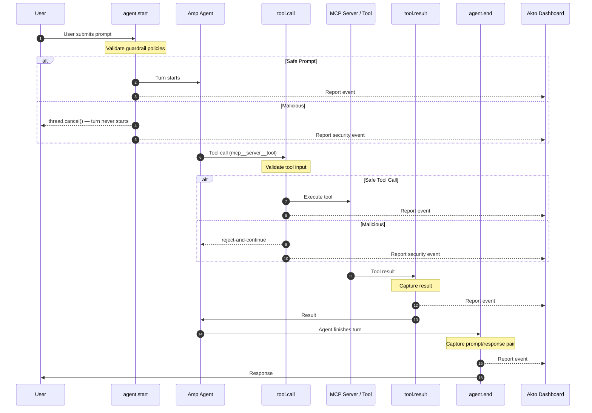

# Amp Hooks

Akto Guardrails for [Amp](https://ampcode.com) provides security validation for AI coding agent interactions. It intercepts prompts before the turn starts, tool calls before they execute, and tool results and responses after they complete — validating each against security policies, blocking risky behavior, and reporting events to your Akto dashboard.

## Key Features

* ✅ **Zero Installation** - No standalone apps to install
* ✅ **Transparent Integration** - Uses Amp's native plugin mechanism
* ✅ **Real-time Protection** - Validates every prompt, tool call, tool result and response
* ✅ **MCP Coverage** - Tool calls are reported as JSON-RPC `tools/call`, so MCP servers and tools show up in your inventory
* ✅ **Centralized Monitoring** - All events reported to Akto dashboard
* ✅ **Flexible Deployment** - Supports Argus and Atlas modes
* ✅ **Configurable Behavior** - Blocking or observation modes


**Amp has no shell-command hook mechanism.** Unlike Claude CLI or Codex CLI, Amp cannot run a script on a lifecycle event. Its only interception point is a **plugin** — a TypeScript module loaded from `.amp/plugins/` and executed by Bun. Akto therefore ships `akto-guardrails-plugin.ts`, a thin bridge that dispatches to the same Python validators every other Akto connector uses. There is no `amp.hooks` setting and no `-wrapper.sh` scripts.

Verified against Amp `0.0.1786450425`.


## How It Works

The plugin subscribes to five Amp lifecycle events — two around the conversation, two around every tool call, and one when a thread session starts:


```mermaid
sequenceDiagram
    autonumber
    participant User
    participant PromptHook as agent.start
    participant Amp as Amp Agent
    participant PreTool as tool.call
    participant MCP as MCP Server / Tool
    participant PostTool as tool.result
    participant ResponseHook as agent.end
    participant Akto as Akto Dashboard

    User->>PromptHook: User submits prompt
    Note over PromptHook: Validate guardrail policies
    alt Safe Prompt
        PromptHook->>Amp: Turn starts
        PromptHook-->>Akto: Report event
    else Malicious
        PromptHook-->>User: thread.cancel() — turn never starts
        PromptHook-->>Akto: Report security event
    end

    Amp->>PreTool: Tool call (mcp__server__tool)
    Note over PreTool: Validate tool input
    alt Safe Tool Call
        PreTool->>MCP: Execute tool
        PreTool-->>Akto: Report event
    else Malicious
        PreTool-->>Amp: reject-and-continue
        PreTool-->>Akto: Report security event
    end

    MCP->>PostTool: Tool result
    Note over PostTool: Capture result
    PostTool-->>Akto: Report event
    PostTool->>Amp: Result

    Amp->>ResponseHook: Agent finishes turn
    Note over ResponseHook: Capture prompt/response pair
    ResponseHook-->>Akto: Report event
    ResponseHook->>User: Response
```

**5 Event Points:**

1. `session.start` — Registers the thread session for observability. Cannot block
2. `agent.start` — Validates prompts before the turn starts. Blocks by calling `thread.cancel()`, which Amp documents as preventing the turn from starting
3. `tool.call` — Validates tool input before execution. The only event that can stop a tool: it returns `reject-and-continue` with a reason, so the tool never runs and the model can choose another route. It can also return `modify` to run the tool with guardrail-sanitized arguments
4. `tool.result` — Captures tool results for observability and response guardrails. Cannot block
5. `agent.end` — Captures the prompt/response pair when the agent finishes. Cannot block


**How MCP tool calls are recognised.** Amp names MCP tools `mcp__<server>__<tool>` — the same convention as Claude Code. The `tool.call` validator parses that shape, and for a match reports the call to Akto as a JSON-RPC `tools/call` on the `/mcp` path, so it lands in your MCP inventory with the server and tool broken out. Tool calls that are **not** MCP (`shell_command`, `apply_patch`, `read_web_page`, …) still pass through the same validator; they are mirrored to `/tool/<tool-name>` instead. Ingestion of non-MCP tool calls is off by default — set `AKTO_INGEST_NON_MCP_TOOLS=true` to enable it.

Run `amp tools list` to see the built-in and MCP tools available in your install.



**Prompt blocking differs from the CLI hook connectors.** Amp's `agent.start` result can only *append* context to a turn — it has no deny verdict. A real block is therefore `thread.cancel()`, and the reason is surfaced to the user through an Amp notification rather than inline in the transcript.


## File Structure

```
~/.config/amp/
├── plugins/
│   ├── akto-guardrails-plugin.ts     # Amp plugin — bridges events to the validators
│   ├── akto-hooks.py                  # Session-start observability dispatcher
│   ├── akto-validate-prompt.py        # Prompt validation logic
│   ├── akto-validate-pre-tool.py      # Tool input validation (MCP + built-in)
│   ├── akto-validate-post-tool.py     # Tool result capture
│   ├── akto-validate-response.py      # Turn/response capture
│   ├── akto_amp_common.py             # Shared config, HTTP and payload building
│   ├── akto_ingestion_utility.py      # Shared validation/ingestion logic
│   ├── akto_heartbeat.py              # Device heartbeat publisher
│   └── akto_machine_id.py             # Device ID utility
└── akto/
    ├── config                         # Akto URL, token, device label
    └── logs/
        ├── akto-guardrails.log
        ├── hook-executions.log
        ├── validate-prompt.log
        ├── validate-pre-tool.log
        ├── validate-post-tool.log
        └── validate-response.log
```

**Key Files:**

* **`akto-guardrails-plugin.ts`**: The only file Amp loads. Subscribes to the five events, spawns the Python validators, and maps their decisions onto Amp's actions (`thread.cancel()`, `reject-and-continue`, `modify`)
  * ⚠️ Reads `~/.config/amp/akto/config` for the Akto URL and token — see the configuration step
* **Python scripts (`.py`)**: Core validation logic and Akto API communication. The plugin resolves them **relative to its own path**, so they must sit in the same directory
* **`akto-validate-pre-tool.py`**: Validates every tool call before it runs. Reports MCP calls (`mcp__<server>__<tool>`) as JSON-RPC `tools/call` on `/mcp`; can reject the call or rewrite its arguments
* **`akto-validate-post-tool.py`**: Captures the tool result as a JSON-RPC result. Observational — it cannot block
* **`akto_ingestion_utility.py`**: lives in the `shared/` GitHub directory, **not** `amp-cli-hooks/`, so it is fetched from `SHARED_BASE` — miss it and session correlation degrades
* **`akto_heartbeat.py`**: Registers this device with Akto every 30s. Required — without a heartbeat record, mini-runtime cannot resolve the device to a user and **drops every event before indexing**, so the endpoint never appears under LLM observability / traces even though ingestion succeeds
* **`akto_machine_id.py`**: Generates unique device identifiers for Atlas mode


**No `settings.json` entry is needed.** Amp auto-discovers plugins from `~/.config/amp/plugins/` (system-wide) and `<repo>/.amp/plugins/` (per project). Amp's `settings.json` is only used to register MCP servers, which the plugin then guards automatically.


## Setup Guide

### Prerequisites

* Amp CLI installed and authenticated ([ampcode.com](https://ampcode.com)) — run `amp --version` to verify
* Akto instance URL and API token
* Python 3.7+ (standard library only — the validators need no third-party packages)
* macOS, Linux, or Windows with bash/zsh

### Installation Steps



**Create Directories**

```bash
mkdir -p ~/.config/amp/plugins
mkdir -p ~/.config/amp/akto/logs
```



**Download the Plugin and Validators**

```bash
# Base URLs for downloading
HOOKS_BASE="https://raw.githubusercontent.com/akto-api-security/akto/master/apps/mcp-endpoint-shield/amp-cli-hooks"
SHARED_BASE="https://raw.githubusercontent.com/akto-api-security/akto/master/apps/mcp-endpoint-shield/shared"

# Plugin entry point + validators + local modules
for f in akto-guardrails-plugin.ts \
         akto-hooks.py \
         akto-validate-prompt.py \
         akto-validate-pre-tool.py \
         akto-validate-post-tool.py \
         akto-validate-response.py \
         akto_amp_common.py \
         akto_heartbeat.py \
         akto_machine_id.py; do
  curl -fsSL -o ~/.config/amp/plugins/"$f" "${HOOKS_BASE}/${f}" \
    || { echo "❌ failed to download $f"; exit 1; }
done

# Shared module (note: SHARED_BASE, not HOOKS_BASE — it lives in a different
# GitHub directory). It must land next to the validators.
curl -fsSL -o ~/.config/amp/plugins/akto_ingestion_utility.py \
  "${SHARED_BASE}/akto_ingestion_utility.py" \
  || { echo "❌ failed to download akto_ingestion_utility.py"; exit 1; }

# Sanity-check: a silent 404 would leave 14-byte "404: Not Found" files behind
find ~/.config/amp/plugins -name 'akto*' -size -100c -print | grep . \
  && echo "⚠️  truncated downloads above — re-run this step" \
  || echo "✅ all files downloaded"
```


Every `.py` file must land in the **same directory** as `akto-guardrails-plugin.ts` — the plugin resolves them relative to its own path, and they import each other as plain top-level modules resolved from the script's own directory.


For a single repository instead of system-wide, use `<repo>/.amp/plugins/` as the destination.



**Configure Akto Ingestion URL, API Token and Device ID** ⚠️ **CRITICAL STEP**


Amp starts the plugin as a long-lived process and passes on only its own environment — a GUI-launched Amp does **not** inherit your shell profile. Use the config file so the install works regardless of how Amp was started. Obtain the API token from **Akto Atlas → Connectors → Setup Guardrail** card. If your deployment does not require auth, leave the token empty.


```bash
# Set your Akto ingestion URL and API token
AKTO_URL="https://your-akto-instance.com"
AKTO_API_TOKEN="your-akto-api-token"   # leave empty ("") if your deployment doesn't require auth

# Build the device label: <computer-name>-<first 8 chars of machine id>
# Works on macOS (scutil/ioreg) and Linux (hostname//etc/machine-id).
# Non-alphanumerics become '-' so the label cannot contain a dot: the dashboard
# splits the reported host on '.', and a dotted label would be truncated.
DEVICE_NAME=$(scutil --get ComputerName 2>/dev/null | tr -d '\n')
if [ -z "$DEVICE_NAME" ]; then DEVICE_NAME=$(hostname 2>/dev/null | tr -d '\n'); fi
if [ -z "$DEVICE_NAME" ]; then DEVICE_NAME=$(uname -n 2>/dev/null | tr -d '\n'); fi
DEVICE_NAME=$(printf '%s' "${DEVICE_NAME%.local}" | sed 's/[^a-zA-Z0-9]/-/g')

MACHINE_ID=$(ioreg -rd1 -c IOPlatformExpertDevice 2>/dev/null | awk -F'"' '/IOPlatformUUID/{print $4}')
if [ -z "$MACHINE_ID" ] && [ -r /etc/machine-id ]; then MACHINE_ID=$(tr -d '\n' < /etc/machine-id); fi
MACHINE_ID=$(printf '%s' "$MACHINE_ID" | tr -cd 'a-fA-F0-9' | tr '[:upper:]' '[:lower:]')

DEVICE_ID="${DEVICE_NAME:-unknown-device}"
if [ -n "$MACHINE_ID" ]; then DEVICE_ID="${DEVICE_ID}-$(printf '%s' "$MACHINE_ID" | cut -c1-8)"; fi
echo "Device label: $DEVICE_ID"

# Write the config file the plugin reads
cat > ~/.config/amp/akto/config << EOFCONFIG
AKTO_DATA_INGESTION_URL=${AKTO_URL}
AKTO_API_TOKEN=${AKTO_API_TOKEN}
DEVICE_ID=${DEVICE_ID}
AKTO_SYNC_MODE=true
AKTO_TIMEOUT=5
MODE=atlas
AMP_API_URL=https://ampcode.com
EOFCONFIG

chmod 600 ~/.config/amp/akto/config

# Verify
cat ~/.config/amp/akto/config
```

Environment variables of the same name still take precedence over the file, so a shell `export` can override any single value for a one-off run.



**Reload Amp**

Amp auto-discovers the plugin — no configuration entry is required. Open the command palette (`Ctrl+O`) and run `plugins: reload`, or restart Amp.

```bash
# Confirm Amp loaded the plugin
amp plugins list
```

You should see `akto-guardrails-plugin.ts active`.



**Configure MCP Servers (Optional)**

MCP servers are registered in Amp's own settings. The plugin guards whatever is configured — no extra wiring.

```bash
cat > ~/.config/amp/settings.json << 'EOF'
{
  "amp.mcpServers": {
    "playwright": {
      "command": "npx",
      "args": ["-y", "@playwright/mcp@latest"]
    }
  }
}
EOF
```



**Verify Installation**

```bash
# View logs
tail -f ~/.config/amp/akto/logs/akto-guardrails.log
tail -f ~/.config/amp/akto/logs/validate-prompt.log
```

Test by running an Amp command:

```bash
amp -x "What is 2+2?"
```

You should see a `PLUGIN_INIT` line followed by `SESSION_START` and `PROMPT_ALLOWED` entries.



## Configuration Reference

### Config File Variables

Read from `~/.config/amp/akto/config` (override the path with `AKTO_CONFIG_FILE`). Every key can also be supplied as an environment variable, which takes precedence.

```bash
MODE=atlas                                  # "argus" or "atlas"
AKTO_DATA_INGESTION_URL=https://your-akto-instance.com   # ⚠️ REQUIRED
AKTO_API_TOKEN=your-akto-api-token          # Akto API token (Authorization header)
DEVICE_ID=My-MacBook-Pro-f0929fe8           # ⚠️ becomes the device name
AKTO_SYNC_MODE=true                         # "true" (blocking) or "false" (observe only)
AKTO_TIMEOUT=5                              # Timeout in seconds
AKTO_CONNECTOR=amp                          # Connector identifier
AMP_API_URL=https://ampcode.com             # Amp endpoint recorded for non-MCP traffic
AKTO_PYTHON=python3                         # Interpreter used to run the validators
DATABASE_ABSTRACTOR_SERVICE_URL=https://cyborg.akto.io   # Heartbeat target (on-prem: override)
```

**Mode Options:**

* **Argus**: Standard validation and reporting
* **Atlas**: Includes device-specific metadata

**Sync Mode:**

* **true**: Blocks threats
* **false**: Reports but allows execution. Every event is still ingested — observe mode changes enforcement only, not coverage

### Tool Event Variables

Read by `akto-validate-pre-tool.py` / `akto-validate-post-tool.py`. All optional — the defaults match what the enterprise installer configures.

```bash
MCP_INGEST_PATH="/mcp"                  # Path MCP tools/call events are mirrored to
AKTO_INGEST_NON_MCP_TOOLS="false"       # "true" also ingests built-in tools (shell_command, apply_patch, …)
NON_MCP_TOOL_PATH_PREFIX="/tool"        # Path prefix for non-MCP tools -> /tool/<tool-name>
NON_MCP_INGEST_PATH=""                  # Set to collapse all non-MCP tools onto one fixed path
```

### Logging Variables

```bash
LOG_DIR="~/.config/amp/akto/logs"       # Directory for log files
LOG_LEVEL="INFO"                        # DEBUG, INFO, WARNING, ERROR
LOG_PAYLOADS="false"                    # Log request/response payload previews
```


**On-prem deployments must override `DATABASE_ABSTRACTOR_SERVICE_URL`.** It defaults to the SaaS cyborg endpoint. If your Akto runs on-prem, point it at your own abstractor before the heartbeat can register the device — and until it registers, LLM observability and traces stay empty.

```bash
echo 'DATABASE_ABSTRACTOR_SERVICE_URL=https://cyborg.your-akto-instance.com' \
  >> ~/.config/amp/akto/config
```


**How `DEVICE_ID` is reported:** the validators send `<DEVICE_ID>.ai-agent.amp` as the request host, and the dashboard uses the first label of that host as the device name. If `DEVICE_ID` is empty they fall back to the machine UUID — which is why a device sometimes shows up as a bare hex string.

## Troubleshooting

### Plugin Not Loading

```bash
# Does Amp see it?
amp plugins list

# Is the file in the right place?
ls -l ~/.config/amp/plugins/akto-guardrails-plugin.ts

# Did it initialise?
grep PLUGIN_INIT ~/.config/amp/akto/logs/akto-guardrails.log | tail -1
```

Reload with the command palette (`Ctrl+O` → `plugins: reload`) or restart Amp. A `PLUGIN_INIT` line with `"ingestionConfigured":false` means the plugin started but found no `AKTO_DATA_INGESTION_URL` in the config file or environment — it stays inactive until that is set.

### Nothing Is Being Validated

```bash
# Is the config file present and readable?
cat ~/.config/amp/akto/config

# Are the validators next to the plugin?
ls -l ~/.config/amp/plugins/akto-validate-*.py

# Did the plugin fail to find one?
grep SCRIPT_NOT_FOUND ~/.config/amp/akto/logs/akto-guardrails.log
```

### `ModuleNotFoundError: No module named 'akto_ingestion_utility'`

The shared ingestion utility was not downloaded, or landed outside the plugin directory. It lives in the `shared/` directory on GitHub, **not** under `HOOKS_BASE`, so it needs its own `curl`.

```bash
# Confirm the file is missing
ls -l ~/.config/amp/plugins/akto_ingestion_utility.py

# Fetch it into the same directory as the plugin
SHARED_BASE="https://raw.githubusercontent.com/akto-api-security/akto/master/apps/mcp-endpoint-shield/shared"
curl -o ~/.config/amp/plugins/akto_ingestion_utility.py \
  "${SHARED_BASE}/akto_ingestion_utility.py"

# Verify the import resolves
python3 -c "import sys; sys.path.insert(0, '$HOME/.config/amp/plugins'); import akto_ingestion_utility; print('OK')"
```

If the file is present and the import still fails, check that `PYTHONSAFEPATH` is unset — it suppresses the script-directory entry on `sys.path` that this import relies on.

```bash
env | grep -i pythonsafepath   # must return nothing
```

### MCP Tool Calls Not Appearing

`tool.call` fires for **every** tool, but only names matching `mcp__<server>__<tool>` are reported as MCP `tools/call` on `/mcp`. Built-in tools (`shell_command`, `apply_patch`, …) take the non-MCP path and are **not** ingested unless you opt in.

```bash
# What tools does this install expose?
amp tools list

# Did the validator run, and how did it classify the call?
tail -20 ~/.config/amp/akto/logs/validate-pre-tool.log

# To also ingest built-in (non-MCP) tool calls
echo 'AKTO_INGEST_NON_MCP_TOOLS=true' >> ~/.config/amp/akto/config
```

If the log shows `Processing built-in tool request`, the call was not an MCP tool — that is expected for Amp's own tools.

### Endpoint Appears in Inventory but Traces / LLM Observability Are Empty

Ingestion and trace indexing are separate paths. mini-runtime resolves each event's device to a user via the heartbeat record (`moduleInfo.name` → `additionalData.username`); an event whose device has no heartbeat, and which carries no `user_email` header, is discarded before indexing. Amp's plugin payloads never carry an email, so the heartbeat is the only thing that can satisfy this — the collection still shows up in inventory, which is why the endpoint looks connected.

```bash
# Was the heartbeat publisher installed?
ls -l ~/.config/amp/plugins/akto_heartbeat.py

# Has it sent recently? (unix timestamp of the last successful send)
cat ~/.config/amp/akto/logs/last_heartbeat

# Look for the send/skip line
grep -i heartbeat ~/.config/amp/akto/logs/*.log | tail -5
```

If the file is missing, re-run the download step. If it is present but never sends, confirm `DATABASE_ABSTRACTOR_SERVICE_URL` points at a reachable abstractor (see the hint above) and that the token in `~/.config/amp/akto/config` is valid — the publisher sends it as the `Authorization` header and swallows its own errors, so a rejected heartbeat is silent apart from the log line.

```bash
# Force a send and watch the result
rm -f ~/.config/amp/akto/logs/last_heartbeat
LOG_LEVEL=DEBUG amp -x "hello"
grep -i heartbeat ~/.config/amp/akto/logs/*.log | tail -3
```

### Prompt Blocks Are Not Visible in the Transcript

This is expected. Amp cannot reject a prompt inline, so a blocked prompt cancels the turn and the reason is delivered as an Amp notification. Confirm the block happened in the log:

```bash
grep PROMPT_BLOCKED ~/.config/amp/akto/logs/akto-guardrails.log | tail -5
```

### Guardrails Time Out

Guardrail evaluation typically takes 1–2 seconds per call. If your policies are slower, raise the timeout — the plugin kills a validator that exceeds it and **allows** the action (fail-open).

```bash
echo 'AKTO_TIMEOUT=10' >> ~/.config/amp/akto/config
grep VALIDATION_TIMEOUT ~/.config/amp/akto/logs/akto-guardrails.log | tail -5
```

### Check Logs for Errors

```bash
# Plugin-level activity (event dispatch, decisions)
cat ~/.config/amp/akto/logs/akto-guardrails.log

# Validator detail
grep -i error ~/.config/amp/akto/logs/*.log
grep "API CALL FAILED" ~/.config/amp/akto/logs/*.log
```

## Uninstallation

To completely remove Akto Guardrails from Amp:

### Complete Removal

```bash
# 1. Remove the plugin and validators
rm -f ~/.config/amp/plugins/akto-guardrails-plugin.ts
rm -f ~/.config/amp/plugins/akto-*.py
rm -f ~/.config/amp/plugins/akto_*.py

# 2. Remove Akto config and logs (optional - keeps historical data if skipped)
rm -rf ~/.config/amp/akto/

# 3. Reload Amp (Ctrl+O -> "plugins: reload") or restart it
```

### Selective Removal (Keep Logs)

```bash
rm -f ~/.config/amp/plugins/akto-guardrails-plugin.ts
rm -f ~/.config/amp/plugins/akto-*.py ~/.config/amp/plugins/akto_*.py

# Akto logs preserved in ~/.config/amp/akto/logs/
```

### Backup Before Removal

```bash
mkdir -p ~/akto-backup
cp ~/.config/amp/akto/config ~/akto-backup/amp-akto-config.bak 2>/dev/null
cp -r ~/.config/amp/akto/logs ~/akto-backup/amp-akto-logs/ 2>/dev/null
```

### Verify Removal

```bash
test -f ~/.config/amp/plugins/akto-guardrails-plugin.ts && echo "⚠️  plugin still exists" || echo "✅ plugin removed"
amp plugins list   # should no longer list akto-guardrails-plugin.ts
```

## Enterprise Deployment

### Automated Deployment Script

```bash
#!/bin/bash
# deploy-amp-hooks.sh

set -e
AKTO_URL="${1:-https://your-akto-instance.com}"
AKTO_API_TOKEN="${2:-}"   # optional: pass your Akto API token as the 2nd argument

echo "🔧 Installing Akto Guardrails for Amp..."

# Create directories
mkdir -p ~/.config/amp/plugins ~/.config/amp/akto/logs

# Download the plugin and validators
HOOKS_BASE="https://raw.githubusercontent.com/akto-api-security/akto/master/apps/mcp-endpoint-shield/amp-cli-hooks"
SHARED_BASE="https://raw.githubusercontent.com/akto-api-security/akto/master/apps/mcp-endpoint-shield/shared"
for f in akto-guardrails-plugin.ts akto-hooks.py akto-validate-prompt.py \
         akto-validate-pre-tool.py akto-validate-post-tool.py akto-validate-response.py \
         akto_amp_common.py akto_heartbeat.py akto_machine_id.py; do
  curl -fsSL "${HOOKS_BASE}/${f}" -o ~/.config/amp/plugins/"$f"
done
curl -fsSL "${SHARED_BASE}/akto_ingestion_utility.py" -o ~/.config/amp/plugins/akto_ingestion_utility.py

# Build the device label: <computer-name>-<first 8 chars of machine id>
DEVICE_NAME=$(scutil --get ComputerName 2>/dev/null | tr -d '\n')
if [ -z "$DEVICE_NAME" ]; then DEVICE_NAME=$(hostname 2>/dev/null | tr -d '\n'); fi
if [ -z "$DEVICE_NAME" ]; then DEVICE_NAME=$(uname -n 2>/dev/null | tr -d '\n'); fi
DEVICE_NAME=$(printf '%s' "${DEVICE_NAME%.local}" | sed 's/[^a-zA-Z0-9]/-/g')
MACHINE_ID=$(ioreg -rd1 -c IOPlatformExpertDevice 2>/dev/null | awk -F'"' '/IOPlatformUUID/{print $4}')
if [ -z "$MACHINE_ID" ] && [ -r /etc/machine-id ]; then MACHINE_ID=$(tr -d '\n' < /etc/machine-id); fi
MACHINE_ID=$(printf '%s' "$MACHINE_ID" | tr -cd 'a-fA-F0-9' | tr '[:upper:]' '[:lower:]')
DEVICE_ID="${DEVICE_NAME:-unknown-device}"
if [ -n "$MACHINE_ID" ]; then DEVICE_ID="${DEVICE_ID}-$(printf '%s' "$MACHINE_ID" | cut -c1-8)"; fi

# Create config file
cat > ~/.config/amp/akto/config << EOFCONFIG
AKTO_DATA_INGESTION_URL=${AKTO_URL}
AKTO_API_TOKEN=${AKTO_API_TOKEN}
DEVICE_ID=${DEVICE_ID}
AKTO_SYNC_MODE=true
AKTO_TIMEOUT=5
MODE=atlas
AMP_API_URL=https://ampcode.com
EOFCONFIG
chmod 600 ~/.config/amp/akto/config

echo "✅ Installation complete!"
echo "📍 Akto instance: ${AKTO_URL}"
echo "🖥️  Device label:  ${DEVICE_ID}"
echo "Reload Amp (Ctrl+O -> 'plugins: reload'), then test with: amp -x 'What is 2+2?'"
```

**Deploy to developers:**

```bash
curl -fsSL https://your-org.com/deploy-amp-hooks.sh | bash -s https://your-akto-instance.com
```

## Quick Setup Summary

```bash
# 1. Create directories
mkdir -p ~/.config/amp/plugins ~/.config/amp/akto/logs

# 2. Download the plugin, validators and shared module
HOOKS_BASE="https://raw.githubusercontent.com/akto-api-security/akto/master/apps/mcp-endpoint-shield/amp-cli-hooks"
SHARED_BASE="https://raw.githubusercontent.com/akto-api-security/akto/master/apps/mcp-endpoint-shield/shared"
for f in akto-guardrails-plugin.ts akto-hooks.py akto-validate-prompt.py \
         akto-validate-pre-tool.py akto-validate-post-tool.py akto-validate-response.py \
         akto_amp_common.py akto_heartbeat.py akto_machine_id.py; do
  curl -fsSL -o ~/.config/amp/plugins/"$f" "${HOOKS_BASE}/${f}" || { echo "❌ $f"; exit 1; }
done
curl -fsSL -o ~/.config/amp/plugins/akto_ingestion_utility.py \
  "${SHARED_BASE}/akto_ingestion_utility.py" || { echo "❌ akto_ingestion_utility.py"; exit 1; }

# 3. ⚠️ Configure Akto URL, API token and device label (ALL REQUIRED)
AKTO_URL="https://your-akto-instance.com"
AKTO_API_TOKEN="your-akto-api-token"   # leave empty ("") if your deployment doesn't require auth
DEVICE_NAME=$(scutil --get ComputerName 2>/dev/null | tr -d '\n')
if [ -z "$DEVICE_NAME" ]; then DEVICE_NAME=$(hostname 2>/dev/null | tr -d '\n'); fi
DEVICE_NAME=$(printf '%s' "${DEVICE_NAME%.local}" | sed 's/[^a-zA-Z0-9]/-/g')
MACHINE_ID=$(ioreg -rd1 -c IOPlatformExpertDevice 2>/dev/null | awk -F'"' '/IOPlatformUUID/{print $4}')
if [ -z "$MACHINE_ID" ] && [ -r /etc/machine-id ]; then MACHINE_ID=$(tr -d '\n' < /etc/machine-id); fi
MACHINE_ID=$(printf '%s' "$MACHINE_ID" | tr -cd 'a-fA-F0-9' | tr '[:upper:]' '[:lower:]')
DEVICE_ID="${DEVICE_NAME:-unknown-device}"
if [ -n "$MACHINE_ID" ]; then DEVICE_ID="${DEVICE_ID}-$(printf '%s' "$MACHINE_ID" | cut -c1-8)"; fi
cat > ~/.config/amp/akto/config << EOFCONFIG
AKTO_DATA_INGESTION_URL=${AKTO_URL}
AKTO_API_TOKEN=${AKTO_API_TOKEN}
DEVICE_ID=${DEVICE_ID}
AKTO_SYNC_MODE=true
MODE=atlas
EOFCONFIG
chmod 600 ~/.config/amp/akto/config

# 4. Reload Amp (Ctrl+O -> "plugins: reload") and confirm
amp plugins list

# 5. Test
amp -x "What is 2+2?"
```

## Resources

* **Amp Manual — Plugins**: [https://ampcode.com/manual#plugins](https://ampcode.com/manual#plugins)
* **Amp Plugin API Reference**: [https://ampcode.com/manual/plugin-api](https://ampcode.com/manual/plugin-api)
* **GitHub**: [https://github.com/akto-api-security/akto](https://github.com/akto-api-security/akto)
* **Support**: [support@akto.io](mailto:support@akto.io)
* **Community**: [https://www.akto.io/community](https://www.akto.io/community)
