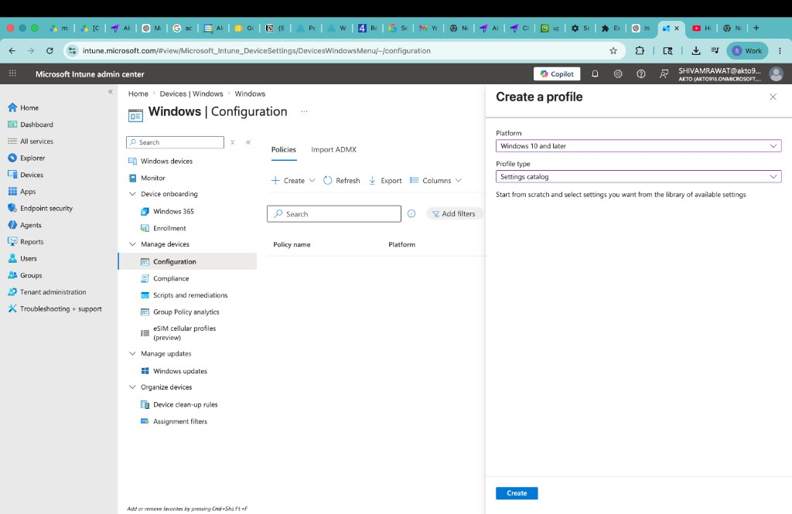
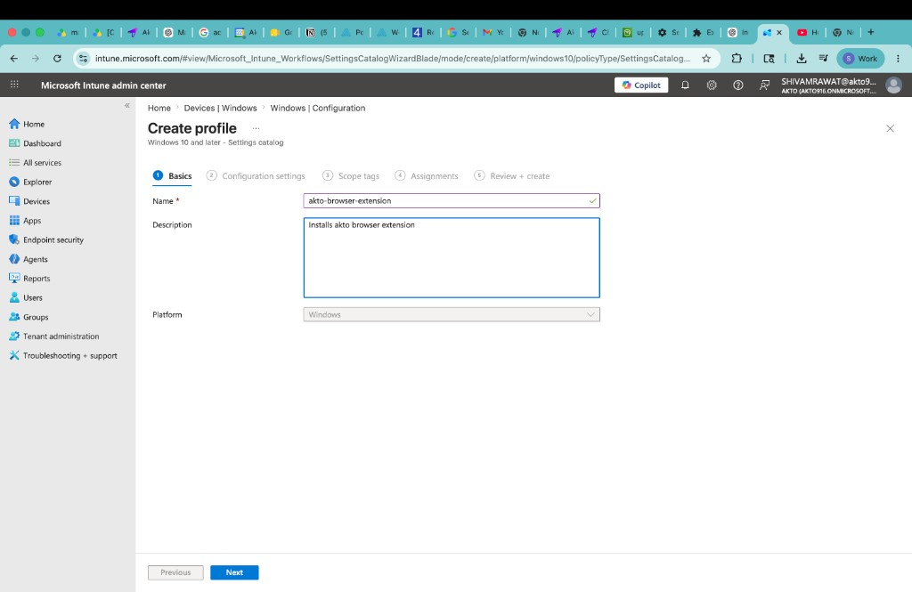
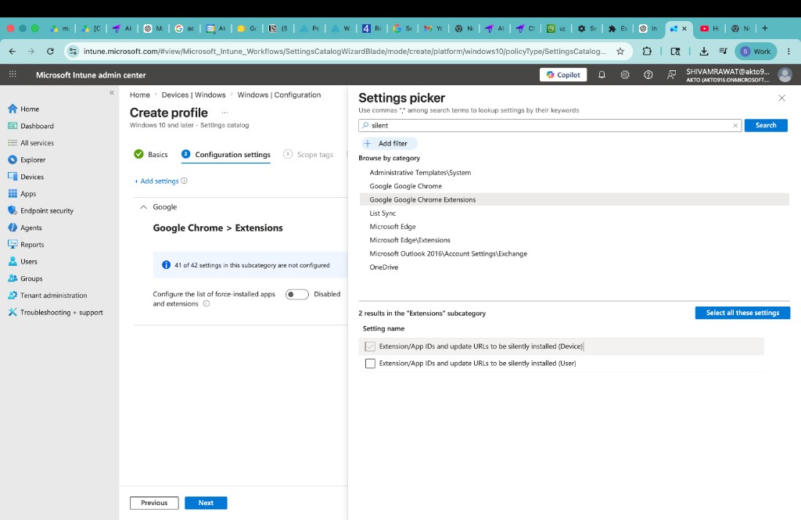
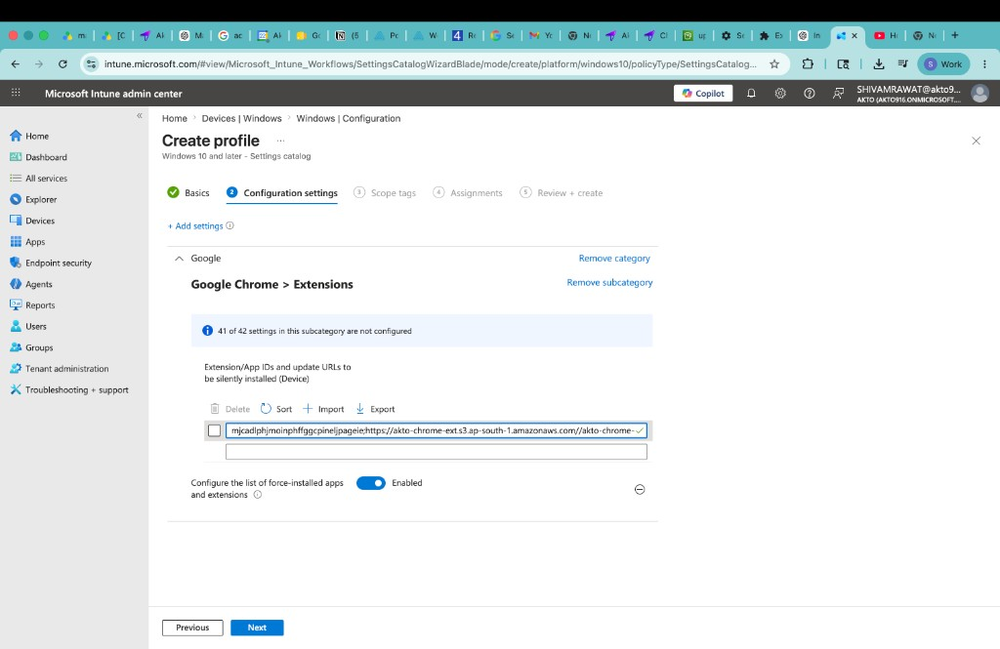
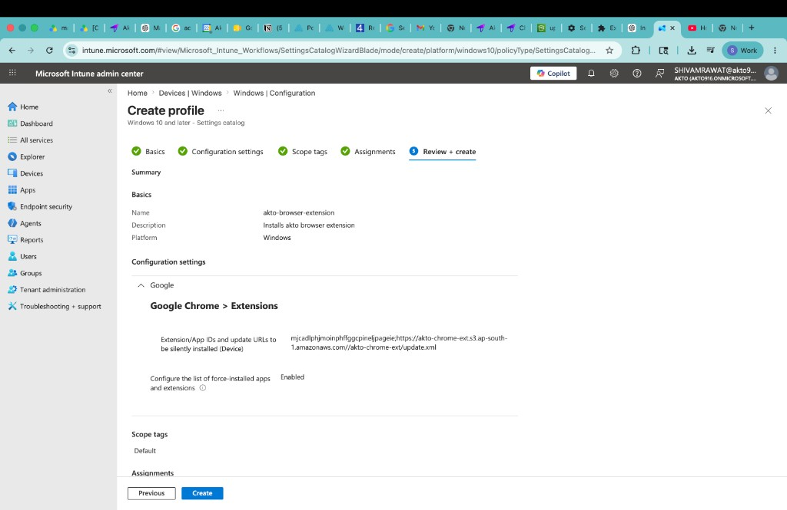

# Intune Deployment (Windows)

Deploy the Akto Security Chrome extension to Windows devices managed by Microsoft Intune using a Settings Catalog profile.

## Overview

This method force-installs the extension for managed devices and keeps it controlled by policy.

Akto provides the required values:

* **Extension ID**
* **Update XML URL**


Use the values exactly as shared by Akto Support. Do not modify the extension ID or update URL format.


## Prerequisites

* Microsoft Intune admin access
* Windows device group(s) already enrolled in Intune
* Google Chrome installed on target devices
* Akto-provided extension details:
  * Extension ID (example format: `xxxxxxxxxxxxxxxxxxxxxxxxxxxxxxxx`)
  * Update XML URL (example format: `https://.../update.xml`)

## Create Intune Configuration Profile



**Go to Windows Configuration in Intune**

1. Open the Microsoft Intune admin center.
2. Navigate to **Devices → Windows → Configuration**.
3. Click **Create**.
4. Set:
   * **Platform:** `Windows 10 and later`
   * **Profile type:** `Settings catalog`
5. Click **Create**.

<div data-with-frame="true"><figure><figcaption>Start a new Settings Catalog profile for Windows devices.</figcaption></figure></div>



**Configure Profile Basics**

1. Enter a profile name, for example: `akto-browser-extension`.
2. Add a description, for example: `Installs Akto browser extension`.
3. Confirm **Platform** is Windows.
4. Click **Next**.

<div data-with-frame="true"><figure><figcaption>Provide profile name and description.</figcaption></figure></div>



**Add Chrome Extension Settings**

1. On **Configuration settings**, click **Add settings**.
2. In **Settings picker**, search for `silent`.
3. Select **Google Chrome \> Extensions**.
4. Choose:
   * **Extension/App IDs and update URLs to be silently installed (Device)**
5. Click **Select these settings**.

<div data-with-frame="true"><figure><figcaption>Select the Chrome extension policy from Settings Catalog.</figcaption></figure></div>



**Set Akto Extension Policy Values**

1. Set **Configure the list of force-installed apps and extensions** to **Enabled**.
2. In **Extension/App IDs and update URLs to be silently installed (Device)**, click **Add**.
3. Enter this value in one line:

```
<AKTO_EXTENSION_ID>;<AKTO_UPDATE_XML_URL>
```

Example:

```
mjcadlphyjmonhffggcpinejpageieeh;https://akto-chrome-ext.s3.ap-south-1.amazonaws.com/akto-chrome-ext/update.xml
```

4. Click **Next**.

<div data-with-frame="true"><figure><figcaption>Add the Akto extension ID and update XML URL, then enable force-install.</figcaption></figure></div>



**Assign and Create the Profile**

1. Complete **Scope tags** as needed.
2. Assign the profile to target device groups.
3. On **Review + create**, verify:
   * Platform is Windows
   * Chrome extension force-install is enabled
   * Extension ID + Update XML URL are correct
4. Click **Create**.

<div data-with-frame="true"><figure><figcaption>Review settings and create the deployment profile.</figcaption></figure></div>



## Validate Deployment

1. Go to **Devices** in Intune and confirm policy assignment status.
2. On a target Windows laptop, open Chrome and check extension presence.
3. In Chrome, open `chrome://policy` and verify Chrome extension policies are applied.
4. Confirm activity is visible in Akto after users browse monitored domains.

## Troubleshooting

* **Extension not installed:** Verify the value format is exactly `<extension_id>;<update_xml_url>`.
* **Policy appears but no extension in Chrome:** Restart Chrome and sync device policies.
* **No Akto traffic visible:** Confirm Browser Extension scope is configured in Akto Settings and target domains match.

## Support

For extension ID/update URL issues or deployment help, contact [**support@akto.io**](mailto:support@akto.io).
