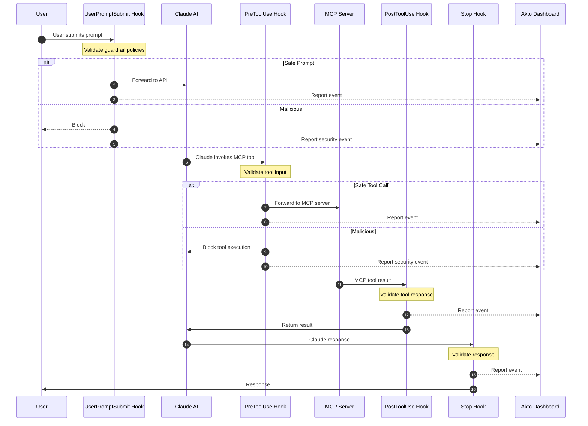

# Claude CLI Hooks — Argus Mode

Akto Guardrails for Claude CLI (Argus mode) provides security validation and observability for AI interactions on **servers and shared environments**. It intercepts prompts, responses, and MCP tool calls, validates them against security policies, blocks risky behavior, and reports all events to your Akto dashboard under **Agentic AI**.

## Key Features

* ✅ **Zero Installation** - No standalone apps to install
* ✅ **Transparent Integration** - Uses Claude CLI's native hook mechanism
* ✅ **Real-time Protection** - Validates every prompt, response, and MCP tool call
* ✅ **Centralized Monitoring** - All events reported to Akto dashboard under Agentic AI
* ✅ **Custom Hostname** - Override the default `api.anthropic.com` host via `AKTO_HOST`
* ✅ **Configurable Behavior** - Blocking or observation-only modes

## How It Works

Claude CLI's hook system executes custom scripts at four critical points:



**4 Hook Points:**

1. `UserPromptSubmit` — Validates prompts before sending to Claude API
2. `PreToolUse` — Validates MCP tool input before execution
3. `PostToolUse` — Captures MCP tool results for observability and response guardrails
4. `Stop` — Validates responses when Claude finishes generating

## File Structure

```
~/.claude/
├── hooks/
│   ├── akto-validate-prompt-wrapper.sh           # Prompt validation wrapper
│   ├── akto-validate-prompt.py                    # Prompt validation logic
│   ├── akto-validate-response-wrapper.sh          # Response validation wrapper
│   ├── akto-validate-response.py                  # Response validation logic
│   ├── akto-validate-mcp-request-wrapper.sh       # MCP tool input wrapper
│   ├── akto-validate-mcp-request.py               # MCP tool input validation
│   ├── akto-validate-mcp-response-wrapper.sh      # MCP tool result wrapper
│   ├── akto-validate-mcp-response.py              # MCP tool result capture
│   └── akto_machine_id.py                         # Device ID utility
├── akto/
│   └── logs/
│       ├── validate-prompt.log
│       ├── validate-response.log
│       ├── validate-mcp-request.log
│       └── validate-mcp-response.log
└── settings.json                                  # Hook configuration
```

**Key Files:**

* **Wrapper scripts (`.sh`)**: Set environment variables, invoke Python scripts
  * ⚠️ **Contains `{{AKTO_DATA_INGESTION_URL}}` placeholder** — Must be replaced with your Akto instance URL
* **Python scripts (`.py`)**: Core validation logic and Akto API communication
* **`akto_machine_id.py`**: Generates unique device identifiers used in ingestion payloads
* **`settings.json`**: Links Claude CLI hook events to wrapper scripts

## Setup Guide

### Prerequisites

* Claude CLI installed ([Installation Guide](https://code.claude.com/docs/en/setup))
* Akto instance URL and token
* Python 3.7+
* macOS, Linux, or Windows with bash/zsh

### Installation Steps



**Create Directories**

```bash
mkdir -p ~/.claude/hooks
mkdir -p ~/.claude/akto/logs
```



**Download Hook Scripts**

```bash
# Base URL for downloading hooks
HOOKS_BASE="https://raw.githubusercontent.com/akto-api-security/akto/master/apps/mcp-endpoint-shield/claude-cli-hooks"

# Download prompt validation hooks
curl -o ~/.claude/hooks/akto-validate-prompt-wrapper.sh \
  "${HOOKS_BASE}/akto-validate-prompt-wrapper.sh"
curl -o ~/.claude/hooks/akto-validate-prompt.py \
  "${HOOKS_BASE}/akto-validate-prompt.py"

# Download response validation hooks
curl -o ~/.claude/hooks/akto-validate-response-wrapper.sh \
  "${HOOKS_BASE}/akto-validate-response-wrapper.sh"
curl -o ~/.claude/hooks/akto-validate-response.py \
  "${HOOKS_BASE}/akto-validate-response.py"

# Download MCP tool hooks
curl -o ~/.claude/hooks/akto-validate-mcp-request-wrapper.sh \
  "${HOOKS_BASE}/akto-validate-mcp-request-wrapper.sh"
curl -o ~/.claude/hooks/akto-validate-mcp-request.py \
  "${HOOKS_BASE}/akto-validate-mcp-request.py"
curl -o ~/.claude/hooks/akto-validate-mcp-response-wrapper.sh \
  "${HOOKS_BASE}/akto-validate-mcp-response-wrapper.sh"
curl -o ~/.claude/hooks/akto-validate-mcp-response.py \
  "${HOOKS_BASE}/akto-validate-mcp-response.py"

# Download utility
curl -o ~/.claude/hooks/akto_machine_id.py \
  "${HOOKS_BASE}/akto_machine_id.py"

# Make executable
chmod +x ~/.claude/hooks/*.sh
```



**Configure Akto Ingestion URL** ⚠️ **CRITICAL STEP**


All wrapper scripts contain the placeholder `{{AKTO_DATA_INGESTION_URL}}` that **must be replaced** with your actual Akto instance URL.


**Automated replacement:**

```bash
# Set your Akto ingestion URL
AKTO_URL="https://your-akto-instance.com"

# Replace URL placeholder across all wrapper scripts
sed -i.bak "s|{{AKTO_DATA_INGESTION_URL}}|${AKTO_URL}|g" ~/.claude/hooks/*-wrapper.sh

# Verify replacement
grep "AKTO_DATA_INGESTION_URL" ~/.claude/hooks/*-wrapper.sh
```

**Manual replacement (alternative):**

Edit each wrapper script and replace:

```bash
export AKTO_DATA_INGESTION_URL="{{AKTO_DATA_INGESTION_URL}}"
```

With:

```bash
export AKTO_DATA_INGESTION_URL="https://your-akto-instance.com"
```

Files to update:

* `akto-validate-prompt-wrapper.sh`
* `akto-validate-response-wrapper.sh`
* `akto-validate-mcp-request-wrapper.sh`
* `akto-validate-mcp-response-wrapper.sh`



**Configure Hooks**

Create Claude CLI settings configuration:

```bash
cat > ~/.claude/settings.json << 'EOF'
{
  "hooks": {
    "UserPromptSubmit": [
      {
        "hooks": [
          {
            "type": "command",
            "command": "bash ~/.claude/hooks/akto-validate-prompt-wrapper.sh",
            "timeout": 10
          }
        ]
      }
    ],
    "Stop": [
      {
        "hooks": [
          {
            "type": "command",
            "command": "bash ~/.claude/hooks/akto-validate-response-wrapper.sh",
            "timeout": 10
          }
        ]
      }
    ],
    "PreToolUse": [
      {
        "hooks": [
          {
            "type": "command",
            "command": "bash ~/.claude/hooks/akto-validate-mcp-request-wrapper.sh",
            "timeout": 10
          }
        ]
      }
    ],
    "PostToolUse": [
      {
        "hooks": [
          {
            "type": "command",
            "command": "bash ~/.claude/hooks/akto-validate-mcp-response-wrapper.sh",
            "timeout": 10
          }
        ]
      }
    ]
  }
}
EOF
```



**Set Token and Optional Custom Hostname**

Add `AKTO_TOKEN` to each wrapper script. Optionally set `AKTO_HOST` to override the default `api.anthropic.com` host header:

```bash
AKTO_TOKEN_VALUE="your-akto-token"
AKTO_HOST_VALUE="my-proxy.corp.example.com"   # optional

for f in ~/.claude/hooks/*-wrapper.sh; do
  # Add token after the AKTO_DATA_INGESTION_URL line
  sed -i.bak "/^export AKTO_DATA_INGESTION_URL/a export AKTO_TOKEN=\"${AKTO_TOKEN_VALUE}\"" "$f"
  # Add custom hostname (remove this line if you want the default api.anthropic.com)
  sed -i.bak "/^export AKTO_CONNECTOR/a export AKTO_HOST=\"${AKTO_HOST_VALUE}\"" "$f"
done
```

Leave `AKTO_HOST` unset to use the default `api.anthropic.com`.



**Configure Hook Behavior (Optional)**

Edit wrapper scripts to customize:

```bash
# In each *-wrapper.sh file:

export MODE="argus"
export AKTO_SYNC_MODE="true"          # "true" (blocking) or "false" (observe only)
export AKTO_TIMEOUT="5"               # Timeout in seconds
export AKTO_CONNECTOR="claude_code_cli"
```

**Sync Mode:**

* **true**: Validates and blocks threats in real time
* **false**: Reports events to Akto but allows all traffic through



**Verify Installation**

Check logs to confirm hooks are working:

```bash
# Run a test prompt
claude "What is 2+2?"

# View prompt hook log
tail -20 ~/.claude/akto/logs/validate-prompt.log
```

A successful Argus mode entry looks like:

```
INFO - MODE: argus, AKTO_HOST: https://api.anthropic.com
INFO - === Hook execution started - Mode: argus, Sync: True ===
INFO - Processing prompt (length: 14 chars)
INFO - Validating prompt against guardrails
INFO - API CALL: POST https://your-akto-instance.com/api/http-proxy?guardrails=true&...
INFO - API RESPONSE: Status 200, Duration: 38ms, Size: 96 bytes
INFO - Prompt ALLOWED by guardrails
INFO - Prompt allowed
```



## Complete Wrapper Script Example

A fully configured Argus mode wrapper script:

```bash
#!/bin/bash
export MODE="argus"
export AKTO_DATA_INGESTION_URL="https://your-akto-instance.com"
export AKTO_TOKEN="your-akto-token"
export AKTO_SYNC_MODE="true"
export AKTO_TIMEOUT="5"
export AKTO_CONNECTOR="claude_code_cli"
export AKTO_HOST="my-proxy.corp.example.com"   # Optional: custom host header value

# Logging Configuration
export LOG_LEVEL="INFO"
export LOG_PAYLOADS="false"

# SSL Configuration
# export SSL_CERT_PATH="/path/to/ca-bundle.crt"
# export SSL_VERIFY="false"  # INSECURE - testing only

exec python3 "$HOME/.claude/hooks/akto-validate-prompt.py" "$@"
```

## Configuration Reference

| Variable | Required | Default | Description |
|---|---|---|---|
| `MODE` | No | `argus` | Set to `argus` (or omit) for Argus mode |
| `AKTO_DATA_INGESTION_URL` | Yes | — | Your Akto instance URL |
| `AKTO_TOKEN` | Yes | — | Authorization token for Akto API |
| `AKTO_HOST` | No | `api.anthropic.com` | Custom `host` header value in requests |
| `AKTO_SYNC_MODE` | No | `true` | `true` = blocking, `false` = observe only |
| `AKTO_TIMEOUT` | No | `5` | Request timeout in seconds |
| `AKTO_CONNECTOR` | No | `claude_code_cli` | Connector identifier in the dashboard |
| `LOG_DIR` | No | `~/.claude/akto/logs` | Directory for log files |
| `LOG_LEVEL` | No | `INFO` | Logging verbosity: DEBUG, INFO, WARNING, ERROR |
| `LOG_PAYLOADS` | No | `false` | Log full request/response payloads |

### Environment Variables (Optional)

Override wrapper script values via shell environment:

```bash
export MODE="argus"
export AKTO_DATA_INGESTION_URL="https://your-akto-instance.com"
export AKTO_TOKEN="your-akto-token"
export AKTO_HOST="my-proxy.corp.example.com"
export AKTO_SYNC_MODE="true"
export AKTO_TIMEOUT="5"
```

## Troubleshooting

### Hooks Not Executing

```bash
# Check settings.json exists and is valid
cat ~/.claude/settings.json | python3 -m json.tool

# Verify scripts are executable
ls -la ~/.claude/hooks/
chmod +x ~/.claude/hooks/*.sh

# Check Claude CLI version
claude --version
```

### Ingestion URL Not Configured

```bash
# Check if placeholder still exists
grep "{{AKTO_DATA_INGESTION_URL}}" ~/.claude/hooks/*-wrapper.sh

# Replace with actual URL
AKTO_URL="https://your-akto-instance.com"
sed -i.bak "s|{{AKTO_DATA_INGESTION_URL}}|${AKTO_URL}|g" ~/.claude/hooks/*-wrapper.sh
```

### Running in Atlas Mode Instead of Argus

```bash
# Verify MODE is set to argus in all wrapper scripts
grep "^export MODE" ~/.claude/hooks/*-wrapper.sh
# Should show: export MODE="argus"

# Fix if needed
sed -i.bak 's|export MODE=.*|export MODE="argus"|' ~/.claude/hooks/*-wrapper.sh
```

### Custom Hostname Not Appearing in Logs

```bash
grep "AKTO_HOST" ~/.claude/hooks/akto-validate-prompt-wrapper.sh
# Should show: export AKTO_HOST="my-proxy.corp.example.com"
```

### Events Not in Dashboard

```bash
# Test API connectivity
curl -s -o /dev/null -w "%{http_code}" \
  "${AKTO_DATA_INGESTION_URL}/api/http-proxy?akto_connector=claude_code_cli"

# Verify URL and token in wrapper scripts
grep -E "AKTO_DATA_INGESTION_URL|AKTO_TOKEN" ~/.claude/hooks/*-wrapper.sh
```

### Check Logs for Errors

```bash
# Tail all logs at once
tail -f ~/.claude/akto/logs/*.log

# Filter errors only
grep -i error ~/.claude/akto/logs/*.log
```

### Hooks Not Blocking Threats

Ensure `AKTO_SYNC_MODE` is `true`:

```bash
grep "AKTO_SYNC_MODE" ~/.claude/hooks/*-wrapper.sh
```

## Uninstallation

### Complete Removal

```bash
# 1. Remove hook configuration
rm ~/.claude/settings.json

# 2. Remove Akto hook scripts
rm -rf ~/.claude/hooks/

# 3. Remove Akto logs (optional — keeps historical data if skipped)
rm -rf ~/.claude/akto/

# No restart needed — Claude CLI reads settings on each invocation
```

### Selective Removal (Keep Logs)

```bash
# Remove only hooks and configuration
rm ~/.claude/settings.json
rm -rf ~/.claude/hooks/

# Akto logs preserved in ~/.claude/akto/
```

### Backup Before Removal

```bash
mkdir -p ~/akto-backup
cp ~/.claude/settings.json ~/akto-backup/claude-settings.json.bak 2>/dev/null
cp -r ~/.claude/akto/ ~/akto-backup/claude-akto-logs/ 2>/dev/null

# Then proceed with removal steps above
```

### Verify Removal

```bash
test -f ~/.claude/settings.json && echo "⚠️  settings.json still exists" || echo "✅ settings.json removed"
test -d ~/.claude/hooks && echo "⚠️  Hook scripts still exist" || echo "✅ Hook scripts removed"
test -d ~/.claude/akto && echo "ℹ️  Logs still present" || echo "✅ Logs removed"
```

## Enterprise Deployment

### Automated Deployment Script

```bash
#!/bin/bash
# deploy-claude-cli-hooks-argus.sh

set -e
AKTO_URL="${1:-https://your-akto-instance.com}"
AKTO_TOKEN_VALUE="${2:-}"
AKTO_HOST_VALUE="${3:-}"   # Optional: custom hostname

echo "🔧 Installing Akto Guardrails for Claude CLI (Argus mode)..."

# Create directories
mkdir -p ~/.claude/hooks ~/.claude/akto/logs

# Download hooks
HOOKS_BASE="https://raw.githubusercontent.com/akto-api-security/akto/master/apps/mcp-endpoint-shield/claude-cli-hooks"
for file in \
  akto-validate-prompt-wrapper.sh akto-validate-prompt.py \
  akto-validate-response-wrapper.sh akto-validate-response.py \
  akto-validate-mcp-request-wrapper.sh akto-validate-mcp-request.py \
  akto-validate-mcp-response-wrapper.sh akto-validate-mcp-response.py \
  akto_machine_id.py; do
  curl -s "${HOOKS_BASE}/${file}" -o ~/.claude/hooks/"${file}"
done

# Make executable
chmod +x ~/.claude/hooks/*.sh

# Configure URL
sed -i.bak "s|{{AKTO_DATA_INGESTION_URL}}|${AKTO_URL}|g" ~/.claude/hooks/*-wrapper.sh

# Inject token and optional custom hostname
for f in ~/.claude/hooks/*-wrapper.sh; do
  if [ -n "${AKTO_TOKEN_VALUE}" ]; then
    sed -i.bak "/^export AKTO_DATA_INGESTION_URL/a export AKTO_TOKEN=\"${AKTO_TOKEN_VALUE}\"" "$f"
  fi
  if [ -n "${AKTO_HOST_VALUE}" ]; then
    sed -i.bak "/^export AKTO_CONNECTOR/a export AKTO_HOST=\"${AKTO_HOST_VALUE}\"" "$f"
  fi
done

# Create settings.json
cat > ~/.claude/settings.json << 'EOFSETTINGS'
{
  "hooks": {
    "UserPromptSubmit": [
      {
        "hooks": [
          {
            "type": "command",
            "command": "bash ~/.claude/hooks/akto-validate-prompt-wrapper.sh",
            "timeout": 10
          }
        ]
      }
    ],
    "Stop": [
      {
        "hooks": [
          {
            "type": "command",
            "command": "bash ~/.claude/hooks/akto-validate-response-wrapper.sh",
            "timeout": 10
          }
        ]
      }
    ],
    "PreToolUse": [
      {
        "hooks": [
          {
            "type": "command",
            "command": "bash ~/.claude/hooks/akto-validate-mcp-request-wrapper.sh",
            "timeout": 10
          }
        ]
      }
    ],
    "PostToolUse": [
      {
        "hooks": [
          {
            "type": "command",
            "command": "bash ~/.claude/hooks/akto-validate-mcp-response-wrapper.sh",
            "timeout": 10
          }
        ]
      }
    ]
  }
}
EOFSETTINGS

echo "✅ Installation complete!"
echo "📍 Akto instance: ${AKTO_URL}"
echo "🔒 Mode: argus"
echo "Test with: claude 'What is 2+2?'"
```

**Deploy to a server or shared environment:**

```bash
curl -fsSL https://your-org.com/deploy-claude-cli-hooks-argus.sh | \
  bash -s https://your-akto-instance.com your-akto-token my-proxy.corp.example.com
```

## Quick Setup Summary

```bash
# 1. Create directories
mkdir -p ~/.claude/hooks ~/.claude/akto/logs

# 2. Download all hook scripts (see Download Hook Scripts above)

# 3. ⚠️ Configure Akto URL (REQUIRED)
AKTO_URL="https://your-akto-instance.com"
sed -i.bak "s|{{AKTO_DATA_INGESTION_URL}}|${AKTO_URL}|g" ~/.claude/hooks/*-wrapper.sh

# 4. Make scripts executable
chmod +x ~/.claude/hooks/*.sh

# 5. Create settings.json (see Configure Hooks above)

# 6. Test
claude "What is 2+2?"
tail -5 ~/.claude/akto/logs/validate-prompt.log
```

## Resources

* **GitHub**: [https://github.com/akto-api-security/akto](https://github.com/akto-api-security/akto)
* **Support**: [support@akto.io](mailto:support@akto.io)
* **Community**: [https://www.akto.io/community](https://www.akto.io/community)
