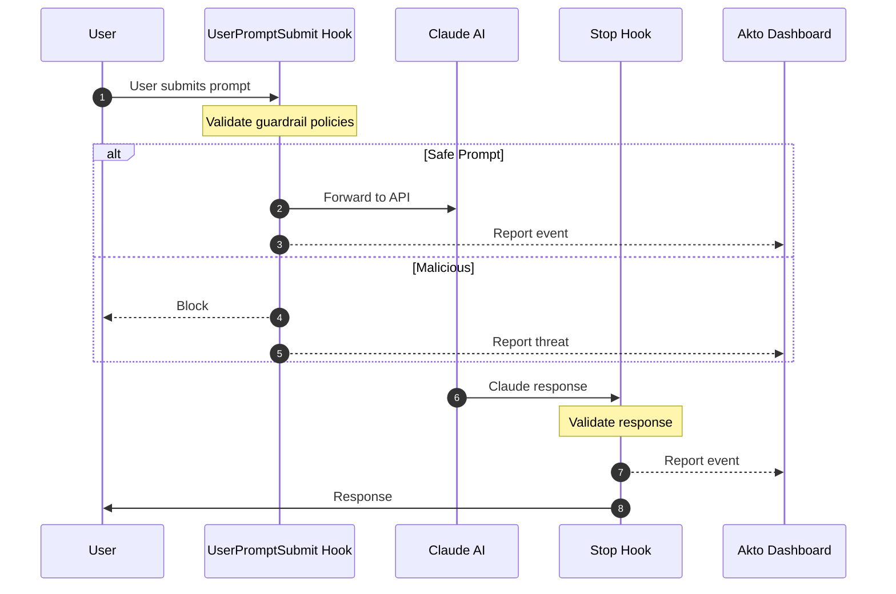

# Claude CLI Hooks

Akto Guardrails for Claude CLI provides security validation for AI interactions. It intercepts prompts before sending to Claude and responses after generation, validates against security policies, blocks risky behavior, and reports events to your Akto dashboard.

## Key Features

* ✅ **Zero Installation** - No standalone apps to install
* ✅ **Transparent Integration** - Uses Claude CLI's native hook mechanism
* ✅ **Real-time Protection** - Validates every prompt and response
* ✅ **Centralized Monitoring** - All events reported to Akto dashboard
* ✅ **Flexible Deployment** - Supports Argus and Atlas modes
* ✅ **Configurable Behavior** - Blocking or observation modes

## How It Works

Claude CLI's hook system executes custom scripts at two critical points:



**2 Hook Points:**

1. `UserPromptSubmit` - Validates prompts before sending to Claude API
2. `Stop` - Validates responses when Claude finishes generating

## File Structure

```
~/.claude/
├── hooks/
│   ├── akto-validate-prompt-wrapper.sh       # Prompt validation wrapper
│   ├── akto-validate-prompt.py                # Prompt validation logic
│   ├── akto-validate-response-wrapper.sh      # Response validation wrapper
│   ├── akto-validate-response.py              # Response validation logic
│   └── akto_machine_id.py                     # Device ID utility
├── akto/
│   └── logs/
│       ├── validate-prompt.log
│       └── validate-response.log
└── settings.json                              # Hook configuration
```

**Key Files:**

* **Wrapper scripts (`.sh`)**: Set environment variables, invoke Python scripts
  * ⚠️ **Contains `AKTO_DATA_INGESTION_URL` placeholder** - Must be replaced with your Akto instance URL
* **Python scripts (`.py`)**: Core validation logic and Akto API communication
* **`akto_machine_id.py`**: Generates unique device identifiers for Atlas mode
* **`settings.json`**: Links hooks to wrapper scripts

## Setup Guide

### Prerequisites

* Claude CLI installed ([Installation Guide](https://code.claude.com/docs/en/setup))
* Akto instance URL
* Python 3.7+
* macOS, Linux, or Windows with bash/zsh

### Installation Steps



**Create Directories**

```bash
mkdir -p ~/.claude/hooks
mkdir -p ~/.claude/akto/logs
```



**Download Hook Scripts**

```bash
# Base URL for downloading hooks
HOOKS_BASE="https://raw.githubusercontent.com/akto-api-security/akto/agent-hooks/apps/mcp-endpoint-shield/claude-cli-hooks"

# Download prompt validation hooks
curl -o ~/.claude/hooks/akto-validate-prompt-wrapper.sh \
  "${HOOKS_BASE}/akto-validate-prompt-wrapper.sh"
curl -o ~/.claude/hooks/akto-validate-prompt.py \
  "${HOOKS_BASE}/akto-validate-prompt.py"

# Download response validation hooks
curl -o ~/.claude/hooks/akto-validate-response-wrapper.sh \
  "${HOOKS_BASE}/akto-validate-response-wrapper.sh"
curl -o ~/.claude/hooks/akto-validate-response.py \
  "${HOOKS_BASE}/akto-validate-response.py"

# Download utility
curl -o ~/.claude/hooks/akto_machine_id.py \
  "${HOOKS_BASE}/akto_machine_id.py"

# Make executable
chmod +x ~/.claude/hooks/*.sh
```



**Configure Akto Ingestion URL** ⚠️ **CRITICAL STEP**


All wrapper scripts contain placeholder `{{AKTO_DATA_INGESTION_URL}}` that **must be replaced** with your actual Akto instance URL.


**Automated replacement:**

```bash
# Set your Akto ingestion URL
AKTO_URL="https://your-akto-instance.com"

# Update all wrapper scripts
sed -i.bak "s|{{AKTO_DATA_INGESTION_URL}}|${AKTO_URL}|g" ~/.claude/hooks/*-wrapper.sh

# Verify replacement
grep "AKTO_DATA_INGESTION_URL" ~/.claude/hooks/*-wrapper.sh
```

**Manual replacement (alternative):**

Edit each wrapper script and replace:

```bash
AKTO_DATA_INGESTION_URL="{{AKTO_DATA_INGESTION_URL}}"
```

With:

```bash
AKTO_DATA_INGESTION_URL="https://your-akto-instance.com"
```

Files to update:

* `akto-validate-prompt-wrapper.sh`
* `akto-validate-response-wrapper.sh`



**Configure Hooks**

Create Claude CLI settings configuration:

```bash
cat > ~/.claude/settings.json << 'EOF'
{
  "hooks": {
    "UserPromptSubmit": [
      {
        "hooks": [
          {
            "type": "command",
            "command": "bash ~/.claude/hooks/akto-validate-prompt-wrapper.sh",
            "timeout": 10
          }
        ]
      }
    ],
    "Stop": [
      {
        "hooks": [
          {
            "type": "command",
            "command": "bash ~/.claude/hooks/akto-validate-response-wrapper.sh",
            "timeout": 10
          }
        ]
      }
    ]
  }
}
EOF
```



**Configure Hook Behavior (Optional)**

Edit wrapper scripts to customize:

```bash
# In each *-wrapper.sh file:

MODE="atlas"                    # "argus" or "atlas"
AKTO_SYNC_MODE="true"          # "true" (blocking) or "false" (observe only)
AKTO_TIMEOUT="5"               # Timeout in seconds
AKTO_CONNECTOR="claude_code_cli"
```

**Mode Options:**

* **Argus**: Standard validation and reporting
* **Atlas**: Includes device-specific metadata

**Sync Mode:**

* **true**: Blocks threats
* **false**: Reports but allows execution



**Install Python Dependencies**

```bash
pip3 install requests

# Verify installation
python3 -c "import requests; print('Requests installed successfully')"
```



**Verify Installation**

Check logs to confirm hooks are working:

```bash
# View logs
tail -f ~/.claude/akto/logs/validate-prompt.log
tail -f ~/.claude/akto/logs/validate-response.log
```

Test by running a Claude command:

```bash
claude "What is 2+2?"
```

You should see log entries indicating validation occurred.



## Configuration Reference

### Wrapper Script Variables

```bash
MODE="atlas"                                            # "argus" or "atlas"
AKTO_DATA_INGESTION_URL="{{AKTO_DATA_INGESTION_URL}}"  # ⚠️ MUST REPLACE
AKTO_SYNC_MODE="true"                                  # "true" or "false"
AKTO_TIMEOUT="5"                                       # Timeout in seconds
AKTO_CONNECTOR="claude_code_cli"                       # Connector identifier
CLAUDE_API_URL="https://api.anthropic.com"             # Claude API endpoint
```

### Environment Variables (Optional)

Override defaults via environment variables or config file:

**Option 1: Environment variables**

```bash
export MODE="atlas"
export AKTO_DATA_INGESTION_URL="https://your-akto-instance.com"
export AKTO_SYNC_MODE="true"
export AKTO_TIMEOUT="5"
```

**Option 2: Config file**

```bash
# Create ~/.claude/akto/config
cat > ~/.claude/akto/config << 'EOF'
AKTO_DATA_INGESTION_URL=https://your-akto-instance.com
AKTO_TIMEOUT=5
CLAUDE_API_URL=https://api.anthropic.com
AKTO_SYNC_MODE=true
MODE=atlas
EOF

chmod 600 ~/.claude/akto/config
```

## Troubleshooting

### Hooks Not Executing

```bash
# Check settings.json exists and is valid
cat ~/.claude/settings.json | python3 -m json.tool

# Verify scripts are executable
ls -la ~/.claude/hooks/
chmod +x ~/.claude/hooks/*.sh

# Check Claude CLI version
claude --version
```

### Ingestion URL Not Configured

```bash
# Check if placeholder still exists
grep "{{AKTO_DATA_INGESTION_URL}}" ~/.claude/hooks/*-wrapper.sh

# Replace with actual URL
AKTO_URL="https://your-akto-instance.com"
sed -i.bak "s|{{AKTO_DATA_INGESTION_URL}}|${AKTO_URL}|g" ~/.claude/hooks/*-wrapper.sh
```

### Check Logs for Errors

```bash
# View logs
cat ~/.claude/akto/logs/validate-prompt.log
cat ~/.claude/akto/logs/validate-response.log

# Check for errors
grep -i error ~/.claude/akto/logs/*.log
```

### Events Not in Dashboard

```bash
# Test API connectivity
curl -X POST "${AKTO_DATA_INGESTION_URL}/api/v1/events" \
  -H "Content-Type: application/json" \
  -d '{"test": "event"}'

# Verify URL in wrapper scripts
grep "AKTO_DATA_INGESTION_URL" ~/.claude/hooks/*-wrapper.sh
```

### Python Dependencies Missing

```bash
# Install required packages
pip3 install requests

# Verify installation
python3 -c "import requests; print(requests.__version__)"
```

## Uninstallation

To completely remove Akto hooks from Claude CLI:

### Complete Removal

```bash
# 1. Remove hook configuration
rm ~/.claude/settings.json

# 2. Remove Akto hook scripts
rm -rf ~/.claude/hooks/

# 3. Remove Akto logs (optional - keeps historical data if skipped)
rm -rf ~/.claude/akto/

# 4. No restart needed - Claude CLI reads settings on each invocation
```

### Selective Removal (Keep Logs)

If you want to preserve logs for audit purposes:

```bash
# Remove only hooks and configuration
rm ~/.claude/settings.json
rm -rf ~/.claude/hooks/

# Akto logs preserved in ~/.claude/akto/
```

### Backup Before Removal

```bash
# Backup configuration and logs before removal
mkdir -p ~/akto-backup
cp ~/.claude/settings.json ~/akto-backup/claude-settings.json.bak 2>/dev/null
cp -r ~/.claude/akto/ ~/akto-backup/claude-akto-logs/ 2>/dev/null

# Then proceed with removal steps above
```

### Verify Removal

```bash
# Check that hooks are removed
test -f ~/.claude/settings.json && echo "⚠️  settings.json still exists" || echo "✅ settings.json removed"
test -d ~/.claude/hooks && echo "⚠️  Hook scripts still exist" || echo "✅ Hook scripts removed"

# Check if logs are removed (if you chose to remove them)
test -d ~/.claude/akto && echo "ℹ️  Logs still present" || echo "✅ Logs removed"
```

### Restore Claude CLI to Default

After uninstallation, Claude CLI will operate without Akto security monitoring. No additional configuration is needed beyond removing the files. Test with:

```bash
claude "Test message"
```

## Enterprise Deployment

### Automated Deployment Script

```bash
#!/bin/bash
# deploy-claude-cli-hooks.sh

set -e
AKTO_URL="${1:-https://your-akto-instance.com}"

echo "🔧 Installing Akto Guardrails for Claude CLI..."

# Create directories
mkdir -p ~/.claude/hooks ~/.claude/akto/logs

# Download hooks
HOOKS_BASE="https://raw.githubusercontent.com/akto-api-security/akto/agent-hooks/apps/mcp-endpoint-shield/claude-cli-hooks"
curl -s "${HOOKS_BASE}/akto-validate-prompt-wrapper.sh" -o ~/.claude/hooks/akto-validate-prompt-wrapper.sh
curl -s "${HOOKS_BASE}/akto-validate-prompt.py" -o ~/.claude/hooks/akto-validate-prompt.py
curl -s "${HOOKS_BASE}/akto-validate-response-wrapper.sh" -o ~/.claude/hooks/akto-validate-response-wrapper.sh
curl -s "${HOOKS_BASE}/akto-validate-response.py" -o ~/.claude/hooks/akto-validate-response.py
curl -s "${HOOKS_BASE}/akto_machine_id.py" -o ~/.claude/hooks/akto_machine_id.py

# Make executable
chmod +x ~/.claude/hooks/*.sh

# Configure URL
sed -i.bak "s|{{AKTO_DATA_INGESTION_URL}}|${AKTO_URL}|g" ~/.claude/hooks/*-wrapper.sh

# Create config file
cat > ~/.claude/akto/config << EOFCONFIG
AKTO_DATA_INGESTION_URL=${AKTO_URL}
AKTO_TIMEOUT=5
CLAUDE_API_URL=https://api.anthropic.com
AKTO_SYNC_MODE=true
MODE=atlas
EOFCONFIG
chmod 600 ~/.claude/akto/config

# Create settings.json
cat > ~/.claude/settings.json << 'EOFSETTINGS'
{
  "hooks": {
    "UserPromptSubmit": [
      {
        "hooks": [
          {
            "type": "command",
            "command": "bash ~/.claude/hooks/akto-validate-prompt-wrapper.sh",
            "timeout": 10
          }
        ]
      }
    ],
    "Stop": [
      {
        "hooks": [
          {
            "type": "command",
            "command": "bash ~/.claude/hooks/akto-validate-response-wrapper.sh",
            "timeout": 10
          }
        ]
      }
    ]
  }
}
EOFSETTINGS

# Install dependencies
pip3 install requests

echo "✅ Installation complete!"
echo "📍 Akto instance: ${AKTO_URL}"
echo "Test with: claude 'What is 2+2?'"
```

**Deploy to developers:**

```bash
curl -fsSL https://your-org.com/deploy-claude-cli-hooks.sh | bash -s https://your-akto-instance.com
```

## Comparison with Cursor Hooks

| Feature                 | Claude CLI Hooks                                    | Cursor Hooks                                             |
| ----------------------- | --------------------------------------------------- | -------------------------------------------------------- |
| **Platform**            | Claude CLI                                          | Cursor IDE                                               |
| **Hook Points**         | 2 (Prompt + Response)                               | 4 (Chat + MCP, each with req/resp)                       |
| **Chat Monitoring**     | ✅ Yes (UserPromptSubmit, Stop)                      | ✅ Yes (beforeSubmitPrompt, afterAgentResponse)           |
| **MCP Tool Monitoring** | ❌ No                                                | ✅ Yes (beforeMCPExecution, afterMCPExecution)            |
| **Total Files**         | 6 files (2 wrappers, 2 Python, 1 utility, 1 config) | 10 files (4 wrappers, 4 Python, 1 utility, 1 config)     |
| **Configuration File**  | `~/.claude/settings.json`                           | `~/.cursor/hooks.json`                                   |
| **Log Location**        | `~/.claude/akto/logs/`                              | `~/.cursor/akto/chat-logs/` + `~/.cursor/akto/mcp-logs/` |
| **Setup Complexity**    | Fewer files, simpler                                | More files, more comprehensive                           |

**See also:** [Cursor Hooks](cursor-hooks.md) for Cursor IDE setup

## Quick Setup Summary

```bash
# 1. Create directories
mkdir -p ~/.claude/hooks ~/.claude/akto/logs

# 2. Download all hook scripts from GitHub (see step 2 above)

# 3. ⚠️ Configure Akto URL (REQUIRED)
AKTO_URL="https://your-akto-instance.com"
sed -i.bak "s|{{AKTO_DATA_INGESTION_URL}}|${AKTO_URL}|g" ~/.claude/hooks/*-wrapper.sh

# 4. Make executable
chmod +x ~/.claude/hooks/*.sh

# 5. Create settings.json (see step 4 above)

# 6. Install dependencies
pip3 install requests

# 7. Test
claude "What is 2+2?"
```

## Resources

* **Claude CLI**: [https://github.com/anthropics/claude-cli](https://github.com/anthropics/claude-cli)
* **GitHub**: [https://github.com/akto-api-security/akto](https://github.com/akto-api-security/akto)
* **Support**: [support@akto.io](mailto:support@akto.io)
* **Community**: [https://www.akto.io/community](https://www.akto.io/community)
