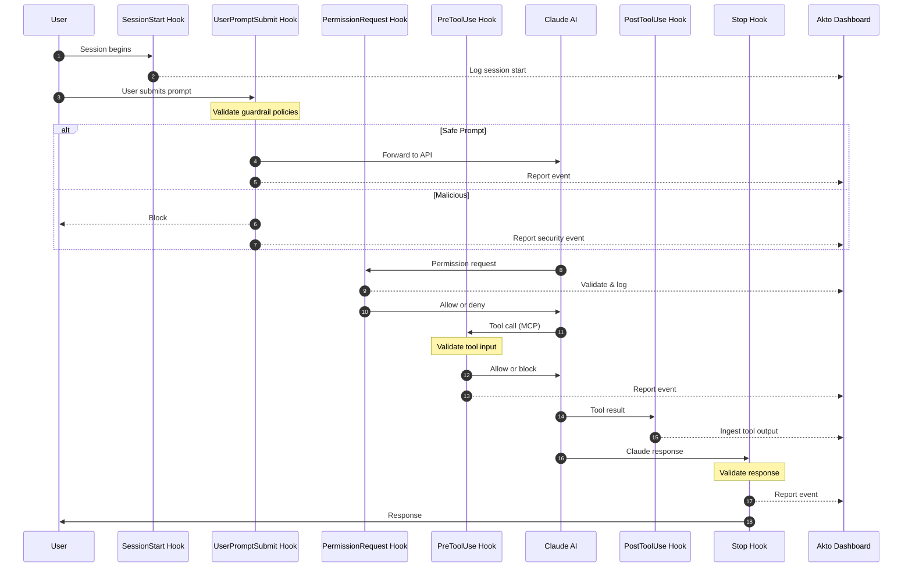

# Claude CLI Hooks

Akto Guardrails for Claude CLI provides security validation for AI interactions. It intercepts prompts before sending to Claude and responses after generation, validates against security policies, blocks risky behavior, and reports events to your Akto dashboard.

## Key Features

* ✅ **Zero Installation** - No standalone apps to install
* ✅ **Transparent Integration** - Uses Claude CLI's native hook mechanism
* ✅ **Real-time Protection** - Validates every prompt and response
* ✅ **Centralized Monitoring** - All events reported to Akto dashboard
* ✅ **Flexible Deployment** - Supports Argus and Atlas modes
* ✅ **Configurable Behavior** - Blocking or observation modes

## How It Works

Claude CLI's hook system executes custom scripts at multiple lifecycle points:


```mermaid
sequenceDiagram
    autonumber
    participant User
    participant SessionHook as SessionStart Hook
    participant PromptHook as UserPromptSubmit Hook
    participant PermHook as PermissionRequest Hook
    participant ToolHook as PreToolUse Hook
    participant Claude as Claude AI
    participant PostToolHook as PostToolUse Hook
    participant ResponseHook as Stop Hook
    participant Akto as Akto Dashboard

    User->>SessionHook: Session begins
    SessionHook-->>Akto: Log session start

    User->>PromptHook: User submits prompt
    Note over PromptHook: Validate guardrail policies
    alt Safe Prompt
        PromptHook->>Claude: Forward to API
        PromptHook-->>Akto: Report event
    else Malicious
        PromptHook-->>User: Block
        PromptHook-->>Akto: Report security event
    end

    Claude->>PermHook: Permission request
    PermHook-->>Akto: Validate & log
    PermHook->>Claude: Allow or deny

    Claude->>ToolHook: Tool call (MCP)
    Note over ToolHook: Validate tool input
    ToolHook->>Claude: Allow or block
    ToolHook-->>Akto: Report event

    Claude->>PostToolHook: Tool result
    PostToolHook-->>Akto: Ingest tool output

    Claude->>ResponseHook: Claude response
    Note over ResponseHook: Validate response
    ResponseHook-->>Akto: Report event
    ResponseHook->>User: Response
```

## Hook Points

Akto covers **25 hook points** across the full Claude CLI session lifecycle, grouped into two categories:

### Blocking Hooks

These hooks can actively block or deny operations based on guardrails policy:

| Hook Event | Script | Blocks Via | Description |
|---|---|---|---|
| `UserPromptSubmit` | `akto-validate-prompt-wrapper.sh` → `akto-validate-prompt.py` | Non-zero exit / `decision: block` | Validates user prompts before sending to Claude API |
| `PreToolUse` | `akto-validate-mcp-request-wrapper.sh` → `akto-validate-mcp-request.py` | Non-zero exit / `decision: block` | Validates MCP tool inputs before execution |
| `PermissionRequest` | `akto-hook-wrapper.sh` → `akto-hooks.py PermissionRequest` | `decision.behavior: deny` | Validates permission requests and can deny with a custom message |
| `ConfigChange` | `akto-hook-wrapper.sh` → `akto-hooks.py ConfigChange` | `decision: block` | Validates configuration changes against guardrails policy |
| `Elicitation` | `akto-hook-wrapper.sh` → `akto-hooks.py Elicitation` | `action: decline` | Validates MCP elicitation requests (form prompts from MCP servers) |
| `ElicitationResult` | `akto-hook-wrapper.sh` → `akto-hooks.py ElicitationResult` | `action: decline` | Validates MCP elicitation results submitted by the user |
| `SubagentStop` | `akto-hook-wrapper.sh` → `akto-sub-agent-stop.py` | `decision: block` / `continue: false` | Validates subagent completion; can block result or stop the main session |
| `TaskCreated` | `akto-hook-wrapper.sh` → `akto-hooks.py TaskCreated` | `continue: false` | Validates task creation against guardrails policy |
| `TaskCompleted` | `akto-hook-wrapper.sh` → `akto-hooks.py TaskCompleted` | `continue: false` | Validates task completion against guardrails policy |

### Observability Hooks

These hooks report events to Akto for monitoring but cannot block:

| Hook Event | Script | Description |
|---|---|---|
| `SessionStart` | `akto-hook-wrapper.sh` → `akto-hooks.py SessionStart` | Logs session initialization metadata |
| `SessionEnd` | `akto-hook-wrapper.sh` → `akto-hooks.py SessionEnd` | Logs session termination metadata |
| `InstructionsLoaded` | `akto-hook-wrapper.sh` → `akto-instructions-loaded.py` | Logs instruction file loads including file content, for compliance tracking |
| `PostToolUse` | `akto-validate-mcp-response-wrapper.sh` → `akto-validate-mcp-response.py` | Ingests MCP tool input/output data |
| `PostToolUseFailure` | `akto-hook-wrapper.sh` → `akto-hooks.py PostToolUseFailure` | Logs tool execution failures (tool name, input, error) |
| `Stop` | `akto-validate-response-wrapper.sh` → `akto-validate-response.py` | Ingests full prompt/response conversation data |
| `StopFailure` | `akto-hook-wrapper.sh` → `akto-hooks.py StopFailure` | Logs events when Claude fails to stop gracefully |
| `SubagentStart` | `akto-hook-wrapper.sh` → `akto-sub-agent-start.py` | Logs subagent creation and extracts the triggering user prompt from transcript |
| `TeammateIdle` | `akto-hook-wrapper.sh` → `akto-hooks.py TeammateIdle` | Logs team collaboration events when a teammate becomes idle |
| `Notification` | `akto-hook-wrapper.sh` → `akto-hooks.py Notification` | Logs notifications emitted by Claude CLI |
| `CwdChanged` | `akto-hook-wrapper.sh` → `akto-hooks.py CwdChanged` | Logs working directory change events |
| `FileChanged` | `akto-hook-wrapper.sh` → `akto-hooks.py FileChanged` | Logs file change events within the session |
| `PermissionDenied` | `akto-hook-wrapper.sh` → `akto-hooks.py PermissionDenied` | Logs events when Claude CLI denies a permission request |
| `PreCompact` | `akto-hook-wrapper.sh` → `akto-hooks.py PreCompact` | Logs pre-compaction events before transcript compression |
| `PostCompact` | `akto-hook-wrapper.sh` → `akto-hooks.py PostCompact` | Logs post-compaction events after transcript is summarized |
| `WorktreeRemove` | `akto-hook-wrapper.sh` → `akto-hooks.py WorktreeRemove` | Logs git worktree deletion events |

## File Structure

```
~/.claude/
├── hooks/
│   ├── akto-hook-wrapper.sh                   # Generic wrapper — sets env vars, invokes target Python script
│   ├── akto-hooks.py                          # Single dispatcher for all misc hooks (SessionStart, PermissionRequest, ConfigChange, etc.)
│   │
│   ├── # Prompt & Response (dedicated wrappers)
│   ├── akto-validate-prompt-wrapper.sh        # Prompt validation wrapper
│   ├── akto-validate-prompt.py                # Prompt validation logic
│   ├── akto-validate-response-wrapper.sh      # Response validation wrapper
│   ├── akto-validate-response.py              # Response ingestion logic
│   │
│   ├── # MCP Tool Validation (dedicated wrappers)
│   ├── akto-validate-mcp-request-wrapper.sh   # MCP request validation wrapper
│   ├── akto-validate-mcp-request.py           # MCP request validation logic
│   ├── akto-validate-mcp-response-wrapper.sh  # MCP response wrapper
│   ├── akto-validate-mcp-response.py          # MCP response ingestion logic
│   │
│   ├── # Standalone hooks (invoked directly via akto-hook-wrapper.sh)
│   ├── akto-instructions-loaded.py            # InstructionsLoaded
│   ├── akto-sub-agent-start.py                # SubagentStart
│   ├── akto-sub-agent-stop.py                 # SubagentStop
│   │
│   ├── akto_ingestion_utility.py              # Shared ingestion utility (from shared/)
│   └── akto_machine_id.py                     # Device ID utility (from shared/)
├── akto/
│   └── logs/                                  # Per-hook log files
└── settings.json                              # Hook configuration
```

**Key Files:**

* **`akto-hook-wrapper.sh`**: Generic wrapper — sets environment variables, then invokes the target Python script passed as argument
* **`akto-hooks.py`**: Single dispatcher for misc hooks — takes hook name as argument (`akto-hooks.py SessionStart`), routes to `akto_ingestion_utility`
* **Dedicated wrapper scripts (`*-wrapper.sh`)**: Used for prompt, response, and MCP hooks that have their own URL/config
* **Standalone scripts**: `akto-instructions-loaded.py`, `akto-sub-agent-start.py`, `akto-sub-agent-stop.py` — invoked directly via `akto-hook-wrapper.sh`
* **`akto_ingestion_utility.py`**: Shared utility for sending data to Akto — sourced from `shared/`
* **`akto_machine_id.py`**: Generates unique device identifiers for Atlas mode — sourced from `shared/`
* **`settings.json`**: Maps all 25 hook events to their respective scripts

## Setup Guide

### Prerequisites

* Claude CLI installed ([Installation Guide](https://code.claude.com/docs/en/setup))
* Akto instance URL
* Python 3.7+
* macOS, Linux, or Windows with bash/zsh

### Installation Steps



**Create Directories**

```bash
mkdir -p ~/.claude/hooks
mkdir -p ~/.claude/akto/logs
```



**Download Hook Scripts**

```bash
# Base URLs
HOOKS_BASE="https://raw.githubusercontent.com/akto-api-security/akto/master/apps/mcp-endpoint-shield/claude-cli-hooks"
SHARED_BASE="https://raw.githubusercontent.com/akto-api-security/akto/master/apps/mcp-endpoint-shield/shared"

# Download shared utilities (sourced from shared/, not hooks/)
curl -o ~/.claude/hooks/akto_ingestion_utility.py \
  "${SHARED_BASE}/akto_ingestion_utility.py"
curl -o ~/.claude/hooks/akto_machine_id.py \
  "${SHARED_BASE}/akto_machine_id.py"

# Download generic wrapper
curl -o ~/.claude/hooks/akto-hook-wrapper.sh \
  "${HOOKS_BASE}/akto-hook-wrapper.sh"

# Download prompt validation hooks
curl -o ~/.claude/hooks/akto-validate-prompt-wrapper.sh \
  "${HOOKS_BASE}/akto-validate-prompt-wrapper.sh"
curl -o ~/.claude/hooks/akto-validate-prompt.py \
  "${HOOKS_BASE}/akto-validate-prompt.py"

# Download response validation hooks
curl -o ~/.claude/hooks/akto-validate-response-wrapper.sh \
  "${HOOKS_BASE}/akto-validate-response-wrapper.sh"
curl -o ~/.claude/hooks/akto-validate-response.py \
  "${HOOKS_BASE}/akto-validate-response.py"

# Download MCP validation hooks
curl -o ~/.claude/hooks/akto-validate-mcp-request-wrapper.sh \
  "${HOOKS_BASE}/akto-validate-mcp-request-wrapper.sh"
curl -o ~/.claude/hooks/akto-validate-mcp-request.py \
  "${HOOKS_BASE}/akto-validate-mcp-request.py"
curl -o ~/.claude/hooks/akto-validate-mcp-response-wrapper.sh \
  "${HOOKS_BASE}/akto-validate-mcp-response-wrapper.sh"
curl -o ~/.claude/hooks/akto-validate-mcp-response.py \
  "${HOOKS_BASE}/akto-validate-mcp-response.py"

# Download misc hooks dispatcher + standalone hooks
curl -o ~/.claude/hooks/akto-hooks.py \
  "${HOOKS_BASE}/akto-hooks.py"
curl -o ~/.claude/hooks/akto-instructions-loaded.py \
  "${HOOKS_BASE}/akto-instructions-loaded.py"
curl -o ~/.claude/hooks/akto-sub-agent-start.py \
  "${HOOKS_BASE}/akto-sub-agent-start.py"
curl -o ~/.claude/hooks/akto-sub-agent-stop.py \
  "${HOOKS_BASE}/akto-sub-agent-stop.py"

# Make executable
chmod +x ~/.claude/hooks/*.sh
```



**Configure Akto Ingestion URL** ⚠️ **CRITICAL STEP**


All wrapper scripts contain placeholder `{{AKTO_DATA_INGESTION_URL}}` that **must be replaced** with your actual Akto instance URL.


**Automated replacement:**

```bash
# Set your Akto ingestion URL
AKTO_URL="https://your-akto-instance.com"

# Update all wrapper scripts
sed -i.bak "s|{{AKTO_DATA_INGESTION_URL}}|${AKTO_URL}|g" ~/.claude/hooks/*-wrapper.sh
sed -i.bak "s|{{AKTO_DATA_INGESTION_URL}}|${AKTO_URL}|g" ~/.claude/hooks/akto-hook-wrapper.sh

# Verify replacement
grep "AKTO_DATA_INGESTION_URL" ~/.claude/hooks/*.sh
```

**Manual replacement (alternative):**

Edit each wrapper script and replace:

```bash
AKTO_DATA_INGESTION_URL="{{AKTO_DATA_INGESTION_URL}}"
```

With:

```bash
AKTO_DATA_INGESTION_URL="https://your-akto-instance.com"
```



**Configure Hooks**

Merge Akto hooks into your existing `~/.claude/settings.json` (replaces the `hooks` key, preserving all other settings):

```bash
SETTINGS="$HOME/.claude/settings.json"

# Create empty settings.json if it doesn't exist
[ -f "$SETTINGS" ] || echo '{}' > "$SETTINGS"

# Merge Akto hooks into existing settings.json
jq -s '.[0] * .[1]' "$SETTINGS" <(curl -s "${HOOKS_BASE}/settings.json") \
  > /tmp/akto_settings_merged.json && mv /tmp/akto_settings_merged.json "$SETTINGS"
```



**Configure Hook Behavior (Optional)**

Edit `akto-hook-wrapper.sh` to customize global defaults:

```bash
# In akto-hook-wrapper.sh:

MODE="atlas"                    # "argus" or "atlas"
AKTO_SYNC_MODE="true"          # "true" (blocking) or "false" (observe only)
AKTO_TIMEOUT="5"               # Timeout in seconds
AKTO_CONNECTOR="claude_code_cli"
```

**Mode Options:**

* **Argus**: Standard validation and reporting
* **Atlas**: Includes device-specific metadata

**Sync Mode:**

* **true**: Blocks threats
* **false**: Reports but allows execution



**Install Python Dependencies**

```bash
pip3 install requests

# Verify installation
python3 -c "import requests; print('Requests installed successfully')"
```



**Verify Installation**

Check logs to confirm hooks are working:

```bash
# View logs
tail -f ~/.claude/akto/logs/validate-prompt.log
tail -f ~/.claude/akto/logs/validate-response.log
```

Test by running a Claude command:

```bash
claude "What is 2+2?"
```

You should see log entries indicating validation occurred.



## Configuration Reference

### Generic Wrapper Variables (`akto-hook-wrapper.sh`)

```bash
MODE="atlas"                                            # "argus" or "atlas"
AKTO_DATA_INGESTION_URL="{{AKTO_DATA_INGESTION_URL}}"  # ⚠️ MUST REPLACE
AKTO_SYNC_MODE="true"                                  # "true" or "false"
AKTO_TIMEOUT="5"                                       # Timeout in seconds
AKTO_CONNECTOR="claude_code_cli"                       # Connector identifier
CONTEXT_SOURCE="ENDPOINT"                              # Context source tag
```

### Environment Variables (Optional)

Override defaults via environment variables or config file:

**Option 1: Environment variables**

```bash
export MODE="atlas"
export AKTO_DATA_INGESTION_URL="https://your-akto-instance.com"
export AKTO_SYNC_MODE="true"
export AKTO_TIMEOUT="5"
```

**Option 2: Config file**

```bash
# Create ~/.claude/akto/config
cat > ~/.claude/akto/config << 'EOF'
AKTO_DATA_INGESTION_URL=https://your-akto-instance.com
AKTO_TIMEOUT=5
CLAUDE_API_URL=https://api.anthropic.com
AKTO_SYNC_MODE=true
MODE=atlas
EOF

chmod 600 ~/.claude/akto/config
```

## Troubleshooting

### Hooks Not Executing

```bash
# Check settings.json exists and is valid
cat ~/.claude/settings.json | python3 -m json.tool

# Verify scripts are executable
ls -la ~/.claude/hooks/
chmod +x ~/.claude/hooks/*.sh

# Check Claude CLI version
claude --version
```

### Ingestion URL Not Configured

```bash
# Check if placeholder still exists
grep "{{AKTO_DATA_INGESTION_URL}}" ~/.claude/hooks/*.sh

# Replace with actual URL
AKTO_URL="https://your-akto-instance.com"
sed -i.bak "s|{{AKTO_DATA_INGESTION_URL}}|${AKTO_URL}|g" ~/.claude/hooks/*.sh
```

### Check Logs for Errors

```bash
# View all logs
ls ~/.claude/akto/logs/

# Check specific log
cat ~/.claude/akto/logs/validate-prompt.log

# Check for errors across all logs
grep -i error ~/.claude/akto/logs/*.log
```

### Events Not in Dashboard

```bash
# Test API connectivity
curl -X POST "${AKTO_DATA_INGESTION_URL}/api/v1/events" \
  -H "Content-Type: application/json" \
  -d '{"test": "event"}'

# Verify URL in wrapper scripts
grep "AKTO_DATA_INGESTION_URL" ~/.claude/hooks/*.sh
```

### Python Dependencies Missing

```bash
# Install required packages
pip3 install requests

# Verify installation
python3 -c "import requests; print(requests.__version__)"
```

## Uninstallation

To completely remove Akto hooks from Claude CLI:

### Complete Removal

```bash
# 1. Remove hook configuration
rm ~/.claude/settings.json

# 2. Remove Akto hook scripts
rm -rf ~/.claude/hooks/

# 3. Remove Akto logs (optional - keeps historical data if skipped)
rm -rf ~/.claude/akto/

# 4. No restart needed - Claude CLI reads settings on each invocation
```

### Selective Removal (Keep Logs)

If you want to preserve logs for audit purposes:

```bash
# Remove only hooks and configuration
rm ~/.claude/settings.json
rm -rf ~/.claude/hooks/

# Akto logs preserved in ~/.claude/akto/
```

### Backup Before Removal

```bash
# Backup configuration and logs before removal
mkdir -p ~/akto-backup
cp ~/.claude/settings.json ~/akto-backup/claude-settings.json.bak 2>/dev/null
cp -r ~/.claude/akto/ ~/akto-backup/claude-akto-logs/ 2>/dev/null

# Then proceed with removal steps above
```

### Verify Removal

```bash
# Check that hooks are removed
test -f ~/.claude/settings.json && echo "settings.json still exists" || echo "settings.json removed"
test -d ~/.claude/hooks && echo "Hook scripts still exist" || echo "Hook scripts removed"

# Check if logs are removed (if you chose to remove them)
test -d ~/.claude/akto && echo "Logs still present" || echo "Logs removed"
```

### Restore Claude CLI to Default

After uninstallation, Claude CLI will operate without Akto security monitoring. No additional configuration is needed beyond removing the files. Test with:

```bash
claude "Test message"
```

## Enterprise Deployment

### Automated Deployment Script

```bash
#!/bin/bash
# deploy-claude-cli-hooks.sh

set -e
AKTO_URL="${1:-https://your-akto-instance.com}"

echo "Installing Akto Guardrails for Claude CLI..."

# Create directories
mkdir -p ~/.claude/hooks ~/.claude/akto/logs

# Base URLs
HOOKS_BASE="https://raw.githubusercontent.com/akto-api-security/akto/master/apps/mcp-endpoint-shield/claude-cli-hooks"
SHARED_BASE="https://raw.githubusercontent.com/akto-api-security/akto/master/apps/mcp-endpoint-shield/shared"

# Shared utilities (sourced from shared/, not hooks/)
curl -s "${SHARED_BASE}/akto_ingestion_utility.py" -o ~/.claude/hooks/akto_ingestion_utility.py
curl -s "${SHARED_BASE}/akto_machine_id.py" -o ~/.claude/hooks/akto_machine_id.py

# Wrappers
for wrapper in \
  akto-hook-wrapper.sh \
  akto-validate-prompt-wrapper.sh \
  akto-validate-response-wrapper.sh \
  akto-validate-mcp-request-wrapper.sh \
  akto-validate-mcp-response-wrapper.sh; do
  curl -s "${HOOKS_BASE}/${wrapper}" -o ~/.claude/hooks/${wrapper}
done

# Python hook scripts
for hook in \
  akto-validate-prompt.py akto-validate-response.py \
  akto-validate-mcp-request.py akto-validate-mcp-response.py \
  akto-hooks.py \
  akto-instructions-loaded.py \
  akto-sub-agent-start.py akto-sub-agent-stop.py; do
  curl -s "${HOOKS_BASE}/${hook}" -o ~/.claude/hooks/${hook}
done

# Make executable
chmod +x ~/.claude/hooks/*.sh

# Configure URL in all wrapper scripts
sed -i.bak "s|{{AKTO_DATA_INGESTION_URL}}|${AKTO_URL}|g" ~/.claude/hooks/*.sh

# Create config file
cat > ~/.claude/akto/config << EOFCONFIG
AKTO_DATA_INGESTION_URL=${AKTO_URL}
AKTO_TIMEOUT=5
CLAUDE_API_URL=https://api.anthropic.com
AKTO_SYNC_MODE=true
MODE=atlas
EOFCONFIG
chmod 600 ~/.claude/akto/config

# Merge Akto hooks into existing settings.json (preserves other settings)
SETTINGS="$HOME/.claude/settings.json"
[ -f "$SETTINGS" ] || echo '{}' > "$SETTINGS"
jq -s '.[0] * .[1]' "$SETTINGS" <(curl -s "${HOOKS_BASE}/settings.json") \
  > /tmp/akto_settings_merged.json && mv /tmp/akto_settings_merged.json "$SETTINGS"

# Install dependencies
pip3 install requests

echo "Installation complete!"
echo "Akto instance: ${AKTO_URL}"
echo "Test with: claude 'What is 2+2?'"
```

**Deploy to developers:**

```bash
curl -fsSL https://your-org.com/deploy-claude-cli-hooks.sh | bash -s https://your-akto-instance.com
```

## Quick Setup Summary

```bash
# 1. Create directories
mkdir -p ~/.claude/hooks ~/.claude/akto/logs

# 2. Download all hook scripts from GitHub (see step 2 above)

# 3. Configure Akto URL (REQUIRED)
AKTO_URL="https://your-akto-instance.com"
sed -i.bak "s|{{AKTO_DATA_INGESTION_URL}}|${AKTO_URL}|g" ~/.claude/hooks/*.sh

# 4. Make executable
chmod +x ~/.claude/hooks/*.sh

# 5. Merge Akto hooks into settings.json (see step 4 above)

# 6. Install dependencies
pip3 install requests

# 7. Test
claude "What is 2+2?"
```

## Resources

* **GitHub**: [https://github.com/akto-api-security/akto](https://github.com/akto-api-security/akto)
* **Support**: [support@akto.io](mailto:support@akto.io)
* **Community**: [https://www.akto.io/community](https://www.akto.io/community)
