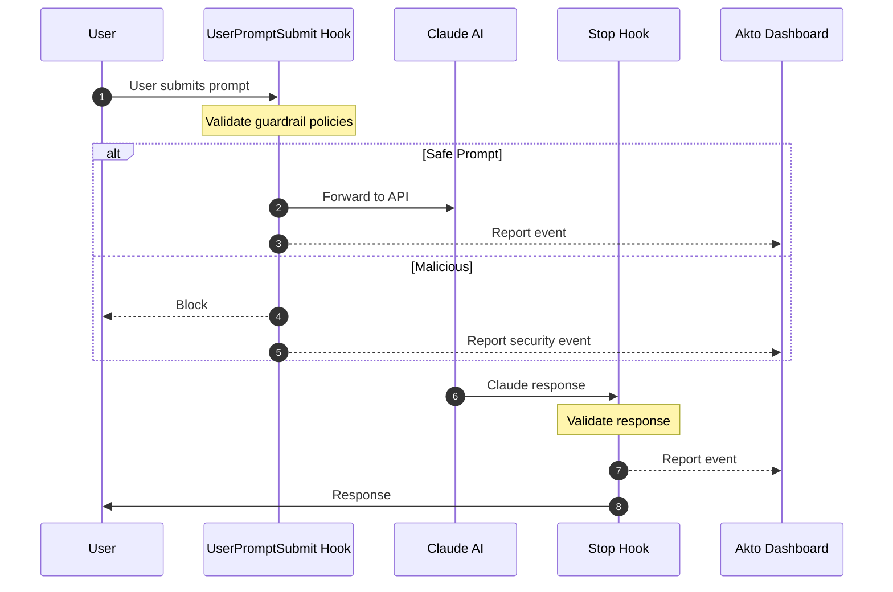

# Claude CLI Hooks

Akto Guardrails for Claude CLI provides security validation for AI interactions. It intercepts prompts before sending to Claude and responses after generation, validates against security policies, blocks risky behavior, and reports events to your Akto dashboard.

## Key Features

* ✅ **Zero Installation** - No standalone apps to install
* ✅ **Transparent Integration** - Uses Claude CLI's native hook mechanism
* ✅ **Real-time Protection** - Validates every prompt and response
* ✅ **Centralized Monitoring** - All events reported to Akto dashboard
* ✅ **Flexible Deployment** - Supports Argus and Atlas modes
* ✅ **Configurable Behavior** - Blocking or observation modes

## How It Works

Claude CLI's hook system executes custom scripts at two critical points:


```mermaid
sequenceDiagram
    autonumber
    participant User
    participant PromptHook as UserPromptSubmit Hook
    participant Claude as Claude AI
    participant ResponseHook as Stop Hook
    participant Akto as Akto Dashboard

    User->>PromptHook: User submits prompt
    Note over PromptHook: Validate guardrail policies
    alt Safe Prompt
        PromptHook->>Claude: Forward to API
        PromptHook-->>Akto: Report event
    else Malicious
        PromptHook-->>User: Block
        PromptHook-->>Akto: Report security event
    end

    Claude->>ResponseHook: Claude response
    Note over ResponseHook: Validate response
    ResponseHook-->>Akto: Report event
    ResponseHook->>User: Response
```

**2 Hook Points:**

1. `UserPromptSubmit` - Validates prompts before sending to Claude API
2. `Stop` - Validates responses when Claude finishes generating

## File Structure

```
~/.claude/
├── hooks/
│   ├── akto-validate-prompt-wrapper.sh       # Prompt validation wrapper
│   ├── akto-validate-prompt.py                # Prompt validation logic
│   ├── akto-validate-response-wrapper.sh      # Response validation wrapper
│   ├── akto-validate-response.py              # Response validation logic
│   ├── akto_ingestion_utility.py              # Shared validation/ingestion logic
│   ├── akto_heartbeat.py                      # Device heartbeat publisher
│   └── akto_machine_id.py                     # Device ID utility
├── akto/
│   └── logs/
│       ├── validate-prompt.log
│       └── validate-response.log
└── settings.json                              # Hook configuration
```

**Key Files:**

* **Wrapper scripts (`.sh`)**: Set environment variables, invoke Python scripts
  * ⚠️ **Contains `AKTO_DATA_INGESTION_URL` placeholder** - Must be replaced with your Akto instance URL
* **Python scripts (`.py`)**: Core validation logic and Akto API communication
* **`akto_ingestion_utility.py`**: Shared validation/ingestion logic imported by every hook script — lives in a different GitHub directory (`shared/`, not `claude-cli-hooks/`), so it needs its own download step
* **`akto_heartbeat.py`**: Registers this device with Akto every 30s. Required — without a heartbeat record, mini-runtime cannot resolve the device to a user and **drops every hook event before indexing**, so the endpoint never appears under LLM observability / traces even though ingestion succeeds
* **`akto_machine_id.py`**: Generates unique device identifiers for Atlas mode
* **`settings.json`**: Links hooks to wrapper scripts

## Setup Guide

### Prerequisites

* Claude CLI installed ([Installation Guide](https://code.claude.com/docs/en/setup))
* Akto instance URL
* Python 3.7+
* macOS, Linux, or Windows with bash/zsh

### Installation Steps



**Create Directories**

```bash
mkdir -p ~/.claude/hooks
mkdir -p ~/.claude/akto/logs
```



**Download Hook Scripts**

```bash
# Base URLs for downloading hooks
HOOKS_BASE="https://raw.githubusercontent.com/akto-api-security/akto/master/apps/mcp-endpoint-shield/claude-cli-hooks"
SHARED_BASE="https://raw.githubusercontent.com/akto-api-security/akto/master/apps/mcp-endpoint-shield/shared"

# Download prompt validation hooks
curl -o ~/.claude/hooks/akto-validate-prompt-wrapper.sh \
  "${HOOKS_BASE}/akto-validate-prompt-wrapper.sh"
curl -o ~/.claude/hooks/akto-validate-prompt.py \
  "${HOOKS_BASE}/akto-validate-prompt.py"

# Download response validation hooks
curl -o ~/.claude/hooks/akto-validate-response-wrapper.sh \
  "${HOOKS_BASE}/akto-validate-response-wrapper.sh"
curl -o ~/.claude/hooks/akto-validate-response.py \
  "${HOOKS_BASE}/akto-validate-response.py"

# Download utility
curl -o ~/.claude/hooks/akto_machine_id.py \
  "${HOOKS_BASE}/akto_machine_id.py"

# Download the heartbeat publisher
curl -o ~/.claude/hooks/akto_heartbeat.py \
  "${HOOKS_BASE}/akto_heartbeat.py"

# Download shared ingestion utility (note: SHARED_BASE, not HOOKS_BASE)
curl -o ~/.claude/hooks/akto_ingestion_utility.py \
  "${SHARED_BASE}/akto_ingestion_utility.py"

# Make executable
chmod +x ~/.claude/hooks/*.sh
```


`akto_ingestion_utility.py` must land in the same directory as the hook scripts — they import it as a plain top-level module, resolved from the script's own directory. Skipping this download makes every hook fail with `ModuleNotFoundError: No module named 'akto_ingestion_utility'`.




**Configure Akto Ingestion URL, API Token and Device ID** ⚠️ **CRITICAL STEP**


All wrapper scripts contain the placeholders `{{AKTO_DATA_INGESTION_URL}}`, `{{AKTO_API_TOKEN}}` and `{{DEVICE_ID (optional)}}` that **must be replaced** — the URL with your actual Akto instance URL, and the token with your Akto API token (obtain it from **Akto Atlas → Connectors → Setup Guardrail** card). If your deployment does not require auth, set the token to an empty string so the placeholder is removed (an unsubstituted `{{AKTO_API_TOKEN}}` would be sent as an invalid `Authorization` header).



`{{DEVICE_ID (optional)}}` is optional in name only — the hooks do **not** treat an unsubstituted placeholder as empty. `DEVICE_ID` becomes the first label of the reported hostname (`<DEVICE_ID>.ai-agent.claudecli`), and the dashboard displays that label verbatim as the device name. Leave the placeholder in and every machine in your org reports the literal string `{{DEVICE_ID (optional)}}`, collapsing them all into a single device.


**Automated replacement:**

```bash
# Set your Akto ingestion URL and API token
AKTO_URL="https://your-akto-instance.com"
AKTO_API_TOKEN="your-akto-api-token"   # leave empty ("") if your deployment doesn't require auth

# Build the device label: <computer-name>-<first 8 chars of machine id>
# Works on macOS (scutil/ioreg) and Linux (hostname//etc/machine-id).
# Non-alphanumerics become '-' so the label cannot contain a dot: the dashboard
# splits the reported host on '.', and a dotted label would be truncated.
DEVICE_NAME=$(scutil --get ComputerName 2>/dev/null | tr -d '\n')
if [ -z "$DEVICE_NAME" ]; then DEVICE_NAME=$(hostname 2>/dev/null | tr -d '\n'); fi
if [ -z "$DEVICE_NAME" ]; then DEVICE_NAME=$(uname -n 2>/dev/null | tr -d '\n'); fi
DEVICE_NAME=$(printf '%s' "${DEVICE_NAME%.local}" | sed 's/[^a-zA-Z0-9]/-/g')

MACHINE_ID=$(ioreg -rd1 -c IOPlatformExpertDevice 2>/dev/null | awk -F'"' '/IOPlatformUUID/{print $4}')
if [ -z "$MACHINE_ID" ] && [ -r /etc/machine-id ]; then MACHINE_ID=$(tr -d '\n' < /etc/machine-id); fi
MACHINE_ID=$(printf '%s' "$MACHINE_ID" | tr -cd 'a-fA-F0-9' | tr '[:upper:]' '[:lower:]')

DEVICE_ID="${DEVICE_NAME:-unknown-device}"
if [ -n "$MACHINE_ID" ]; then DEVICE_ID="${DEVICE_ID}-$(printf '%s' "$MACHINE_ID" | cut -c1-8)"; fi
echo "Device label: $DEVICE_ID"

# Update all wrapper scripts
sed -i.bak "s|{{AKTO_DATA_INGESTION_URL}}|${AKTO_URL}|g" ~/.claude/hooks/*-wrapper.sh
sed -i.bak "s|{{AKTO_API_TOKEN}}|${AKTO_API_TOKEN}|g" ~/.claude/hooks/*-wrapper.sh
sed -i.bak "s|{{DEVICE_ID (optional)}}|${DEVICE_ID}|g" ~/.claude/hooks/*-wrapper.sh

# Verify replacement — no {{...}} should remain
grep -E "AKTO_DATA_INGESTION_URL|AKTO_API_TOKEN|DEVICE_ID" ~/.claude/hooks/*-wrapper.sh
grep -l "{{" ~/.claude/hooks/*-wrapper.sh && echo "⚠️  placeholders still present" || echo "✅ all placeholders substituted"
```

**Manual replacement (alternative):**

Edit each wrapper script and replace:

```bash
AKTO_DATA_INGESTION_URL="{{AKTO_DATA_INGESTION_URL}}"
AKTO_API_TOKEN="{{AKTO_API_TOKEN}}"
DEVICE_ID="{{DEVICE_ID (optional)}}"
```

With:

```bash
AKTO_DATA_INGESTION_URL="https://your-akto-instance.com"
AKTO_API_TOKEN="your-akto-api-token"
DEVICE_ID="My-MacBook-Pro-f0929fe8"
```

Files to update:

* `akto-validate-prompt-wrapper.sh`
* `akto-validate-response-wrapper.sh`



**Configure Hooks**

Create Claude CLI settings configuration:

```bash
cat > ~/.claude/settings.json << 'EOF'
{
  "hooks": {
    "UserPromptSubmit": [
      {
        "hooks": [
          {
            "type": "command",
            "command": "bash ~/.claude/hooks/akto-validate-prompt-wrapper.sh",
            "timeout": 10
          }
        ]
      }
    ],
    "Stop": [
      {
        "hooks": [
          {
            "type": "command",
            "command": "bash ~/.claude/hooks/akto-validate-response-wrapper.sh",
            "timeout": 10
          }
        ]
      }
    ]
  }
}
EOF
```



**Configure Hook Behavior (Optional)**

Edit wrapper scripts to customize:

```bash
# In each *-wrapper.sh file:

MODE="atlas"                    # "argus" or "atlas"
AKTO_SYNC_MODE="true"          # "true" (blocking) or "false" (observe only)
AKTO_TIMEOUT="5"               # Timeout in seconds
AKTO_CONNECTOR="claude_code_cli"
```

**Mode Options:**

* **Argus**: Standard validation and reporting
* **Atlas**: Includes device-specific metadata

**Sync Mode:**

* **true**: Blocks threats
* **false**: Reports but allows execution



**Install Python Dependencies**

```bash
pip3 install requests

# Verify installation
python3 -c "import requests; print('Requests installed successfully')"
```



**Verify Installation**

Check logs to confirm hooks are working:

```bash
# View logs
tail -f ~/.claude/akto/logs/validate-prompt.log
tail -f ~/.claude/akto/logs/validate-response.log
```

Test by running a Claude command:

```bash
claude "What is 2+2?"
```

You should see log entries indicating validation occurred.



## Configuration Reference

### Wrapper Script Variables

```bash
MODE="atlas"                                            # "argus" or "atlas"
AKTO_DATA_INGESTION_URL="{{AKTO_DATA_INGESTION_URL}}"  # ⚠️ MUST REPLACE
AKTO_API_TOKEN="{{AKTO_API_TOKEN}}"                    # Akto API token (Authorization header)
DEVICE_ID="{{DEVICE_ID (optional)}}"                   # ⚠️ MUST REPLACE — becomes the device name
AKTO_SYNC_MODE="true"                                  # "true" or "false"
AKTO_TIMEOUT="5"                                       # Timeout in seconds
AKTO_CONNECTOR="claude_code_cli"                       # Connector identifier
CLAUDE_API_URL="https://api.anthropic.com"             # Claude API endpoint
DATABASE_ABSTRACTOR_SERVICE_URL="https://cyborg.akto.io"  # Heartbeat target (on-prem: override)
```


**On-prem deployments must override `DATABASE_ABSTRACTOR_SERVICE_URL`.** The wrappers default to the SaaS cyborg endpoint. If your Akto runs on-prem, point it at your own abstractor before the heartbeat can register the device — and until it registers, LLM observability and traces stay empty.

```bash
export DATABASE_ABSTRACTOR_SERVICE_URL="https://cyborg.your-akto-instance.com"
sed -i.bak "s|^export DATABASE_ABSTRACTOR_SERVICE_URL=.*|export DATABASE_ABSTRACTOR_SERVICE_URL=\"${DATABASE_ABSTRACTOR_SERVICE_URL}\"|" \
  ~/.claude/hooks/*-wrapper.sh
```


**How `DEVICE_ID` is reported:** the hooks send `<DEVICE_ID>.ai-agent.claudecli` as the request host, and the dashboard uses the first label of that host as the device name. If `DEVICE_ID` is empty the hooks fall back to the lowercased computer name (or, where that cannot be resolved, the raw machine UUID — which is why a device sometimes shows up as a bare hex string).

```bash
export DEVICE_ID="My-MacBook-Pro-f0929fe8"   # <name>-<first 8 of machine id>
```

### Environment Variables (Optional)

Override defaults via environment variables or config file:

**Option 1: Environment variables**

```bash
export MODE="atlas"
export AKTO_DATA_INGESTION_URL="https://your-akto-instance.com"
export AKTO_API_TOKEN="your-akto-api-token"
export AKTO_SYNC_MODE="true"
export AKTO_TIMEOUT="5"
```

**Option 2: Config file**

```bash
# Create ~/.claude/akto/config
cat > ~/.claude/akto/config << 'EOF'
AKTO_DATA_INGESTION_URL=https://your-akto-instance.com
AKTO_API_TOKEN=your-akto-api-token
AKTO_TIMEOUT=5
CLAUDE_API_URL=https://api.anthropic.com
AKTO_SYNC_MODE=true
MODE=atlas
EOF

chmod 600 ~/.claude/akto/config
```

## Troubleshooting

### `ModuleNotFoundError: No module named 'akto_ingestion_utility'`

The shared ingestion utility was not downloaded, or landed outside `~/.claude/hooks/`. It lives in the `shared/` directory on GitHub, **not** under `HOOKS_BASE`, so it needs its own `curl`.

```bash
# Confirm the file is missing
ls -l ~/.claude/hooks/akto_ingestion_utility.py

# Fetch it into the same directory as the hook scripts
SHARED_BASE="https://raw.githubusercontent.com/akto-api-security/akto/master/apps/mcp-endpoint-shield/shared"
curl -o ~/.claude/hooks/akto_ingestion_utility.py \
  "${SHARED_BASE}/akto_ingestion_utility.py"

# Verify the import resolves
python3 -c "import sys; sys.path.insert(0, '$HOME/.claude/hooks'); import akto_ingestion_utility; print('OK')"
```

If the file is present and the import still fails, check that `PYTHONSAFEPATH` is unset — it suppresses the script-directory entry on `sys.path` that this import relies on.

```bash
env | grep -i pythonsafepath   # must return nothing
```

### Endpoint Appears in Inventory but Traces / LLM Observability Are Empty

Ingestion and trace indexing are separate paths. mini-runtime resolves each hook event's device to a user via the heartbeat record (`moduleInfo.name` → `additionalData.username`); an event whose device has no heartbeat, and which carries no `user_email` header, is discarded before indexing. Claude Code's hook payloads never carry an email, so the heartbeat is the only thing that can satisfy this — the collection still shows up in inventory, which is why the endpoint looks connected.

```bash
# Was the heartbeat publisher installed?
ls -l ~/.claude/hooks/akto_heartbeat.py

# Has it sent recently? (unix timestamp of the last successful send)
cat ~/.claude/akto/logs/last_heartbeat

# Look for the send/skip line
grep -i heartbeat ~/.claude/akto/logs/*.log | tail -5
```

If the file is missing, re-run the download step. If it is present but never sends, confirm `DATABASE_ABSTRACTOR_SERVICE_URL` points at a reachable abstractor (see the hint above) and that `AKTO_AGENT_HEARTBEAT` is **not** set — that flag is for machines where the Akto agent already publishes the heartbeat, and it disables publishing from the hook.

```bash
grep -E "AKTO_AGENT_HEARTBEAT|DATABASE_ABSTRACTOR_SERVICE_URL" ~/.claude/hooks/*-wrapper.sh
```

### Hooks Not Executing

```bash
# Check settings.json exists and is valid
cat ~/.claude/settings.json | python3 -m json.tool

# Verify scripts are executable
ls -la ~/.claude/hooks/
chmod +x ~/.claude/hooks/*.sh

# Check Claude CLI version
claude --version
```

### Ingestion URL Not Configured

```bash
# Check if placeholder still exists
grep "{{AKTO_DATA_INGESTION_URL}}" ~/.claude/hooks/*-wrapper.sh

# Replace with actual URL
AKTO_URL="https://your-akto-instance.com"
sed -i.bak "s|{{AKTO_DATA_INGESTION_URL}}|${AKTO_URL}|g" ~/.claude/hooks/*-wrapper.sh
```

### Check Logs for Errors

```bash
# View logs
cat ~/.claude/akto/logs/validate-prompt.log
cat ~/.claude/akto/logs/validate-response.log

# Check for errors
grep -i error ~/.claude/akto/logs/*.log
```

### Events Not in Dashboard

```bash
# Test API connectivity
curl -X POST "${AKTO_DATA_INGESTION_URL}/api/v1/events" \
  -H "Content-Type: application/json" \
  -d '{"test": "event"}'

# Verify URL in wrapper scripts
grep "AKTO_DATA_INGESTION_URL" ~/.claude/hooks/*-wrapper.sh
```

### Python Dependencies Missing

```bash
# Install required packages
pip3 install requests

# Verify installation
python3 -c "import requests; print(requests.__version__)"
```

## Uninstallation

To completely remove Akto hooks from Claude CLI:

### Complete Removal

```bash
# 1. Remove hook configuration
rm ~/.claude/settings.json

# 2. Remove Akto hook scripts
rm -rf ~/.claude/hooks/

# 3. Remove Akto logs (optional - keeps historical data if skipped)
rm -rf ~/.claude/akto/

# 4. No restart needed - Claude CLI reads settings on each invocation
```

### Selective Removal (Keep Logs)

If you want to preserve logs for audit purposes:

```bash
# Remove only hooks and configuration
rm ~/.claude/settings.json
rm -rf ~/.claude/hooks/

# Akto logs preserved in ~/.claude/akto/
```

### Backup Before Removal

```bash
# Backup configuration and logs before removal
mkdir -p ~/akto-backup
cp ~/.claude/settings.json ~/akto-backup/claude-settings.json.bak 2>/dev/null
cp -r ~/.claude/akto/ ~/akto-backup/claude-akto-logs/ 2>/dev/null

# Then proceed with removal steps above
```

### Verify Removal

```bash
# Check that hooks are removed
test -f ~/.claude/settings.json && echo "⚠️  settings.json still exists" || echo "✅ settings.json removed"
test -d ~/.claude/hooks && echo "⚠️  Hook scripts still exist" || echo "✅ Hook scripts removed"

# Check if logs are removed (if you chose to remove them)
test -d ~/.claude/akto && echo "ℹ️  Logs still present" || echo "✅ Logs removed"
```

### Restore Claude CLI to Default

After uninstallation, Claude CLI will operate without Akto security monitoring. No additional configuration is needed beyond removing the files. Test with:

```bash
claude "Test message"
```

## Enterprise Deployment

### Automated Deployment Script

```bash
#!/bin/bash
# deploy-claude-cli-hooks.sh

set -e
AKTO_URL="${1:-https://your-akto-instance.com}"
AKTO_API_TOKEN="${2:-}"   # optional: pass your Akto API token as the 2nd argument

echo "🔧 Installing Akto Guardrails for Claude CLI..."

# Create directories
mkdir -p ~/.claude/hooks ~/.claude/akto/logs

# Download hooks
HOOKS_BASE="https://raw.githubusercontent.com/akto-api-security/akto/master/apps/mcp-endpoint-shield/claude-cli-hooks"
SHARED_BASE="https://raw.githubusercontent.com/akto-api-security/akto/master/apps/mcp-endpoint-shield/shared"
curl -s "${HOOKS_BASE}/akto-validate-prompt-wrapper.sh" -o ~/.claude/hooks/akto-validate-prompt-wrapper.sh
curl -s "${HOOKS_BASE}/akto-validate-prompt.py" -o ~/.claude/hooks/akto-validate-prompt.py
curl -s "${HOOKS_BASE}/akto-validate-response-wrapper.sh" -o ~/.claude/hooks/akto-validate-response-wrapper.sh
curl -s "${HOOKS_BASE}/akto-validate-response.py" -o ~/.claude/hooks/akto-validate-response.py
curl -s "${HOOKS_BASE}/akto_machine_id.py" -o ~/.claude/hooks/akto_machine_id.py
curl -s "${HOOKS_BASE}/akto_heartbeat.py" -o ~/.claude/hooks/akto_heartbeat.py
curl -s "${SHARED_BASE}/akto_ingestion_utility.py" -o ~/.claude/hooks/akto_ingestion_utility.py

# Make executable
chmod +x ~/.claude/hooks/*.sh

# Build the device label: <computer-name>-<first 8 chars of machine id>
DEVICE_NAME=$(scutil --get ComputerName 2>/dev/null | tr -d '\n')
if [ -z "$DEVICE_NAME" ]; then DEVICE_NAME=$(hostname 2>/dev/null | tr -d '\n'); fi
if [ -z "$DEVICE_NAME" ]; then DEVICE_NAME=$(uname -n 2>/dev/null | tr -d '\n'); fi
DEVICE_NAME=$(printf '%s' "${DEVICE_NAME%.local}" | sed 's/[^a-zA-Z0-9]/-/g')
MACHINE_ID=$(ioreg -rd1 -c IOPlatformExpertDevice 2>/dev/null | awk -F'"' '/IOPlatformUUID/{print $4}')
if [ -z "$MACHINE_ID" ] && [ -r /etc/machine-id ]; then MACHINE_ID=$(tr -d '\n' < /etc/machine-id); fi
MACHINE_ID=$(printf '%s' "$MACHINE_ID" | tr -cd 'a-fA-F0-9' | tr '[:upper:]' '[:lower:]')
DEVICE_ID="${DEVICE_NAME:-unknown-device}"
if [ -n "$MACHINE_ID" ]; then DEVICE_ID="${DEVICE_ID}-$(printf '%s' "$MACHINE_ID" | cut -c1-8)"; fi

# Configure URL, token and device label
sed -i.bak "s|{{AKTO_DATA_INGESTION_URL}}|${AKTO_URL}|g" ~/.claude/hooks/*-wrapper.sh
sed -i.bak "s|{{AKTO_API_TOKEN}}|${AKTO_API_TOKEN}|g" ~/.claude/hooks/*-wrapper.sh
sed -i.bak "s|{{DEVICE_ID (optional)}}|${DEVICE_ID}|g" ~/.claude/hooks/*-wrapper.sh

# Create config file
cat > ~/.claude/akto/config << EOFCONFIG
AKTO_DATA_INGESTION_URL=${AKTO_URL}
AKTO_API_TOKEN=${AKTO_API_TOKEN}
AKTO_TIMEOUT=5
CLAUDE_API_URL=https://api.anthropic.com
AKTO_SYNC_MODE=true
MODE=atlas
EOFCONFIG
chmod 600 ~/.claude/akto/config

# Create settings.json
cat > ~/.claude/settings.json << 'EOFSETTINGS'
{
  "hooks": {
    "UserPromptSubmit": [
      {
        "hooks": [
          {
            "type": "command",
            "command": "bash ~/.claude/hooks/akto-validate-prompt-wrapper.sh",
            "timeout": 10
          }
        ]
      }
    ],
    "Stop": [
      {
        "hooks": [
          {
            "type": "command",
            "command": "bash ~/.claude/hooks/akto-validate-response-wrapper.sh",
            "timeout": 10
          }
        ]
      }
    ]
  }
}
EOFSETTINGS

# Install dependencies
pip3 install requests

echo "✅ Installation complete!"
echo "📍 Akto instance: ${AKTO_URL}"
echo "🖥️  Device label:  ${DEVICE_ID}"
echo "Test with: claude 'What is 2+2?'"
```

**Deploy to developers:**

```bash
curl -fsSL https://your-org.com/deploy-claude-cli-hooks.sh | bash -s https://your-akto-instance.com
```

## Quick Setup Summary

```bash
# 1. Create directories
mkdir -p ~/.claude/hooks ~/.claude/akto/logs

# 2. Download all hook scripts from GitHub (see step 2 above)

# 3. ⚠️ Configure Akto URL, API token and device label (ALL REQUIRED)
AKTO_URL="https://your-akto-instance.com"
AKTO_API_TOKEN="your-akto-api-token"   # leave empty ("") if your deployment doesn't require auth
DEVICE_NAME=$(scutil --get ComputerName 2>/dev/null | tr -d '\n')
if [ -z "$DEVICE_NAME" ]; then DEVICE_NAME=$(hostname 2>/dev/null | tr -d '\n'); fi
if [ -z "$DEVICE_NAME" ]; then DEVICE_NAME=$(uname -n 2>/dev/null | tr -d '\n'); fi
DEVICE_NAME=$(printf '%s' "${DEVICE_NAME%.local}" | sed 's/[^a-zA-Z0-9]/-/g')
MACHINE_ID=$(ioreg -rd1 -c IOPlatformExpertDevice 2>/dev/null | awk -F'"' '/IOPlatformUUID/{print $4}')
if [ -z "$MACHINE_ID" ] && [ -r /etc/machine-id ]; then MACHINE_ID=$(tr -d '\n' < /etc/machine-id); fi
MACHINE_ID=$(printf '%s' "$MACHINE_ID" | tr -cd 'a-fA-F0-9' | tr '[:upper:]' '[:lower:]')
DEVICE_ID="${DEVICE_NAME:-unknown-device}"
if [ -n "$MACHINE_ID" ]; then DEVICE_ID="${DEVICE_ID}-$(printf '%s' "$MACHINE_ID" | cut -c1-8)"; fi
sed -i.bak "s|{{AKTO_DATA_INGESTION_URL}}|${AKTO_URL}|g" ~/.claude/hooks/*-wrapper.sh
sed -i.bak "s|{{AKTO_API_TOKEN}}|${AKTO_API_TOKEN}|g" ~/.claude/hooks/*-wrapper.sh
sed -i.bak "s|{{DEVICE_ID (optional)}}|${DEVICE_ID}|g" ~/.claude/hooks/*-wrapper.sh

# 4. Make executable
chmod +x ~/.claude/hooks/*.sh

# 5. Create settings.json (see step 4 above)

# 6. Install dependencies
pip3 install requests

# 7. Test
claude "What is 2+2?"
```

## Resources

* **GitHub**: [https://github.com/akto-api-security/akto](https://github.com/akto-api-security/akto)
* **Support**: [support@akto.io](mailto:support@akto.io)
* **Community**: [https://www.akto.io/community](https://www.akto.io/community)
