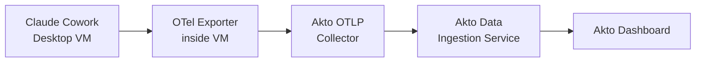

# Claude Cowork Connector

## Overview

Claude Cowork is an enterprise feature of the Claude desktop app that runs Claude AI inside a sandboxed virtual machine with full tool execution, file system access, and granular permission controls. Employees use it to run agentic workflows directly from their machines.

The Akto Claude Cowork connector gives your security team real-time visibility into Cowork sessions across your organization — every prompt, tool execution, API call, and permission decision — without deploying additional endpoint agents.

Available on Claude **Team** and **Enterprise** plans, requiring desktop app **v1.1.4173 or later**.

## How It Works

Claude Cowork exports OpenTelemetry (OTel) telemetry from within the Cowork VM. You configure Akto's OTLP collector endpoint in your Claude admin settings, and events are pushed directly to Akto in real time.


**Push mode** — Cowork pushes events to Akto the moment they occur. Unlike polling-based connectors, events typically appear in the Akto dashboard within seconds of the interaction.


## What Akto Ingests

| Event | What Akto Discovers |
|---|---|
| **user\_prompt** | Prompt submitted by the user, prompt length, and (optionally) full prompt content |
| **tool\_result** | Tool name, execution duration, success/failure, error details, and (optionally) tool inputs and file paths |
| **api\_request** | Claude model used, token counts, cost estimate, and latency per API call |
| **api\_error** | Failed API requests with HTTP status codes and retry attempt counts |
| **tool\_decision** | Permission accept/reject decisions and their source for each tool invocation |

All events include standard correlation attributes: `session.id`, `organization.id`, `user.email`, `user.account_uuid`, `prompt.id` (links all events from a single interaction), and `workspace.host_paths` (directories the Cowork VM has access to).


`user.email` is always included in every event. Ensure your data retention and privacy policies account for PII in telemetry data.


## Prerequisites

* Claude desktop app version **1.1.4173 or later** installed on employee machines
* Claude **Team** or **Enterprise** plan
* Admin access to your Claude organization settings at [claude.ai](https://claude.ai)
* Akto Atlas account with the Connectors section accessible

## Steps to Connect



**Get your Akto OTLP endpoint and token**

Open your Akto Atlas dashboard and navigate to **Connectors**. Locate the **Claude Cowork** card and click **Connect**. Copy the provided:

* **OTLP collector URL** — e.g., `https://otlp.your-akto-instance.com`
* **Bearer token** — used to authenticate the telemetry push

If the Claude Cowork connector card is not visible, contact Akto support to have it provisioned for your organization.



**Configure the OTLP exporter in Claude admin settings**

Log in to [claude.ai](https://claude.ai) as an **admin**. Go to **Admin settings → Cowork** and fill in the monitoring fields:

| Field | Value |
|---|---|
| **OTLP endpoint** | The Akto OTLP collector URL from the previous step |
| **OTLP protocol** | `http/json` |
| **OTLP headers** | `Authorization=Bearer <your-akto-token>` |

Click **Save**. Settings apply to new Cowork sessions started after this point — active sessions are not affected.



**(Optional) Enable content capture**

By default, Akto receives metadata only (lengths, durations, token counts). To enable prompt injection detection and deeper security analysis, turn on `otlpContentCapture` in your Claude admin settings:

* **userPrompts** — exports full prompt text with each `user_prompt` event
* **toolDetails** — exports `tool_input` fields (file paths, URLs, command parameters) with each `tool_result` event

Enable only what your security policies permit.



**(Optional) Allowlist Akto's collector domain**

If your organization has network egress restrictions enabled in Claude, add Akto's collector domain to the allowlist at **Admin settings → Capabilities → Network egress**.


Traffic to non-allowlisted domains is silently dropped by the Cowork VM. If you see no events in Akto, this is the most common cause.




**Verify data in Akto**

Have a user start a new Claude Cowork session on their desktop and submit a prompt. Within seconds, confirm that events appear in your Akto Atlas dashboard under **Agentic AI Discovery**.



## What You'll See in Akto

Once connected, Claude Cowork data flows into the following areas of your Akto Atlas dashboard:

* **Agentic AI Discovery → Agentic Assets**: A **Claude Cowork** asset appears, representing all discovered Cowork sessions across your organization
* **Atlas Guardrails**: Akto evaluates Cowork events against your configured security policies in real time, flagging prompt injection attempts, sensitive data exposure in tool inputs, and risky tool executions as they happen

## Get Support for your Akto setup

There are multiple ways to request support from Akto. We are 24X7 available on the following:

1. In-app `intercom` support. Message us with your query on intercom in Akto dashboard and someone will reply.
2. Join our [discord channel](https://www.akto.io/community) for community support.
3. Contact [support@akto.io](mailto:support@akto.io) for email support.
4. Contact us [here](https://www.akto.io/contact-us).
