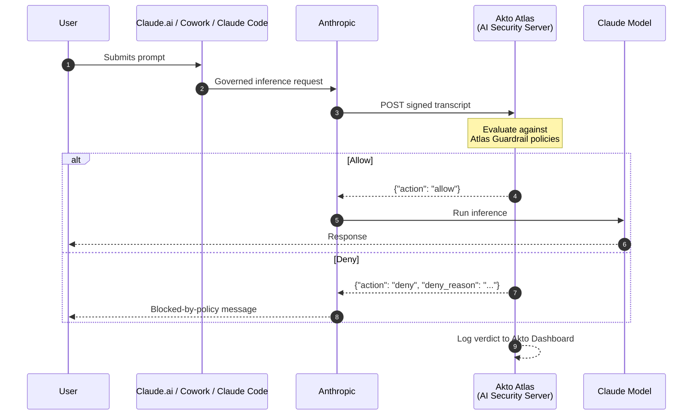

# Claude Inference Hooks

## Overview

[Inference Hooks](https://platform.claude.com/docs/en/manage-claude/inference-hooks) is a Claude Enterprise feature that routes every governed prompt through an organization's own **AI security server**, an HTTPS endpoint that returns an allow or deny verdict, before inference runs. A denied prompt never reaches the model.

Akto Atlas can act as that AI security server. Point your organization's Inference Hooks configuration at Akto, and every governed prompt across claude.ai, Cowork, and Claude Code is evaluated against your **Atlas Guardrail policies** inline, before the model ever sees it, with no endpoint agent, browser extension, or IDE hook required.

This is the only Claude integration in Atlas that can **block a prompt before it runs**. The [Anthropic Connector](anthropic-connector.md) and [Claude Cowork Connector](claude-cowork-connector.md) give you visibility after or alongside the fact; Inference Hooks gives you enforcement in the critical path.

## How It Works

1. A user submits a prompt on a governed surface (claude.ai, Cowork, or Claude Code).
2. Anthropic sends an HTTPS `POST` containing the conversation transcript to Akto's verdict endpoint, signed per the [Standard Webhooks](https://www.standardwebhooks.com/) spec so Atlas can verify it came from Anthropic, and carrying an `Authorization` header with your Akto token so Atlas can identify your account.
3. Atlas evaluates the transcript against your configured Guardrail policies and returns a verdict within your organization's verdict timeout (5 seconds by default).
4. On `allow`, inference proceeds normally. On `deny`, Anthropic blocks the request and shows the user a policy message built from Atlas's per-request reason plus your standing contact/exception text. The decision is logged to your Akto dashboard either way.



Today the only hook event is `prompt`, firing once per governed request before inference begins. Response-side enforcement is on Anthropic's roadmap, not yet available.

## What Atlas Evaluates

Every transcript Anthropic forwards is scored against the same Guardrail policies Atlas already enforces at the endpoint. See [Agent Guard](../../agentic-guardrails/concepts/agent-guard.md) for the full scanner list. Typical uses of the hook:

* **Sensitive data exposure**: PII, secrets, source code, or other regulated data in the prompt
* **Unsafe prompts and jailbreaks**: prompt injection or jailbreak patterns
* **Policy engines**: model allowlists, project-scoped restrictions, or working-hours controls
* **Compliance archival**: always return `allow` and use the transcript purely to archive activity in real time, as a push-based alternative to polling the Anthropic Compliance API

## What Atlas Can and Cannot See

Anthropic forwards what the user sees: transcript text, tool calls and their results, and text extracted from attachments. It never forwards raw file or image bytes, system prompts, or Anthropic-internal context, so image-only content (a screenshot of a document, for example) cannot be inspected or blocked on this path.

## Prerequisites

* A **Claude Enterprise** organization, with Inference Hooks enabled (currently in beta)
* A user with the `organization:manage` permission in claude.ai (built-in Admin, Owner, and Primary owner roles hold this)
* An **Akto Atlas** account with the Connectors section accessible

## Setting It Up

Akto exposes a dedicated webhook endpoint for Claude Inference Hooks, scoped to your Akto account:

```
https://<your-account-id>-guardrails.akto.io/api/v1/webhooks/claude/guardrail
```

Register this URL as your AI security server in claude.ai, under **Organization Settings → Inference Hooks**, and set the request's **`Authorization`** header to your **database abstractor token**, the same API token used by your other Akto connectors. Get it from **Connectors → Setup Guardrail** in your Akto Atlas dashboard.


**Contact the Akto team** to set this up, via in-app Intercom support or [support@akto.io](mailto:support@akto.io). They'll confirm your account's webhook URL and token, and walk you through registering them in claude.ai.


## What You'll See in Akto

* **Atlas Guardrails → Guardrail Activity**: every verdict Atlas returned (allow or deny, the policy that fired, and the full transcript context), alongside guardrail events from your other endpoints
* **Agentic AI Discovery → Agentic Assets**: governed Claude usage attributed to the requesting user, correlated with any Anthropic Connector or Cowork Connector data for the same org

## Get Support for your Akto setup

There are multiple ways to request support from Akto. We are 24X7 available on the following:

1. In-app `intercom` support. Message us with your query on intercom in Akto dashboard and someone will reply.
2. Join our [discord channel](https://www.akto.io/community) for community support.
3. Contact `support@akto.io` for email support.
4. Contact us [here](https://www.akto.io/contact-us).
