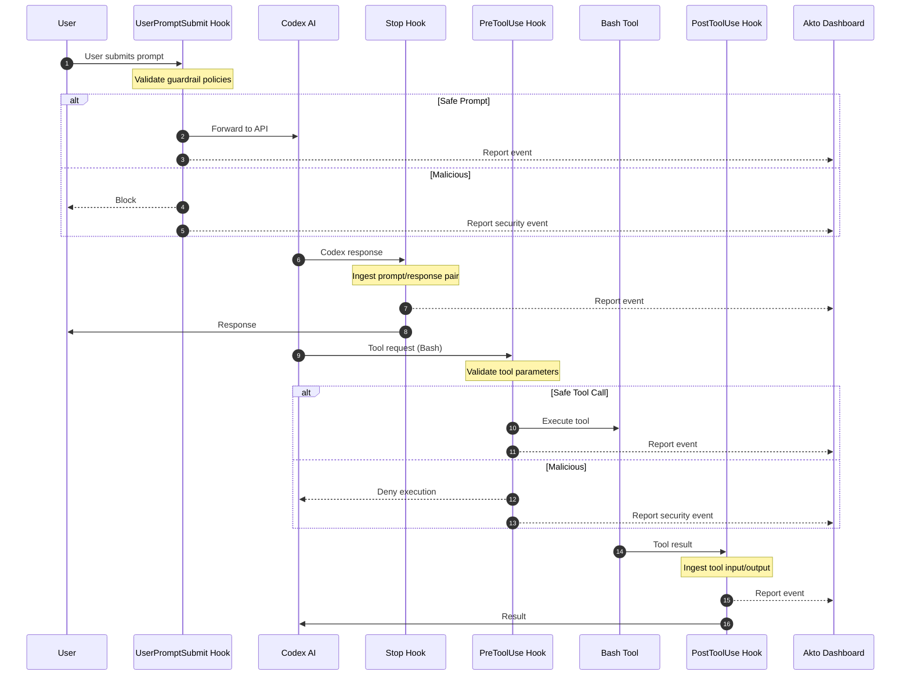

# Codex CLI & Desktop Hooks

Akto Guardrails for Codex provides comprehensive security monitoring and validation for both **chat interactions** and **tool executions** — and works with both **Codex CLI** and **Codex Desktop**. It intercepts prompts before sending to Codex, validates tool calls before execution, blocks risky behavior, and reports all events to your Akto dashboard.

## Key Features

* ✅ **Zero Installation** - No standalone apps to install
* ✅ **Transparent Integration** - Uses Codex's native hook mechanism (CLI and Desktop)
* ✅ **Real-time Protection** - Validates every prompt and tool call
* ✅ **Centralized Monitoring** - All events reported to Akto dashboard
* ✅ **Flexible Deployment** - Supports Argus and Atlas modes
* ✅ **Configurable Behavior** - Blocking or observation modes
* ✅ **Auto-detected API Host** - Automatically resolves Codex API endpoint from environment

## How It Works

Codex's hook system (shared by both CLI and Desktop) executes custom scripts at four critical points:



**4 Hook Points:**

1. `UserPromptSubmit` - Validates prompts before sending to Codex API
2. `Stop` - Ingests prompt/response pair when Codex finishes generating
3. `PreToolUse` - Validates tool requests before execution (blocks if malicious)
4. `PostToolUse` - Ingests tool input/output after execution (observational only)

> **Note:** Codex currently only supports the `Bash` tool for `PreToolUse` and `PostToolUse` hooks (both CLI and Desktop).

## File Structure

```
~/.codex/
├── hooks.json                                  # Hook configuration
├── config.toml                                 # Codex CLI config (feature flag required)
├── hooks/
│   ├── akto-validate-prompt-wrapper.sh         # Prompt validation wrapper
│   ├── akto-validate-prompt.py                 # Prompt validation logic
│   ├── akto-validate-response-wrapper.sh       # Response ingestion wrapper
│   ├── akto-validate-response.py               # Response ingestion logic
│   ├── akto-validate-pre-tool-wrapper.sh       # Pre-tool validation wrapper
│   ├── akto-validate-pre-tool.py               # Pre-tool validation logic
│   ├── akto-validate-post-tool-wrapper.sh      # Post-tool ingestion wrapper
│   ├── akto-validate-post-tool.py              # Post-tool ingestion logic
│   └── akto_machine_id.py                      # Device ID utility
└── akto/
    └── logs/
        ├── validate-prompt.log
        ├── validate-response.log
        ├── validate-pre-tool.log
        └── validate-post-tool.log
```

**Key Files:**

* **Wrapper scripts (`.sh`)**: Set environment variables, invoke Python scripts
  * ⚠️ **Contains `AKTO_DATA_INGESTION_URL` placeholder** - Must be replaced with your Akto instance URL
* **Python scripts (`.py`)**: Core validation and ingestion logic, Akto API communication
* **`akto_machine_id.py`**: Generates unique device identifiers for Atlas mode
* **`hooks.json`**: Links hooks to wrapper scripts
* **`config.toml`**: Must enable the `codex_hooks` feature flag

## Setup Guide

### Prerequisites

* Codex CLI or Codex Desktop installed
* Akto instance URL
* Python 3.7+
* macOS, Linux, or Windows with bash/zsh

### Enabling Local Hooks in Managed Environments


This section is only relevant if your machine is managed by an organization (MDM, ChatGPT Business/Enterprise). If you're on a personal or unmanaged device, skip ahead to [Installation Steps](codex-cli-hooks.md#installation-steps).


In managed environments, organizational policies may override local Codex hook configuration. This section helps administrators identify and resolve restrictions so that local hooks can execute.

#### Configuration Precedence

Codex evaluates configuration sources in this order — higher-precedence sources win:

1. Cloud-managed requirements (ChatGPT Business / Enterprise)
2. macOS managed preferences (MDM)
3. Local user configuration (`~/.codex/config.toml`)
4. Other defaults

#### Scenario 1: Cloud-Managed Requirements

Organization administrators should review settings in the ChatGPT administration environment under:

* Codex Settings → Managed Requirements
* Policies → Developer Tools Settings
* Hooks Restrictions / Managed Hooks Configuration

Look for settings that disable hooks globally or restrict execution to organization-managed hooks only:

```toml
hooks_enabled = false
managed-hooks-only = true
```

**To allow local hooks**, ensure:

```toml
hooks_enabled = true
managed-hooks-only = false
```

Or remove the restriction entirely.

#### Scenario 2: macOS Managed Preferences (MDM)

MDM-managed Codex configuration is delivered through the preference domain `com.openai.codex` via platforms such as Jamf Pro, Kandji, Microsoft Intune, Mosyle, or VMware Workspace ONE.

**Check current managed configuration on the device:**

```bash
# View installed profiles
profiles show
# or
sudo profiles show

# Read managed preferences
defaults read /Library/Managed\ Preferences/com.openai.codex
```

Locate the `requirements_toml_base64` field, decode it, and inspect for restrictions such as:

```toml
hooks_enabled = false
managed-hooks-only = true
codex_hooks = false
```

**To allow local hooks**, update the MDM profile so that:

```toml
hooks_enabled = true
managed-hooks-only = false
```

Or remove the managed hook restriction entirely. After updating:

1. Save the configuration.
2. Push the updated profile to managed devices.
3. Restart Codex.
4. Verify hook discovery and execution.

#### Local User Configuration

Once organizational restrictions are removed, users enable hooks locally:

```toml
# ~/.codex/config.toml
[features]
codex_hooks = true
```

Hook files can then be placed in `~/.codex/hooks/` or `~/.codex/hooks.json`.

#### Validation

After enabling local hooks:

1. Restart Codex.
2. Execute an action that should trigger a hook.
3. Verify logs show events such as:

```
Hook discovered
Hook started
Hook completed
```

If hooks are not discovered, re-check cloud-managed requirements and MDM-managed preferences, as they take precedence over local configuration.

### Installation Steps



**Enable Codex Hooks Feature Flag**

Codex hooks are experimental. Enable them in `~/.codex/config.toml` (used by both CLI and Desktop):

```toml
[features]
codex_hooks = true
```



**Create Directories**

```bash
mkdir -p ~/.codex/hooks
mkdir -p ~/.codex/akto/logs
```



**Download Hook Scripts**

```bash
# Base URL for downloading hooks
HOOKS_BASE="https://raw.githubusercontent.com/akto-api-security/akto/master/apps/mcp-endpoint-shield/codex-cli-hooks"

# Download prompt validation hooks
curl -o ~/.codex/hooks/akto-validate-prompt-wrapper.sh \
  "${HOOKS_BASE}/akto-validate-prompt-wrapper.sh"
curl -o ~/.codex/hooks/akto-validate-prompt.py \
  "${HOOKS_BASE}/akto-validate-prompt.py"

# Download response ingestion hooks
curl -o ~/.codex/hooks/akto-validate-response-wrapper.sh \
  "${HOOKS_BASE}/akto-validate-response-wrapper.sh"
curl -o ~/.codex/hooks/akto-validate-response.py \
  "${HOOKS_BASE}/akto-validate-response.py"

# Download pre-tool validation hooks
curl -o ~/.codex/hooks/akto-validate-pre-tool-wrapper.sh \
  "${HOOKS_BASE}/akto-validate-pre-tool-wrapper.sh"
curl -o ~/.codex/hooks/akto-validate-pre-tool.py \
  "${HOOKS_BASE}/akto-validate-pre-tool.py"

# Download post-tool ingestion hooks
curl -o ~/.codex/hooks/akto-validate-post-tool-wrapper.sh \
  "${HOOKS_BASE}/akto-validate-post-tool-wrapper.sh"
curl -o ~/.codex/hooks/akto-validate-post-tool.py \
  "${HOOKS_BASE}/akto-validate-post-tool.py"

# Download utility
curl -o ~/.codex/hooks/akto_machine_id.py \
  "${HOOKS_BASE}/akto_machine_id.py"

# Make executable
chmod +x ~/.codex/hooks/*.sh
```



**Configure Akto Ingestion URL and API Token** ⚠️ **CRITICAL STEP**


All wrapper scripts contain the placeholders `{{AKTO_DATA_INGESTION_URL}}` and `{{AKTO_API_TOKEN}}` that **must be replaced** — the URL with your actual Akto instance URL, and the token with your Akto API token. If your deployment does not require auth, set the token to an empty string so the placeholder is removed (an unsubstituted `{{AKTO_API_TOKEN}}` would be sent as an invalid `Authorization` header).


**Automated replacement:**

```bash
# Set your Akto ingestion URL and API token
AKTO_URL="https://your-akto-instance.com"
AKTO_API_TOKEN="your-akto-api-token"   # leave empty ("") if your deployment doesn't require auth

# Update all wrapper scripts
sed -i.bak "s|{{AKTO_DATA_INGESTION_URL}}|${AKTO_URL}|g" ~/.codex/hooks/*-wrapper.sh
sed -i.bak "s|{{AKTO_API_TOKEN}}|${AKTO_API_TOKEN}|g" ~/.codex/hooks/*-wrapper.sh

# Verify replacement
grep -E "AKTO_DATA_INGESTION_URL|AKTO_API_TOKEN" ~/.codex/hooks/*-wrapper.sh
```

**Manual replacement (alternative):**

Edit each wrapper script and replace:

```bash
AKTO_DATA_INGESTION_URL="{{AKTO_DATA_INGESTION_URL}}"
AKTO_API_TOKEN="{{AKTO_API_TOKEN}}"
```

With:

```bash
AKTO_DATA_INGESTION_URL="https://your-akto-instance.com"
AKTO_API_TOKEN="your-akto-api-token"
```

Files to update:

* `akto-validate-prompt-wrapper.sh`
* `akto-validate-response-wrapper.sh`
* `akto-validate-pre-tool-wrapper.sh`
* `akto-validate-post-tool-wrapper.sh`



**Configure Hooks**

Copy `hooks.json` to `~/.codex/hooks.json`:

```bash
cat > ~/.codex/hooks.json << 'EOF'
{
  "hooks": {
    "UserPromptSubmit": [
      {
        "hooks": [
          {
            "type": "command",
            "command": "bash ~/.codex/hooks/akto-validate-prompt-wrapper.sh",
            "timeout": 10
          }
        ]
      }
    ],
    "Stop": [
      {
        "hooks": [
          {
            "type": "command",
            "command": "bash ~/.codex/hooks/akto-validate-response-wrapper.sh",
            "timeout": 10
          }
        ]
      }
    ],
    "PreToolUse": [
      {
        "hooks": [
          {
            "type": "command",
            "command": "bash ~/.codex/hooks/akto-validate-pre-tool-wrapper.sh",
            "timeout": 10
          }
        ]
      }
    ],
    "PostToolUse": [
      {
        "hooks": [
          {
            "type": "command",
            "command": "bash ~/.codex/hooks/akto-validate-post-tool-wrapper.sh",
            "timeout": 10
          }
        ]
      }
    ]
  }
}
EOF
```

> **Note:** You can also place `hooks.json` at `<repo>/.codex/hooks.json` for repository-level hooks.



**Configure Hook Behavior (Optional)**

Edit wrapper scripts to customize:

```bash
# In each *-wrapper.sh file:

MODE="atlas"                    # "argus" or "atlas"
AKTO_SYNC_MODE="true"          # "true" (blocking) or "false" (observe only)
AKTO_TIMEOUT="5"               # Timeout in seconds
AKTO_CONNECTOR="codex_cli"
```

**Mode Options:**

* **Argus**: Standard validation and reporting
* **Atlas**: Includes device-specific metadata

**Sync Mode:**

* **true**: Blocks threats (prompt validation + tool validation)
* **false**: Reports but allows execution



**Verify Installation**

Check logs to confirm hooks are working:

```bash
# Tail all logs
tail -f ~/.codex/akto/logs/*.log
```

Test by running a Codex command:

* **CLI**: `codex "What is 2+2?"`
* **Desktop**: Open Codex Desktop and send a message in the chat

You should see log entries indicating validation occurred.



## Configuration Reference

<details>

<summary>Wrapper Script Variables</summary>

```bash
MODE="atlas"                                            # "argus" or "atlas"
AKTO_DATA_INGESTION_URL="{{AKTO_DATA_INGESTION_URL}}"  # ⚠️ MUST REPLACE
AKTO_API_TOKEN="{{AKTO_API_TOKEN}}"                    # Akto API token (Authorization header)
AKTO_SYNC_MODE="true"                                  # "true" or "false"
AKTO_TIMEOUT="5"                                       # Timeout in seconds
AKTO_CONNECTOR="codex_cli"                             # Connector identifier
CONTEXT_SOURCE="ENDPOINT"                              # Context source tag
LOG_LEVEL="INFO"                                       # DEBUG, INFO, WARNING, ERROR
LOG_PAYLOADS="false"                                   # Log payload previews
```

</details>

<details>

<summary>Environment Variables (Optional)</summary>

Override defaults via environment variables in `~/.zshrc` or `~/.bashrc`:

```bash
export MODE="atlas"
export AKTO_DATA_INGESTION_URL="https://your-akto-instance.com"
export AKTO_API_TOKEN="your-akto-api-token"
export AKTO_SYNC_MODE="true"
export AKTO_TIMEOUT="5"
export DEVICE_ID=""                        # Optional: custom device ID for Atlas mode
export LOG_DIR="~/.codex/akto/logs"       # Log directory
export LOG_LEVEL="INFO"                   # Logging verbosity
export LOG_PAYLOADS="false"               # Log request/response previews
```

Then reload your shell:

```bash
source ~/.zshrc
```

</details>

<details>

<summary>Codex API Host Auto-Detection</summary>

The Codex API host and path are automatically resolved from the same environment variables Codex CLI uses:

| Scenario | Host | Path |
| -------- | ---- | ---- |
| `OPENAI_BASE_URL` set | value of `OPENAI_BASE_URL` | `/v1/responses` |
| `OPENAI_API_KEY` set | `api.openai.com` | `/v1/responses` |
| ChatGPT browser login | `chatgpt.com` | `/backend-api/codex/responses` |

</details>

<details>

<summary>Hook Input Fields</summary>

All hooks receive a common JSON payload on stdin, plus event-specific fields:

| Event | Additional Fields |
| ----- | ----------------- |
| `UserPromptSubmit` | `prompt` |
| `Stop` | `last_assistant_message`, `stop_hook_active` |
| `PreToolUse` | `tool_name`, `tool_use_id`, `tool_input` |
| `PostToolUse` | `tool_name`, `tool_use_id`, `tool_input`, `tool_response` |

</details>

## Troubleshooting

<details>

<summary>Hooks Not Executing</summary>

```bash
# 1. Verify hooks feature flag is enabled
cat ~/.codex/config.toml | grep codex_hooks

# 2. Check hooks.json exists and is valid
cat ~/.codex/hooks.json | python3 -m json.tool

# 3. Verify scripts are executable
ls -la ~/.codex/hooks/
chmod +x ~/.codex/hooks/*.sh

# 4. Check Python 3 is installed
python3 --version

# 5. Check logs
tail -f ~/.codex/akto/logs/*.log
```

</details>

<details>

<summary>Ingestion URL Not Configured</summary>

```bash
# Check if placeholder still exists
grep "{{AKTO_DATA_INGESTION_URL}}" ~/.codex/hooks/*-wrapper.sh

# Replace with actual URL
AKTO_URL="https://your-akto-instance.com"
sed -i.bak "s|{{AKTO_DATA_INGESTION_URL}}|${AKTO_URL}|g" ~/.codex/hooks/*-wrapper.sh
```

</details>

<details>

<summary>Check Logs for Errors</summary>

```bash
# View individual logs
cat ~/.codex/akto/logs/validate-prompt.log
cat ~/.codex/akto/logs/validate-response.log
cat ~/.codex/akto/logs/validate-pre-tool.log
cat ~/.codex/akto/logs/validate-post-tool.log

# Check for API call failures
grep "API CALL FAILED" ~/.codex/akto/logs/*.log

# Check for blocked events
grep "BLOCKING" ~/.codex/akto/logs/*.log
```

</details>

<details>

<summary>Events Not in Dashboard</summary>

```bash
# Test API connectivity
curl -X POST "${AKTO_DATA_INGESTION_URL}/api/v1/events" \
  -H "Content-Type: application/json" \
  -d '{"test": "event"}'

# Verify URL in wrapper scripts
grep "AKTO_DATA_INGESTION_URL" ~/.codex/hooks/*-wrapper.sh
```

</details>

<details>

<summary>Service Unavailable</summary>

If Akto is unreachable:

* With `AKTO_SYNC_MODE=true`: hooks fail open and allow execution (fail-safe)
* With `AKTO_SYNC_MODE=false`: hooks skip ingestion silently

</details>

## Uninstallation

To completely remove Akto hooks from Codex CLI or Codex Desktop:

<details>

<summary>Complete Removal</summary>

```bash
# 1. Remove hook configuration
rm ~/.codex/hooks.json

# 2. Remove Akto hook scripts
rm -rf ~/.codex/hooks/

# 3. Remove feature flag from config.toml
# Edit ~/.codex/config.toml and remove or set codex_hooks = false

# 4. Remove Akto logs (optional - keeps historical data if skipped)
rm -rf ~/.codex/akto/

# 5. No restart needed - Codex reads config on each invocation (CLI and Desktop)
```

</details>

<details>

<summary>Selective Removal (Keep Logs)</summary>

```bash
# Remove only hooks and configuration
rm ~/.codex/hooks.json
rm -rf ~/.codex/hooks/

# Akto logs preserved in ~/.codex/akto/
```

</details>

<details>

<summary>Backup Before Removal</summary>

```bash
# Backup configuration and logs before removal
mkdir -p ~/akto-backup
cp ~/.codex/hooks.json ~/akto-backup/codex-hooks.json.bak 2>/dev/null
cp -r ~/.codex/akto/ ~/akto-backup/codex-akto-logs/ 2>/dev/null

# Then proceed with removal steps above
```

</details>

<details>

<summary>Verify Removal</summary>

```bash
# Check that hooks are removed
test -f ~/.codex/hooks.json && echo "⚠️  hooks.json still exists" || echo "✅ hooks.json removed"
test -d ~/.codex/hooks && echo "⚠️  Hook scripts still exist" || echo "✅ Hook scripts removed"

# Check if logs are removed (if you chose to remove them)
test -d ~/.codex/akto && echo "ℹ️  Logs still present" || echo "✅ Logs removed"
```

</details>

<details>

<summary>Restore Codex to Default</summary>

After uninstallation, Codex CLI and Codex Desktop will operate without Akto security monitoring. Test with:

* **CLI**: `codex "Test message"`
* **Desktop**: Open Codex Desktop and send a message — no hook logs should appear

</details>

## Enterprise Deployment

### Automated Deployment Script

<details>

<summary>deploy-codex-cli-hooks.sh</summary>

```bash
#!/bin/bash
# deploy-codex-cli-hooks.sh

set -e
AKTO_URL="${1:-https://your-akto-instance.com}"
AKTO_API_TOKEN="${2:-}"   # optional: pass your Akto API token as the 2nd argument

echo "🔧 Installing Akto Guardrails for Codex (CLI & Desktop)..."

# Enable feature flag
mkdir -p ~/.codex
if ! grep -q "codex_hooks" ~/.codex/config.toml 2>/dev/null; then
  cat >> ~/.codex/config.toml << 'EOFTOML'

[features]
codex_hooks = true
EOFTOML
fi

# Create directories
mkdir -p ~/.codex/hooks ~/.codex/akto/logs

# Download hooks
HOOKS_BASE="https://raw.githubusercontent.com/akto-api-security/akto/master/apps/mcp-endpoint-shield/codex-cli-hooks"
curl -s "${HOOKS_BASE}/akto-validate-prompt-wrapper.sh" -o ~/.codex/hooks/akto-validate-prompt-wrapper.sh
curl -s "${HOOKS_BASE}/akto-validate-prompt.py" -o ~/.codex/hooks/akto-validate-prompt.py
curl -s "${HOOKS_BASE}/akto-validate-response-wrapper.sh" -o ~/.codex/hooks/akto-validate-response-wrapper.sh
curl -s "${HOOKS_BASE}/akto-validate-response.py" -o ~/.codex/hooks/akto-validate-response.py
curl -s "${HOOKS_BASE}/akto-validate-pre-tool-wrapper.sh" -o ~/.codex/hooks/akto-validate-pre-tool-wrapper.sh
curl -s "${HOOKS_BASE}/akto-validate-pre-tool.py" -o ~/.codex/hooks/akto-validate-pre-tool.py
curl -s "${HOOKS_BASE}/akto-validate-post-tool-wrapper.sh" -o ~/.codex/hooks/akto-validate-post-tool-wrapper.sh
curl -s "${HOOKS_BASE}/akto-validate-post-tool.py" -o ~/.codex/hooks/akto-validate-post-tool.py
curl -s "${HOOKS_BASE}/akto_machine_id.py" -o ~/.codex/hooks/akto_machine_id.py

# Make executable
chmod +x ~/.codex/hooks/*.sh

# Configure URL and token
sed -i.bak "s|{{AKTO_DATA_INGESTION_URL}}|${AKTO_URL}|g" ~/.codex/hooks/*-wrapper.sh
sed -i.bak "s|{{AKTO_API_TOKEN}}|${AKTO_API_TOKEN}|g" ~/.codex/hooks/*-wrapper.sh

# Create hooks.json
cat > ~/.codex/hooks.json << 'EOFHOOKS'
{
  "hooks": {
    "UserPromptSubmit": [
      {"hooks": [{"type": "command", "command": "bash ~/.codex/hooks/akto-validate-prompt-wrapper.sh", "timeout": 10}]}
    ],
    "Stop": [
      {"hooks": [{"type": "command", "command": "bash ~/.codex/hooks/akto-validate-response-wrapper.sh", "timeout": 10}]}
    ],
    "PreToolUse": [
      {"hooks": [{"type": "command", "command": "bash ~/.codex/hooks/akto-validate-pre-tool-wrapper.sh", "timeout": 10}]}
    ],
    "PostToolUse": [
      {"hooks": [{"type": "command", "command": "bash ~/.codex/hooks/akto-validate-post-tool-wrapper.sh", "timeout": 10}]}
    ]
  }
}
EOFHOOKS

echo "✅ Installation complete!"
echo "📍 Akto instance: ${AKTO_URL}"
echo "Test with: codex 'What is 2+2?' (CLI) or open Codex Desktop and send a message"
```

</details>

**Deploy to developers:**

```bash
curl -fsSL https://your-org.com/deploy-codex-cli-hooks.sh | bash -s https://your-akto-instance.com
```

## Resources

* **GitHub**: [https://github.com/akto-api-security/akto](https://github.com/akto-api-security/akto)
* **Support**: [support@akto.io](mailto:support@akto.io)
* **Community**: [https://www.akto.io/community](https://www.akto.io/community)
